## Программа курса "Объектно-ореинтированное программирование" Язык UML и паттерны проектирования


%%


 "Состояние"
 
---

Расскажи подробно про паттерн 

"Состояние"

Подробно понятно простым языком без кода. Опиши историю возниконовение, определение. Основные элементы. Самые популярные кейсы использования

Используй синтаксис Markdown выделяй ширным, подсчеркивай, важные моменты заключай в 

>[!info] 
>Полезная информация


>[!warning] 
>Важная информация


---

Опиши какими UML диаграммами лучше всего рассказать про паттерн проектирования

"Состояние"

А так же придумай максимально подходящий пример реализации паттерна. Напиши описания, максимально подробные и детальные, для тех типов UML диаграмм которые ты выбрал.

Что на них должно быть изображено. И как именно.
Подробно, понятно, простым языком.

---

На основе описаний составленных в прошлом примере, составь PlantUML диаграммы для презентации этого паттерна проектирования. Не используем привязку к конкретному языку.

+++

Диаграммы должны быть валидными. 
Диграммы должны быть в блоках кода 

```plantuml

```
Все описания и заметки делай внутри диаграммы, используй для этого
legend
endlegend

В легенде можешь делать таблицы, по необходимости.
Легенды должны быть ПОДРОБНЫМИ и понятными.
Используй мои стили
scale 800 height
skinparam BackgroundColor #FFE4B5
 в диаграмме используй цвет #LightYellow а так же оттенки этого. 


---
3 Варианта практики для студентов на тему паттерны программирования ООП без привязки к языку программирования. Создание UML диаграмм классов и последовательности:

Абстрактная фабрика

Поставь задачу и детально её опиши от начала до конца, что с чем связано. Практика должна быть не очень сложной, чтобы её можно было выполнить за 20-30 минут.

Результат твоей работы: 3 варианта практки детально описанной. Краткое содержание, текст, критерии проверки. Используй синтаксис Markdown выделяй ширным, подсчеркивай, важные моменты заключай в 

>[!info] 
>Полезная информация


>[!warning] 
>Важная информация


%%

```table-of-contents
```


## Содержание


| Тема                                                                                           | Количество уроков | Формат               | № урока |
| ---------------------------------------------------------------------------------------------- | ----------------- | -------------------- | ------- |
| Введение в объектно-ориентированный анализ и проектирование                                    | 2                 | Урок                 | 1-2     |
| Диаграммы в UML. Диаграммы вариантов использования                                             | 1                 | Урок                 | 3       |
| Практическая работа: построение диаграмм вариантов использования                               | 1                 | Практическая работа  | 4       |
| Диаграмма классов                                                                              | 3                 | Урок                 | 5-7     |
| Практическая работа построения диаграмм классов                                                | 1                 | Практическая работа  | 8       |
| Диаграмма состояний, диаграмма деятельности                                                    | 1                 | Урок                 | 9       |
| Практическая работа построение диаграммы состояний. Построение диаграмм деятельности           | 1                 | Практическое занятие | 10      |
| Диаграмма последовательности                                                                   | 3                 | Урок                 | 11-13   |
| Практическая работа построение диаграмм последовательности                                     | 1                 | Практическая работа  | 14      |
| Диаграмма кооперации, диаграмма компонентов, диаграмма развертывания                           | 1                 | Урок                 | 15      |
| Практическая работа: Построение диаграмм кооперации, компонентов, развертывания                | 1                 | Практическое занятие | 16      |
| Введение в паттерны проектирования                                                             | 2                 | Урок                 | 17-18   |
| Порождающие паттерны                                                                           | 3                 | Урок                 | 19-21   |
| Практическая работа: Использование порождающих паттернов                                       | 1                 | Практическая работа  | 22      |
| Структурные паттерны                                                                           | 5                 | Урок                 | 23-27   |
| Практическая работа: использование структурных паттернов                                       | 1                 | Практическая работа  | 28      |
| Паттерны поведения                                                                             | 4                 | Урок                 | 29-32   |
| Практическая работа: анализ и сравнение паттернов поведения. Использование паттернов поведения | 2                 | Практическое занятие | 33-34   |
| Дифференцированный зачет                                                                       | 2                 | Урок                 | 35-36   |

Полный список типов диаграмм и схем которые мы будем изучать:

1. Диаграммы вариантов **[использования](https://youtu.be/BdAcxboG5No?si=_OqJnttahxpTEj1P)** (прецедентов)
2. Диаграмма **[классов](https://youtu.be/sVVJp5a41o4?si=WPoXGRmWnvi4UNtU)**
3. Диаграмма **[состояний](https://youtu.be/ojCcUvGfpi8?si=Snj_ahmK3w52h41j)**
4. Диаграмма **[деятельности](https://youtu.be/Z8PHBsNXAgc?si=bCdTYIGxp461V2tp)**
5. Диаграмма [**последовательности**](https://youtu.be/ycg3njrkk1c?si=lG594Sy3p25ei3QD)
6. Диаграмма **[кооперации](https://youtu.be/KVLJj9xOq0E?si=gTsT2mTymtsPS0uI)** (коммуникации)
7. Диаграмма [**компонентов**](https://youtu.be/OiVyha3sf_I?si=NMmM0UDeyzZlOyR9)
8. Диаграмма [**развертывания**](https://youtu.be/Yz8phtJoP7I?si=KGRrlrwEPItvZUdf)

Паттерны проектирования:
1. Порождающие
2. Структурные
3. Поведенческие


## Урок 1

>[!warning] 
>
>### Содержание. Урок 1: Введение в объектно-ориентированный анализ и проектирование (1-й урок)
>
**Цели урока:**
>- Понимание основ объектно-ориентированного подхода
>- Знакомство с базовыми принципами объектно-ориентированного анализа и проектирования
>
**План урока:**
>- **Введение (5 минут):** Объяснение целей и задач урока
>- **Основы ООП (10 минут):** Обсуждение принципов инкапсуляции, наследования и полиморфизма
>- **Объектно-ориентированный анализ (10 минут):** Введение в методы анализа, изучение основных элементов моделирования (объекты, классы, связи)
>- **Объектно-ориентированное проектирование (10 минут):** Обсуждение процесса проектирования ПО, роли UML
>- **Вопросы и ответы (5 минут):** Время для вопросов студентов и уточнения непонятных моментов
>- **Заключение (5 минут):** Подведение итогов урока, объяснение домашнего задания


### Объектно-ориентированное мышление: Открытие нового мира программирования

#### Введение в мир объектов и классов

Когда мы впервые сталкиваемся с программированием, мир кода может показаться непроницаемым лабиринтом логики и синтаксиса. Но с объектно-ориентированным программированием (ООП), этот лабиринт приобретает структуру и смысл. ООП не просто организация кода; это философия, в которой концепции из реального мира оживают в виде объектов и классов. Именно это мы и изучили на нашем первом уроке.

Давайте же подробно рассмотрим, в чем сама суть ООП?

**ООП (объектно-ориентированное программирование)** - это подход к разработке программного обеспечения, который основывается на концепции объектов и классов.

**Объекты** - это экземпляры классов, которые представляют собой абстракцию реальных или виртуальных сущностей. Каждый объект имеет свои свойства (атрибуты) и поведение (методы). Например, если мы говорим о классе "Собака", то каждая конкретная собака будет являться объектом этого класса.

**Классы** - это шаблоны или определения для создания объектов. Они определяют набор атрибутов и методов, которые будут присутствовать у каждого экземпляра этого класса. Класс можно рассматривать как чертеж для создания объектов.

**Основные принципы ООП:**

1. *Инкапсуляция*: скрытие внутренних деталей реализации от внешнего мира. Объекты могут взаимодействовать друг с другом только через определенные интерфейсы.
2. *Наследование*: возможность создавать новые классы на основе уже существующих, наследуя их свойства и методы. Это позволяет создавать иерархию классов и упрощает повторное использование кода.
3. *Полиморфизм*: возможность объектов с одним и тем же интерфейсом иметь различную реализацию. Это позволяет обрабатывать объекты разных классов одинаковым образом.

ООП позволяет создавать более структурированный, модульный и гибкий код. Он способствует повторному использованию кода, упрощает его поддержку и расширение. Кроме того, ООП позволяет лучше моделировать реальный мир, что делает программы более интуитивно понятными для разработчиков и пользователей.

В следующих уроках мы будем изучать более подробно каждый из принципов ООП, а также различные концепции и инструменты, связанные с объектно-ориентированным программированием.
#### Основные столпы ООП

##### Инкапсуляция: Секретность как добродетель

Представьте, что ваш код - это ваш собственный маленький мирок, где каждый объект - это существо с личными границами. Инкапсуляция в ООП позволяет каждому объекту скрывать свои внутренние механизмы и детали реализации, открывая для взаимодействия с внешним миром только выбранные аспекты. Это похоже на то, как человек может скрывать свои мысли и чувства, демонстрируя наружу только выбранное поведение.

Инкапсуляция в ООП позволяет объединить данные и методы, работающие с этими данными, в одном объекте. Такой объект может скрывать свои внутренние детали реализации и предоставлять только определенные интерфейсы для взаимодействия с внешним миром.

Основная идея инкапсуляции заключается в том, что объект сам решает, какие данные он хочет скрыть от других объектов и какие операции он разрешает выполнять над этими данными. Это позволяет создавать более надежные и гибкие программы.

Например, представьте класс "Счет", который имеет приватное поле "баланс" и публичные методы "пополнить" и "снять". Внутри класса может быть сложная логика для обработки этих операций, но для внешнего мира это не имеет значения. Важно только то, что пользователь может пополнить или снять деньги со счета.

Используя инкапсуляцию, мы можем изменять внутренние детали реализации класса "Счет" без изменения кода других объектов, которые используют этот класс. Например, мы можем добавить проверку на отрицательный баланс или установить ограничения на максимальную сумму снятия. Все это можно сделать без изменения интерфейса класса "Счет".

Инкапсуляция также помогает предотвратить неправильное использование объектов. Если мы скрываем внутренние детали реализации, другие объекты не могут напрямую изменять данные или вызывать приватные методы. Это позволяет контролировать доступ к данным и предотвращает возможные ошибки.

Таким образом, инкапсуляция является одним из основных столпов ООП, позволяющим создавать модульные и гибкие программы, где каждый объект имеет свои личные границы и контролирует доступ к своим данным и методам.

##### Наследование: Семейные узы в коде

Как дети наследуют черты от родителей, так и в ООП объекты наследуют характеристики от других объектов. Это позволяет нам создавать иерархии и общие функции, расширяя и уточняя поведение без повторного написания кода. В мире программирования это экономит время и энергию, а также помогает избегать ошибок.

В объектно-ориентированном программировании наследование позволяет создавать иерархии классов, где классы-наследники наследуют свойства и методы от родительских классов. Родительский класс называется базовым классом, а наследующий его класс - производным или дочерним классом.

При использовании наследования, дочерний класс может использовать все свойства и методы родительского класса, а также добавлять свои собственные. Это позволяет создавать более специализированные версии объектов, которые имеют общие черты с базовым классом, но также имеют свои уникальные характеристики.

Наследование также позволяет использовать полиморфизм - возможность объекта производного класса быть использованным везде, где ожидается объект базового класса. Это упрощает кодирование и улучшает его читаемость.

Однако не всегда наследование является лучшим подходом. Иногда композиция - использование объекта в качестве части другого объекта - может быть предпочтительнее. Композиция позволяет более гибко комбинировать различные функциональности и избегать проблем, связанных с множественным наследованием или изменением базового класса.

В целом, наследование является мощным инструментом в ООП, который позволяет создавать гибкую иерархию классов и повторно использовать код. Однако его использование должно быть обосновано и осознанным, чтобы избежать излишней сложности и проблем в дальнейшем развитии программы.

##### Полиморфизм: Гибкость форм и функций

Как вода принимает форму сосуда, в который она налита, так и объекты в ООП могут принимать различные формы. Полиморфизм дает объектам возможность использовать одно и то же имя для различных методов, что позволяет одному и тому же интерфейсу обладать множеством форм реализации. Это как если бы вы могли пригласить "повара" на ужин, но в зависимости от желания, он мог бы стать шеф-поваром, пиццайоло или кондитером.

Полиморфизм в ООП позволяет объектам иметь одинаковые имена методов, но с различной реализацией. Например, у нас может быть класс "Фигура", у которого есть метод "площадь". Но каждая конкретная фигура (круг, квадрат, треугольник) будет реализовывать этот метод по-своему. Таким образом, мы можем вызывать метод "площадь" для любой фигуры без знания о ее конкретном типе.

Полиморфизм также позволяет нам использовать один и тот же интерфейс для работы с различными объектами. Например, у нас может быть интерфейс "Форма", который имеет методы "периметр" и "площадь". Классы круга, квадрата и треугольника могут реализовывать этот интерфейс и предоставлять свою специфичную реализацию для каждого метода. Таким образом, мы можем работать с любой формой через общий интерфейс без необходимости знать о ее конкретном типе.

Полиморфизм также может быть полезен при работе с коллекциями объектов. Например, у нас может быть список фигур, который содержит различные типы фигур. Мы можем вызывать методы на каждом объекте в списке, не заботясь о его конкретном типе. Это позволяет нам легко добавлять и удалять объекты из списка, не нарушая кода, который использует этот список.

Таким образом, полиморфизм в ООП обеспечивает гибкость форм и функций объектов. Он позволяет использовать один и тот же интерфейс для работы с различными объектами, а также дает возможность объектам иметь одинаковые имена методов с различной реализацией. Это делает код более гибким и расширяемым.

### Как UML вписывается в ООП

##### UML: Язык программирования мира дизайна

**Unified Modeling Language (UML)** - это не просто набор странных диаграмм и символов, это язык, который позволяет разработчикам описывать, конструировать и документировать аспекты программных систем. Если мыслить метафорами, то UML - это чертежи, на которых архитекторы программного мира изображают структуру будущих проектов.

UML дает возможность разработчикам визуализировать и описать структуру и поведение программных систем, используя различные типы диаграмм. Он является универсальным языком, который позволяет команде разработчиков общаться и понимать друг друга без необходимости глубокого погружения в код.

В ООП (объектно-ориентированное программирование), UML играет важную роль. Он **помогает разработчикам проектировать классы,** объекты, связи между ними и методы. С помощью диаграмм классов можно определить структуру классов, их атрибуты и методы. Диаграммы объектов позволяют представить конкретные экземпляры классов и связи между ними.

UML также **предоставляет возможность описывать отношения между классами** с помощью д*иаграмм ассоциации, агрегации, композиции, наследования и реализации*. Это позволяет разработчикам лучше понять структуру программной системы и ее зависимости.

Кроме того, **UML поддерживает моделирование поведения системы** с помощью *диаграмм состояний, активностей и последовательностей*. Диаграммы состояний позволяют описать все возможные состояния объекта и переходы между ними. Диаграммы активностей помогают визуализировать процессы и потоки управления в системе. Диаграммы последовательностей позволяют описать взаимодействие между объектами в определенном порядке.

UML также предоставляет возможность документирования системы с помощью диаграмм компонентов, развертывания и пакетов. Диаграммы компонентов позволяют описать архитектурные компоненты системы и связи между ними. Диаграммы развертывания показывают физическое размещение компонентов на аппаратном обеспечении. Диаграммы пакетов помогают организовать классы и другие элементы модели в логические группы.

В целом, UML является мощным инструментом для проектирования программных систем, особенно в контексте ООП. Он помогает разработчикам лучше понять структуру и поведение системы, а также обеспечивает средство коммуникации между разработчиками и другими участниками проекта.

#### 📝 Пример: Диаграмма классов UML

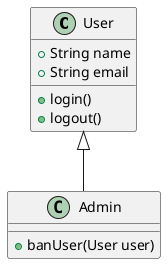

В этом простом примере мы видим класс `User` с атрибутами и методами. Класс `Admin` наследует все от `User`, добавляя свою специфическую функцию `banUser(User user)`. Это иллюстрирует как наследование работает в UML и в ООП – `Admin` обладает всеми свойствами `User`, но также и расширяет его функционал.


#### Реализация концепций на практике

На уроке мы не просто изучили теоретические аспекты ООП, мы также обсудили, как эти концепции реализуются на практике. Особенно важно это для понимания объектно-ориентированного анализа и проектирования, когда мы переводим требования и представления стейкхолдеров в конкретные структуры данных и алгоритмы.

#### Роль UML в объектно-ориентированном проектировании

##### Диаграммы: Чертежи программного мира

UML действует как универсальный язык для визуализации структуры и поведения системы. Это особенно ценно в объектно-ориентированном проектировании, где сложность системы может расти экспоненциально. С помощью UML разработчики могут создавать диаграммы классов, которые показывают, как классы связаны между собой, какие атрибуты и методы они содержат.


#### Преимущества использования UML

UML предоставляет разработчикам мощный инструмент для анализа, проектирования и документирования системы. Вот несколько преимуществ использования UML:

1. **Язык визуализации**: UML предоставляет набор графических символов и нотаций, которые позволяют разработчикам визуализировать структуру и поведение системы. Это делает процесс разработки более понятным и доступным для всех участников проекта.

2. **Универсальность**: UML является стандартом в индустрии программного обеспечения и широко используется различными методологиями разработки. Это означает, что разработчики, знакомые с UML, могут легко работать с другими командами и интегрировать свою работу с другими системами.

3. **Абстракция**: UML позволяет создавать абстрактные модели системы, которые скрывают детали реализации и фокусируются на ключевых концепциях и отношениях между элементами системы. Это помогает упростить сложные системы и облегчить понимание и коммуникацию между участниками проекта.

4. **Анализ и проектирование**: UML предоставляет различные виды диаграмм, которые позволяют разработчикам анализировать и проектировать систему на разных уровнях абстракции. Например, диаграммы классов позволяют определить структуру системы, диаграммы последовательности - моделировать взаимодействие между объектами, а диаграммы состояний - описывать поведение объектов.

5. **Документация**: UML диаграммы могут служить отличной формой документации для системы. Они предоставляют компактное и наглядное представление системы, которое можно использовать для объяснения ее структуры и поведения другим участникам проекта или клиентам.

В целом, использование UML в объектно-ориентированном проектировании помогает создавать более чистый и эффективный код, улучшает коммуникацию внутри команды разработки и облегчает понимание и сопровождение системы на протяжении всего ее жизненного цикла.


>[!info] #### Заключение: Осмысление урока
>
>Заканчивая наш первый урок, мы увидели, что ООП и UML не просто технические инструменты, но и способы мышления и общения в сфере разработки программного обеспечения. Они позволяют нам приближать абстракции программирования к понятным и управляемым концепциям из реального мира, обеспечивая тем самым не только эффективность, но и ясность визуального представления сложных систем. 
>
>Этот урок был первым шагом на пути к глубокому пониманию объектно-ориентированного подхода в программировании, который обязательно откроет новые горизонты в создании программных решений.


UML, или Унифицированный язык моделирования, — это стандартизированный язык визуального моделирования, который используется для спецификации, визуализации, построения и документирования артефактов системы программного обеспечения. Концепция UML начала разрабатываться в начале 1990-х годов в ответ на необходимость стандартизации разрозненных подходов к моделированию программного обеспечения, которые существовали в то время. 

### История и Версии

Первая версия UML 1.0 была представлена в 1997 году. С тех пор UML продолжал развиваться, и на данный момент существует несколько версий стандарта. Наиболее значительными обновлениями были UML 2.0, введенная в 2005 году, которая расширила возможности языка, добавив новые типы диаграмм и улучшив существующие, и последующие минорные обновления до UML 2.5 и далее.

Последняя на момент моего последнего обновления информации версия — UML 2.5.1, выпущенная в 2017 году. Однако важно проверить последние источники, так как могли появиться новые версии.

#### Типы Диаграмм UML

UML включает в себя 14 типов диаграмм, которые разделяются на две категории: диаграммы структуры и диаграммы поведения.

##### Диаграммы Структуры:
1. **Диаграмма классов (Class Diagram)**: Описывает структуру системы, показывая классы, их атрибуты, методы и взаимосвязи между объектами.
2. **Диаграмма объектов (Object Diagram)**: Представляет экземпляры классов и их взаимосвязи в конкретный момент времени.
3. **Диаграмма компонентов (Component Diagram)**: Показывает организацию и зависимости между компонентами в системе.
4. **Диаграмма развертывания (Deployment Diagram)**: Описывает физическую структуру системы, включая узлы, на которых развертываются компоненты.
5. **Диаграмма композитных структур (Composite Structure Diagram)**: Показывает внутреннее строение классов и взаимосвязи между частями системы.
6. **Диаграмма пакетов (Package Diagram)**: Группирует элементы UML в пакеты, показывая зависимости между ними.
7. **Диаграмма профилей (Profile Diagram)**: Определяет стереотипы и расширения для настройки UML моделей под конкретные задачи.

##### Диаграммы Поведения:
1. **Диаграмма случаев использования (Use Case Diagram)**: Описывает функциональные требования к системе и взаимодействие системы с внешними акторами.
2. **Диаграмма активностей (Activity Diagram)**: Показывает поток управления или поток данных с использованием действий и потоков.
3. **Диаграмма последовательности (Sequence Diagram)**: Представляет взаимодействие объектов в системе в порядке времени.
4. **Диаграмма коммуникации (Communication Diagram)**: Иллюстрирует взаимодействия между объектами в терминах сообщений, аналогично диаграмме последовательности, но с акцентом на отношениях и взаимодействиях.
5. **Диаграмма состояний (State Diagram)**: Описывает жизненный цикл объекта, включая его состояния, переходы между состояниями и события, вызывающие эти переходы.
6. **Диаграмма времени (Timing Diagram)**: Представляет поведение объектов во времени, выделяя изменения состояний или условий в определенные моменты времени.
7. **Диаграмма обзора взаимодействия (Interaction Overview Diagram)**: Вариант диаграммы активностей, который использует элементы диаграммы последовательности для описания потока управления.

#### Как Понять UML

Понять UML можно, представив его как визуальный язык для рисования чертежей программного обеспечения. Точно так же, как архитекторы используют чертежи для обозначения структуры здания, разработчики используют UML для создания модели программного продукта, которая включает в себя его структуру, поведение и взаимодействие компонентов.

- **Диаграммы структуры** помогают понять, как система устроена, какие у неё есть составляющие и как они связаны.
- **Диаграммы поведения** описывают, как система ведет себя в различных ситуациях, какие процессы и операции в ней происходят.

UML полезен не только для создания новых систем, но и для документирования и анализа существующих. Это универсальный инструмент, который может использоваться на разных этапах разработки от идеи до реализации.

Хотя UML может показаться сложным из-за большого количества диаграмм и символов, начать работу с ним можно, сосредоточившись на нескольких наиболее важных типах диаграмм, таких как диаграммы классов, случаев использования и последовательности. По мере накопления опыта можно постепенно включать и другие типы диаграмм в свою работу.

## Урок 2

>[!warning] 
>### Содержание. Урок 2: Введение в объектно-ориентированный анализ и проектирование (2-й урок)
>
 **Цели урока:**
>- Погружение в методологии объектно-ориентированного анализа и проектирования
>- Изучение роли и значимости UML в проектировании
>
>**План урока:**
>- **Повторение (5 минут):** Краткий обзор предыдущего урока, ответы на вопросы
>- **Методологии ООА и ООП (15 минут):** Обсуждение различных методологий, таких как RUP, Agile и их использование в анализе и >проектировании
>- **UML как язык моделирования (15 минут):** Введение в UML, его роль и использование в ООА/ООП
>- **Практический пример (5 минут):** Представление простого примера использования UML для моделирования
>- **Вопросы и ответы (5 минут):** Время для обсуждения возникших вопросов
>- **Заключение (5 минут):** Подведение итогов урока, объяснение следующих шагов


### Погружение в Методологии: Как Строить Программное Обеспечение С Умом

#### Разведка по методологиям

Второй урок нашего курса посвящен углубленному изучению объектно-ориентированного анализа и проектирования (ООАП), и в центре внимания оказались методологии разработки. Методологии - это своего рода "рецепты" или наборы лучших практик, которые разработчики используют для создания структурированных и качественных программных продуктов.

🔍 **Что такое методологии разработки?**

Методологии разработки - это наборы правил, процессов и инструментов, которые помогают команде разработчиков создавать программное обеспечение более эффективно и организованно. Они представляют собой некоторый "рецепт" или подход к разработке, который определяет последовательность шагов и рекомендации для достижения конкретной цели.

📚 **Какие существуют методологии разработки?**

Существует множество методологий разработки, каждая из которых имеет свои особенности и применяется в определенных ситуациях. Некоторые из наиболее популярных методологий включают:

- **Водопадная модель**: последовательный подход к разработке, где каждая фаза строго следует за предыдущей.
- **Гибкая** (Agile) методология: итеративный подход к разработке, где требования и планы могут меняться на протяжении проекта.
- **SCRUM**: фреймворк гибкой методологии, который делит проект на короткие спринты для достижения конкретных целей.
- **Каскадная модель**: подход, где каждая фаза разработки завершается перед переходом к следующей.

🛠️ **Зачем нужны методологии разработки?**

Методологии разработки помогают командам разработчиков более эффективно организовывать свою работу и достигать поставленных целей. Они предлагают структурированный подход к разработке, который помогает сократить время и затраты на проект, а также повысить качество программного обеспечения.

Например, методология **Agile** позволяет команде быстро реагировать на изменения требований клиента и гибко адаптироваться к новым условиям. Это особенно полезно в сфере разработки программного обеспечения, где требования могут меняться на протяжении всего проекта.

Водопадная модель, напротив, предлагает последовательный подход к разработке, где каждая фаза строго следует за предыдущей. Это может быть полезно в случаях, когда требования четко определены и не подвержены изменениям.

**SCRUM** - это фреймворк гибкой методологии, который делит проект на короткие спринты для достижения конкретных целей. Это позволяет команде быстро получать обратную связь от клиента и вносить коррективы в работу.

Каскадная модель предлагает подход, где каждая фаза разработки завершается перед переходом к следующей. Это может быть полезно в случаях, когда каждая фаза должна быть полностью завершена перед тем, как приступить к следующей.

В целом, методологии разработки помогают командам разработчиков структурировать свою работу и управлять проектами более эффективно. Они предлагают набор инструментов и рекомендаций, которые помогают достичь поставленных целей и создать качественное программное обеспечение.

📈 **Как выбрать подходящую методологию?**

Выбор методологии зависит от множества факторов, таких как размер проекта, требования заказчика, доступные ресурсы и опыт команды разработчиков. Некоторые проекты могут лучше подходить для водопадной модели, где требования четко определены заранее, в то время как другие проекты могут требовать более гибкого подхода, такого как Agile или SCRUM.

💡 **Важные принципы методологий разработки**

Независимо от выбранной методологии, есть несколько общих принципов, которые помогут команде разработчиков успешно реализовать проект:

- Коммуникация и сотрудничество: важно поддерживать открытую коммуникацию и сотрудничество между всеми участниками проекта.
- Итеративность: разработка должна быть итеративной, чтобы позволить быстрые корректировки и адаптацию к изменяющимся требованиям.
- Тестирование: тестирование является неотъемлемой частью методологий разработки, чтобы обеспечить качество программного обеспечения.
- Постоянное улучшение: команда разработчиков должна стремиться к постоянному улучшению своих навыков и процессов разработки.

Давайте, более подробно рассмотрим каждую методологию.

#### Agile


🔍 **Что такое Agile?**

Agile - это гибкая методология разработки, которая акцентирует внимание на быстрой адаптации к изменениям и сотрудничестве между участниками команды разработчиков. Она предлагает итеративный подход к разработке, где требования и планы могут меняться на протяжении всего проекта.

📚 **Как работает Agile?**

Agile основывается на принципах "Манифеста Agile", который определяет ценности и принципы этой методологии. Основные принципы Agile включают:

1. Взаимодействие с клиентом: активное взаимодействие с клиентом для понимания его требований и обратной связи.
2. Итеративность: разработка происходит поэтапно, с короткими спринтами, что позволяет быстро получать обратную связь от клиента и вносить изменения.
3. Самоорганизация команды: команда разработчиков самостоятельно организует свою работу и принимает решения.
4. Гибкость: возможность быстро адаптироваться к изменениям требований или условий проекта.

>[!info] Agile использует такие практики, как ***"Scrum" и "Kanban"***, чтобы организовать работу команды разработчиков. Scrum - это фреймворк гибкой методологии, который делит проект на короткие спринты (обычно 1-2 недели), в течение которых команда работает над определенными задачами. Каждый спринт начинается с планирования, где определяются цели и задачи для этого спринта, а заканчивается обзором, где команда демонстрирует свои достижения клиенту.

🛠️ **Когда использовать Agile?**

Agile подходит для проектов, где требования могут меняться на протяжении всего процесса разработки. Он особенно полезен в сфере разработки программного обеспечения, где клиент может не иметь четкого представления о конечном продукте или требования могут меняться в результате обратной связи.

💡 **Преимущества Agile**

- Гибкость: Agile позволяет быстро адаптироваться к изменениям требований и условий проекта.
- Быстрая обратная связь: короткие спринты и регулярные обзоры позволяют команде получать обратную связь от клиента и вносить изменения.
- Улучшение качества: Agile подразумевает постоянное тестирование и проверку, что помогает обнаруживать и исправлять ошибки на ранних этапах разработки.

📈 **Пример использования Agile**

Представим, что команда разработчиков работает над созданием нового мобильного приложения. Вместо того, чтобы разработать все функции сразу, они используют Agile методологию и делят проект на короткие спринты продолжительностью 2 недели.

На первом спринте команда фокусируется на основных функциях приложения, таких как регистрация пользователя и авторизация. После завершения спринта они проводят обзор с клиентом, который дает свою обратную связь и предлагает изменения.

На следующем спринте команда добавляет функцию поиска в приложение. Опять же, после завершения спринта они проводят обзор с клиентом и вносят необходимые изменения.

Таким образом, команда постепенно разрабатывает приложение, получая обратную связь от клиента на каждом этапе. Это позволяет им быстро адаптироваться к изменениям требований и создавать качественное программное обеспечение.


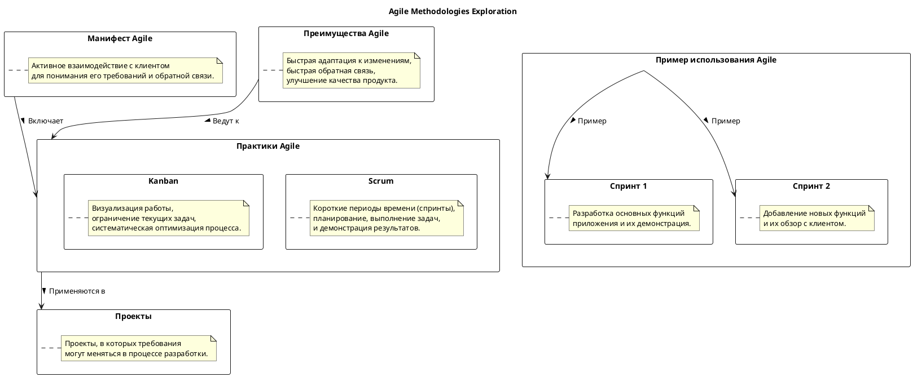
---
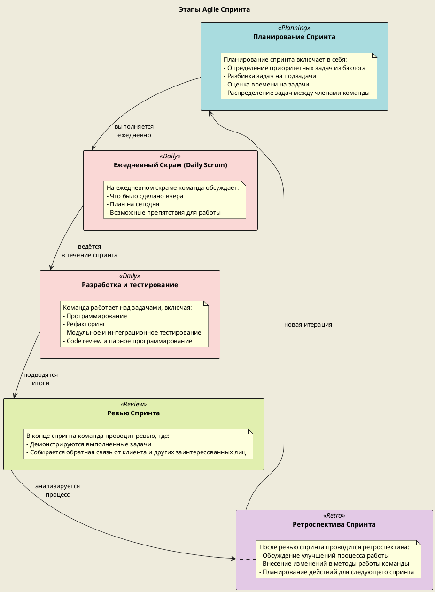

#### SCRUM

🔍 **Что такое SCRUM?**

SCRUM - это гибкая методология разработки, которая используется для управления проектами. Она основана на итеративном и инкрементальном подходе к разработке, где проект разбивается на короткие спринты, обычно длительностью от 1 до 4 недель. Каждый спринт имеет конкретные цели и результаты, которые должны быть достигнуты.

📚 **Как работает SCRUM?**

SCRUM состоит из нескольких ключевых элементов:

- **Продуктовый бэклог**: это список всех требований и задач проекта, упорядоченных по приоритету. Он постоянно обновляется и изменяется в соответствии с потребностями проекта.
- **Спринты**: это короткие временные интервалы (обычно 1-4 недели), в течение которых команда разработчиков работает над определенным набором задач из продуктового бэклога.
- **Спринт планирование**: на этом этапе команда выбирает задачи из продуктового бэклога для выполнения в следующем спринте. Задачи декомпозируются на более мелкие подзадачи, и определяется объем работы, который команда может выполнить за спринт.
- **Ежедневное SCRUM-совещание**: это короткое (обычно 15 минут) ежедневное совещание, на котором каждый член команды отчитывается о своих достижениях, планах и препятствиях.
- **Спринтовый обзор**: на этом совещании команда демонстрирует выполненную работу заказчику или заинтересованным сторонам и получает обратную связь.
- **Спринтовый ретроспектив**: на этом совещании команда анализирует прошлый спринт и обсуждает, что было хорошо, что можно улучшить и какие изменения нужно внести в следующий спринт.

🛠️ **Зачем использовать SCRUM?**

SCRUM помогает командам разработчиков достичь следующих преимуществ:

- Гибкость: SCRUM позволяет быстро реагировать на изменения требований клиента или рынка. Команда может легко адаптироваться к новым условиям и вносить коррективы в работу.
- Прозрачность: каждый спринт имеет конкретные цели и результаты, которые видны всей команде и заказчику. Это обеспечивает прозрачность процесса разработки и позволяет легко отслеживать прогресс.
- Коллективная ответственность: SCRUM подразумевает активное участие всей команды в планировании, выполнении и оценке работы. Каждый член команды несет ответственность за достижение целей спринта.
- Улучшение качества: регулярные спринтовые обзоры и ретроспективы помогают выявлять проблемы и находить пути для улучшения процесса разработки.

💡 **Важные принципы SCRUM**

SCRUM основан на нескольких важных принципах:

- **Инкрементальность**: разработка происходит постепенно, с каждым спринтом добавляются новые функции или улучшения к уже существующим.
- **Самоорганизация**: команда сама организует свою работу и принимает решения. SCRUM-мастер играет роль фасилитатора, помогая команде следовать методологии.
- **Коллективная ответственность**: каждый член команды несет ответственность за достижение целей спринта и успех проекта в целом.
- **Обратная связь**: регулярные спринтовые обзоры и ретроспективы позволяют команде получать обратную связь от заказчика и улучшать процесс разработки.

SCRUM - это мощный инструмент для управления проектами разработки программного обеспечения. Он помогает командам разработчиков организовывать свою работу, достигать поставленных целей и создавать качественное программное обеспечение.


🚀 **Заключение**

Методологии разработки играют важную роль в создании программного обеспечения. Они помогают командам разработчиков организовывать свою работу, повышать эффективность и достигать поставленных целей. Выбор подходящей методологии зависит от конкретных условий проекта, но независимо от выбранной методологии, важно придерживаться общих принципов успешной разработки.

#### В чем разница?

Scrum и Agile (эджайл) часто упоминаются вместе, и это может привести к путанице, но важно понимать различие между ними.

### Agile (Эджайл)

**Agile** - это больше философия или набор принципов для разработки программного обеспечения, которая была описана в [Агил-манифесте](http://agilemanifesto.org/) в 2001 году. Основные принципы Agile включают:

- **Индивиды и взаимодействия** больше, чем процессы и инструменты.
- **Работающий продукт** больше, чем исчерпывающая документация.
- **Сотрудничество с клиентом** больше, чем договоренности по контракту.
- **Готовность к изменениям** больше, чем следование первоначальному плану.

Цель Agile - ускорить процесс разработки и сделать его более гибким, с акцентом на быстрое и непрерывное доставление ценности клиенту, активное вовлечение клиента в процесс, открытость к изменениям и непрерывное улучшение.
### Scrum

**Scrum**, с другой стороны, является одной из конкретных методологий, следующих философии Agile. Это набор практик и ролей, которые применяются в рамках разработки продукта. Основные аспекты Scrum включают:

- **Роли**: В Scrum определены специфические роли, такие как Скрам-мастер (Scrum Master), Владелец продукта (Product Owner) и Команда разработки (Development Team).
- **События**: Scrum разбивает проект на итерации, известные как спринты (обычно от 1 до 4 недель), с регулярными совещаниями (Daily Stand-up, Sprint Planning, Sprint Review и Sprint Retrospective).
- **Артефакты**: Scrum требует определенных "доставляемых" элементов, таких как Product Backlog (список всех требований к продукту), Sprint Backlog (требования, выбранные для реализации в текущем спринте) и Increment (новая версия продукта, получаемая по итогам спринта).

### Как Scrum отличается от Agile

- **Agile** - это широкая философия с множеством подходов (включая Scrum, Kanban и другие), в то время как **Scrum** - это конкретный набор правил и практик для реализации этой философии.
- **Agile** определяет ценности и принципы, **Scrum** предоставляет конкретный способ их применения.
- В **Agile** в центре внимания - непрерывное улучшение и гибкость, в **Scrum** - прозрачность, инспектирование и адаптация через фиксированные рамки спринтов.

Таким образом, Scrum - это один из способов "делать" Agile, предоставляющий конкретный фреймворк для его применения на практике.

### Водопадная модель

🔍 **Что такое водопадная модель?**

**Водопадная модель** - это последовательный подход к разработке, где каждая фаза строго следует за предыдущей. Она предполагает линейную последовательность шагов, начиная с определения требований и заканчивая тестированием и поддержкой продукта.

📚 **Как работает водопадная модель?**

Водопадная модель состоит из следующих фаз:

1. Определение требований: команда разработчиков взаимодействует с клиентом, чтобы определить требования к программному продукту.
2. Анализ: команда анализирует требования и определяет, какие функции должны быть реализованы.
3. Проектирование: на основе анализа команда разрабатывает детальный план проекта, включая архитектуру и дизайн.
4. Разработка: команда приступает к написанию кода и реализации функциональности продукта.
5. Тестирование: после завершения разработки команда проводит тестирование для обнаружения и исправления ошибок.
6. Внедрение: разработанный продукт внедряется в рабочую среду или предоставляется клиенту.
7. Поддержка: команда обеспечивает поддержку и техническое обслуживание продукта после его внедрения.

Каждая фаза завершается перед переходом к следующей, и изменения требований или планов могут быть сложными или невозможными на поздних этапах разработки.

🛠️ **Когда использовать водопадную модель?**

Водопадная модель подходит для проектов, где требования четко определены заранее и не подвержены изменениям. Она может быть полезна, когда клиент имеет четкое представление о конечном продукте и не ожидает значительных изменений.

💡 **Преимущества водопадной модели**

- Простота: водопадная модель проста в использовании и понимании.
- Четкость: каждая фаза строго следует за предыдущей, что обеспечивает четкость процесса разработки.
- Хорошо подходит для стабильных требований: если требования четко определены заранее, то водопадная модель может быть эффективным подходом.

📈 **Пример использования водопадной модели**

Представим, что команда разработчиков работает над созданием веб-сайта для клиента. Сначала они проводят встречу с клиентом, чтобы
определить требования к веб-сайту. На основе этой информации команда анализирует требования и определяет, какие функции должны быть реализованы.

Затем команда приступает к проектированию веб-сайта, разрабатывая детальный план, который включает в себя архитектуру и дизайн. После завершения проектирования команда приступает к разработке, где они пишут код и реализуют функциональность веб-сайта.

После завершения разработки команда проводит тестирование, чтобы обнаружить и исправить ошибки. Затем разработанный веб-сайт внедряется в рабочую среду или предоставляется клиенту.

После внедрения команда продолжает обеспечивать поддержку и техническое обслуживание веб-сайта для клиента.

В данном случае использование водопадной модели было эффективным, так как требования к веб-сайту были четко определены заранее и не подвержены изменениям. Команда могла последовательно следовать каждой фазе разработки, что обеспечило четкость процесса и успешное завершение проекта.
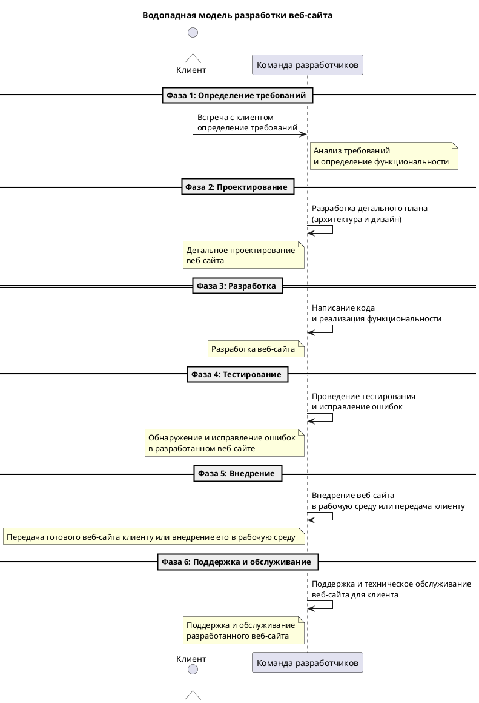


### Архитектурные фундаменты ООП

##### ООА и ООП: Близнецы-разработчики

**Объектно-ориентированный анализ (ООА)** и **объектно-ориентированное проектирование (ООП)** работают рука об руку, чтобы преобразовать требования к программному обеспечению в конкретные решения. ООА фокусируется на что система должна делать, а ООП на как система будет это делать.
ООА и ООП являются взаимосвязанными и взаимодополняющими методами разработки программного обеспечения. ООА направлен на анализ требований к системе и определение ее функциональности, тогда как ООП фокусируется на проектировании структуры системы и способа реализации этой функциональности.

В контексте **ООА**, разработчики проводят детальное изучение требований к системе, выявляют основные функции, которые она должна выполнять, а также определяют объекты и классы, которые будут использоваться для решения этих задач. В результате проведения ООА создается модель предметной области - набор классов, объектов и связей между ними, которые отражают структуру и поведение системы.

Затем наступает этап **ООП**, где разработчики принимают модель предметной области из ООА и начинают проектирование системы. В ходе проектирования определяется архитектура системы - как классы и объекты будут взаимодействовать между собой для выполнения необходимых функций. Разработчики определяют интерфейсы классов, методы и свойства, а также устанавливают отношения между классами, такие как наследование и ассоциация.

>[!info]
> **ООП позволяет разработчикам создавать модульные, гибкие и легко поддерживаемые системы.** Классы и объекты, созданные в ходе ООА и ООП, позволяют разделить систему на независимые компоненты, что упрощает ее разработку и сопровождение. Кроме того, ООП способствует повторному использованию кода благодаря возможности создания классов-наследников или использования композиции объектов.
>
**Важно отметить, что ООА и ООП не являются линейными процессами.** Разработчики могут проводить анализ требований к системе параллельно с проектированием ее структуры. В ходе работы над проектом могут возникать изменения в требованиях или необходимость изменить структуру системы. Поэтому гибкость и адаптивность являются ключевыми принципами ООА и ООП.
>
**Таким образом, ООА и ООП являются неотъемлемой частью разработки программного обеспечения.** Они работают вместе, чтобы преобразовать требования к системе в конкретные решения. ООА определяет, что система должна делать, а ООП определяет, как она будет это делать. Эти методы позволяют создавать гибкие и модульные системы, которые легко поддерживать и развивать.

### UML: Универсальный Язык Программистов

##### Разговаривая на UML

**Unified Modeling Language (UML)** - это визуальный язык, который позволяет аналитикам и разработчикам создавать схемы, отражающие структуру и поведение программных систем. Во время урока мы исследовали различные типы UML-диаграмм, каждая из которых служит определенной цели, от изображения статической структуры системы до моделирования ее поведения и динамики.

UML предоставляет разработчикам универсальный набор символов и нотаций, которые позволяют им визуализировать различные аспекты системы. Например, **диаграмма классов UML** позволяет представить структуру классов и связей между ними, а **диаграмма последовательности UML** позволяет моделировать взаимодействие объектов во времени.

Одним из основных преимуществ использования UML является его универсальность. UML может быть использован для моделирования различных типов систем, от маленьких приложений до сложных корпоративных систем. Благодаря этому, команда разработчиков может использовать общий язык и нотацию для обмена идеями и концепциями.

*Еще одним преимуществом UML является его способность сделать сложные концепции более понятными и доступными.* 

**Вместо того чтобы описывать систему словами или текстом, разработчики могут использовать графические диаграммы, которые легко читаются и понимаются. Это особенно полезно при командной работе или при общении с заинтересованными сторонами, которые не имеют технического образования.**

Кроме того, UML позволяет разработчикам проводить анализ и проектирование системы на ранних этапах разработки. С помощью UML-диаграмм, разработчики могут визуализировать требования к системе, определить ее структуру и взаимодействие компонентов. Это помогает предотвратить ошибки и проблемы, связанные с неправильным пониманием требований или недостаточной архитектурой системы.

Однако следует отметить, что UML не является самоцелью. Он является всего лишь инструментом для моделирования и коммуникации. Успешное использование UML требует хорошего понимания его концепций и нотаций, а также умения применять его в конкретной ситуации.

В целом, UML является мощным инструментом для анализа и проектирования программных систем. Он позволяет разработчикам визуализировать сложные концепции и обменяться информацией с другими участниками проекта. Успешное использование UML может значительно повысить качество и эффективность разработки программного обеспечения.

#### Виды диаграмм: Наброски будущего ПО

Одни из ключевых диаграмм в UML - это диаграммы классов, объектов, вариантов использования, активностей, последовательности и состояний. Диаграммы классов, например, отображают классы и отношения между ними, обеспечивая основу для построения системы.
Диаграммы объектов, в свою очередь, представляют конкретные экземпляры классов и связи между ними. Эти диаграммы полезны для понимания, как объекты взаимодействуют друг с другом в рамках системы.

1. Диаграммы вариантов использования
2. Диаграмма классов
3. Диаграмма состояний
4. Диаграмма деятельности
5. Диаграмма последовательности
6. Диаграмма кооперации
7. Диаграмма компонентов
8. Диаграмма развертывания

Давайте чуть более подробно поговорим, что с помощью каждой из них можно сделать.

**Диаграммы вариантов использования**: позволяют описать различные сценарии использования системы, иллюстрируя взаимодействие между актерами (пользователями или внешними системами) и системой. Они помогают определить функциональные требования к системе и выделить основные функции, которые должна выполнять система. Например, диаграмма вариантов использования может показать, как пользователь регистрируется в системе, авторизуется, создает новый объект или выполняет поиск информации.

Пример:

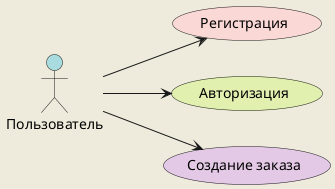


**Диаграмма классов**: позволяет описать структуру системы, ее классы и связи между ними. Она показывает атрибуты и методы каждого класса, а также отношения наследования, ассоциации, агрегации и композиции между классами. Диаграмма классов является основой для проектирования объектно-ориентированных систем.

Пример:

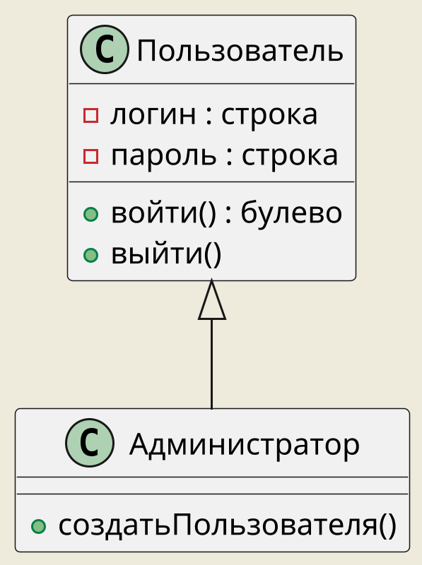


**Диаграмма состояний**: позволяет описать жизненный цикл объекта или состояния системы. Она показывает переходы между состояниями объекта или системы в ответ на определенные события. Диаграмма состояний полезна для моделирования поведения объектов или системы в различных ситуациях.

Пример:

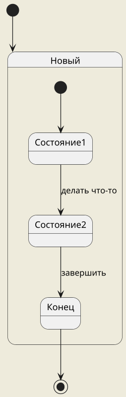


**Диаграмма деятельности**: позволяет описать последовательность действий или процессов в рамках определенного сценария использования. Она показывает шаги, условия и ветвления в процессе выполнения задачи. Диаграмма деятельности полезна для анализа и оптимизации бизнес-процессов.

Пример:

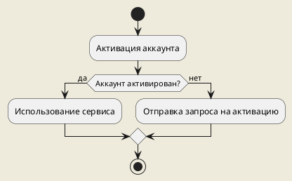


**Диаграмма последовательности**: позволяет описать взаимодействие между объектами или компонентами системы в рамках определенного сценария использования. Она показывает последовательность сообщений, которые передаются между объектами, и время выполнения каждого сообщения. Диаграмма последовательности полезна для анализа и оптимизации взаимодействия между компонентами системы.

Пример:

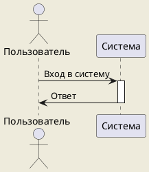


**Диаграмма кооперации**: позволяет описать сотрудничество между объектами или компонентами системы в рамках определенного сценария использования. Она показывает, как объекты обмениваются сообщениями и как они сотрудничают для выполнения задачи. Диаграмма кооперации полезна для анализа и оптимизации коллективной работы объектов или компонентов.

Пример:

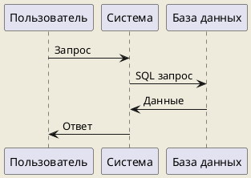


В чем отличия UML диаграмм кооперации и последовательности? 

🔍 UML диаграммы кооперации и последовательности являются двумя типами диаграмм, используемых в языке моделирования UML (Unified Modeling Language). Они оба представляют взаимодействие между объектами в системе, но имеют некоторые отличия.

📊 **UML диаграмма кооперации** (Collaboration diagram) также известна как диаграмма коммуникации. Она показывает, как объекты сотрудничают друг с другом для выполнения определенной функциональности. Диаграмма кооперации фокусируется на связях между объектами и порядке передачи сообщений между ними. Она отображает объекты в виде прямоугольников с их именами и ролями, а связи между объектами представлены стрелками или линиями.

⚙️ **UML диаграмма последовательности** (Sequence diagram) показывает последовательность сообщений, передаваемых между объектами в системе. Она описывает, как объекты взаимодействуют друг с другом в определенном порядке для достижения цели. Диаграмма последовательности отображает объекты в виде прямоугольников с их именами, а сообщения представлены стрелками, указывающими направление передачи сообщения.

🔄 Отличия между диаграммой кооперации и диаграммой последовательности:

1️⃣  **Уровень детализации**: Диаграмма кооперации обычно более абстрактна и показывает общую структуру взаимодействия объектов, в то время как диаграмма последовательности более детализирована и показывает точную последовательность сообщений между объектами.

2️⃣  **Фокус**: Диаграмма кооперации фокусируется на связях между объектами и коммуникации, тогда как диаграмма последовательности фокусируется на временной последовательности сообщений.

3️⃣  **Представление объектов**: В диаграмме кооперации объекты представлены с указанием их ролей, а в диаграмме последовательности они представлены только с их именами.

4️⃣  **Сложность**: Диаграмма кооперации может быть проще для понимания, так как она не учитывает временные аспекты взаимодействия. Диаграмма последовательности может быть сложнее для понимания из-за учета времени выполнения операций.

📝 В целом, диаграмма кооперации и диаграмма последовательности являются полезными инструментами для визуализации взаимодействия между объектами в системе. Выбор между ними зависит от уровня детализации и целей моделирования.

**Диаграмма компонентов**: позволяет описать структуру системы на уровне компонентов и связей между ними. Она показывает, какие компоненты присутствуют в системе, как они связаны между собой и какие интерфейсы они предоставляют. Диаграмма компонентов полезна для архитектурного проектирования системы.

Пример:

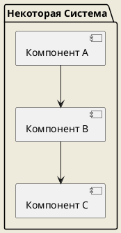


**Диаграмма развертывания**: позволяет описать физическую конфигурацию системы, ее компоненты и связи между ними. Она показывает, на каких устройствах или серверах размещены компоненты системы и как они взаимодействуют друг с другом. Диаграмма развертывания полезна для планирования и настройки инфраструктуры системы.

Пример:

```plantuml
scale 800 height
@startuml
skinparam BackgroundColor #EEEBDC

' 8. Диаграмма развертывания
node "Сервер приложений" as AppServer {
  artifact "МояАпп.war"
}
node "База данных" as Database {
  artifact "МояБаза.db"
}
AppServer --> Database : JDBC

@enduml

````



Каждая из этих диаграмм имеет свою специфическую цель и помогает разработчикам и аналитикам лучше понять структуру и поведение системы, ее функциональные требования и взаимодействие между компонентами. Использование этих диаграмм в процессе разработки программного обеспечения помогает улучшить качество и эффективность проекта.

##### Применение UML: От анализа до разработки

UML может быть использован на различных этапах жизненного цикла программного обеспечения, начиная с анализа требований и заканчивая разработкой и тестированием.

На этапе анализа требований UML-диаграммы могут быть использованы для визуализации требований пользователей и определения функциональности системы. Диаграммы вариантов использования могут помочь разработчикам понять, как пользователи будут взаимодействовать с системой, а диаграммы классов - определить основные компоненты системы.

На этапе проектирования UML-диаграммы используются для определения структуры и архитектуры системы. Диаграммы классов позволяют разработчикам определить классы и связи между ними, а диаграммы последовательности - моделировать взаимодействие объектов. Диаграммы состояний могут быть использованы для моделирования поведения объектов или системы в различных состояниях.

На этапе разработки UML-диаграммы могут быть использованы для документирования кода и обмена информацией между членами команды разработки. Диаграммы классов могут помочь разработчикам понять структуру кода и отношения между классами, а диаграммы активностей - моделировать последовательность операций или процессов.

На этапе тестирования UML-диаграммы могут быть использованы для определения тестовых сценариев и проверки соответствия реализации требованиям. Диаграммы вариантов использования могут помочь определить сценарии использования системы, которые должны быть протестированы, а диаграммы последовательности - моделировать взаимодействие объектов в тестовых сценариях.

В целом, UML является мощным инструментом для анализа и проектирования программных систем на различных этапах их разработки. Он позволяет разработчикам визуализировать и коммуницировать сложные концепции, улучшает понимание требований и помогает предотвратить ошибки и проблемы в процессе разработки.

##### 📝 Пример: Диаграмма вариантов использования UML

```plantuml
@startuml
left to right direction
actor Customer
actor Bank
usecase "Withdraw cash" as WC
usecase "Deposit funds" as DF
usecase "Transfer funds" as TF
Customer --> WC
Customer --> DF
Bank --> TF
@enduml
```

На приведенной диаграмме показано взаимодействие клиента с банковскими операциями, такими как снятие наличных и пополнение счета, а также возможность банка осуществлять переводы.

##### Окно в процесс разработки

Во время урока мы также обсудили, как практически использовать UML для моделирования. С помощью UML можно начать переводить собранные требования в четко определенные модели, которые станут основой для написания кода.

##### Вопросы: Мост между теорией и практикой

Вопросы и ответы играют ключевую роль в образовательном процессе, особенно когда речь идет о сложных темах, таких как методологии программирования. Задавая вопросы, студенты имеют возможность глубже погрузиться в материал, а преподаватель может лучше понять, какие аспекты требуют дополнительного объяснения.

>[!info]
> ##### Подводя итоги
>
К концу урока мы пришли к пониманию, что объектно-ориентированный анализ и проектирование не ограничиваются только созданием кода. Это комплексный процесс, который начинается с понимания того, что система должна делать, и переходит к детальному планированию того, как система будет это делать.
>
Мы разобрались, что UML не просто инструмент для создания диаграмм, но и способ общения внутри команды разработчиков и с заинтересованными сторонами. UML помогает представить сложные системы в удобоваримом и универсальном виде, что существенно облегчает процесс проектирования и сопровождения программных продуктов.
>
В конце урока, каждый студент вынес для себя что-то важное: для кого-то это было новое открытие методологий ООАП, а кто-то увидел, как теоретические знания превращаются в практические навыки, благодаря примерам использования UML. Это знания, которые станут фундаментом для дальнейшего пути в мире программирования.

## Урок 3

>[!warning] 
>### Содержание. Урок 3: Диаграммы в UML. Диаграммы вариантов использования (3-й урок)
>
**Цели урока:**
>- Знакомство со структурой и назначением диаграмм вариантов использования в UML
>- Разработка навыков построения диаграмм вариантов использования
>
**План урока:**
>- **Введение (5 минут):** Объяснение целей урока и важности диаграмм вариантов использования
>- **Теория диаграмм вариантов использования (10 минут):** Обучение структуре и элементам диаграмм вариантов использования
>- **Примеры диаграмм вариантов использования (15 минут):** Анализ реальных примеров диаграмм
>- **Создание диаграммы (10 минут):** Разработка простой диаграммы вариантов использования на общем примере
>- **Обсуждение и вопросы (3 минуты):** Возможность для студентов задать вопросы по пройденному материалу
>- **Заключение (2 минуты):** Объяснение домашнего задания, подведение итогов урока

```tg
Подробный и детальный конспект этого урока. В формате СТАТЬИ. А не плана, указаний или приказов. Никаких домашних задний, если я об этом не прошу. Подробно, понятно, простым языком. Можешь использовать PlantUml диаграммы (пиши их код) для коротких примеров. Используй заголовки 3 и 4 уровней, а так же перечни, эмодзи.
```

### Осваиваем UML: Искусство Диаграмм Вариантов Использования

#### 🌟 Вступление в мир UML


> [!info] 
> Отличная статья Хабра[^1] на эту тему. [читать](https://habr.com/ru/articles/566218/)
> 
> Отличное видео на тему[^2] : 
> <iframe width="560" height="315" src="https://www.youtube.com/embed/BdAcxboG5No?si=HB9B-KKZ2HtXETHb" title="YouTube video player" frameborder="0" allow="accelerometer; autoplay; clipboard-write; encrypted-media; gyroscope; picture-in-picture; web-share" allowfullscreen></iframe>

---

> [!INFO]- Collapse
> 
В этом видео мы рассмотрим диаграмму прецедентов и разберемся, что она представляет собой, как определять прецеденты, кто такие актеры и вообще, что происходит в этом процессе. Если вам интересна эта тема, ставьте лайк, подписывайтесь на канал и не забудьте нажать на колокольчик, чтобы получать уведомления о новых видео.
>
Диаграмма прецедентов обычно используется для отображения связей между прецедентами, актерами и системами. Она не показывает порядок выполнения шагов для достижения целей каждого прецедента и содержит только несколько фигур. Если на диаграмме более 20 вариантов прецедентов, скорее всего она неправильно используется.
>
Существует множество различных диаграмм и каждая из них служит своим целям. Очень часто можно описать разные детали системы с использованием других типов диаграмм и связать их с помощью прецедентов. Прецеденты представляют только функциональные требования системы. Другие требования, такие как бизнес-правила, требования качества обслуживания и ограничения реализации, должны быть представлены отдельными диаграммами.
>
>Диаграмма прецедентов обычно разрабатывается на ранней стадии разработки и используется для следующих целей: определение контекста системы, формирование требований к системе, валидация архитектуры системы, внедрение реализации и создание контрольных примеров или тестов. Обычно все это разрабатывается аналитиками совместно с экспертами из области, в которой создается система.
>
>Таким образом, диаграмма прецедентов является важным инструментом для понимания функциональных требований системы и ее контекста. Она помогает определить связи между прецедентами, актерами и системой, а также установить правильные требования для успешной разработки и внедрения системы.
>![[Pasted image 20240318084949.png]]
**Актер в широком смысле** - это человек или сущность, которая взаимодействует с системой и благодаря которой возникают прецеденты на диаграмме. Обычно актер изображается в виде стилизованного человечка и имеет название, соответствующее его роли в бизнес-процессах. Актер подобен концепции пользователя, но может играть разные роли. Например, профессор может быть как преподавателем, так и научным руководителем в исследованиях. Таким образом, он играет две роли в разных системах.
>
>**Актер запускает прецеденты**, то есть взаимодействует с системой. Взаимодействие актера с системой определяет, как система реагирует на это взаимодействие и описывает прецедент. Актер также имеет определенные ожидания от взаимодействия с системой. Если ожидания не соответствуют действительности, то возникают проблемы в работе системы.
>
>**Прецедент** - это функция системы, которая может быть автоматической или мануальной. Название прецедента обычно состоит из глагола и существительного или словосочетания. Каждый актер должен быть связан с прецедентом, в то время как некоторые прецеденты могут не иметь связи с актерами. Прецеденты определяют ожидаемое поведение системы, но не описывают точный способ его достижения.
>
>Прецеденты могут быть представлены в текстовом или графическом виде, например, в виде диаграммы прецедентов. Главная цель моделирования прецедентов - помочь нам проектировать систему с точки зрения конечного пользователя, указав все видимые действия системы. Актеры могут быть связаны с прецедентами через ассоциации, которые показывают, что актер и прецедент взаимодействуют друг с другом посредством сообщений или вызовов. Граница системы на графической диаграмме обозначается сплошной линией.
>
>Для больших и сложных систем каждый модуль может иметь свою границу системы, а может быть и общая граница для всей системы. Например, для ERP-системы и организации каждый модуль, такой как управление персоналом, начисление заработной платы, бухгалтерский учет и т. д., может иметь свою системную границу для прецедентов, специфичных для каждой из этих бизнес-функций. Вся система может охватывать все эти модули и иметь общую границу.
>
>Взаимосвязи между прецедентами определяются аналитиками программного обеспечения. Использование существующих прецедентов с помощью различных типов отношений позволяет снизить общие усилия, необходимые для разработки системы.
>
>Давайте рассмотрим основные взаимосвязи между прецедентами на примерах. Диаграмма прецедентов иллюстрирует набор прецедентов для системы, то есть субъектов и отношений между ними. "Extends" или "расширение" указывает, что, например, прецедент "неверный пароль" может быть включен при условии, указанном в расширениях. Естественно, поведение, указанное в базовом прецеденте "вход в учетную запись", будет описывать действия актера с учетной записью. Представим себе ситуацию, когда у нас есть базовый прецедент, описывающий взаимодействие актера с учетной записью. Например, возможность логина. На этот базовый прецедент можно добавить несколько расширений, таких как "неверный пароль", при котором система будет реагировать определенным образом, и верный пароль, при котором система скорее всего будет реагировать по-другому.
>
>**Расширение** является важным элементом, так как показывает дополнительную функциональность или поведение системы. Такой тип отношений используется для включения необязательного поведения из того прецедента, который расширяет базовый прецедент. Например, студент запрашивает расписание, и это требует расширения базового прецедента "запросить расписание" в прецеденте "поиск". "Include" или "включение в себя" означает, что один прецедент использует функциональность другого прецедента. Отношение между ними обозначается при помощи стереотипа "include". Такой тип отношений означает, что экземпляр базового прецедента будет включать поведение, указанное в дочернем прецеденте. Оно обозначается направленной стрелкой из пунктирной линии, где кончик указывает на дочерний прецедент. Включение добавляет дополнительную функциональность, не указанную в базовом сценарии использования, и используется для того, чтобы добавить общее поведение из включенного прецедента в базовый прецеденты.
>
>**Генерализация или наследование** - это отношение между прецедентами, которое поддерживает повторное использование общего поведения. В этом отношении родительский прецедент является основой для дочернего прецедента, который расширяет его функциональность. Генерализация изображается сплошной линией с треугольным наконечником, указывающим на родителя.
>
>**Дочерний прецедент** наследует поведение и смысловую составляющую своего родителя, но может также добавить или переопределить его поведение. Например, в нашем случае у родительского прецедента "поиск" есть два наследника: "поиск по преподавателю" и "поиск по дате".
>
>На данной диаграмме прецедентов описана система продаж автомобилей. И интересно заметить, что такая большая система может быть описана всего 10 прецедентами. В этом и заключается прелесть диаграммы прецедентов - она позволяет структурировать и организовать систему с точки зрения действующих лиц или актеров.
>
>Есть несколько советов по эффективному использованию диаграммы прецедентов в проекте. Во-первых, всегда структурируйте и организуйте диаграмму прецедентов с точки зрения актеров. Прецеденты должны начинаться с простого и обобщенного варианта, а затем уточняться и детализироваться. Диаграммы прецедентов основаны на функциональности и должны быть сосредоточены на том, что они делают и как.

---

Добро пожаловать в увлекательный мир моделирования! 

На третьем уроке мы погружаемся в изучение диаграмм вариантов использования UML (Unified Modeling Language) - мощного инструмента для визуализации, спецификации и документирования разработки систем.

#### 📘 Суть диаграмм вариантов использования

##### Что такое диаграмма вариантов использования?

Диаграмма вариантов использования - это графическое представление функций, которые система должна выполнять с точки зрения пользователей. Эти диаграммы помогают нам разобраться, как конечные пользователи будут взаимодействовать с системой, что в свою очередь позволяет определить требования к функционалу системы.

##### Элементы диаграммы

На таких диаграммах вы увидите следующие элементы:
- **Актеры (Actors)** - это пользователи или внешние системы, которые взаимодействуют с нашей системой.
- **Прецеденты (Use Cases)** - это функциональные возможности системы, описанные с точки зрения пользователя.


>[!info] 
>Прецеденты **описывают конкретные действия**, которые пользователь может выполнить в системе. Например, "Зарегистрироваться в системе", "Добавить товар в корзину" или "Оформить заказ". Каждый прецедент имеет название, которое отражает его основную функцию.

##### Зачем нужна диаграмма вариантов использования?

**Диаграмма вариантов использования помогает разработчикам и аналитикам лучше понять требования к системе и ее функциональность.** Она позволяет описать все возможные действия пользователей и определить, как система должна на них реагировать.

Эта диаграмма также может быть полезна для коммуникации с заказчиком или другими заинтересованными сторонами. Она предоставляет наглядное представление функциональности системы и помогает уточнить требования.

##### Как строится диаграмма вариантов использования?

Для построения диаграммы вариантов использования нужно выполнить следующие шаги:

1. **Определить актеров** - пользователей или внешние системы, которые будут взаимодействовать с нашей системой. Например, это могут быть администраторы, клиенты или другие сервисы.

2. **Определить прецеденты** - функциональные возможности системы, описанные с точки зрения пользователя. Для каждого прецедента нужно указать его название и краткое описание.

3. **Установить связи между актерами и прецедентами** - показать, какие актеры могут выполнять какие прецеденты. Например, администратор может добавлять новых пользователей в систему, а клиент может оформлять заказы.

4. **Добавить расширения и альтернативные пути** - показать возможные варианты развития событий внутри прецедента. Например, если пользователь вводит неправильные данные при регистрации, система может показать ошибку и запросить повторный ввод.

##### Пример диаграммы вариантов использования


На этом примере видно, что актер "Пользователь" может выполнять прецеденты "Зарегистрироваться", "Войти в систему" и "Просмотреть товары". Актер "Администратор" может выполнять прецеденты "Добавить нового пользователя" и "Удалить пользователя".

```md
mermaid
```

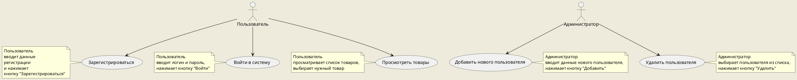
##### Заключение

Диаграмма вариантов использования - это инструмент, который помогает определить требования к функционалу системы и понять, как пользователи будут взаимодействовать с ней. Она является важной частью процесса анализа и проектирования системы и помогает улучшить коммуникацию между разработчиками, аналитиками и заказчиком.


#### 🖼️ Пример диаграммы вариантов использования

Давайте посмотрим, как выглядит простая диаграмма вариантов использования на примере интернет-магазина:

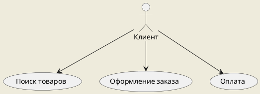


На диаграмме представлен клиент (актер) и основные действия, которые он может выполнять в системе: поиск товаров, оформление заказа и оплату.

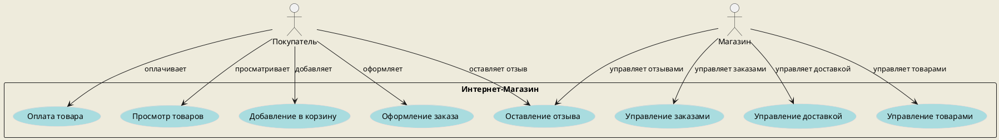
#### 💡 Строим диаграмму вместе

##### Как создать свою диаграмму?

На уроке мы научились создавать такие диаграммы шаг за шагом:
1. Определите актеров системы.
2. Выделите основные действия, которые актеры выполняют с системой.
3. Нарисуйте диаграмму, используя актеров и прецеденты.

### Диаграммы вариантов использования UML: Всё, что Вам Нужно Знать

Диаграмма вариантов использования (Use Case Diagram) в UML - это прекрасный инструмент, который позволяет наглядно показать, как различные пользователи (или системы) взаимодействуют с системой. Чтобы понять этот вид диаграмм, давайте подробно рассмотрим её основные элементы и блоки.

#### Актёры (Actors)

Актёры - это представление пользователей или других систем, которые взаимодействуют с нашей системой. Они могут быть:

- **Людьми** (например, клиент, администратор).
- **Внешними системами** (например, платёжная система, база данных).
- **Подсистемами** (если наша система является частью большего приложения).

На диаграмме актёры обычно обозначаются в виде человечков или прямоугольников с именами ролей.

#### Прецеденты (Use Cases)

Прецеденты - это функции или задачи, которые система выполняет в ответ на действия актёров. Они описывают, что система делает, но не то, как она это делает. На диаграмме прецеденты обозначаются овалами с названиями внутри.

#### Отношения (Relationships)

Отношения показывают связи между актёрами и прецедентами. Существует несколько типов отношений:

- **Ассоциации** (простые линии) - базовые взаимодействия актёра с прецедентом. Тип стрелки: прямая линия без стрелок.
- **Включения** (include) - когда один прецедент включает в себя другой. Тип стрелки: пунктирная со стрелкой, указывающей на включаемый прецедент.
- **Расширения** (extend) - когда прецедент может расширяться дополнительным поведением. Тип стрелки: пунктирная со стрелкой.

#### Заметки (Notes)

Заметки могут быть добавлены к любому элементу для дополнительного пояснения или комментариев. Они помогают лучше понять логику диаграммы и могут содержать дополнительную информацию о прецедентах или актёрах.

#### Пример диаграммы вариантов использования с PlantUML

Давайте создадим простую диаграмму вариантов использования для интернет-магазина:

```plantuml
@startuml
skinparam BackgroundColor #EEEBDC
skinparam UseCaseBackgroundColor #A9DCDF
skinparam UseCaseBorderColor #FAD8D6
skinparam ActorBackgroundColor #E1EFAF
skinparam ActorBorderColor #E3C9E6

actor "Клиент" as Client
actor "Система управления заказами" as OrderSystem

usecase "Выбор товара" as UC1
usecase "Добавление товара в корзину" as UC2


usecase "Оформление заказа" as UC3
usecase "Оплата заказа" as UC4

Client --> UC1
Client --> UC2
Client --> UC3
Client --> UC4

OrderSystem --> UC3
OrderSystem --> UC4

note right of UC1
  Клиент просматривает каталог,
  выбирает товары по категориям.
end note

note right of UC2
  Выбранные товары помещаются
  в виртуальную корзину для последующего оформления заказа.
end note

note right of UC3
  Клиент вводит данные для доставки,
  проверяет заказ перед подтверждением.
end note

note right of UC4
  Платеж может быть совершен
  различными способами: кредитной картой,
  электронными деньгами или при получении.
end note

@enduml
```

На этой диаграмме мы видим актёров "Клиент" и "Система управления заказами", которые взаимодействуют с прецедентами - "Выбор товара", "Добавление товара в корзину", "Оформление заказа" и "Оплата заказа". Заметки прилагаются к каждому прецеденту, чтобы объяснить, что происходит на каждом этапе.

В диаграммах вариантов использования UML используются следующие типы отношений между актерами и вариантами использования:

1. **Ассоциации** - линии, соединяющие актеров с вариантами использования, показывают, что актер участвует в варианте использования.
2. **Включения** (`<<include>>`) - когда один вариант использования неизбежно и всегда включает выполнение другого варианта использования.
3. **Расширения** (`<<extend>>`) - когда один вариант использования может в некоторых ситуациях включать дополнительное поведение, представленное другим вариантом использования.
4. **Обобщения** - когда один актер наследует роль другого актера, это подобно наследованию в объектно-ориентированном программировании.

### Примеры на PlantUML

#### Ассоциация

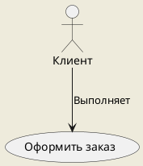

Эта диаграмма показывает, что клиент выполняет вариант использования "Оформить заказ".

#### Включение

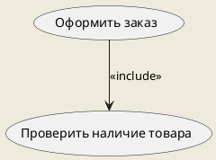

Здесь "Оформить заказ" всегда включает "Проверить наличие товара" как часть процесса.

#### Расширение

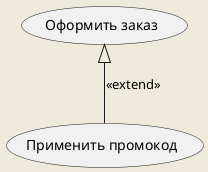

"Применить промокод" является необязательным расширением процесса оформления заказа.

#### Обобщение

```plantuml
@startuml
skinparam BackgroundColor #EEEBDC

actor "Пользователь" as User
actor "Премиум-клиент" as PremiumClient

PremiumClient --|> User

usecase "Оформить заказ" as PlaceOrder

User --> PlaceOrder
PremiumClient --> PlaceOrder

@enduml
```

"Премиум-клиент" является специализированным типом "Пользователя" и участвует в тех же вариантах использования, что и обычный "Пользователь".
#### 💬 Обсуждение и вопросы

Этот этап урока был посвящен вопросам от студентов, что помогло укрепить понимание основных концепций и узнать больше о специфических ситуациях при создании диаграмм.

#### 🎓 Заключительные мысли

В завершение мы подвели итоги: диаграммы вариантов использования - не просто рисунки, но и способ коммуникации между разработчиками, аналитиками и клиентами. Они служат мостом между желаниями и требованиями к реально работающей системе.

Давайте создадим диаграмму вариантов использования на PlantUML, на которой будут представлены различные типы отношений: ассоциация, включение (`<<include>>`), расширение (`<<extend>>`) и обобщение (наследование между актёрами). В этом примере будем рассматривать контекст веб-приложения для заказа еды.

```plantuml
@startuml
scale 1200 width
skinparam BackgroundColor #EEEBDC
skinparam style strictuml

left to right direction 
actor "Ресторанный критик" as fc 
rectangle Ресторан {   
usecase "Есть" as UC1   
usecase "Платить" as UC2   
usecase "Пить" as UC3   
usecase "Составлять отзыв" as UC4
} 
fc --> UC1 
fc --> UC2 
fc --> UC3 
fc --> UC4

@enduml
```

На этой диаграмме:
- **Ассоциация** (прямая стрелка) показывает, что Клиент может "Выбрать ресторан", "Сделать заказ", "Оплатить заказ" и "Оставить отзыв".
- **Включение** (`<<include>>`, пунктирная стрелка с наконечником) указывает, что действие "Оплатить заказ" всегда включается при выполнении "Сделать заказ".
- **Расширение** (`<<extend>>`, пунктирная стрелка с наконечником) демонстрирует, что возможность "Оставить отзыв" является опциональной и расширяет функциональность "Сделать заказ".
- **Наследование** между актёрами (прямая линия) показывает, что Администратор наследует возможности Клиента и добавляет свои уникальные действия, такие как "Добавить специальное предложение" и "Просмотреть заказы".

Этот пример иллюстрирует, как на диаграмме вариантов использования можно наглядно представить различные типы отношений между актёрами и прецедентами, описывая взаимодействие пользователей с системой.

```plantuml
@startuml

scale 1800 width
skinparam BackgroundColor #EEEBDC
skinparam style strictuml
left to right direction
skinparam packageStyle rectangle

actor Пользователь

actor "Внешняя система" as External

  

rectangle Система {

usecase "Основное использование" as UC1
usecase "Дополнительное использование" as UC2
usecase "Альтернативное использование" as UC3

}

Пользователь -> UC2 : данные

External --> UC1 : Ассоциация (обычное использование)
External ..> UC2 : расширяет
External .. UC3 : включает

note right of UC1 : Основное действие системы
note left of UC2 : Дополнительная функциональность
  
legend
== Легенда ==
  -->   : Ассоциация (обычное использование) - Простая линия, указывающая на обычное использование.
  ..>   : Расширение - Стрелка с пунктирной линией, указывающая на расширение.
  ..    : Включение - Пунктирная линия, без стрелки, указывающая на включение.
endlegend
@enduml
```
## Урок 4: Практическая работа: построение диаграмм вариантов использования

>[!info]
>Онлайн редакторы
>https://mermaid.live/
>http://draw.io/
>http://www.plantuml.com/plantuml/uml/


Для практической работы (урок №4), которая посвящена построению диаграмм вариантов использования UML (Use Case Diagrams), мы можем предложить следующие пять вариантов заданий:


### Вариант 1: Разработка диаграммы вариантов использования для системы онлайн-библиотеки

**Задача:** 
- Создать диаграмму вариантов использования, которая описывает взаимодействие пользователей с онлайн-системой библиотеки. Учесть различные типы пользователей: читатели, библиотекари и администраторы.

**Подзадачи:**
- Определение и описание акторов (читатели, библиотекари, администраторы).
- Определение вариантов использования для каждого актора (поиск книг, бронирование, управление пользователями и т.д.).
- Описание взаимодействия между акторами и системой.
- Визуализация взаимосвязей между акторами и вариантами использования.

### Вариант 2: Построение диаграммы для интернет-магазина

**Задача:** 
- Спроектировать диаграмму вариантов использования для интернет-магазина, включающую процессы выбора товара, оформления заказа и оплаты.

**Подзадачи:**
- Идентификация основных и альтернативных потоков событий для каждого варианта использования.
- Подробное описание потоков событий.
- Связывание вариантов использования с соответствующими акторами (покупатели, продавцы, система оплаты).
- Обсуждение ограничений и предпосылок для каждого варианта использования.

### Вариант 3: Анализ вариантов использования в системе управления проектами

**Задача:** 
- Разработать диаграмму вариантов использования для системы управления проектами, отражающую процессы планирования, отслеживания задач и взаимодействия команды.

**Подзадачи:**
- Определение ролей участников проекта (менеджер проекта, разработчик, аналитик и т.д.).
- Описание ключевых функций системы для каждой роли.
- Оформление диаграммы с чётким разграничением обязанностей и возможностей акторов.
- Создание сценариев использования для комплексных задач, требующих взаимодействия акторов.

### Вариант 4: Сценарии использования мобильного приложения для фитнес-трекинга

**Задача:** 
- Описать с помощью диаграммы вариантов использования типичные сценарии работы пользователя с мобильным приложением для отслеживания физической активности.

**Подзадачи:**
- Выявление функций приложения, таких как трекинг активности, планирование тренировок, настройка целей и мониторинг прогресса.
- Определение вариантов использования для различных видов пользователей (новички, опытные спортсмены).
- Изображение взаимодействия между пользователями и приложением, включая внешние сервисы (например, социальные сети для деления достижений).
- Разработка диаграммы, в которой будет учитываться возможность синхронизации данных с другими устройствами и сервисами (например, смарт-часы).

### Вариант 5: Проектирование диаграммы вариантов использования для автоматизированной системы ресторана

**Задача:**
- Создать диаграмму вариантов использования, отражающую процессы заказа еды в ресторане с использованием автоматизированной системы (как в зале, так и онлайн).

**Подзадачи:**
- Идентификация акторов системы (посетители, официанты, кухня, администрация).
- Выявление и описание функциональности системы для каждой группы акторов (электронное меню, система заказов, CRM для администрации).
- Описание процесса взаимодействия между акторами и системой, в том числе интеграция с платёжными и доставочными сервисами.
- Оформление диаграммы с указанием взаимодействий и зависимостей между различными вариантами использования.

При выполнении каждого из этих вариантов учащиеся должны сосредоточиться на детальном анализе предметной области, выявлении ключевых акторов и вариантов использования, а также на правильном оформлении диаграммы согласно стандартам UML. Они могут использовать различные инструменты для создания диаграмм, такие как Visio, Lucidchart или даже специализированные программы для UML, например, StarUML или Enterprise Architect. 

Важно также научить учащихся правильно документировать каждый вариант использования, включая основной поток действий и альтернативные потоки (если таковые имеются), а также потенциальные расширения и исключения. Это поможет им в дальнейшем при проектировании более сложных систем и в разработке технических требований.


## Уроки 5-7: Погружение в Диаграммы Классов UML


<iframe width="560" height="315" src="https://www.youtube.com/embed/sVVJp5a41o4?si=zKuERZEoUhj4rDj0" title="YouTube video player" frameborder="0" allow="accelerometer; autoplay; clipboard-write; encrypted-media; gyroscope; picture-in-picture; web-share" allowfullscreen></iframe>

### Введение в диаграмму классов

#### **Структура системы через диаграмму классов**

Диаграмма классов служит наглядным пособием для иллюстрации структуры системы, детально описывая классы, их атрибуты, методы, а также отношения между объектами. Сегодня мы погрузимся в изучение этой темы, раскрывая все тонкости и нюансы. Не забудьте подписаться на канал и активировать уведомления, чтобы не пропустить новые видео.

#### **UML: Унифицированный язык моделирования**

**UML**, или *Унифицированный язык моделирования*, представляет собой стандарт в мире программирования. Он был разработан для упрощения процесса проектирования систем с использованием общепринятого набора символов и нотаций. Этот инструмент стал ответом на потребность в едином языке моделирования среди разработчиков, уставших от хаоса различных символов и обозначений.

#### **Класс: основные понятия**

Класс можно описать как шаблон для создания объектов, который задает начальные значения состояния, инициализацию полей (переменных) и реализацию поведения (методов). Важно понимать, что класс определяет не только возможное состояние объекта через атрибуты, но и его поведение через методы. Каждый атрибут имеет свой тип данных, а каждый метод — свою сигнатуру.

#### **Отображение класса на диаграмме**

На диаграмме классов имя класса отображается в верхней части блока. Далее следуют атрибуты с указанием типов данных после двоеточия. В нижней части блока расположены методы с типами возвращаемых значений также после двоеточия в конце сигнатуры метода.

Минимальное обозначение класса на диаграмме

```plantuml
@startuml
scale 1800 width
class ClassName {
}
@enduml
```

**Важно:** На диаграмме обязательным является только указание имени класса. Это логично, поскольку без имени сложно понять предназначение элемента на диаграмме.

#### **Модификаторы доступа**

Вы могли заметить использование символов `+`, `-` и `#` перед атрибутами и методами на диаграммах классов. Эти символы обозначают модификаторы доступа:
- `+` означает `public` (общедоступный),
- `-` указывает на `private` (частный),
- `#` соответствует `protected` (защищенный).

### Параметры методов: Входные, Выходные и Ввода-Вывода

#### **Понимание направленности параметров**

В программировании, каждый параметр метода может иметь своё особое назначение и способ использования. Рассмотрим три ключевых типа направленности параметров: *in*, *out*, и *in out*.

- **Метод 1**: использует параметр `p1` как **входной**. Это значит, что значение `p1` активно участвует в работе метода, однако сам метод не вносит изменений в `p1`.
- **Метод 2**: принимает `p2` как параметр **ввода-вывода**. Здесь значение `p2` не только используется в процессе работы метода, но и подвергается изменениям, результаты которых доступны после выполнения метода.
- **Метод 3**: рассматривает `t3` как **выходной** параметр. В этом случае, `t3` служит "хранилищем" для результата работы метода.

#### **Применение диаграмм классов на разных этапах разработки**

Диаграммы классов являются мощным инструментом на всех этапах жизненного цикла разработки программного обеспечения. Их применение позволяет постепенно углубляться в детализацию проекта с трех различных точек зрения.

- **Концептуальная перспектива**: На этом уровне диаграмма интерпретируется как отражение объектов реального мира. Концепции изучаемой области представлены через классы, которые эти концепции реализуют. Эта перспектива абстрагирована от конкретных языков программирования.
  
- **Спецификационная перспектива**: Здесь диаграмма представляет абстракции программного обеспечения или его компонентов с указанием интерфейсов, но без деталей реализации. Смотря на спецификацию, можно увидеть структуру программного продукта, не углубляясь в его техническую составляющую.
  
- **Имплементационная перспектива**: Наконец, на этом уровне диаграмма описывает конкретную реализацию программного обеспечения с использованием определённых технологий и языков программирования. Это позволяет получить полное представление о том, как программа будет выполнена на практике.

Каждая из этих перспектив играет свою роль в процессе создания качественного и функционального ПО, помогая разработчикам систематизировать знания о проекте на различных его стадиях.

### Отношения между классами: Разбор ключевых типов

#### Ассоциация: Связующее звено между классами

**Ассоциация** представляет собой отношение между классами, аналогичное связям, которые соединяют объекты. Это основа для создания связей между объектами; без ассоциации невозможно обеспечить взаимодействие между двумя классами. Для визуализации такого взаимодействия используются соединительные линии, которые на схемах символизируют ассоциацию. Важной особенностью является возможность указания *кратности* – количества объектов, участвующих в отношениях. Кратность выражается через интервалы минимум-максимум, например, отражая возможность одного студента учиться у нескольких преподавателей и наоборот.

#### Наследование: Схематическое изображение иерархии

*Наследование*, иногда называемое генерализацией, демонстрирует отношение между базовым (родительским) классом и его производными (наследниками). Изображается в виде полой стрелки, направленной к родительскому классу. Примером может служить иерархия геометрических фигур: квадрат, прямоугольник и круг как наследники базового класса "Фигура". Наследование позволяет объединять несколько классов под общим родителем, при этом если речь идет о наследовании от абстрактного класса, его имя выделяется *курсивом*.

#### Реализация: Воплощение интерфейса объектами

Реализация – это отношение между интерфейсом и объектами, которые этот интерфейс воплощают. Это ключевой элемент для понимания того, как конкретные объекты применяют обобщенные методы интерфейса.

### Зависимость, Агрегация и Композиция: Отличия и примеры

Зависимость указывает на то, что изменения в одном классе могут повлиять на функциональность другого. Агрегация и композиция обозначают более специфические типы ассоциаций. В случае **агрегации**, целое состоит из частей, которые могут существовать независимо (например, автомобиль и колесо). **Композиция** же подразумевает более строгую связь: части не могут существовать без целого (например, дом и комната).

Каждый из этих шести основных типов отношений играет свою роль в проектировании программного обеспечения, помогая разработчикам создавать структурированный и легко модифицируемый код.

### Интерфейс и его Роль в Программировании

Интерфейс играет ключевую роль в объектно-ориентированном программировании, предоставляя набор методов для выполнения определенных действий, таких как покупка и продажа частной собственности. Это основа для создания гибких и масштабируемых приложений.

#### Зависимости между Классами

Когда дело доходит до отношений между классами, особое внимание уделяется зависимостям. Если объект одного класса использует объект другого класса без его сохранения в поле, такое отношение называется **зависимостью**. Это означает, что любые изменения в одном классе неизбежно повлияют на другой. Например, если у класса "Песня" есть метод `methodOfRead` с параметром "Книга", который проверяет, прочитал ли человек книгу, это является зависимостью. В диаграммах классов такие отношения обозначаются пунктирными линиями со стрелками.

#### Агрегация и Композиция

*Агрегация* — это форма ассоциации, когда один класс является частью другого. Примером может служить рабочее место программиста, состоящее из стула, стола, компьютера и вентилятора; эти элементы существуют независимо от удаления рабочего места. Агрегация изображается непрерывной линией с пустым ромбом на конце.

В отличие от агрегации, *композиция* подразумевает более строгую связь: если уничтожается агрегаторный класс, то уничтожаются и все его составные части. Например, органы тела не жизнеспособны без самого тела. Композиция обозначается похожим образом на агрегацию, но ромб закрашен полностью.

### Советы по Работе с Диаграммами Классов

Создание диаграмм классов может показаться сложной задачей на первый взгляд. Однако регулярная практика и использование примеров из области программирования значительно упрощает этот процесс. Начать можно с изучения различных **паттернов программирования**, которые помогут лучше понять структуру и взаимосвязь классов в программном коде.

### Урок 5: Основы Диаграмм Классов

## Введение 📚

Диаграммы классов являются неотъемлемой частью языка моделирования UML (Unified Modeling Language), который широко используется для визуализации, спецификации, конструирования и документирования систем. Эти диаграммы предоставляют статический снимок структуры системы, показывая классы системы, их атрибуты, методы и взаимосвязи между ними. Погрузимся в основные элементы диаграмм классов и узнаем, как они помогают разработчикам лучше понять и проектировать системы.

## Классы 🏗️

Класс в контексте UML и программирования - это шаблон или чертеж, который описывает характеристики (атрибуты) и поведение (методы) объектов. Объект - это конкретный экземпляр класса. Например, если рассмотреть класс "Автомобиль", то конкретный автомобиль "Toyota Camry" будет его объектом.

### Атрибуты 🔢

Атрибуты класса определяют состояние объектов этого класса. Они могут быть различных типов данных, таких как целые числа, строки или булевые значения. Например, у класса "Автомобиль" могут быть атрибуты: марка (строка), год выпуска (целое число), цвет (строка).

### Методы 🔧

Методы определяют поведение объектов класса. Это функции или процедуры, которые могут изменять атрибуты объектов или выполнять определенные действия с ними. Примерами методов для класса "Автомобиль" могли бы быть: завести двигатель, остановить двигатель, изменить скорость.

## Модификаторы доступа 🔒

Модификатор доступа - это ключевое слово в программировании, которое устанавливает правила доступности атрибутов и методов для других частей кода.

- **Публичный (public):** Атрибут или метод доступен из любой части программного кода. Это значит, что к такому элементу можно обратиться из любого другого класса.
  
- **Приватный (private):** Доступ к атрибуту или методу разрешен только внутри того же класса. Это обеспечивает инкапсуляцию данных - принцип ООП, который предотвращает прямой доступ к состоянию объекта извне.
  
- **Защищенный (protected):** Атрибут или метод доступен внутри самого класса и его подклассов (наследников). Это позволяет реализовать более гранулированный контроль над доступом по сравнению с полностью приватными или публичными элементами.

### Наследование

🔗 Наследование - это механизм, который позволяет классам наследовать атрибуты и методы других классов. Класс, от которого происходит наследование, называется суперклассом или родительским классом, а класс, который наследует атрибуты и методы, называется подклассом или дочерним классом.

🔀 Дочерний класс может добавлять новые атрибуты и методы или изменять существующие. Он также может вызывать методы из родительского класса с помощью ключевого слова `super`.

```plantuml
class Animal {
  - name: String
  + eat(): void
}

class Dog extends Animal {
  + bark(): void
}
```

В этом примере `Animal` является суперклассом, а `Dog` - дочерним классом. Класс `Dog` наследует атрибут `name` и метод `eat` от класса `Animal`, а также добавляет свой собственный метод `bark`.

#### Урок 6: Отношения в Диаграммах Классов

##### Разведка Отношений
На этом уроке раскрываются различные типы отношений между классами, их нотации и значение в архитектуре системы.

##### Виды Отношений
- **Ассоциации**: Взаимосвязь между объектами разных классов.
- **Агрегация и композиция**: Специальные формы ассоциации, показывающие "часть-целое" отношения.
- **Наследование**: Отношение между базовым классом и производными классами.


##### Пример
```plantuml
@startuml
class БазовыйКласс {
}
class ПроизводныйКласс {
}
БазовыйКласс <|-- ПроизводныйКласс
@enduml
```

##### Ассоциации
Ассоциация - это взаимосвязь между объектами разных классов. Она показывает, что один объект использует другой объект или взаимодействует с ним. Ассоциации могут быть однонаправленными или двунаправленными.

Однонаправленная ассоциация обозначается стрелкой, указывающей на класс, который использует другой класс. Например, если у нас есть класс "Студент" и класс "Университет", то можно сказать, что студент ассоциирован с университетом.

```plantuml
@startuml
class Студент {
}
class Университет {
}
Студент --> Университет
@enduml
```

Двунаправленная ассоциация обозначается двумя стрелками, указывающими на оба класса. Например, если у нас есть классы "Клиент" и "Банк", то можно сказать, что клиент ассоциирован с банком и банк ассоциирован с клиентом.

```plantuml
@startuml
class Клиент {
}
class Банк {
}
Клиент --> Банк
Банк --> Клиент
@enduml
```

##### Агрегация и композиция
Агрегация и композиция - это специальные формы ассоциации, которые показывают "часть-целое" отношение.

Агрегация - это отношение, когда один объект содержит другой объект в качестве своей части. Например, если у нас есть класс "Команда" и класс "Игрок", то можно сказать, что команда агрегирует игроков.

```plantuml
@startuml
class Команда {
}
class Игрок {
}
Команда o-- Игрок
@enduml
```

Композиция - это более строгое отношение, когда один объект является составной частью другого объекта и не может существовать без него. Например, если у нас есть класс "Человек" и класс "Сердце", то можно сказать, что сердце композирует человека.

```plantuml
@startuml
class Человек {
}
class Сердце {
}
Человек *-- Сердце
@enduml
```

##### Наследование
Наследование - это отношение между базовым классом и производными классами. Производные классы наследуют свойства и методы базового класса.

Наследование обозначается стрелкой с пустым треугольником (базовый класс) и заполненным треугольником (производный класс). Например, если у нас есть класс "Фигура" и класс "Круг", то можно сказать, что круг наследует фигуру.

```plantuml
@startuml
class Фигура {
}
class Круг {
}
Фигура <|-- Круг
@enduml
```


## Урок 8
#### Урок 8: Практическое Занятие по Диаграммам Классов

##### Создание Собственной Диаграммы
На практическом занятии студенты применяют знания, полученные на предыдущих уроках, для создания диаграммы классов реальной системы или приложения.

##### Шаги Разработки
1. **Определение классов**: Выделение основных сущностей системы.
2. **Определение атрибутов и методов**: Описываются свойства и поведение каждого класса.
3. **Установление отношений**: Определение взаимосвязей между классами для полной карты системы.

##### Взаимодействие и Обратная Связь
В конце занятия проводится сессия вопросов и ответов, где студенты могут обсудить возникшие трудности и получить обратную связь от преподавателя.

Эти уроки предоставляют углубленное понимание диаграмм классов в UML, начиная от базовых понятий и заканчивая практическим применением для анализа и проектирования реальных систем.

### Практические работы по построению диаграмм классов
#### 1. Разработка системы управления школьной библиотекой
**Задание:** Подросткам предлагается разработать диаграмму классов для системы управления школьной библиотекой. Диаграмма должна включать классы для книг, учеников, учителей и выдачи книг. Участники должны определить атрибуты и методы для каждого класса, а также отношения между ними, такие как ассоциации и наследование.

#### 2. Создание приложения для ведения дневника питания
**Задание:** Разработайте диаграмму классов для приложения, которое позволяет пользователям вести дневник своего питания. Включите классы для пищевых продуктов, приемов пищи (завтрак, обед, ужин), пользовательских профилей и отчетов о калориях. Обсудите, какие методы могут быть у каждого класса, чтобы добавлять продукты, рассчитывать калории и создавать отчеты.

#### 3. Проектирование системы регистрации на спортивные секции
**Задание:** Группа подростков должна создать диаграмму классов для системы регистрации на спортивные секции в школе или общественном центре. Система должна включать классы для спортивных секций, тренеров, учеников и расписаний. Определите, как эти классы будут взаимодействовать друг с другом и какие отношения (например, ассоциации или агрегация) могут быть между ними.

#### 4. Организация системы онлайн-голосования
**Задание:** Задача — спроектировать диаграмму классов для системы онлайн-голосования, которая позволяет пользователям голосовать за различные варианты (например, выборы школьного президента или опросы мнений). Система должна включать классы для пользователей, голосов, опросов и результатов. Подумайте о том, как обеспечить анонимность голосования и как подсчитывать голоса.

#### 5. Разработка интерактивного учебного приложения
**Задание:** Группа подростков получает задание создать диаграмму классов для интерактивного учебного приложения, например, для изучения иностранных языков или математики. Приложение должно включать классы для уроков, упражнений, пользовательских достижений и статистики обучения. Участники должны определить, какие функции будут доступны пользователям, и как система будет отслеживать их прогресс.

Эти практические работы помогут подросткам не только закрепить знания о диаграммах классов и объектно-ориентированном анализе, но и научат их применять эти знания для решения реальных задач, развивая логическое мышление и навыки проектирования.


---

### Погружение в Мир Диаграмм Классов UML

#### Вступление в Урок

На пороге освоения объектно-ориентированного анализа и проектирования каждый новичок сталкивается с одним из самых ключевых инструментов этой области - диаграммой классов UML. Эти диаграммы не просто карты или схемы; они являются фундаментальным строительным материалом для понимания и проектирования сложных систем. Именно здесь начинается наше путешествие в удивительный мир объектно-ориентированного проектирования, где классы и объекты вступают в игру, создавая основу для любой программной архитектуры.

#### Основные Концепции Диаграмм Классов

##### Классы и Объекты: Основа Всего

В самом сердце диаграмм классов лежат **классы** и **объекты**. Класс можно представить как чертеж или шаблон, по которому создаются объекты. Классы определяют атрибуты (свойства) и методы (поведение), которыми будут обладать их объекты - конкретные экземпляры этих классов. Понимая эту взаимосвязь, мы легче представляем себе структуру разрабатываемой системы.

##### Атрибуты и Методы: Свойства и Поведение

Каждый класс описывается через **атрибуты** и **методы**. Атрибуты - это переменные, которые хранят данные или состояние объекта, в то время как методы - это функции, которые определяют поведение объекта или способы взаимодействия с его состоянием. Сочетание атрибутов и методов в классах позволяет объектам выполнять свои функции в рамках системы.

##### Видимость: Регулирование Доступа

Уровни доступа или **видимость** атрибутов и методов класса - это способ контроля над тем, как и где можно использовать члены класса. Существуют четыре основных уровня доступа:
- **Public (+)**: Члены класса доступны из любого места.
- **Private (-)**: Доступ к членам класса возможен только внутри самого класса.
- **Protected (#)**: Члены класса доступны внутри класса и в производных классах.
- **Package (~)**: Доступ ограничен пределами пакета, в котором находится класс.

Эти уровни доступа помогают обеспечивать безопасность данных и корректность их использования в системе.

#### Пример На PlantUML

Давайте разберем пример простейшей диаграммы классов для системы образовательного учреждения:

```plantuml
@startuml
class Ученик {
  -имя : String
  -возраст : int
  +учиться() : void
}

class Учитель {
  -имя : String
  -предмет : String
  +преподавать() : void
}

Ученик "0..*" -- "1" Учитель : "учится у"
@enduml
```

На этой диаграмме представлены два класса: `Ученик` и `Учитель`, каждый со своими атрибутами и методами. Уровень доступа к атрибутам обозначен соответ

ствующим символом (- для private). Методы, доступные для вызова извне, помечены плюсом (+). Отношение между классами показывает, что ученик учится у учителя, демонстрируя ассоциацию.

### Заключение

Понимание и умение работать с диаграммами классов открывает перед разработчиками двери в мир эффективного проектирования и анализа программных систем. Овладев этим навыком, вы сможете лучше структурировать свои проекты, делая их не только функциональными, но и гибкими к изменениям, что является ключом к успешной разработке программного обеспечения.


---

### Исследование Отношений в Диаграммах Классов UML

На шестом уроке нашего путешествия по миру объектно-ориентированного анализа и проектирования мы погружаемся в тему отношений между классами в UML. Эти отношения не только помогают определить структуру нашей системы, но и играют критическую роль в определении того, как различные части системы будут взаимодействовать друг с другом.

#### Ассоциации: Связи Между Объектами

Ассоциации описывают связь между двумя и более классами, где объекты одного класса связаны с объектами другого. Это базовый тип отношения, который указывает на возможность совместной работы или взаимодействия объектов разных классов в рамках системы.

**Пример на PlantUML:**

```plantuml
@startuml
class Студент {
}
class Университет {
}

Студент "0..*" -- "1" Университет : учится в
@enduml
```

Здесь отношение показывает, что один университет может иметь множество студентов, но каждый студент учится только в одном университете.

#### Агрегация и Композиция: Структурные Отношения

Агрегация и композиция оба являются специализированными формами ассоциации, которые описывают отношение "часть-целое".

- **Агрегация** показывает, что один класс является частью другого класса, но при этом обладает определенной степенью независимости. Например, класс "Колесо" может существовать отдельно от класса "Автомобиль".

- **Композиция** более строгая форма, указывающая, что части не могут существовать независимо от целого. Если "Автомобиль" уничтожен, то и "Колеса", как его составная часть, также прекращают свое существование.

**Пример на PlantUML:**

```plantuml
@startuml
class Автомобиль {
}

class Колесо {
}

Автомобиль "1" *-- "4" Колесо : имеет
@enduml
```

Отношение композиции между "Автомобилем" и "Колесами" демонстрирует, что автомобиль имеет четыре колеса.

#### Наследование: Иерархия Классов

Наследование позволяет одному классу (производному классу) унаследовать атрибуты и методы другого класса (базового класса), обеспечивая повторное использование кода и создание иерархической структуры классов.

**Пример на PlantUML:**

```plantuml
@startuml
class ТранспортноеСредство {
}

class Автомобиль {
}

ТранспортноеСредство <|-- Автомобиль
@enduml
```

Здесь "Автомобиль" является специализированным типом "Транспортного Средства" и наследует его свойства и поведение.

### Заключение

Изучение отношений между классами в UML дает нам инструменты для точного описания взаимодействий и зависимостей внутри

 системы. Эти отношения помогают строить более гибкие и масштабируемые архитектуры, делая их понятными и управляемыми как для разработчиков, так и для заинтересованных сторон. Понимание и правильное применение ассоциаций, агрегации, композиции и наследования являются ключевыми аспектами в процессе проектирования любой системы.


---


[^1]: [Статья Хабр: Диаграммы вариантов использования](https://habr.com/ru/articles/566218/)
[^2]: [Видео UML Диаграмма Прецедентов (UML Use Case Diagrams)](https://youtu.be/BdAcxboG5No?si=NJHnU7OptuLwRkSE)


## Урок 9-12

### Диаграмма состояний
https://youtu.be/ojCcUvGfpi8?si=tBNilxyDR6oREmuJ

#### Что такое UML диаграмма состояний?

Диаграмма состояний UML (или диаграмма конечных автоматов) — это способ визуализации жизненного цикла объекта, отражающий все возможные состояния, в которых он может находиться, а также переходы между этими состояниями, вызванные событиями или условиями.

Давайте разберемся с основными понятиями:

- **Состояние**: Это конкретное условие или ситуация в жизни объекта, в котором он выполняет определенную активность, ожидает события или проверяет условия для перехода в другое состояние.
- **Переход**: Это смена состояний, которая происходит, когда выполняется определенное событие или условие. Например, переход может быть вызван нажатием кнопки, истечением времени или достижением определенного значения переменной.
- **Событие**: Это внешнее воздействие на объект, которое может вызвать переход из одного состояния в другое.
- **Действие**: Это активность, выполняемая в ответ на событие или при входе/выходе из состояния.

На диаграмме состояний **состояния обычно представлены в виде закругленных прямоугольников**, а **переходы — в виде стрелок**, соединяющих эти состояния. Начальное состояние обозначается **специальной начальной точкой (черным кружком)**, а конечное состояние — **кружком с точкой внутри**, окруженным еще одним кружком.

Применение диаграмм состояний UML особенно полезно при моделировании поведения объектов в системах, где важно понимание состояний и управление ими, например, в различных сетевых устройствах, пользовательских интерфейсах, игровых персонажах и даже в процессах бизнес-логики.

Диаграммы состояний позволяют разработчикам и аналитикам лучше понять и предсказать поведение системы, предотвратить ошибки в логике и упростить процесс разработки, особенно в сложных и динамически изменяющихся средах.

#### Примеры кейсов использования UML диаграммы состояний

Диаграммы состояний UML наиболее полезны в ситуациях, когда поведение объекта в программе зависит от его состояния, и особенно когда этих состояний много и они взаимосвязаны. Вот несколько конкретных примеров использования диаграмм состояний в ООП-проектировании:

1. **Системы управления пользовательскими сессиями:**
   - Показывают стадии сессии пользователя, например: "неавторизован", "авторизован", "ожидание подтверждения", "тайм-аут" и "завершение сессии".
   
2. **Электронная коммерция и управление заказами:**
   - Описывают жизненный цикл заказа: "в корзине", "оформлен", "оплачен", "отправлен", "доставлен", "срок поставки истек", "возвращен", "отменён".
   
3. **Игры и управление состоянием игровых персонажей:**
   - Отображают состояния персонажа, например: "стоит", "идет", "бежит", "атакует", "защищается", "поврежден", "восстанавливается".
   
4. **Финансовые и банковские системы:**
   - Используются для моделирования состояний финансовой транзакции: "неинициированная", "в обработке", "отклоненная", "одобренная".
   
5. **Системы автоматизированного управления процессами:**
   - Иллюстрируют различные стадии производственного процесса, такие как "ожидание", "выполнение", "пауза", "завершение", "ошибка".
   
6. **Пользовательские интерфейсы и управление состояниями виджетов:**
   - Описывают поведение элементов интерфейса, например, кнопки, которая может быть "активна", "неактивна", "нажата", "выделена".
   
7. **Мобильные приложения и управление состоянием сетевых запросов:**
   - Отражают статус сетевого запроса: "не начат", "запущен", "в ожидании", "успешен", "неудачен".


#### Пример PlantUML кода для создания диаграммы состояний

Диаграммы состояний помогают разработчикам четко определить, как объект должен реагировать на внешние воздействия или внутренние изменения в каждом из своих состояний, обеспечивая надежность и предсказуемость поведения системы.


Вот пример PlantUML кода для создания диаграммы состояний игрового персонажа:

```plantuml
@startuml
skinparam backgroundColor #EEEBDC

[*] --> Стоит

state Стоит {
  [*] --> Нейтральное
  Нейтральное --> Перемещается : начать движение
  Нейтральное --> Атакует : начать атаку

  state Перемещается {
    [*] --> Ходьба
    Ходьба --> Бег : переключиться на бег
    Бег --> Ходьба : замедлиться до шага
    Бег --> Нейтральное : остановиться
    Ходьба --> Нейтральное : остановиться
  }

  Атакует --> Нейтральное : завершить атаку
}

Стоит --> Защищается : начать защиту
Защищается --> Стоит : завершить защиту

Стоит --> Поврежден
Поврежден --> Восстанавливается : начать восстановление
Восстанавливается --> Стоит : завершить восстановление

@enduml
```

В этом примере у игрового персонажа есть следующие состояния:

- **Стоит:** базовое состояние, персонаж никуда не двигается.
- **Нейтральное:** состояние покоя, готовность к действию.
- **Перемещается:** персонаж начинает движение, может переходить между ходьбой и бегом.
- **Атакует:** персонаж атакует.
- **Защищается:** персонаж защищается.
- **Поврежден:** персонаж получает урон.
- **Восстанавливается:** персонаж восстанавливает здоровье.

Состояния связаны переходами, которые активируются событиями, например, начало движения или атаки. Состояние "Перемещается" дополнительно разделено на подсостояния "Ходьба" и "Бег", между которыми персонаж может переключаться.

#### Основные графические элементы диаграммы состояний

Диаграмма состояний UML позволяет визуализировать жизненный цикл объекта, показывая, как объект переходит из одного состояния в другое в ответ на события. Вот простое объяснение основных элементов этой диаграммы:

##### Состояния (States)
- **Что это:** Состояние объекта в определенный момент времени. В нем могут выполняться определенные действия, ожидаться события или проверяться условия.
- **Как выглядит:** Прямоугольник со скругленными углами. Внутри указывается название состояния.

##### Переходы (Transitions)
- **Что это:** Описывают, как объект переходит из одного состояния в другое в ответ на событие.
- **Как выглядит:** Стрелки, соединяющие состояния. Над стрелкой **может быть указано событие**, вызывающее переход.

##### Начальное Состояние (Initial State)
- **Что это:** Точка, с которой начинается жизненный цикл объекта.
- **Как выглядит:** Черный заполненный круг.

##### Конечное Состояние (Final State)
- **Что это:** Состояние, в котором объект заканчивает свой жизненный цикл.
- **Как выглядит:** Черный круг, окруженный более крупным кругом.

##### Ветвление (Decision)
- **Что это:** Точка в процессе, где происходит проверка условия, которая может привести к разным переходам в зависимости от результата.
- **Как выглядит:** Ромб.

##### Действия (Actions)
- **Что это:** Операции, выполняемые в состоянии или при выполнении перехода.
- **Как выглядит:** Обычно указывается внутри состояния или рядом с переходом.

##### Входные/Выходные Действия (Entry/Exit Actions)
- **Что это:** Действия, которые автоматически выполняются при входе в состояние или выходе из него.
- **Как выглядит:** Указываются внутри состояния с пометками "вход"/"выход".

##### Активности в Состоянии (Activities within State)
- **Что это:** Действия, выполняющиеся, пока объект находится в определенном состоянии.
- **Как выглядит:** Указываются внутри прямоугольника состояния.

Эти элементы сочетаются, чтобы создать детализированное представление о поведении объекта или компонента в системе. Диаграмма состояний идеально подходит для моделирования сложных объектов с множественными состояниями и условиями, позволяя разработчикам и аналитикам лучше понять динамику системы.


#### Задания на выполнение диаграммы состояний UML

1. **Онлайн-магазин**
   - Разработайте диаграмму состояний для системы управления заказами в онлайн-магазине. Состояния должны включать: новый заказ, обработка, оплачено, отправлено, доставлено, возвращено. Добавьте переходы, вызванные событиями, такими как оплата заказа или подтверждение доставки.

2. **Банкомат**
   - Создайте диаграмму состояний для процесса использования банкомата. Учтите состояния: идентификация, ввод ПИН-кода, главное меню, выбор операции, выполнение операции, печать чека, возврат карты. Опишите события, приводящие к изменению состояний.

3. **Управление аккаунтом пользователя**
   - Спроектируйте диаграмму состояний для аккаунта пользователя на веб-сайте, которая отражает такие состояния, как: создан, активен, заблокирован, ожидает подтверждения электронной почты, удален. Включите события, которые инициируют переходы между этими состояниями.

4. **Система управления задачами**
   - Опишите с помощью диаграммы состояний жизненный цикл задачи в системе управления проектами. Состояния могут включать: новая, в работе, на паузе, завершена, отменена. Укажите, какие действия или события приводят к смене состояний.

5. **Студенческий портал**
   - Разработайте диаграмму состояний для системы подачи и оценки студенческих работ. Включите состояния: подана, на рассмотрении, требуется доработка, принята, отклонена. Показать, как преподавательские решения влияют на состояние работы.


#### Практика "Банкомат"

### Практическое задание: Диаграмма состояний UML для банкомата

**Цель задания:** Разработать диаграмму состояний, которая визуализирует процесс взаимодействия пользователя с банкоматом от момента начала операции до ее завершения.

**Описание:** Банкоматы являются частью повседневной жизни многих людей, обеспечивая простой доступ к банковским услугам, таким как снятие наличных, проверка баланса и пополнение счета. Чтобы обеспечить удобство и безопасность использования, банкоматы должны точно и последовательно выполнять серию действий в ответ на ввод пользователя. Создание диаграммы состояний для банкомата поможет понять логику его работы и обработку различных пользовательских взаимодействий.

**Основные состояния:**
1. **Идентификация:** Начальное состояние, в котором банкомат ожидает вставления карты пользователем для начала сессии.
2. **Ввод ПИН-кода:** После идентификации пользователя, банкомат запрашивает ПИН-код для верификации личности.
3. **Главное меню:** После успешного ввода ПИН-кода, пользователь попадает в главное меню, где может выбрать одну из доступных операций.
4. **Выбор операции:** В этом состоянии пользователь выбирает операцию, которую хочет выполнить (например, снятие наличных).
5. **Выполнение операции:** Банкомат выполняет запрошенную операцию. В зависимости от типа операции могут потребоваться дополнительные данные от пользователя.

**Важные моменты для включения в диаграмму:**
- Переход между состояниями обычно происходит в ответ на ввод пользователя или выполнение внутренних проверок банкоматом.
- После выполнения операции, пользователь может вернуться в главное меню для выполнения других операций или завершить сессию и вернуть карту.
- В случае неверного ввода ПИН-кода, банкомат должен предложить пользователю попробовать ввести ПИН еще раз или завершить сессию после нескольких неудачных попыток.

**Завершение задания:** Студенты должны представить диаграмму состояний, полностью описывающую процесс взаимодействия пользователя с банкоматом, учитывая вышеуказанные состояния и переходы между ними. В дополнение к основным состояниям, студенты могут включить обработку ошибок, альтернативные варианты выполнения операций и другие состояния, которые могут возникнуть в процессе использования банкомата.
#### Примерная диаграмма состояний UML для банкомата:

1. **Идентификация (Начальное состояние)**
   - Пользователь вставляет карту -> Переход в состояние "Ввод ПИН-кода"

2. **Ввод ПИН-кода**
   - Ввод верного ПИН-кода -> Переход в "Главное меню"
   - Ввод неверного ПИН-кода -> Остается в состоянии "Ввод ПИН-кода" с возможностью повторить попытку или завершить сессию (если превышено количество попыток)

3. **Главное меню**
   - Выбор операции пользователем -> Переход в "Выбор операции"

4. **Выбор операции**
   - Выбор конкретной операции (например, снятие наличных) -> Переход в "Выполнение операции"
   - Возврат в Главное меню или завершение сессии

5. **Выполнение операции**
   - Успешное выполнение -> Возможность вернуться в "Главное меню" или завершить сессию
   - Неудача при выполнении (например, недостаточно средств) -> Возврат к выбору другой операции или завершение сессии

6. **Завершение сессии / Возврат карты**
   - Конечное состояние после выбора пользователем завершения работы или автоматически по истечении времени ожидания.

**Дополнительные элементы:**

- **Обработка ошибок:** Можно добавить специальные состояния для обработки различных ошибок, например, неправильный формат данных или проблемы со связью.
- **Блокировка карты:** Если пользователь несколько раз подряд вводит неверный ПИН, карта может быть временно заблокирована.
- **Состояния ожидания:** Можно добавить специальные состояния ожидания между основными действиями для учета времени обработки запросов.

Эта диаграмма является упрощенным примером и может быть расширена и дополнена студентами для более точного отображения всех возможных процессов и случаев использования банкомата. Создание такой диаграммы помогает систематизировать поток работы устройства и предусмотреть различные пользовательские сценарии, что является ключевой задачей при проектировании интерфейсов пользователя и системных процессов.

Решение практики
UMLPlant диаграмма:


```plantuml
@startuml
skinparam backgroundColor #EEEBDC
title =Диаграмма состояний "Банкомат"
scale 1000 height
' Направление диаграммы сверху вниз direction
left to right direction
[*] --> Идентификация : Вставка карты

  
state Идентификация {
  [*] -right-> Ввод_ПИН_кода
}

state Ввод_ПИН_кода {
  [*] --> Проверка_ПИН
  Проверка_ПИН --> Верный_ПИН : Верный ПИН-код
  Проверка_ПИН --> Неверный_ПИН : Неверный ПИН-код
  Неверный_ПИН --> Попытка_ввода : < 3 попытки
  Неверный_ПИН -right-> [*] : >= 3 попытки\nЗаблокировать карту
  Попытка_ввода -up-> Проверка_ПИН : Ввод ПИН-кода
  Верный_ПИН --> Главное_меню
}

  
state Главное_меню {
  [*] --> Выбор_операции
  Выбор_операции -up-> [*] : Выход из системы\nЗавершение работы
}

  
state Выбор_операции {
    state Снятие {
        [*] -> ЗапросСуммы
        ЗапросСуммы -> СнятиеНаличных : Достаточно средств
        СнятиеНаличных -down-> Главное_меню
        ЗапросСуммы -down-> Главное_меню : Недостаточно средств\nили другая ошибка
    }
    state Баланс {
        [*] -> ЗапросБаланса
        ЗапросБаланса -down-> Главное_меню
    }
    state Пополнение {
        [*] -> ЗапросСуммыПополнения
        ЗапросСуммыПополнения -> ПолучениеДенег
        ПолучениеДенег -down-> Главное_меню
        ПолучениеДенег -down-> Главное_меню : Проблема при пополнении
    }
}


legend
==Банкомат==
Идентификация - вставка карты и ввод ПИН-кода
Главное меню - выбор операции
Снятие - снятие наличных
Баланс - запрос баланса
Пополнение - пополнение счета
endlegend

@enduml
```

Эта диаграмма состояний UML представляет упрощенную модель взаимодействия пользователя с банкоматом. Рассмотрены основные состояния и переходы, включая идентификацию пользователя, ввод PIN-кода, выбор и выполнение операций (снятие наличных, проверку баланса и пополнение счета), а также обработку ошибок и завершение работы. Диаграмма может быть детализирована или расширена в зависимости от специфических требований к функциональности банкомата.


### Диаграмма деятельности
https://youtu.be/Z8PHBsNXAgc?si=zXTK6V4hQuMtaFtv

#### Определение диаграммы деятельности

Диаграмма деятельности (Activity Diagram) в UML — это визуализация последовательности действий или шагов в процессе или рабочем потоке. Она подобна блок-схеме и отлично подходит для представления логики работы алгоритмов, бизнес-процессов или последовательных шагов внутри системы.

Основные элементы диаграммы деятельности:

- **Начальная точка (Start Point)**: Обычно обозначается черным кружком и указывает место, где начинается поток деятельности.
- **Конечная точка (End Point)**: Закругленный кружок с небольшой точкой внутри, сигнализирующий об окончании процесса.
- **Действия (Actions)**: Прямоугольники с закругленными углами, представляющие выполнение конкретных операций или задач.
- **Решения (Decision nodes)**: Ромбы, которые используются для представления мест, где принимаются решения и поток может разветвляться на несколько путей.
- **Слияния (Merge nodes)**: Также ромбы, но они обозначают место, где разветвленные пути снова сходятся в один.
- **Параллельные ветвления (Fork nodes)**: Широкие полосы через которые поток деятельности может разделяться на параллельно выполняемые действия.
- **Синхронизация (Join nodes)**: Те же широкие полосы, что и для параллельного ветвления, но в этом случае они показывают слияние параллельных потоков обратно в один.
- **Плавательные дорожки (Swimlanes)**: Вертикальные или горизонтальные разделы, которые представляют разные участников или роли, участвующие в процессе.

Диаграммы деятельности часто используются для:

- **Моделирования бизнес-процессов**: Для визуализации шагов в рамках процесса, таких как обработка заказов, управление ресурсами компании или потоки работы отделов.
- **Разработки программного обеспечения**: Для представления алгоритмической логики или для детализации пользовательского взаимодействия с системой.
- **Оптимизации рабочих процессов**: Для идентификации узких мест, избыточных действий или возможностей для улучшения эффективности.

В целом, диаграмма деятельности помогает организовать и структурировать процессы таким образом, чтобы они были понятны всем участникам проекта, от аналитиков и разработчиков до заинтересованных сторон и конечных пользователей.

#### Когда нужно использовать диаграмму деятельности?

Диаграмма деятельности используется на разных этапах проекта для различных целей. Она помогает участникам проекта визуализировать и понять процессы. Вот основные этапы, где она может быть применена:

##### Планирование и Анализ

На этом этапе диаграмма деятельности помогает аналитикам и менеджерам проектов:
- **Изучить Текущие Процессы:** Понять, как процессы функционируют в данный момент.
- **Определить Требования:** Визуализировать, какие действия нужно выполнить, чтобы достичь конкретной цели.
- **Обнаружить Проблемы:** Выявить узкие места, избыточные шаги или потенциальные ошибки в рабочем процессе.

##### Проектирование

Разработчики и дизайнеры используют диаграммы деятельности для:
- **Моделирования Процессов:** Оформить новые или улучшенные процессы перед их реализацией.
- **Коммуникации С Командой:** Убедиться, что все члены команды понимают задачу одинаково и видят последовательность действий.

##### Реализация

На этапе реализации диаграммы деятельности могут:
- **Служить Руководством:** Они становятся частью технической документации, которую разработчики используют при написании кода.
- **Помочь в Разработке Тестов:** QA-инженеры могут использовать их для создания тестовых сценариев, соответствующих различным путям деятельности.

##### Тестирование и Отладка

- **Тестирование Потоков Процесса:** QA-инженеры проверяют каждый шаг процесса, представленного на диаграмме, на наличие ошибок.
- **Идентификация Сценариев Использования:** Понять, как разные сценарии использования могут влиять на процессы в приложении.

##### Внедрение и Поддержка

- **Обучение Пользователей:** Диаграммы могут использоваться для подготовки инструкционных материалов и руководств для конечных пользователей.
- **Оценка Эффективности Процесса:** После внедрения изменений диаграмма деятельности может показать, были ли улучшения эффективны.

##### Корректировка и Улучшение

- **Анализ Последствий Изменений:** Диаграммы деятельности обновляются, чтобы отразить изменения и помочь оценить их влияние на процесс.
- **Непрерывное Улучшение:** Постоянное использование диаграмм для уточнения и улучшения бизнес-процессов.

В общем, диаграммы деятельности — это мощный инструмент, который помогает в различных аспектах жизненного цикла проекта, обеспечивая ясность и облегчая общение между всеми участниками проекта.


#### Пример диаграммы деятельности

Давайте создадим пример диаграммы деятельности на PlantUML, которая отображает процесс логина пользователя в системе:

```plantuml
@startuml
' Задаем цвет фона
skinparam backgroundColor #EEEBDC

' Определяем начальную точку
start

' Определяем действие
:Ввод логина и пароля;

' Решение, основанное на условии
if (Данные корректны?) then (yes)
  :Загрузка главной страницы;
else (no)
  :Вывод сообщения об ошибке;
  ' Предлагаем пользователю ввести данные еще раз
  :Ввод логина и пароля;
endif

' Определяем конечную точку
stop
@enduml
```

На этой диаграмме:

- **Начальная точка** обозначается с помощью ключевого слова `start`.
- **Действия** представлены в виде прямоугольников со скругленными углами. Например, пользователь вводит логин и пароль.
- **Решение** представлено ромбовидной фигурой с двумя выходами, обозначающими "yes" и "no". Здесь проверяется, корректны ли введенные данные.
- Если данные корректны, процесс переходит к **действию** загрузки главной страницы.
- Если данные некорректны, выводится сообщение об ошибке и процесс возвращается к шагу ввода данных.
- **Конечная точка** обозначается ключевым словом `stop`.

Эта диаграмма деятельности помогает визуализировать логические шаги в процессе аутентификации пользователя и является отличным инструментом для понимания и обсуждения этого процесса с командой разработки или клиентами.

#### Пять примеров, что можно описать диаграммой деятельности (без кода)
Диаграммы деятельности помогают визуализировать последовательность шагов и решений в различных процессах. Вот пять примеров процессов, которые можно описать с помощью диаграммы деятельности:

1. **Процесс оформления заказа в интернет-магазине**: от выбора товаров до оплаты и получения подтверждения заказа. Диаграмма может включать шаги выбора товара, добавления его в корзину, выбора способа доставки и оплаты, а также обработку возможных ошибок при оплате.

2. **Процедура подачи заявления на получение визы**: от заполнения анкеты до получения решения посольства. Эта диаграмма может показывать этапы заполнения онлайн-формы, предоставления необходимых документов, записи на собеседование, ожидания решения и получения паспорта с визой.

3. **Процесс разработки программного обеспечения**: от сбора требований до выпуска продукта на рынок. Диаграмма может описывать этапы сбора требований, проектирования архитектуры системы, программирования, тестирования, исправления ошибок и финального релиза продукта.

4. **Система обработки жалоб клиентов**: от получения жалобы до урегулирования проблемы и обратной связи с клиентом. Этот процесс может включать прием жалобы через разные каналы (телефон, электронная почта), назначение ответственного менеджера, анализ проблемы, принятие мер по её устранению и информирование клиента о результате.

5. **Медицинский осмотр при приеме на работу**: от записи на прием до получения заключения о годности к работе. Данный процесс может содержать этапы записи на прием через интернет или по телефону, проведение медицинского осмотра (осмотр терапевта, сдача анализов), ожидание результатов анализов и получение медицинского заключения.

Каждый из этих примеров представляет последовательность шагов с возможными условными переходами и решениями, что делает диаграмму деятельности ценным инструментом для анализа и оптимизации процессов.

#### Различия диаграмм

Диаграмма деятельности, диаграмма последовательности и диаграмма состояний — все это элементы UML, каждый из которых служит для визуализации различных аспектов системы, но с разных точек зрения.

##### Диаграмма Деятельности
Это подобно потоковой диаграмме, которая показывает шаги процесса от начала до конца. Она отлично подходит для моделирования рабочих процессов, бизнес-процессов и процедур, описывая, что происходит в системе в ответ на определенные события. Диаграмма деятельности может охватывать несколько объектов и актеров, и она фокусируется на потоке действий и контроле, без уточнения, как объекты или компоненты системы взаимодействуют друг с другом на техническом уровне.

##### Диаграмма Последовательности
Фокусируется на порядке и взаимодействии операций между различными объектами или компонентами в течение определенного сценария использования или в контексте определенного процесса. Она показывает, кто (какие объекты или компоненты) и в каком порядке общается друг с другом. Эти диаграммы отлично подходят для детализации взаимодействий внутри системы, когда нужно показать последовательность сообщений, передаваемых между объектами.

##### Диаграмма Состояний
Она фокусируется на изменении состояния одного объекта в ответ на внутренние и внешние события. Диаграмма состояний отлично подходит для описания жизненного цикла объекта, показывая, как объект меняет свое поведение в зависимости от изменения своего состояния.

**Ключевые отличия:**
- **Диаграмма деятельности** отлично показывает широкий рабочий процесс и делает упор на поток деятельности и ветвления.
- **Диаграмма последовательности** лучше всего подходит для детального отображения взаимодействия между объектами во времени.
- **Диаграмма состояний** сосредоточена на изменении состояний объекта и переходах между этими состояниями.

Выбор между этими тремя типами диаграмм зависит от того, что именно вы хотите представить: поток работы, детали взаимодействия или поведение объекта при различных условиях.

#### Основные графические элементы диаграммы деятельности

UML-диаграмма деятельности помогает нам понять, как происходит процесс или последовательность действий в системе. Она использует ряд графических элементов для визуализации шагов и потоков в деятельности. Вот основные из этих элементов, описанные простым языком:

##### Начальная Точка (Start Point)
- Представлена в виде темного кружка и обозначает начало процесса или деятельности.

##### Конечная Точка (End Point)
- Изображается как темный кружок с окружностью вокруг него. Этот символ указывает на конец процесса.

##### Действия (Actions)
- Отображаются как прямоугольники со скругленными углами. Каждый прямоугольник содержит краткое описание действия, которое должно быть выполнено.

##### Решения (Decision Nodes)
- Представлены в виде ромба и используются для обозначения момента принятия решения, где поток действий может разветвляться на несколько направлений в зависимости от условий или ответов.

##### Слияние (Merge Nodes)
- Также изображаются как ромбы и указывают на место, где разветвленные потоки снова сходятся в один.

##### Параллельные Действия (Fork and Join)
- Представлены серией линий, идущих параллельно друг другу. «Fork» означает начало параллельных потоков действий, а «Join» — их слияние.

##### Потоки Управления (Control Flows)
- Изображаются в виде стрелок, соединяющих элементы диаграммы и указывающих направление потока действий от одного шага к другому.

##### Плавательные Дорожки (Swimlanes)
- Это вертикальные или горизонтальные полосы, разделяющие действия на разные области ответственности или роли участников процесса.

##### Виды Действий (Activity Types)
- Включают в себя различные специализированные формы действий, такие как отправка сигнала, прием события, и так далее, каждое из которых имеет свою уникальную нотацию.

##### Ветвления и Циклы (Branches and Loops)
- Могут быть обозначены специальными заметками или структурами, управляющими повторением действий или выбором пути выполнения в зависимости от определенных условий.

Эти элементы сочетаются для создания подробной картины того, как действия и решения взаимосвязаны в рамках процесса, предоставляя четкое и легко понимаемое представление о том, как должна функционировать система или ее часть.


#### Задания на выполнение диаграммы деятельности UML

1. **Процесс регистрации на веб-сайте**
   - Спроектируйте диаграмму деятельности для процесса регистрации пользователя на веб-сайте, начиная от заполнения формы регистрации до получения подтверждения по электронной почте и активации аккаунта.

2. **Бронирование отеля**
   - Создайте диаграмму деятельности для процесса бронирования номера в отеле, включая выбор дат, типа номера, ввода данных клиента, оплаты и получения подтверждения бронирования.

3. **Публикация статьи в блоге**
   - Опишите с помощью диаграммы деятельности процесс публикации статьи в блоге от момента создания черновика до публикации и получения отзывов читателей.

4. **Обработка жалобы клиента**
   - Разработайте диаграмму деятельности для процесса обработки жалобы клиента в службе поддержки, включая прием жалобы, ее анализ, принятие мер и информирование клиента о результате.

5. **Процесс зачисления в университет**
   - Создайте диаграмму деятельности, которая показывает процесс зачисления студента в университет. Этот процесс должен начинаться с подачи заявления и заканчиваться зачислением или отказом.


## Урок 13 - 16

>[!warning] Тема уроков
Диаграмма [**последовательности**](https://youtu.be/ycg3njrkk1c?si=lG594Sy3p25ei3QD)
Диаграмма **[кооперации](https://youtu.be/KVLJj9xOq0E?si=gTsT2mTymtsPS0uI)** (коммуникации)

### Диаграмма последовательности

Диаграмма последовательности UML — это тип диаграммы, который показывает, как группа объектов взаимодействует во времени. Она отлично подходит для представления последовательности сообщений, передаваемых между объектами для выполнения определённой задачи или в рамках конкретного сценария использования.

#### Что изображает диаграмма последовательности?

На диаграмме последовательности вертикальные линии представляют различные объекты или участников взаимодействия, а горизонтальные стрелки между ними — сообщения или вызовы функций/методов. Время на диаграмме течёт сверху вниз, так что действия, происходящие раньше, находятся ближе к верху страницы, а последующие действия располагаются ниже.

#### Как и где применяется диаграмма последовательности?

1. **Проектирование системы:** Диаграммы последовательности помогают разработчикам понять, как объекты в системе должны взаимодействовать для выполнения определённых функций.
2. **Анализ требований:** Используются для демонстрации того, как система будет реагировать на определённые события или запросы, помогая анализировать требования к системе.
3. **Коммуникация в команде:** Упрощают обсуждение аспектов проекта между разработчиками, тестировщиками и другими заинтересованными сторонами, предоставляя ясное и наглядное представление взаимодействий.
4. **Документация:** Служат частью технической документации, позволяя новым членам команды или внешним разработчикам быстрее понять архитектуру и логику работы системы.

#### Чем диаграмма последовательности отличается от других диаграмм UML?

- **От диаграммы коммуникации:** Хотя обе диаграммы иллюстрируют взаимодействие между объектами, диаграмма последовательности фокусируется на временной последовательности этих взаимодействий, тогда как диаграмма коммуникации акцентирует внимание на структуре взаимоотношений между объектами.
- **От диаграммы состояний:** Диаграмма состояний отображает жизненный цикл одного объекта, показывая, как его состояние изменяется в ответ на события. В отличие от неё, диаграмма последовательности показывает динамическое взаимодействие между множеством объектов во времени.
- **От диаграммы деятельности:** Диаграмма активностей похожа на потоковую диаграмму и представляет шаги процесса или алгоритма, фокусируясь на потоке управления. Диаграмма последовательности, напротив, подчёркивает взаимодействие и последовательность сообщений между объектами.

>[!info]
Таким образом, диаграмма последовательности UML является мощным инструментом для визуализации и анализа взаимодействия между объектами системы в рамках временной последовательности. Она предоставляет детальное представление о том, какие сообщения передаются, когда они передаются, и какие объекты участвуют в процессе. Это делает диаграмму последовательности идеальным инструментом для детального моделирования конкретных сценариев использования, особенно в сложных системах, где важно понимать точный порядок взаимодействий.

#### Примеры использования:

- **Разработка веб-приложений:** Моделирование взаимодействия между браузером пользователя и сервером при выполнении запросов к веб-странице.
- **Системы реального времени:** Анализ последовательности событий и обработки сигналов в системах управления или мониторинга.
- **Мобильные приложения:** Описание процесса аутентификации пользователя и последующих запросов к серверу данных.

#### Отличия от других диаграмм UML обеспечивают уникальную ценность:

- **Фокус на временной последовательности:** Это ключевое отличие от большинства других диаграмм UML, что делает диаграмму последовательности незаменимой при анализе временных зависимостей в системе.
- **Взаимодействие и сотрудничество объектов:** В отличие от диаграмм, фокусирующихся на статической структуре или внутреннем состоянии одного объекта, диаграмма последовательности иллюстрирует, как объекты работают вместе для достижения общей цели.
- **Детализация сценариев использования:** Помогает разбивать сложные сценарии на более простые взаимодействия, делая их понятными для всех участников проекта.

Использование диаграммы последовательности в комплексе с другими типами диаграмм UML позволяет всесторонне описать систему, её поведение и структуру, обеспечивая тем самым успешное проектирование и реализацию проектов различной сложности.


#### Пример простой диаграммы

Вот пример простой диаграммы последовательности на PlantUML, иллюстрирующей процесс логина пользователя в системе:

```plantuml
@startuml
participant Пользователь
participant "Веб-интерфейс" as Веб
participant "Сервер" as Сервер

Пользователь -> Веб: Ввод логина и пароля
Веб -> Сервер: Проверка аутентификации
Сервер --> Веб: Результат проверки
Веб --> Пользователь: Отображение результата

@enduml
```

##### Шаги диаграммы:

1. **Пользователь** вводит свой логин и пароль в **Веб-интерфейс**.
2. **Веб-интерфейс** отправляет данные для аутентификации на **Сервер**.
3. **Сервер** обрабатывает данные и отправляет обратно **Веб-интерфейсу** результат проверки.
4. **Веб-интерфейс** получает результат и отображает его **Пользователю**.

Этот пример демонстрирует основной поток событий процесса аутентификации пользователя с использованием диаграммы последовательности. Каждый шаг представлен в виде сообщений, передаваемых между участниками взаимодействия.


### Основные сущности диаграммы последовательности

Диаграмма последовательности в UML (Unified Modeling Language) — это визуальное представление, показывающее, как объекты системы взаимодействуют друг с другом со временем для выполнения определённой задачи. Вот подробное объяснение основных сущностей, которые используются в диаграмме последовательности:

#### Участники (Participants)
Участники (или объекты) — это сущности, которые взаимодействуют на диаграмме. Они представлены прямоугольниками с именем объекта и, опционально, его классом, разделёнными двоеточием (например, `Пользователь:Клиент`). Участники располагаются горизонтально в верхней части диаграммы.

#### Линии Жизни (Lifelines)
Линии жизни представляют собой вертикальные линии, идущие от участников вниз. Они символизируют время жизни объекта во время взаимодействия. Линия жизни показывает, когда объект создаётся, когда он активен и когда его время жизни заканчивается.  

#### Сообщения (Messages)
Сообщения — это коммуникация между объектами и представляют собой стрелки между линиями жизни. Сообщения могут быть синхронными (со стрелкой), асинхронными (с пунктирной стрелкой), возвратами (показывают возвращение управления) и созданием объекта. Над каждой стрелкой указывается название сообщения, что отражает вызов метода или функции.

#### Активационные Бары (Activation Bars)
Активационные бары — это толстые горизонтальные линии, которые располагаются на линии жизни объекта. Они показывают период времени, в течение которого объект активно участвует в выполнении операции. Положение и длина бара указывают на время начала и окончания активности.

#### Рамки Фрагментов (Interaction Fragments)
Рамки фрагментов используются для управления потоком взаимодействия. Они могут представлять условные операции (alt), циклы (loop), параллельное выполнение (par) и другие сценарии. Рамки обозначаются прямоугольниками с меткой в левом верхнем углу, указывающей на тип фрагмента.

#### Ворота (Gates)
Ворота используются в диаграммах последовательности для представления точек входа и выхода сообщений, особенно в рамках вложенных фрагментов или при взаимодействии с внешним контекстом.

#### Разрушение (Destruction)
Символ разрушения объекта представлен крестом (Х) в конце линии жизни и указывает на момент, когда объект уничтожается или перестаёт существовать в контексте взаимодействия.

Эти основные сущности обеспечивают гибкость и мощность диаграмм последовательности для моделирования сложных взаимодействий и процессов в различных системах и приложениях.

Вот пример диаграммы последовательности на PlantUML с примечаниями (notes), описывающими основные сущности:

```plantuml
@startuml
' Определение участников
participant "Пользователь" as User
participant "Веб-сервер" as WebServer
participant "База данных" as Database

' Привязка Note к участникам
note right of User
  Участник (Participant) -
  Сущность, участвующая во взаимодействии
end note

' Пример взаимодействия
User -> WebServer : Запрос страницы
note over WebServer
  Сообщение (Message) -
  Коммуникация между объектами
end note

activate WebServer
WebServer -> Database : Запрос данных
activate Database
Database --> WebServer : Данные
deactivate Database

WebServer --> User : Страница с данными
deactivate WebServer

' Пример активационного бара
note left of WebServer
  Активационный бар (Activation Bar) -
  Показывает период активности объекта
end note

' Описание линии жизни
note right of Database
  Линия жизни (Lifeline) -
  Представляет время жизни объекта
end note

@enduml
```

На этой диаграмме:
- **Участники (Participants):** "Пользователь", "Веб-сервер" и "База данных" представляют собой сущности, участвующие в процессе.
- **Сообщения (Messages):** Показаны стрелками и представляют коммуникацию между участниками. Например, "Запрос страницы" от пользователя к веб-серверу.
- **Активационные бары (Activation Bars):** Вертикальные прямоугольники на линиях жизни участников, показывающие периоды их активности.
- **Линии жизни (Lifelines):** Вертикальные линии под каждым участником, символизирующие продолжительность их участия во взаимодействии.

Примечания (notes) используются для пояснения назначения каждой из этих сущностей на диаграмме.

### Блоки внутри UML диаграммы последовательности

Группировать сообщения возможно используя следующие ключевые слова:

- `alt/else`
- `opt`
- `loop`
- `par`
- `break`
- `critical`
- `group`, соответствует тексту который должен быть отображен

#### Описание блоков

UML (Unified Modeling Language) диаграммы последовательности используются для представления взаимодействия между объектами во времени. Они идеально подходят для моделирования процессов, где важно понимать, как объекты обмениваются сообщениями. В этих диаграммах можно использовать различные блоки для группировки и условного отображения сообщений. Вот описание ключевых блоков:

1. **`alt/else`**: Блок "альтернатива" используется для моделирования условных ветвлений в потоке выполнения. Внутри `alt` могут быть две или более секций, разделенных `else`. Каждая секция представляет альтернативный путь выполнения, основанный на определенном условии.

2. **`opt`**: Блок "опционально" применяется когда определенное взаимодействие может произойти, но не является обязательным для выполнения процесса. Это одиночный блок, который обозначает необязательное сообщение или группу сообщений.

3. **`loop`**: Этот блок используется для представления повторяющихся взаимодействий. Внутри блока `loop`, сообщения будут повторяться определенное количество раз или пока выполняется некоторое условие.

4. **`par`**: Блок "параллельность" используется для моделирования параллельных потоков выполнения. Сообщения внутри различных секций `par` выполняются параллельно друг другу.

5. **`break`**: Блок "прерывание" применяется когда нужно выразить выход из цикла или прерывание текущего потока выполнения при определенном условии.

6. **`critical`**: Этот блок используется для обозначения критической секции, где одновременный доступ ограничен до одного активного участника за раз, чтобы избежать конфликтов или состояний гонки.

7. **`group`**: Блок "группа" позволяет создавать пользовательские группы сообщений с указанием текста (названия группы), который должен быть отображён на диаграмме. Это может быть полезно для логической группировки частей диаграммы по функциональности или любому другому критерию.

Каждый из этих блоков помогает лучше структурировать диаграммы последовательности и делает их более читаемыми и понятными за счет выделения ключевых аспектов взаимодействия объектов.


### 3 примера

#### Простая Диаграмма: Регистрация Пользователя

**Сценарий:** Пользователь регистрируется на веб-сайте.

1. **Пользователь** начинает процесс, выбирая опцию "Регистрация" на **Веб-странице**.
2. **Веб-страница** запрашивает у пользователя ввести его данные: имя пользователя, пароль и электронную почту.
3. **Пользователь** отправляет заполненную форму регистрации обратно на **Веб-сервер**.
4. **Веб-сервер** обрабатывает полученные данные и делает запрос к **Базе данных** для сохранения нового пользователя.
5. **База данных** подтверждает успешное сохранение пользователя и отправляет подтверждение обратно на **Веб-сервер**.
6. **Веб-сервер**, в свою очередь, информирует **Пользователя** через **Веб-страницу** о успешной регистрации.

Эта диаграмма иллюстрирует прямолинейный процесс регистрации пользователя, включая взаимодействие между клиентом и сервером, а также сервером и базой данных.

```plantuml
@startuml
title Процесс регистрации пользователя на веб-сайте

actor Пользователь
participant "Веб-страница" as WebPage
participant "Веб-сервер" as WebServer
database "База данных" as Database

Пользователь -> WebPage : Выбор "Регистрация"
note right of WebPage: Пользователь заполняет форму регистрации

WebPage -> Пользователь : Запрос данных (имя, пароль, email)
Пользователь -> WebPage : Ввод данных

WebPage -> WebServer : Отправка данных пользователя
note right of WebServer: Обработка данных пользователя

WebServer -> Database : Запрос на сохранение пользователя
note right of Database: Сохранение информации о пользователе

Database --> WebServer : Подтверждение сохранения
WebServer --> WebPage : Успешная регистрация
WebPage --> Пользователь : Отображение подтверждения

@enduml

```

#### Процесс:

1. **Выбор "Регистрация"**: Пользователь начинает процесс, нажимая на кнопку или ссылку для регистрации на веб-странице.
2. **Запрос данных**: Веб-страница запрашивает у пользователя необходимые для регистрации данные.
3. **Ввод данных**: Пользователь вводит запрошенные данные и отправляет форму.
4. **Отправка данных пользователя**: Веб-страница пересылает данные пользователя на веб-сервер для обработки.
5. **Запрос на сохранение пользователя**: Веб-сервер обрабатывает полученные данные и отправляет запрос в базу данных на сохранение нового пользователя.
6. **Подтверждение сохранения**: База данных сохраняет информацию и отправляет подтверждение об успешной регистрации обратно на веб-сервер.
7. **Отображение подтверждения**: Веб-сервер сообщает веб-странице о успешной регистрации, и веб-страница отображает соответствующее подтверждение пользователю.

Этот процесс демонстрирует последовательность взаимодействий между пользователем, веб-страницей, веб-сервером и базой данных, обеспечивая понимание шагов регистрации на веб-сайте.


#### Средняя Сложность: Оформление Заказа в Интернет-Магазине

**Сценарий:** Клиент оформляет заказ на покупку товара в интернет-магазине.

1. **Клиент** добавляет товары в корзину на **Веб-странице интернет-магазина**.
2. После добавления всех желаемых товаров, **Клиент** переходит к оформлению заказа.
3. **Веб-страница** запрашивает у **Клиента** информацию для доставки и оплаты.
4. **Клиент** вводит требуемую информацию и подтверждает заказ.
5. **Веб-сервер** интернет-магазина обрабатывает заказ и отправляет запрос к **Системе оплаты** для проведения транзакции.
6. **Система оплаты** обрабатывает платёж и отправляет результат обратно на **Веб-сервер**.
7. **Веб-сервер**, получив подтверждение оплаты, фиксирует заказ в **Базе данных** и отправляет **Клиенту** уведомление о успешном оформлении заказа.
8. Параллельно **Веб-сервер** отправляет запрос в **Систему управления складом** для подготовки товара к отправке.

Эта диаграмма включает дополнительные аспекты, такие как взаимодействие с системой оплаты и складом, что делает её более сложной по сравнению с процессом регистрации пользователя.

Вот пример детализированной диаграммы последовательности на PlantUML для описанного сценария оформления заказа в интернет-магазине, включая заголовок, легенду и заметки:

```plantuml
@startuml
title Оформление заказа в интернет-магазине

legend right
  **Легенда:**
  - **Клиент** - Покупатель, оформляющий заказ.
  - **Веб-страница интернет-магазина** - Интерфейс, через который клиент взаимодействует для оформления заказа.
  - **Веб-сервер** - Сервер интернет-магазина, обрабатывающий запросы.
  - **Система оплаты** - Внешняя система для обработки платежей.
  - **База данных** - Хранилище данных интернет-магазина.
  - **Система управления складом** - Система для обработки и отправки заказов.
endlegend

actor Клиент
participant "Веб-страница интернет-магазина" as WebPage
participant "Веб-сервер" as WebServer
participant "Система оплаты" as PaymentSystem
database "База данных" as DB
participant "Система управления складом" as WarehouseSystem

Клиент -> WebPage : Добавляет товары в корзину
note right of WebPage: Клиент выбирает товары на веб-странице интернет-магазина

Клиент -> WebPage : Переходит к оформлению заказа
WebPage -> Клиент : Запрашивает информацию для доставки и оплаты
Клиент -> WebPage : Вводит информацию и подтверждает заказ

WebPage -> WebServer : Передает данные заказа
WebServer -> PaymentSystem : Отправляет запрос на оплату
PaymentSystem --> WebServer : Возвращает результат оплаты
note right of WebServer: Веб-сервер обрабатывает подтверждение оплаты

WebServer -> DB : Фиксирует заказ
DB --> WebServer : Подтверждает сохранение
WebServer -> Клиент : Отправляет уведомление о успешном оформлении заказа
note over Клиент: Клиент получает уведомление о успешном оформлении заказа

WebServer -> WarehouseSystem : Запрашивает подготовку товара к отправке
note right of WarehouseSystem: Система управления складом готовит товар к отправке

@enduml
```

#### Объяснение диаграммы:

- **Клиент** начинает процесс, добавляя товары в корзину на **Веб-странице интернет-магазина**, затем переходит к оформлению заказа и вводит необходимую информацию для доставки и оплаты.
- **Веб-страница** перенаправляет данные заказа на **Веб-сервер**, который обрабатывает заказ и отправляет запрос на оплату в **Систему оплаты**.
- После получения подтверждения оплаты от **Системы оплаты**, **Веб-сервер** фиксирует заказ в **Базе данных** и уведомляет **Клиента** о успешном оформлении заказа.
- Одновременно **Веб-сервер** отправляет запрос в **Систему управления складом** для подготовки и отправки товара.

Заметки на диаграмме добавляют дополнительные пояснения о каждом шаге в процессе и участниках взаимодействия, облегчая понимание логики работы сценария оформления заказа в интернет-магазине.


#### Сложная Диаграмма: Автоматизированная Обработка Жалоб Пользователей

**Сценарий:** Автоматическая система обрабатывает жалобы пользователей и классифицирует их для дальнейшего решения.

1. **Пользователь** отправляет жалобу через **Веб-интерфейс** службы поддержки.
2. **Веб-сервер** принимает жалобу и с помощью **Системы анализа текста** анализирует её содержание.
3. **Система анализа текста** классифицирует жалобу по категориям (например, техническая проблема, вопрос по оплате) и отправляет результаты обратно на **Веб-сервер**.
4. **Веб-сервер**, основываясь на классификации, автоматически направляет жалобу в соответствующий отдел:
   - Если жалоба техническая, она перенаправляется в **Технический отдел**.
   - Если жалоба касается оплаты, она направляется в **Финансовый отдел**.
5. В каждом отделе **Автоматизированная система управления задачами** принимает жалобу и назначает её сотруднику для дальнейшей обработки, учитывая загрузку сотрудников и их специализацию.
6. **Сотрудник отдела** обрабатывает жалобу:
   - В **Техническом отделе** сотрудник может идентифицировать и устранить проблему, а затем обновить статус жалобы как "Решено".
   - В **Финансовом отделе** сотрудник может провести необходимые проверки и корректировки по платежам, а затем также обновить статус жалобы.
7. После обработки жалобы, **Веб-сервер** автоматически отправляет ответ **Пользователю** с информацией о решении его проблемы или дальнейших инструкциях.


Давайте создадим диаграмму последовательности на PlantUML для сценария автоматической обработки жалоб пользователей, включая тайтл, легенду и заметки на диаграмме:

```plantuml
@startuml
title Автоматическая система обработки жалоб пользователей

legend left
  **Легенда**
  Пользователь = Клиент службы поддержки
  Веб-интерфейс = Портал для подачи жалоб
  Веб-сервер = Сервер, обрабатывающий жалобы
  Система анализа текста = ИИ для классификации жалоб
  Технический отдел = Отдел техподдержки
  Финансовый отдел = Отдел обработки финансовых вопросов
  Автоматизированная система управления задачами = Система назначения задач сотрудникам
endlegend

actor Пользователь
participant "Веб-интерфейс" as WebInterface
participant "Веб-сервер" as WebServer
participant "Система анализа текста" as TextAnalysis
participant "Технический отдел" as TechDept
participant "Финансовый отдел" as FinDept

Пользователь -> WebInterface : Отправка жалобы
WebInterface -> WebServer : Жалоба пользователя
WebServer -> TextAnalysis : Анализ жалобы
TextAnalysis -> WebServer : Классификация жалобы

alt если жалоба техническая
    WebServer -> TechDept : Направление жалобы
    note right of TechDept : Жалоба обрабатывается техническим отделом
else если жалоба финансовая
    WebServer -> FinDept : Направление жалобы
    note right of FinDept : Жалоба обрабатывается финансовым отделом
end

TechDept -> WebServer : Решение по жалобе
FinDept -> WebServer : Решение по жалобе
WebServer -> Пользователь : Ответ на жалобу

@enduml
```

#### Описание диаграммы:

- **Пользователь** подает жалобу через **Веб-интерфейс**, который передает информацию на **Веб-сервер**.
- **Веб-сервер** использует **Систему анализа текста** для классификации жалобы и определения её типа.
- В зависимости от типа жалобы, она направляется либо в **Технический отдел** (для технических проблем), либо в **Финансовый отдел** (для финансовых вопросов).
- После обработки, отделы отправляют решение обратно на **Веб-сервер**, который информирует **Пользователя** об исходе обработки его жалобы.

### Заметки на диаграмме:

- Заметки используются для уточнения логики перенаправления жалоб и обработки в разных отделах.
- Альтернативные ветвления (alt/else) показывают условный выбор направления жалобы на основе её классификации.

Эта диаграмма последовательности представляет детализированный взгляд на процесс обработки жалоб в автоматизированной системе, демонстрируя взаимодействие между различными компонентами системы и шаги обработки жалобы от момента её подачи до получения пользователем ответа.


### Анализ сложности диаграмм:

- **Простая диаграмма (Регистрация Пользователя):** Основывается на линейном взаимодействии между пользователем, веб-интерфейсом и базой данных. Этот процесс прямолинеен и не включает ветвления или параллельные процессы.
  
- **Средняя сложность (Оформление Заказа в Интернет-Магазине):** Включает взаимодействия с несколькими внешними системами (система оплаты, система управления складом), а также условные и параллельные процессы, такие как проверка наличия средств и подготовка товара к отправке.
  
- **Сложная диаграмма (Автоматизированная Обработка Жалоб Пользователей):** Демонстрирует многозадачность и сложную логику обработки, включая автоматизированную классификацию текста, перенаправление в различные отделы в зависимости от типа жалобы и назначение задач сотрудникам. Также затрагивает вопросы автоматизации бизнес-процессов и управления рабочими процессами внутри организации.

Каждый из этих примеров иллюстрирует уникальные аспекты использования диаграмм последовательности для визуализации различных уровней сложности взаимодействий между сущностями в системе, обеспечивая глубокое понимание процессов и помогая в проектировании и анализе.

## Практика. Диаграмма последовательности

### Задание 1: Процесс Входа в Систему

**Цель:** Создать диаграмму последовательности, иллюстрирующую процесс аутентификации пользователя в системе.

**Сущности:**
- Пользователь
- Веб-страница входа
- Сервер аутентификации
- База данных пользователей

**Шаги:**
1. Пользователь вводит свои учетные данные на веб-странице входа.
2. Веб-страница отправляет учетные данные на сервер аутентификации.
3. Сервер аутентификации проверяет учетные данные в базе данных пользователей.
4. База данных возвращает результат проверки на сервер аутентификации.
5. Сервер аутентификации отправляет результат аутентификации на веб-страницу.
6. Веб-страница отображает пользователю сообщение об успешном входе или ошибке.

### Задание 2: Оформление Заказа в Интернет-Магазине

**Цель:** Спроектировать диаграмму последовательности для процесса оформления заказа клиентом в интернет-магазине.

**Сущности:**
- Клиент
- Веб-интерфейс магазина
- Система управления заказами
- Платежная система
- Система управления складом

**Шаги:**
1. Клиент добавляет товары в корзину и нажимает кнопку "Оформить заказ".
2. Веб-интерфейс запрашивает у клиента информацию для доставки и оплаты.
3. Клиент заполняет необходимую информацию и подтверждает заказ.
4. Система управления заказами обрабатывает заказ и отправляет запрос в платежную систему.
5. Платежная система обрабатывает оплату и возвращает результат.
6. Система управления заказами отправляет запрос на склад о наличии товара.
7. Система управления складом подтверждает наличие товара и готовность к отправке.
8. Система управления заказами отправляет клиенту подтверждение оформления заказа.

### Задание 3: Бронирование Билета на Мероприятие

**Цель:** Описать диаграмму последовательности для процесса бронирования билета на мероприятие через веб-сайт.

**Сущности:**
- Посетитель
- Веб-сайт мероприятия
- Система бронирования
- Платежная система

**Шаги:**
1. Посетитель выбирает мероприятие и место на веб-сайте.
2. Веб-сайт перенаправляет запрос в систему бронирования.
3. Система бронирования проверяет доступность выбранного места и возвращает информацию на веб-сайт.
4. Посетитель вводит платежные данные и подтверждает бронирование.
5. Веб-сайт отправляет платежные данные в платежную систему.
6. Платежная система обрабатывает платеж и отправляет подтверждение об оплате на веб-сайт.
7. Система бронирования резервирует место и отправляет электронный билет посетителю.


### Задание 4: Получение и обработка заявки на кредит

**Цель:** Создать диаграмму последовательности для процесса подачи и обработки заявки на кредит через веб-портал банка.

**Шаги:**
1. **Клиент** заполняет онлайн-форму заявки на кредит, включая личные данные, сумму кредита и срок погашения.
2. **Веб-интерфейс** перенаправляет данные заявки на **Сервер банка**.
3. **Сервер банка** обрабатывает заявку: проверяет кредитную историю клиента и оценивает его платежеспособность.
    - В случае положительного результата, сервер продолжает процесс.
    - При отрицательном результате, сервер отправляет сообщение об отказе.
4. **Сервер банка** рассчитывает условия кредита, включая процентную ставку и ежемесячный платеж.
5. **Сервер банка** отправляет клиенту предложение с условиями кредита через **Веб-интерфейс**.
6. **Клиент** принимает предложение и подтверждает заявку на кредит.
7. **Сервер банка** фиксирует заявку в **Базе данных** и отправляет клиенту подтверждение об успешном оформлении кредита.

**Сущности:**
- Клиент
- Веб-интерфейс
- Сервер банка
- База данных банка

**Заметки:**
- Важно убедиться, что все персональные данные клиента передаются и хранятся с соблюдением требований безопасности.
- Расчет условий кредита должен производиться на основе актуальных кредитных ставок банка.
- Подтверждение заявки должно содержать всю необходимую информацию о кредите, включая срок погашения и условия досрочного погашения.

### Диаграмма коммуникаций

Диаграмма коммуникаций в UML (Unified Modeling Language) — это тип диаграммы, который показывает, как объекты в системе взаимодействуют друг с другом для выполнения определенной задачи или в рамках определенного процесса. Эти диаграммы ранее назывались диаграммами коллаборации. Основная цель диаграммы коммуникаций — представить взаимосвязи и взаимодействия между различными частями системы в удобочитаемой форме.

#### Что такое диаграмма коммуникаций и чем она отличается от других типов диаграмм?

В отличие от диаграмм последовательности, которые сосредотачиваются на временной последовательности взаимодействий, диаграммы коммуникаций фокусируются на отношениях и связях между объектами, не уделяя первоочередного внимания времени. Вместо вертикального изображения временной шкалы, как в диаграммах последовательности, диаграммы коммуникаций представляют объекты как узлы сети, соединенные линиями, которые обозначают обмен сообщениями.


#### Как, где и зачем применяется диаграмма коммуникаций?

**Как:** Диаграмма строится путем размещения объектов, участвующих в взаимодействии, в виде узлов и соединения их линиями, на которых отображаются передаваемые сообщения. Каждое сообщение может быть пронумеровано для указания порядка действий, но основное внимание уделяется отношениям между объектами.

**Где:** Диаграммы коммуникаций применяются в процессах разработки программного обеспечения на этапах анализа и проектирования системы, особенно когда необходимо наглядно представить взаимодействие между компонентами системы.

**Зачем:** 
- **Для анализа системы:** Помогают аналитикам и разработчикам понять, как объекты в системе связаны и взаимодействуют, что способствует более эффективному проектированию архитектуры системы.
- **Для документирования:** Служат средством документирования взаимодействий между компонентами системы, обеспечивая понимание логики работы системы для новых разработчиков и других заинтересованных сторон.
- **Для упрощения коммуникации:** Упрощают объяснение сложных взаимодействий внутри системы всем участникам проекта, включая не технический персонал, поскольку диаграммы коммуникаций могут быть более интуитивно понятны, чем некоторые другие типы диаграмм UML.
- **Для оптимизации процессов:** Позволяют выявить избыточные связи или ненужные взаимодействия, что может привести к оптимизации и упрощению архитектуры системы.

>[!info]
>Таким образом, диаграммы коммуникаций — это ценный инструмент в арсенале средств моделирования UML, предоставляющий возможность более глубоко понять и оптимизировать взаимодействие между различными частями системы. Они помогают выявить, как объекты сотрудничают для достижения общих целей, облегчают идентификацию и устранение возможных узких мест в коммуникациях и вносят ясность в проектирование сложных систем, делая процесс разработки более организованным и целенаправленным.
>
Диаграммы коммуникаций часто используются в комбинации с другими типами диаграмм UML для обеспечения полного понимания системы. Например, они могут дополнять диаграммы последовательности, предоставляя альтернативный взгляд на те же процессы, но с акцентом на взаимосвязи, а не на временную последовательность. Это особенно полезно в ситуациях, когда важно понять не только когда и в каком порядке происходят взаимодействия, но и как объекты связаны друг с другом на более глобальном уровне.
>
В контексте агильной разработки программного обеспечения, где быстрота и адаптивность являются ключевыми, диаграммы коммуникаций могут служить важным инструментом для быстрого моделирования и рефакторинга архитектуры системы. Они позволяют команде разработки эффективно обсуждать архитектурные решения, идентифицировать потенциальные проблемы и реализовывать изменения в архитектуре с минимальными затратами времени.

Также диаграммы коммуникаций ценны при работе над межсистемными взаимодействиями и интеграциями, где необходимо четко понимать и документировать, как различные системы и их компоненты обмениваются данными и управляющими командами. В таких ситуациях они способствуют созданию надежных и эффективных интерфейсов взаимодействия.

В заключение, диаграммы коммуникаций UML играют важную роль в анализе и проектировании программных систем, обеспечивая глубокое понимание механизмов взаимодействия внутри системы и способствуя разработке более качественного и устойчивого программного обеспечения.

### Элементы диаграммы коммуникаций

Диаграмма коммуникаций UML (ранее известная как диаграмма коллаборации) визуализирует взаимодействие между объектами в контексте выполнения определенного сценария. Она позволяет наглядно показать, как объекты связаны друг с другом и какие сообщения они обменивают. Вот основные элементы, из которых состоит диаграмма коммуникаций:

#### 1. Объекты (Objects)
- **Название:** Объект
- **Описание:** Конкретный экземпляр класса, участвующий в процессе коммуникации.
- **Роль на диаграмме:** Представлен в виде прямоугольника с именем объекта и, опционально, его классом. Объекты являются отправителями и получателями сообщений.

#### 2. Сообщения (Messages)
- **Название:** Сообщение
- **Описание:** Действие или коммуникация, передаваемая от одного объекта к другому. Сообщения могут быть синхронными, асинхронными, создавать новые объекты или вызывать операции.
- **Роль на диаграмме:** Представлены стрелками между объектами. Направление стрелки указывает от отправителя к получателю. Над стрелкой указывается название сообщения.

#### 3. Связи (Links)
- **Название:** Связь
- **Описание:** Отношение между двумя объектами, показывающее их взаимосвязь в контексте сценария. Связи определяют пути, по которым могут передаваться сообщения.
- **Роль на диаграмме:** Представлены линиями между объектами. Связи не обязательно соответствуют постоянным ассоциациям между классами; они могут быть временными для конкретного сценария взаимодействия.

#### 4. Номера последовательности (Sequence Numbers)
- **Название:** Номер последовательности
- **Описание:** Указывает порядок, в котором отправляются сообщения между объектами. Может использоваться для указания условного выполнения или циклов.
- **Роль на диаграмме:** Размещаются рядом со стрелками сообщений, часто в виде чисел или комбинации букв и чисел, отражающих вложенные или параллельные потоки взаимодействия.

Эти элементы вместе образуют структуру диаграммы коммуникаций, позволяя детально описать взаимодействие между объектами для достижения определенной цели или выполнения конкретного сценария. Диаграмма коммуникаций особенно полезна, когда необходимо подчеркнуть отношения между объектами и путь коммуникации, в то время как диаграмма последовательности более сфокусирована на временной последовательности взаимодействий.

### 3 примера диаграммы коммуникации

### Пример 1: Регистрация пользователя на веб-сайте

**Простая диаграмма коммуникаций**

- **Участники:** Пользователь, Веб-форма регистрации, Сервер, База данных.
- **Процесс:**
  1. **Пользователь** заполняет веб-форму регистрации, включая имя, электронный адрес и пароль.
  2. Веб-форма регистрации отправляет данные (**Сообщение 1**) на **Сервер**.
  3. Сервер обрабатывает данные и делает запрос (**Сообщение 2**) к **Базе данных** для создания новой учетной записи.
  4. База данных подтверждает создание учетной записи и отправляет подтверждение (**Сообщение 3**) обратно на Сервер.
  5. Сервер отправляет подтверждение регистрации (**Сообщение 4**) обратно на Веб-форму регистрации.
  6. Пользователь получает уведомление об успешной регистрации.

Этот пример иллюстрирует простой процесс регистрации, демонстрируя основные взаимодействия между пользователем и системой через веб-форму.

Вот как может быть представлена диаграмма коммуникаций для процесса регистрации пользователя на веб-сайте с использованием PlantUML:

```plantuml
@startuml
title Процесс регистрации пользователя на веб-сайте

legend right
  **Легенда**
  Пользователь = Человек, желающий зарегистрироваться
  Веб-форма регистрации = Интерфейс для ввода данных пользователя
  Сервер = Обрабатывает запросы от веб-формы
  База данных = Хранит информацию о пользователях
endlegend

participant Пользователь
participant "Веб-форма регистрации" as WebForm
participant "Сервер" as Server
database "База данных" as DB

note right of Пользователь
  Пользователь желает зарегистрироваться на сайте
end note

Пользователь -> WebForm : Заполняет данные
note right of WebForm
  Включает имя, электронный адрес и пароль
end note

WebForm -> Server : Сообщение 1: Отправка данных
note right of Server
  Сервер обрабатывает полученные данные
end note

Server -> DB : Сообщение 2: Запрос на создание учетной записи
note right of DB
  База данных проверяет данные и создает учетную запись
end note

DB -> Server : Сообщение 3: Подтверждение создания учетной записи
Server -> WebForm : Сообщение 4: Подтверждение регистрации
WebForm -> Пользователь : Уведомление об успешной регистрации

@enduml
```

### Описание диаграммы:

Эта диаграмма коммуникаций UML иллюстрирует взаимодействие между пользователем, веб-формой регистрации, сервером и базой данных в процессе создания новой учетной записи на веб-сайте. Каждый шаг в процессе подробно описывается с помощью заметок, уточняя действия и переходы между различными участниками. Основное внимание уделяется потоку данных от пользователя к системе и обратно, а также взаимодействиям между сервером и базой данных для обработки и подтверждения регистрации. Легенда помогает понять роли каждого участника в процессе.

Этот пример демонстрирует, как диаграмма коммуникаций может быть использована для наглядного представления процессов в системе, облегчая понимание взаимодействий между компонентами и пользователями.


### Пример 2: Оформление заказа в интернет-магазине

**Средняя сложность диаграммы коммуникаций**

- **Участники:** Покупатель, Веб-интерфейс корзины, Система обработки платежей, Склад, Служба доставки.
- **Процесс:**
  1. **Покупатель** добавляет товары в корзину и инициирует процесс оформления заказа.
  2. Веб-интерфейс корзины запрашивает подтверждение и детали оплаты от Покупателя.
  3. После получения данных, Веб-интерфейс отправляет информацию о заказе (**Сообщение 1**) в **Систему обработки платежей** и запрос на проверку наличия товара (**Сообщение 2**) на Склад.
  4. Система обработки платежей подтверждает оплату и отправляет уведомление (**Сообщение 3**) обратно в Веб-интерфейс.
  5. Склад подтверждает наличие товара и отправляет запрос (**Сообщение 4**) в **Службу доставки** для организации доставки.
  6. Служба доставки подтверждает возможность доставки и информирует (**Сообщение 5**) Веб-интерфейс, который, в свою очередь, уведомляет Покупателя об успешном оформлении заказа и деталях доставки.

Этот пример показывает более сложный процесс с участием нескольких внешних систем, демонстрируя множественные шаги и взаимодействия, необходимые для успешного оформления заказа.

Вот пример кода для диаграммы коммуникаций в PlantUML, отражающий процесс оформления заказа в интернет-магазине:

```plantuml
@startuml
title Оформление заказа в интернет-магазине

legend right
  **Легенда**
  Покупатель - Клиент интернет-магазина
  Веб-интерфейс корзины - Интерфейс пользователя для корзины и оформления заказа
  Система обработки платежей - Служба для обработки транзакций
  Склад - Хранение и управление товарами
  Служба доставки - Организация и выполнение доставки заказов
endlegend

actor "Покупатель" as Customer
participant "Веб-интерфейс корзины" as WebCart
participant "Система обработки платежей" as PaymentSystem
participant "Склад" as Warehouse
participant "Служба доставки" as DeliveryService

note left of Customer
  Покупатель желает совершить покупку
end note

Customer -> WebCart : Выбирает товары и инициирует оформление заказа
WebCart -> PaymentSystem : Сообщение 1: Запрос на обработку платежа
note over PaymentSystem
  Обработка деталей платежа и подтверждение транзакции
end note

WebCart -> Warehouse : Сообщение 2: Запрос на проверку наличия товара
note over Warehouse
  Проверка наличия и подтверждение возможности отгрузки
end note

PaymentSystem -> WebCart : Сообщение 3: Подтверждение оплаты
Warehouse -> DeliveryService : Сообщение 4: Запрос на организацию доставки
note over DeliveryService
  Подтверждение готовности выполнить доставку
end note

DeliveryService -> WebCart : Сообщение 5: Уведомление о готовности доставки
WebCart -> Customer : Уведомление о подтверждении заказа и деталях доставки

@enduml
```

#### Описание диаграммы:

Диаграмма коммуникаций для оформления заказа в интернет-магазине иллюстрирует взаимодействие между покупателем и различными компонентами системы, задействованными в процессе покупки. Процесс начинается с выбора товаров покупателем и переходит к оформлению заказа. Детали заказа передаются в систему обработки платежей и на склад для подтверждения платежа и наличия товаров. Завершает процесс подтверждение службой доставки возможности доставки, после чего покупатель получает соответствующее уведомление.

Элементы `note` используются для дополнительных пояснений действий, выполняемых каждым участником. Легенда объясняет роль каждого из участников, а тайтл дает общее описание диаграммы.


### Пример 3. Кофе


```plantuml
@startuml
skinparam BackgroundColor #EEEBDC
title Диаграмма коммуникаций заказа кофе в кофейне

actor Клиент #Goldenrod
actor Бариста #Maroon
participant "Кофемашина" as CoffeeMachine #SaddleBrown

Клиент -> Бариста : 1: "Привет, хочу кофе"
Бариста -> Клиент : 1.1: "С собой или на месте?"
Клиент -> Бариста : 1.1.1: "С собой, пожалуйста"

alt Если с собой
    Бариста -> CoffeeMachine : 2: "Приготовь кофе в стаканчике"
else Если на месте
    Бариста -> CoffeeMachine : 2: "Приготовь кофе в кружке"
end

Бариста -> Клиент : 3: "Ваш кофе будет стоить 150 рублей"
Клиент -> Бариста : 3.1: "Вот деньги"
Бариста -> Клиент : 3.2: "Спасибо, ваш кофе скоро будет готов"

CoffeeMachine -> Бариста : 4: "Кофе готов"
Бариста -> Клиент : 5: "Вот ваш кофе, хорошего дня!"

@enduml
```

#### Описание диаграммы:
Эта диаграмма коммуникаций показывает взаимодействие между клиентом, баристой и кофемашиной при заказе кофе. Процесс начинается с того, что клиент приветствует баристу и делает заказ. Бариста задает уточняющий вопрос о том, нужен ли кофе с собой или на месте, и клиент отвечает. Затем бариста обращается к кофемашине с просьбой приготовить кофе в соответствии с выбором клиента. После этого бариста сообщает цену, клиент платит, и бариста уведомляет, что кофе будет готово в ближайшее время. Как только кофе готово, бариста передает его клиенту и желает хорошего дня.

Условие "с собой или на месте" обрабатывается с помощью конструкции `alt/else`, которая позволяет выбрать один из потоков в зависимости от ответа клиента. Это показывает вариативность взаимодействия и способность системы адаптироваться к различным сценариям заказов.


## Урок 17 - 20

>[!warning] Тема уроков
Диаграмма [**компонентов**](https://youtu.be/OiVyha3sf_I?si=N345VJ_A6n4j6FPv)
Диаграмма **[развёртывания](https://youtu.be/Yz8phtJoP7I?si=-qYaQYj1_93_IGSb)**
### Диаграмма компонентов

>[!info] Полезные ссылки
> [Документация PlantUML](https://plantuml.com/ru/component-diagram)

#### Что такое "Диаграмма компонентов"

UML-диаграмма компонентов — это структурная диаграмма, используемая для моделирования физических аспектов системы информационных технологий. Эта диаграмма фокусируется на организации и взаимодействии программных частей системы, таких как программные модули, библиотеки, файлы, исполняемые файлы или пакеты. Вот основные аспекты UML-диаграммы компонентов:

1. **Компоненты:** Они представляют собой модули программного обеспечения, которые инкапсулируют содержание и поведение, связанные с выполнением некоторых функций. Компонент может быть чем-то конкретным, как функция или класс, или более абстрактным, как служба или система.

2. **Интерфейсы:** Интерфейсы описывают группы операций, которые компонент предоставляет другим компонентам или использует от них. Это позволяет разграничивать, что каждый компонент может делать или предоставлять другим частям системы.

3. **Зависимости:** Они показывают, какие компоненты взаимодействуют или полагаются на функциональность других компонентов.

4. **Соединения:** Линии связи или соединения между компонентами и интерфейсами указывают на то, как данные и контроль передаются внутри системы.

#### Где и зачем используется:

- **Проектирование систем:** Диаграмма компонентов помогает архитекторам и разработчикам программного обеспечения понять структуру разрабатываемой системы, определить ее модульность.

- **Документация:** Эта диаграмма обеспечивает визуальную документацию структуры системы, что полезно для новых разработчиков и заинтересованных сторон, чтобы быстро понять, как устроена система.

- **Повторное использование компонентов:** Понимание зависимостей и интерфейсов помогает выявить возможности для повторного использования компонентов.

- **Анализ и оптимизация:** Диаграмма может быть использована для анализа зависимостей и устранения лишних связей, что приводит к более эффективной и чистой архитектуре.

- **Рефакторинг:** В случае необходимости обновления или модернизации системы диаграмма компонентов служит отправной точкой для определения, какие части системы нуждаются в изменении и как они связаны с другими частями.

В общем, UML-диаграмма компонентов — это мощный инструмент для структурирования и понимания сложных программных систем и их инфраструктур.


### Диаграмма компонентов - отличия от сородичей

UML-диаграмма компонентов и UML-диаграмма классов обе служат для моделирования структурных аспектов систем, но они фокусируются на различных уровнях абстракции и целях:

#### UML-диаграмма компонентов:
- **Фокус на модульности:** Основное внимание уделяется модульной структуре системы, компонентам (как логическим единицам программного обеспечения) и их взаимосвязям. 
- **Абстракция высокого уровня:** Представляет компоненты на высоком уровне абстракции, не углубляясь в детали реализации внутри компонентов.
- **Внешние взаимодействия:** Показывает, как компоненты взаимодействуют друг с другом через интерфейсы и порты, отражая зависимости между компонентами.
- **Реализация и развертывание:** Используется для планирования структуры системы в контексте развертывания и реализации, а также для понимания взаимосвязей на уровне пакетов и библиотек.

#### UML-диаграмма классов:
- **Фокус на структуре:** Сосредоточена на внутренней структуре системы, включая классы, их атрибуты, методы и отношения между классами (наследование, ассоциации, зависимости).
- **Детальная реализация:** Представляет детали реализации классов в системе, позволяя понять, как данные организованы и какие операции могут быть выполнены.
- **Внутренние взаимодействия:** Показывает, как объекты классов создаются и взаимодействуют внутри системы, что помогает в понимании логики работы приложения.
- **Проектирование и архитектура:** Используется на этапе проектирования системы для определения структуры данных, поведения классов и их взаимоотношений.

#### Отличия:
- **Уровень детализации:** Диаграмма компонентов работает на более высоком уровне абстракции, сосредотачиваясь на взаимодействии между большими частями системы, в то время как диаграмма классов углубляется в детали реализации отдельных классов и их отношений.
- **Цели использования:** Диаграмма компонентов чаще используется для понимания и планирования физической структуры системы, включая развертывание и реализацию, в то время как диаграмма классов нацелена на детальное моделирование логики и структуры данных на этапе проектирования.
- **Сфера применения:** Диаграмма компонентов применяется при анализе и проектировании на уровне архитектуры системы, когда важно понимать, как разные части системы соотносятся друг с другом. Диаграмма классов используется для глубокого понимания внутренней структуры и дизайна классов и объектов внутри этих компонентов.

### Элементы 

UML-диаграммы компонентов используются для визуализации организации и взаимодействия программных частей системы. Вот основные элементы, которые вы найдете на такой диаграмме:

#### 1. **Компонент (Component)**
- **Как выглядит:** Прямоугольник с названием внутри, часто с двумя маленькими прямоугольниками на левой стороне.
- **Что обозначает:** Компонент представляет модуль программного обеспечения с определенной функциональностью или группой функций. Компонент может быть библиотекой, пакетом, службой, системой и так далее. Он может использоваться для инкапсуляции определенных данных и методов, доступных другим частям системы через интерфейс.

#### 2. **Интерфейс (Interface)**
- **Как выглядит:** Круг с названием интерфейса или маленький кружок, соединенный с компонентом.
- **Что обозначает:** Интерфейс описывает набор операций, которые предоставляет компонент или от него требуются. Интерфейсы определяют, как компоненты могут взаимодействовать друг с другом, не раскрывая деталей реализации.

#### 3. **Порт (Port)**
- **Как выглядит:** Маленький квадрат на границе компонента.
- **Что обозначает:** Порт представляет точку взаимодействия между компонентом и его окружением. Порты служат для уточнения интерфейсов, которые компонент предоставляет или требует, упрощая подключение компонентов друг к другу.

#### 4. **Зависимость (Dependency)**
- **Как выглядит:** Пунктирная стрелка, указывающая от одного элемента к другому.
- **Что обозначает:** Зависимость показывает, что один компонент зависит от другого для своей работы. Это может быть использование одного компонента другим или необходимость одного компонента в данных или службах, предоставляемых другим.

#### 5. **Ассоциация (Association)**
- **Как выглядит:** Сплошная линия, соединяющая два компонента.
- **Что обозначает:** Ассоциация указывает на взаимосвязь между двумя компонентами. В контексте диаграммы компонентов это часто указывает на связь между компонентом и интерфейсом, который он предоставляет или использует.

#### 6. **Агрегация и Композиция**
- **Как выглядит:** Агрегация обозначается сплошной линией с пустым ромбом на одном конце, а композиция - сплошной линией с заполненным ромбом.
- **Что обозначает:** Оба эти элемента описывают отношение "часть-целое" между компонентами, но композиция используется, когда часть не может существовать отдельно от целого, в то время как агрегация допускает такую возможность.

Эти элементы помогают архитекторам и разработчикам программного обеспечения точно описывать структуру и взаимодействия внутри системы на высоком уровне абстракции. Использование UML-диаграммы компонентов обеспечивает ясное представление о том, как программные компоненты системы сочетаются вместе для выполнения определенных задач, как они связаны между собой, и какие внешние интерфейсы или сервисы они используют или предоставляют.

#### Как и зачем используется:

- **В проектировании систем:** Диаграммы компонентов помогают при проектировании системы, позволяя архитекторам выявить и определить компоненты и их взаимосвязи на ранних стадиях разработки.
- **В документации:** Они служат отличным средством для документирования архитектуры программного обеспечения, позволяя новым участникам проекта быстрее понять его структуру.
- **В анализе:** Анализируя диаграмму компонентов, можно определить потенциальные узкие места системы, проверить корректность взаимодействий и выявить возможности для оптимизации или рефакторинга.
- **В обеспечении модульности:** Диаграммы компонентов подчеркивают модульность системы, поддерживая принципы проектирования, направленные на создание независимых, легко заменяемых и масштабируемых частей программного обеспечения.

Использование этих элементов на диаграмме компонентов облегчает понимание структуры системы, ее модульности и способов взаимодействия различных частей программного обеспечения. Это ключевой инструмент для разработчиков, архитекторов и аналитиков, позволяющий эффективно проектировать, анализировать и оптимизировать системы на различных этапах их жизненного цикла.

### Когда использовать?

Разберем, в каких ситуациях и для каких целей принято использовать UML-диаграмму классов и UML-диаграмму компонентов, а также когда их использование вместе может быть оправдано.

#### UML-диаграмма классов
**Когда использовать:**
- **На этапе проектирования:** Когда нужно подробно спланировать структуру программы, включая классы, их свойства и методы, а также отношения между ними (наследование, агрегация, ассоциация).
- **Для документирования и анализа:** Помогает документировать дизайн системы для будущей разработки, анализа и рефакторинга.
- **При создании объектно-ориентированных систем:** Где важно понимание взаимодействия между объектами и классами.
- **В образовательных целях:** Для обучения концепциям ООП и визуализации взаимосвязей в системе.

**Почему использовать:**
- Предоставляет четкое представление о внутренней структуре системы и логике взаимодействия её элементов.
- Способствует глубокому пониманию и четкому определению ответственностей каждого класса.

#### UML-диаграмма компонентов
**Когда использовать:**
- **На этапе проектирования архитектуры:** Когда цель состоит в том, чтобы определить высокоуровневую структуру системы и её модули.
- **Для планирования развертывания:** Помогает планировать, как компоненты будут развернуты в различных средах.
- **В больших и сложных проектах:** Где необходимо понять, как разные части системы работают вместе, особенно в распределенных и микросервисных архитектурах.
- **Для интеграции и взаимодействия между системами:** Показывает, как внешние системы и сервисы связаны с вашей системой.

**Почему использовать:**
- Позволяет визуализировать и понять сложные взаимосвязи между различными компонентами системы на высоком уровне.
- Идеально подходит для планирования и анализа архитектуры программного обеспечения, а также для разделения системы на модули или микросервисы.

#### Использование вместе
- **Дополняющее использование:** Диаграммы классов и компонентов могут использоваться вместе для полного покрытия потребностей проекта — от детального дизайна классов и объектов до организации компонентов и их взаимодействий на системном уровне.
- **Для больших систем:** В больших и многослойных системах диаграммы классов могут быть использованы для моделирования логики внутри отдельных компонентов, в то время как диаграммы компонентов могут показывать, как эти компоненты сочетаются вместе и взаимодействуют на более высоком уровне.

**Заключение:**
Выбор между диаграммой классов и диаграммой компонентов (или их совместное использование) зависит от целей проекта, фазы разработки и нужд команды. 

- **Диаграмма классов** идеально подходит для детализации и проектирования внутренней структуры программы, особенно в контексте объектно-ориентированного программирования. Она помогает разработчикам детально продумать и спланировать реализацию системы, обеспечивая понимание взаимосвязей и взаимодействий между объектами и классами.

- **Диаграмма компонентов** лучше всего подходит для архитектурного планирования, понимания и документирования высокоуровневой структуры и организации системы. Она особенно полезна в крупных проектах, где необходимо учитывать модульность, взаимодействие между различными частями системы и интеграцию с внешними сервисами.

**Использование вместе** обеспечивает комплексный подход к проектированию системы, позволяя одновременно сосредоточиться на деталях реализации (через диаграммы классов) и на архитектурной структуре системы (через диаграммы компонентов). Это дает командам гибкость в планировании, реализации и документировании системы, обеспечивая глубокое понимание как внутренней структуры классов и объектов, так и организации компонентов на более высоком уровне. 

В конечном итоге, выбор зависит от текущих потребностей проекта и команды. В некоторых случаях может быть достаточно одной диаграммы, в других — целесообразно использовать обе для полного и всестороннего понимания и представления системы.

### Простой пример

Давайте создадим простой пример диаграммы компонентов с использованием PlantUML, которая иллюстрирует систему онлайн-бронирования отелей. В этой системе будут компоненты для пользовательского интерфейса, системы управления бронированием и базы данных. В легенде к диаграмме я включу описание того, что представляет собой диаграмма компонентов.

```plantuml
@startuml
skinparam componentStyle uml2

package "Онлайн Система Бронирования Отелей" {
  [Пользовательский Интерфейс] as UI
  [Система Управления Бронированием] as Booking
  [База Данных Отелей] as HotelsDB
}

UI .right.> Booking : Использует
Booking .right.> HotelsDB : Запросы данных

legend right
  **Диаграмма компонентов UML** представляет структурную организацию системы 
  на высоком уровне. Она показывает различные компоненты системы, их взаимодействия 
  и зависимости. В этом примере:
  
  - **Пользовательский Интерфейс** является точкой входа для пользователей, 
    желающих забронировать отель.
  
  - **Система Управления Бронированием** обрабатывает запросы на бронирование,
    проверяет доступность и управляет бронированиями.
  
  - **База Данных Отелей** хранит информацию об отелях, их доступности и бронированиях.
  
  Эта диаграмма помогает понять, как пользовательский запрос на бронирование 
  обрабатывается системой и какие компоненты системы в этом участвуют.
endlegend

@enduml
```

Этот пример демонстрирует основные компоненты онлайн-системы бронирования отелей и как пользовательский интерфейс взаимодействует с системой управления бронированием, которая, в свою очередь, взаимодействует с базой данных отелей для выполнения запросов на бронирование. Такая диаграмма помогает разработчикам и архитекторам системы понять структуру и взаимосвязи компонентов системы на высоком уровне абстракции.

### Сложный пример

Давайте создадим более сложный пример диаграммы компонентов с использованием PlantUML, иллюстрирующий систему онлайн-торговли, которая включает в себя веб-сайт, систему управления заказами, систему управления складом, систему обработки платежей и внешний сервис доставки.

```plantuml
@startuml
skinparam componentStyle uml2

package "Система Онлайн-Торговли" {
  [Веб-Сайт] as WebSite
  [Система Управления Заказами] as OrderMgmt
  [Система Управления Складом] as WarehouseMgmt
  [Система Обработки Платежей] as PaymentProcessing
  [Внешний Сервис Доставки] as DeliveryService
}

WebSite ..> OrderMgmt : Инициирует заказы
OrderMgmt -right-> PaymentProcessing : Обрабатывает платежи
OrderMgmt -down-> WarehouseMgmt : Управляет запасами
WarehouseMgmt -down-> DeliveryService : Координирует доставку
OrderMgmt .left.> DeliveryService : Отслеживает статус доставки

legend right
  **Сложная диаграмма компонентов UML** представляет систему онлайн-торговли,
  включающую несколько взаимодействующих компонентов. Компоненты работают совместно,
  чтобы обеспечить полный цикл обработки заказа, от оформления до доставки. 
  
  - **Веб-Сайт** является точкой входа для клиентов, где они могут просматривать товары
    и оформлять заказы.
  
  - **Система Управления Заказами** централизует управление заказами, обеспечивая 
    обработку, проверку наличия товаров и координацию платежей.
    
  - **Система Управления Складом** отвечает за запасы товаров, обеспечивая их 
    своевременное пополнение и отправку.
    
  - **Система Обработки Платежей** интегрируется с банковскими и платежными 
    системами для проведения финансовых транзакций.
    
  - **Внешний Сервис Доставки** обеспечивает физическую доставку товаров к 
    конечному потребителю.
  
  Этот пример иллюстрирует, как современные онлайн-торговые системы интегрируются
  с различными внутренними и внешними компонентами для обеспечения эффективной 
  работы электронной коммерции.
endlegend

@enduml
```

В этом примере показаны сложные взаимодействия и зависимости между различными компонентами системы онлайн-торговли. Каждый компонент выполняет свою роль в общем процессе, от принятия заказов на веб-сайте до их обработки, платежей, управления складом и организации доставки товаров. Такая диаграмма дает четкое представление об архитектуре системы, ее модульности и взаимосвязях, что важно для понимания, планирования и оптимизации бизнес-процессов в сфере онлайн-торговли.


### Практика

#### Задание 1: Система Бронирования Отелей

**Цель задания:** Создать UML-диаграмму компонентов для онлайн-системы бронирования отелей.

**Описание системы:** Система позволяет пользователям искать отели, просматривать информацию о номерах, доступности и ценах, а затем бронировать номера.

**Компоненты и связи:**
- **Веб-интерфейс:** Точка входа для пользователей.
- **Система поиска и бронирования:** Обрабатывает запросы поиска и бронирования отелей.
- **База данных отелей:** Хранит информацию об отелях, номерах и бронированиях.
- **Система управления пользователями:** Управляет учетными записями пользователей и их данными.
- **Платежная система:** Обрабатывает транзакции и платежи.

Связи между веб-интерфейсом и системой поиска и бронирования, системой поиска и базой данных, системой управления пользователями и платежной системой должны быть отображены на диаграмме.

#### Задание 2: Онлайн-Магазин Электроники

**Цель задания:** Разработать UML-диаграмму компонентов для системы онлайн-магазина электроники.

**Описание системы:** Система позволяет пользователям просматривать каталог товаров, добавлять товары в корзину и оформлять заказы.

**Компоненты и связи:**
- **Веб-приложение:** Интерфейс для покупателей.
- **Система управления товарами:** Управляет каталогом товаров и инвентарем.
- **Система управления заказами:** Обрабатывает и отслеживает заказы.
- **Платежный шлюз:** Обрабатывает платежные операции.
- **Служба доставки:** Координирует доставку заказов.

Необходимо указать взаимодействие между веб-приложением и остальными компонентами системы, а также между системой управления заказами, платежным шлюзом и службой доставки.

#### Задание 3: Система Управления Библиотекой

**Цель задания:** Создать UML-диаграмму компонентов для системы управления библиотекой.

**Описание системы:** Система обеспечивает каталогизацию книг, управление учетом книг и читателей, а также обработку запросов на выдачу и возврат книг.

**Компоненты и связи:**
- **Пользовательский интерфейс:** Предоставляет доступ к каталогу и учетным записям.
- **Система каталогизации:** Управляет базой данных книг.
- **Система учета:** Отслеживает выдачу и возврат книг, а также учетные записи читателей.
- **Система уведомлений:** Отправляет уведомления о сроках возврата книг.

Требуется показать взаимодействие между пользователями и системой через пользовательский интерфейс, а также внутреннюю логику работы систем каталогизации, учета и уведомлений.

#### Задание 4: Система Мониторинга Здоровья

**Цель задания:** Разработать UML-диаграмму компонентов для системы мониторинга здоровья, используемой в медицинских учреждениях.

**Описание системы:** Система собирает, обрабатывает и анализирует данные о здоровье пациентов с использованием различных медицинских устройств и приложений.

**Компоненты и связи:**
- **Пользовательский интерфейс (Приложение для пациента):** Позволяет пациентам вводить данные о своем здоровье и просматривать аналитические отчеты.
- **Медицинские устройства:** Устройства для сбора данных о здоровье пациентов (например, тонометры, глюкометры).
- **Система сбора данных:** Собирает данные от медицинских устройств и приложений.
- **Сервер аналитики здоровья:** Анализирует собранные данные и предоставляет отчеты о состоянии здоровья.
- **База данных пациентов:** Хранит историю здоровья и аналитические данные о пациентах.

Необходимо отобразить взаимодействие между медицинскими устройствами и системой сбора данных, а также связь между системой сбора данных, сервером аналитики и базой данных пациентов. Также показать, как пользовательский интерфейс взаимодействует с сервером аналитики для предоставления отчетов пациентам.

**Практические задания** предназначены для развития у студентов навыков моделирования сложных систем с использованием UML-диаграмм компонентов. Задачи помогут студентам понять, как разные части системы взаимодействуют друг с другом на высоком уровне, и научат их грамотно документировать архитектуру программного обеспечения.


### Пример Джанго и БД

Создадим UML-диаграмму компонентов для Django приложения, использующего модели интервальных повторений. Диаграмма будет включать компоненты для моделей "Карточка", "Категория", "Теги", их связи с базой данных SQLite.

```plantuml
@startuml
skinparam componentStyle uml2
skinparam component {
    BackgroundColor PaleGreen
    ArrowColor SeaGreen
}
skinparam database {
    BackgroundColor LightYellow
    ArrowColor Gold
}

package "Django Приложение Интервальных Повторений" {
    [Модель Карточка] as Card
    [Модель Категория] as Category
    [Модель Теги] as Tags

    database "SQLite База Данных" as SQLite {
        [Таблица Карточки] as TableCard
        [Таблица Категории] as TableCategory
        [Таблица Теги] as TableTags
        [Связь Карточки-Теги] as LinkCardTags
    }
}

Card .down.> TableCard : Сохраняется в
Category .down.> TableCategory : Сохраняется в
Tags .down.> TableTags : Сохраняется в
Card "Многие к Одному" -right-> Category : Принадлежит
Card "Многие ко Многим" .right.> Tags : Использует теги
TableCard ||--|| TableCategory : "Многие к Одному"
TableCard "Многие ко Многим" .. LinkCardTags
LinkCardTags "Многие ко Многим" .. TableTags : "Многие ко Многим"

legend right
    **Диаграмма компонентов Django приложения интервальных повторений**
    
    Эта диаграмма представляет компоненты моделей Django приложения и их связь 
    с таблицами в SQLite базе данных. Модель "Карточка" связана с "Категорией" 
    отношением "Многие к Одному" и с "Тегами" отношением "Многие ко Многим".
    
    В SQLite, эти связи представлены соответствующими таблицами и таблицей 
    связи для "Многие ко Многим" между "Карточками" и "Тегами".
    
    Каждый компонент модели Django напрямую соответствует таблице в базе данных, 
    обеспечивая персистентность данных приложения.
endlegend

@enduml
```

Этот пример диаграммы компонентов иллюстрирует структуру типичного Django приложения с интервальными повторениями карточек. Модели Django, такие как "Карточка", "Категория", и "Теги", представлены в виде компонентов и связаны с соответствующими таблицами в базе данных SQLite. Отношения между моделями, такие как "Многие к Одному" и "Многие ко Многим", отражаются в структуре базы данных через таблицы и связующие таблицы. Эта диаграмма помогает визуализировать связь между объектной моделью приложения и его базой данных, что особенно полезно для понимания структуры и отладки приложения.


### Диаграмма развертывания

UML (Unified Modeling Language) диаграммы развертывания служат для моделирования физических аспектов информационных систем. Эти диаграммы показывают, как программное обеспечение развертывается на аппаратном обеспечении и как компоненты системы взаимосвязаны в рабочей среде. Давайте рассмотрим этот тип диаграмм более подробно.

#### Что такое UML-диаграммы развертывания?

Диаграммы развертывания UML используются для визуализации и документирования архитектуры развертывания программных систем. Они показывают конфигурацию оборудования (или нод), на которых размещаются программные агенты (такие как исполняемые файлы, библиотеки, компоненты), а также физические соединения между этим оборудованием.

#### Как они выглядят и что обозначают?

Основные элементы диаграммы развертывания включают:

- **Узлы (Nodes):** Обозначаются как трехмерные кубы, представляют физические устройства в сети, на которых развертывается или исполняется программное обеспечение. Узлы могут быть серверами, компьютерами пользователей, мобильными устройствами, сетевыми устройствами и так далее.
- **Артефакты (Artifacts):** Представляют физическую спецификацию программного обеспечения на узлах. Это могут быть исполняемые файлы, библиотеки, скрипты и другие файлы, необходимые для работы приложения.
- **Соединения (Associations):** Отображают коммуникационные пути между узлами, такие как LAN, WAN или интернет-соединения, указывая, как компоненты системы общаются друг с другом.

#### Где и зачем применяются?

- **Планирование инфраструктуры:** Диаграммы развертывания помогают архитекторам и системным администраторам понять, какая инфраструктура (оборудование и сети) необходима для поддержки системы.
- **Документирование и анализ:** Предоставляют средство для документирования физической структуры системы, что полезно как для новых, так и для существующих членов команды, а также для сторонних подрядчиков.
- **Оптимизация производительности и надежности:** Помогают определить возможные узкие места в производительности или проблемы с надежностью, анализируя, как компоненты взаимодействуют и как распределены ресурсы.
- **Подготовка к развертыванию и тестированию:** Служат основой для планирования процесса развертывания и тестирования системы, обеспечивая, что все необходимые компоненты находятся на своих местах и правильно настроены.

Использование диаграмм развертывания позволяет командам лучше понять и эффективно управлять процессами развертывания программного обеспечения, обеспечивая, что приложения будут работать должным образом в целевой среде.

### Диаграмма развертывания - отличия от сородичей

Диаграмма развертывания UML и ее "сородичи", такие как диаграммы компонентов, диаграммы классов, и диаграммы активностей, служат разным целям в процессе разработки программного обеспечения. Понимание различий и контекстов применения этих диаграмм позволяет командам эффективно планировать, документировать и реализовывать системы.

#### Диаграмма развертывания UML

**Что это такое:** Иллюстрирует физическую архитектуру системы, включая аппаратное обеспечение, сети, узлы и способы развертывания программного обеспечения на этом оборудовании.

**Особенности:** 
- Показывает, как компоненты программного обеспечения распределены по устройствам.
- Визуализирует физические соединения между различными частями системы.

**Когда применяется:** 
- При планировании инфраструктуры.
- Для документации архитектуры системы.
- В процессе оптимизации производительности и надежности системы.

#### Диаграмма компонентов UML

**Что это такое:** Отображает организацию и взаимодействие программных компонентов внутри системы.

**Особенности:** 
- Фокусируется на структуре и связях программных модулей, а не на физическом размещении.
- Помогает понять, какие компоненты системы зависят друг от друга.

**Когда применяется:** 
- Для планирования модульной архитектуры системы.
- В процессе рефакторинга и оптимизации программного кода.

#### Диаграмма классов UML

**Что это такое:** Показывает структуру системы в терминах классов и объектов, их атрибутов, методов и отношений.

**Особенности:** 
- Идеально подходит для объектно-ориентированного анализа и проектирования.
- Описывает внутреннюю логику программных модулей.

**Когда применяется:** 
- На этапах проектирования и реализации системы.
- Для документирования и анализа объектной модели.

#### Диаграмма активностей UML

**Что это такое:** Отображает поток управления или поток данных внутри системы или процесса.

**Особенности:** 
- Визуализирует шаги процесса и условия перехода между ними.
- Подходит для моделирования бизнес-процессов и алгоритмов.

**Когда применяется:** 
- При анализе и оптимизации рабочих процессов.
- Для планирования логики работы программных систем.

**Выбор диаграммы для конкретной задачи:**
- **Диаграмма развертывания** лучше всего подходит, когда вам нужно представить физическую архитектуру системы и понять, как программное обеспечение будет работать на реальном оборудовании.
- **Диаграммы компонентов и классов** используются для детализации внутренней структуры программного обеспечения, в то время как **диаграмма активностей** фокусируется на процессах и потоках выполнения внутри системы или между её компонентами.

В командах **диаграмма развертывания** часто применяется на этапах планирования инфраструктуры и подготовки к развертыванию программного обеспечения. Это позволяет всем участникам проекта иметь четкое представление о том, какие аппаратные и сетевые ресурсы необходимы, как именно программные компоненты будут развернуты на этих ресурсах, и какие могут быть потребности в масштабировании или безопасности.

**Диаграммы компонентов** чаще всего используются для документирования и планирования архитектуры программных систем, особенно когда необходимо четко определить границы и связи между отдельными модулями или службами.

**Диаграммы классов** предпочтительны на более ранних этапах разработки, когда важно продумать структуру данных и поведение системы на уровне классов и объектов. Они являются ключевыми для объектно-ориентированного проектирования.

**Диаграммы активностей** находят свое применение в любой фазе проекта, где требуется визуализировать и оптимизировать бизнес-процессы, алгоритмы или потоки данных. Они помогают анализировать и улучшать эффективность работы системы, выявлять и устранять узкие места в процессах.

Итак, выбор между этими видами диаграмм зависит от специфических целей и задач, стоящих перед командой:

- **Для планирования физического развертывания системы** и анализа взаимодействия между аппаратурой и программным обеспечением лучше всего подойдет **диаграмма развертывания**.
- **Для детального проектирования архитектуры ПО** и определения взаимосвязей между программными компонентами используйте **диаграмму компонентов**.
- **Для разработки и анализа объектной модели** системы необходимы **диаграммы классов**.
- **Для моделирования процессов** и оптимизации рабочих процедур выберите **диаграмму активностей**.

Все эти диаграммы вместе предоставляют полное и многоаспектное видение системы, от высокоуровневой архитектуры до детального проектирования и оптимизации процессов, что способствует эффективной разработке и успешному внедрению сложных информационных систем.


### Элементы 

Диаграмма развертывания UML представляет собой визуализацию физической архитектуры системы, показывая, как программное обеспечение размещается и взаимодействует на аппаратном обеспечении. Давайте подробнее рассмотрим основные элементы диаграммы развертывания и их назначение.

#### Узлы (Nodes)

- **Что это такое:** Узлы представляют собой физические элементы системы, на которых развертывается или выполняется программное обеспечение. Это может быть сервер, компьютер, мобильное устройство, роутер и так далее.
- **Как выглядит:** На диаграмме узлы часто изображаются в виде трехмерных кубов.
- **Для чего используется:** Узлы помогают понять, как аппаратные ресурсы используются в системе и где физически расположены ключевые компоненты программного обеспечения.

#### Артефакты (Artifacts)

- **Что это такое:** Артефакты – это физические файлы программного обеспечения, которые развертываются на узлах. Это могут быть исполняемые файлы, библиотеки, скрипты, конфигурационные файлы и т. д.
- **Как выглядит:** Артефакты обычно отображаются в виде прямоугольников с именем файла или компонента.
- **Для чего используется:** Артефакты показывают, какие конкретные части программного обеспечения развертываются на каждом узле, обеспечивая связь между аппаратной и программной частями системы.

#### Соединения (Connections)

- **Что это такое:** Соединения представляют сетевые, коммуникационные или другие виды связей между узлами.
- **Как выглядит:** На диаграмме соединения часто изображаются в виде линий между узлами.
- **Для чего используется:** Соединения показывают, как узлы взаимодействуют друг с другом, какие каналы связи используются и как осуществляется обмен данными в системе.

#### Зависимости (Dependencies)

- **Что это такое:** Зависимости показывают, как артефакты и компоненты системы зависят друг от друга в процессе развертывания.
- **Как выглядит:** Зависимости могут изображаться в виде пунктирных стрелок между артефактами или узлами.
- **Для чего используется:** Зависимости помогают понять порядок развертывания компонентов и какие требования необходимы для корректной работы системы.

Используя эти элементы, диаграмма развертывания UML позволяет команде разработчиков и архитекторов четко представить, как система будет установлена и функционировать в реальной операционной среде. Это способствует более глубокому пониманию архитектуры проекта, помогает в планировании инфраструктуры и упрощает процесс развертывания и тестирования системы.

### Простой пример

Давайте создадим простую PlantUML диаграмму развертывания для веб-приложения, которое развернуто на веб-сервере и взаимодействует с базой данных на отдельном сервере баз данных. Это позволит нам иллюстрировать основные концепции и компоненты диаграммы развертывания с использованием узлов (nodes) и легенды (legend) для пояснений.

```plantuml
@startuml
skinparam monochrome true

node "Веб-Сервер" as WebServer {
  artifact "Веб-Приложение" as WebApp
}

node "Сервер Базы Данных" as DBServer {
  database "База Данных" as Database
}

WebApp .down.> Database : Читает/Записывает данные

legend right
    **Диаграмма развертывания веб-приложения**
    
    Диаграмма показывает, как веб-приложение развернуто на веб-сервере
    и взаимодействует с базой данных, размещенной на отдельном сервере баз данных.
    
    | Элемент        | Описание                                      |
    |----------------|------------------------------------------------|
    | Веб-Сервер     | Физический или виртуальный сервер для размещения веб-приложений. |
    | Веб-Приложение | Программное обеспечение, предоставляющее веб-интерфейс пользователям. |
    | Сервер Базы Данных | Сервер, на котором размещается база данных приложения. |
    | База Данных    | Хранилище данных, используемое веб-приложением для сохранения информации. |

    **Связи:**
    - Веб-Приложение читает и записывает данные в базу данных,
    показывая взаимодействие между компонентами системы.
endlegend

@enduml
```

Этот пример диаграммы развертывания иллюстрирует основную структуру веб-приложения, разделенного между веб-сервером и сервером базы данных. Легенда и заметки в диаграмме помогают объяснить, что каждый элемент на диаграмме представляет собой, и как они взаимодействуют друг с другом. Это обеспечивает ясное понимание развертывания системы для всех участников проекта.

### Сложный пример

Создадим более сложный пример диаграммы развертывания с использованием PlantUML для многокомпонентной системы, которая включает веб-приложение, микросервисы, базу данных, внешние API и балансировщик нагрузки. Эта система будет демонстрировать взаимодействие различных узлов и артефактов, а также зависимости между ними.

```plantuml
@startuml
skinparam monochrome false

node "Балансировщик Нагрузки" as LoadBalancer {
  artifact "NGINX" as NGINX
}

node "Веб-Сервер" as WebServer {
  artifact "Веб-Приложение" as WebApp
}

node "Сервис Аутентификации" as AuthService {
  artifact "JWT Токены" as JWT
}

node "Сервис Оплаты" as PaymentService {
  artifact "Платежный Гейтвей" as PaymentGateway
}

node "Сервер Базы Данных" as DBServer {
  database "База Данных" as Database
}

node "Внешний API" as ExternalAPI {
  [Сервис СМС] as SMSService
}

LoadBalancer -down-> WebServer : Перенаправляет\nHTTP запросы
WebServer -right-> AuthService : Запросы\nаутентификации
WebServer -down-> PaymentService : Запросы\nоплаты
WebServer .down.> Database : Читает/Записывает данные
PaymentService -right-> ExternalAPI : Запросы\nотправки СМС
AuthService -[hidden]- ExternalAPI
WebServer -[hidden]- ExternalAPI

legend right
    **Сложная диаграмма развертывания системы**
    
    Диаграмма иллюстрирует архитектуру многокомпонентной системы с балансировщиком нагрузки,
    микросервисами, базой данных и внешними сервисами. Каждый узел системы представляет собой
    отдельный сервер или группу серверов, выполняющих определенные функции.
    
    | Компонент              | Описание                                       |
    |------------------------|------------------------------------------------|
    | Балансировщик Нагрузки | Распределяет входящие запросы между веб-серверами для оптимизации нагрузки. |
    | Веб-Сервер             | Обслуживает веб-приложение, обрабатывает пользовательские запросы. |
    | Сервис Аутентификации  | Управляет аутентификацией пользователей, выдачей токенов. |
    | Сервис Оплаты          | Обрабатывает транзакции и взаимодействует с платежными системами. |
    | Сервер Базы Данных     | Хранит данные приложения, обеспечивает их целостность и безопасность. |
    | Внешний API            | Предоставляет доступ к внешним сервисам, таким как СМС-уведомления. |

    **Взаимодействие:**
    - NGINX используется для балансировки нагрузки между веб-серверами.
    - Веб-приложение общается с сервисами аутентификации и оплаты, а также напрямую с базой данных.
    - Сервис оплаты взаимодействует с внешним API для отправки СМС-уведомлений.
endlegend

@enduml
```

В этом примере сложной диаграммы развертывания мы видим взаимодействие между веб-сервером, балансировщиком нагрузки, микросервисами для аутентификации и оплаты, базой данных и внешними API. Балансировщик нагрузки используется для оптимального распределения входящих запросов между серверами, обеспечивая высокую доступность и эффективность системы. Веб-приложение обрабатывает пользовательские запросы, взаимодействует с сервисами аутентификации и оплаты, а также напрямую с базой данных для чтения и записи информации. Сервис оплаты, в свою очередь, использует внешние API для отправки СМС-уведомлений и других действий, связанных с обработкой платежей.

Легенда и заметки на диаграмме объясняют роль каждого компонента системы и их взаимодействие, что делает архитектуру понятной для всех участников проекта. Диаграмма также помогает в планировании инфраструктуры, определении требований к аппаратному обеспечению и разработке стратегий для масштабирования системы.

Такой подробный визуальный обзор архитектуры системы важен не только для архитекторов и разработчиков, но и для администраторов и поддержки, поскольку он предоставляет всестороннее понимание того, как компоненты системы взаимодействуют друг с другом, как они развернуты на аппаратном обеспечении и какие каналы связи используются. Это позволяет команде более эффективно управлять системой, диагностировать и решать возникающие проблемы, а также планировать будущие обновления и расширения системы.

### Процесс 


Да, можно описать процесс CI/CD для веб-приложения с использованием Git, GitHub Actions, Docker и Docker Hub на PlantUML диаграмме развертывания. Такая диаграмма позволит визуализировать автоматический процесс развертывания приложения на сервере. Ниже приведен пример, как это может быть реализовано на PlantUML.

```plantuml
@startuml
skinparam monochrome false
skinparam shadowing false

node "Разработчик" {
  [Git] as DevGit
}

cloud "GitHub" {
  [Репозиторий] as Repo
  [GitHub Actions] as Actions
}

node "Docker Hub" {
  [Образ Docker] as DockerImage
}

node "Продуктовый сервер" {
  [Docker] as ProdDocker
  component "Веб-приложение" as WebApp
}

DevGit --> Repo : push
Repo --> Actions : Триггер GitHub Actions\nна push
Actions --> DockerImage : Сборка и push\nDocker образа
DockerImage --> ProdDocker : Pull последнего\nDocker образа
ProdDocker --> WebApp : Запуск веб-приложения\nв Docker контейнере

legend right
    **Диаграмма развертывания CI/CD для веб-приложения**
    
    Процесс автоматического развертывания начинается с того, что разработчик выполняет push 
    изменений в Git, который находится в репозитории на GitHub. Каждый push триггерит 
    выполнение GitHub Actions, которые запускают процесс сборки приложения и его Docker образа.
    
    После сборки образ публикуется в Docker Hub, откуда автоматически развертывается на 
    продуктовом сервере. На сервере Docker образ запускается как контейнер, в котором 
    работает веб-приложение.
    
    | Элемент          | Описание |
    |------------------|----------|
    | Git              | Версионный контроль, используемый разработчиками для управления кодом. |
    | GitHub Actions   | Платформа CI/CD от GitHub для автоматизации сборки, тестирования и развертывания. |
    | Docker Hub       | Сервис для хранения и распространения Docker образов. |
    | Docker           | Платформа для развертывания приложений в контейнерах. |
    | Веб-приложение   | Программное обеспечение, запущенное на сервере в Docker контейнере. |
    
    **Примечание:** В реальной среде CI/CD могут быть дополнительные шаги, такие как 
    автоматическое тестирование, проверки безопасности и уведомления.
endlegend

@enduml

```

Этот пример иллюстрирует основной процесс CI/CD для веб-приложения, используя инструменты Git, GitHub Actions для автоматизации процесса сборки и развертывания, Docker для контейнеризации приложения, и Docker Hub как репозиторий для хранения и распространения Docker образов. Диаграмма включает легенду, описывающую роль каждого компонента в процессе CI/CD. Это дает четкое понимание процесса автоматического развертывания приложения и взаимодействия между инструментами и платформами.

### Практика

#### Практика 1: Развертывание Веб-Приложения

**Задача:** Создайте диаграмму развертывания для простого веб-приложения, размещенного на одном веб-сервере и базе данных.

**Компоненты:**
- Веб-сервер: Сервер, на котором хостится веб-приложение.
- База данных: Система управления базами данных, хранящая данные приложения.
- Веб-приложение: Код приложения, размещенный на веб-сервере.

**Связи:**
- Веб-приложение делает запросы к базе данных для чтения или записи информации.

**Задание:** 
1. Опишите веб-сервер и базу данных как узлы (nodes).
2. Разместите артефакт веб-приложения на веб-сервере.
3. Покажите связь между веб-приложением и базой данных.

#### Практика 2: Микросервисная Архитектура

**Задача:** Создайте диаграмму развертывания для системы с микросервисной архитектурой, содержащей несколько микросервисов, балансировщик нагрузки и базу данных.

**Компоненты:**
- Балансировщик нагрузки: Распределяет входящий трафик между микросервисами.
- Микросервисы: Независимые службы, каждая из которых выполняет свою функцию.
- База данных: Центральное хранилище данных для всех микросервисов.

**Связи:**
- Балансировщик нагрузки перенаправляет запросы к соответствующим микросервисам.
- Микросервисы взаимодействуют с базой данных для выполнения операций с данными.

**Задание:**
1. Изобразите балансировщик нагрузки, микросервисы и базу данных как отдельные узлы.
2. Покажите, как балансировщик нагрузки соединяется с микросервисами и как микросервисы взаимодействуют с базой данных.

#### Практика 3: Облачное Развертывание

**Задача:** Спроектируйте диаграмму развертывания для приложения, размещенного в облаке, включающего веб-сервер, базу данных и хранилище объектов.

**Компоненты:**
- Веб-сервер: Облачный экземпляр для обработки веб-запросов.
- База данных: Облачная база данных для хранения структурированных данных.
- Хранилище объектов: Облачное хранилище для неструктурированных данных, например, изображений или видео.

**Связи:**
- Веб-сервер обращается к базе данных и хранилищу объектов для получения и сохранения данных.

**Задание:**
1. Определите облачные компоненты как узлы.
2. Покажите, как веб-сервер соединен с базой данных и хранилищем объектов.

#### Практика 4: Интеграция С Внешними Сервисами

**Задача:** Отобразите на диаграмме развертывания приложение, которое взаимодействует с внешним API для отправки электронной почты и обработки платежей, а также содержит внутреннюю базу данных и сервер приложений.

**Компоненты:**
- Сервер приложений: Сервер, на котором выполняется основная бизнес-логика приложения.
- База данных: Локальное хранилище данных приложения.
- Внешний сервис электронной почты: Сервис, предоставляющий возможности отправки электронной почты.
- Внешний платежный сервис: Сервис для обработки онлайн-платежей.

**Связи:**
- Сервер приложений делает запросы к внешним сервисам (электронной почты и платежей) через API.
- Сервер приложений также взаимодействует с базой данных для выполнения операций CRUD (создание, чтение, обновление, удаление).

**Задание:**
1. Изобразите сервер приложений и базу данных как отдельные узлы.
2. Добавьте внешние сервисы электронной почты и платежей как отдельные компоненты.
3. Покажите, как сервер приложений соединяется с базой данных и взаимодействует с внешними API.
4. Опишите в легенде каждый компонент и его роль в системе.

Эти практические задания предназначены для студентов и новичков, изучающих UML диаграммы развертывания. Задания постепенно усложняются от простого развертывания до интеграции с внешними сервисами, что позволяет глубже понять, как различные компоненты системы могут взаимодействовать и быть развернуты в разных средах. Создание таких диаграмм поможет студентам визуализировать архитектуру реальных приложений и лучше понять процесс их развертывания и интеграции с внешними сервисами.


## Урок 17 - 20

>[!warning] Тема уроков
Концепция паттернов проектирования
Порождающие паттерны


### Когда появились паттерны?

Паттерны проектирования в программировании - это шаблоны решений для типичных проблем, с которыми сталкиваются разработчики при проектировании и создании программных систем. Они помогают улучшить структуру и архитектуру кода, делая его более понятным, гибким и поддерживаемым.

История появления паттернов проектирования:

1. **Когда**: Паттерны проектирования начали активно развиваться в конце 1980-х и начале 1990-х годов.

2. **Почему**: Перед появлением паттернов проектирования, разработчики сталкивались с тем, что приходилось решать одни и те же задачи снова и снова. Это приводило к созданию неэффективных и сложных систем. Чтобы избежать этого, сообщество программистов начало искать общие решения для типичных проблем.

3. **Зачем**: Главная цель паттернов проектирования - упростить процесс разработки программного обеспечения и сделать код более устойчивым к изменениям и расширениям. Они помогают разработчикам создавать более чистый и структурированный код.

4. **Кем**: Один из ключевых вкладов в развитие паттернов проектирования сделали Эрих Гамма, Ричард Хелм, Ральф Джонсон и Джон Влиссидес. Они опубликовали книгу под названием "Паттерны проектирования: элементы повторного использования объектно-ориентированного программирования" (Design Patterns: Elements of Reusable Object-Oriented Software) в 1994 году. Эта книга стала классикой и стандартом для изучения паттернов проектирования.

5. **Как**: Паттерны проектирования представляют собой абстрактные шаблоны решений, которые можно применять в конкретных ситуациях. Они описывают, какие классы, объекты и методы следует использовать, чтобы решить определенную задачу. Примеры паттернов включают в себя Singleton, Factory Method, Observer, и многие другие.

6. **Для чего**: Паттерны проектирования помогают:

   - Улучшить структуру кода, сделав его более понятным и поддерживаемым.
   - Снизить сложность разработки, так как они предлагают проверенные и эффективные способы решения задач.
   - Обеспечить гибкость и расширяемость системы, что делает ее более адаптивной к изменяющимся требованиям.
   - Содействовать повторному использованию кода, так как паттерны представляют собой готовые решения, которые можно применять в различных проектах.

Важно понимать, что паттерны проектирования - это не законы, а рекомендации. Они помогают разработчикам, но не всегда являются единственно верным решением. Их применение зависит от конкретной задачи и контекста разработки.

### Понятие паттерна проектирования

**Понятие паттерна проектирования в Python:**

>[!info] 
>Паттерн проектирования - это общепринятый шаблон решения для типичных проблем, с которыми разработчики сталкиваются при проектировании программных систем. Он представляет собой bewrwstrukturt и проверенное решение, которое можно применять в разных контекстах. В Python, паттерны проектирования помогают улучшить структуру и архитектуру кода, делая его более понятным, гибким и поддерживаемым.

**Структурные элементы паттерна проектирования:**

1. **Имя паттерна**: Каждый паттерн имеет имя, которое обозначает его цель и суть.
2. **Проблема**: Описание типичной проблемы, которую паттерн решает.
3. **Решение**: Описание того, каким образом паттерн решает проблему, включая структуру классов и отношения между ними.
4. **Преимущества и недостатки**: Оценка, какие выгоды и ограничения связаны с использованием данного паттерна.

**Категоризация паттернов:**

Паттерны проектирования обычно разделяются на несколько категорий:

1. **Структурные паттерны**: Занимаются организацией классов и объектов для упрощения их взаимодействия.
2. **Поведенческие паттерны**: Определяют способы взаимодействия объектов и распределение обязанностей между ними.
3. **Порождающие паттерны**: Отвечают за создание объектов с учетом различных сценариев и требований.

**Жизненный цикл паттерна:**

1. **Идентификация проблемы**: Разработчики определяют, что у них есть типичная проблема, которую можно решить с использованием паттерна.
2. **Выбор паттерна**: Разработчики выбирают наиболее подходящий паттерн для решения своей проблемы.
3. **Проектирование и реализация**: Создание структуры классов и объектов в соответствии с выбранным паттерном.
4. **Тестирование**: Проверка, что решение работает правильно и соответствует требованиям.
5. **Документация и обучение**: Документирование использования паттерна и обучение других разработчиков, как его применять.

**Документация и представление:**

Документация паттерна должна включать:

- **Имя паттерна и его описание**: Чтобы разработчики понимали, что решает этот паттерн.

- **Примеры использования**: Демонстрация типичных сценариев, где паттерн может быть полезен.

- **Структура классов и отношения**: Графическое представление классов и их взаимодействия.

- **Преимущества и недостатки**: Список плюсов и минусов использования паттерна.

- **Примеры на Python:**

Примеры паттернов проектирования на Python могут быть найдены в различных источниках, включая книги, статьи и ресурсы онлайн. Эти примеры обычно включают код, который иллюстрирует, как создавать классы и объекты в соответствии с выбранным паттерном, чтобы решить определенные задачи.


### Принципы применения паттернов

**Принципы применения паттернов проектирования в Python:**

1. **Анализ задачи**:

   Первый шаг - анализ задачи, которую вы пытаетесь решить. Понимание конкретных требований и ограничений задачи поможет вам выбрать подходящий паттерн. Рассмотрите, какие объекты и классы нужны, как они взаимодействуют между собой и какие операции им нужны. Это поможет определить, какой паттерн может лучше всего решить проблему.

2. **Принципы SOLID**:

   Принципы SOLID (Single Responsibility, Open/Closed, Liskov Substitution, Interface Segregation, Dependency Inversion) играют важную роль при выборе и применении паттернов. Они помогают создавать гибкий и расширяемый код. Например, принцип единственной ответственности (Single Responsibility Principle) говорит о том, что класс должен иметь только одну причину для изменения, что помогает определить, когда следует использовать паттерн "Стратегия" или "Декоратор".

3. **Избежание излишней сложности**:

   Важно избегать избыточной сложности в системе, связанной с неправильным использованием паттернов. Не стоит внедрять паттерн, если он не решает конкретную проблему в вашем проекте. Не забывайте, что простота - ключевой принцип разработки. Если паттерн не приносит пользы или усложняет код без необходимости, его лучше не использовать.

4. **Адаптация паттернов под конкретные задачи**:

   Не всегда стандартный паттерн решает вашу задачу идеально. Иногда приходится модифицировать или комбинировать паттерны для специфических потребностей проекта. Это нормально. Главное, чтобы решение оставалось читаемым и поддерживаемым.

5. **Рефакторинг с применением паттернов**:

   Паттерны также могут использоваться при рефакторинге существующего кода. Они помогут улучшить архитектуру и сделать код более чистым и гибким. При рефакторинге старайтесь следовать принципам SOLID и постепенно внедрять паттерны, чтобы улучшить структуру кода.

Важно помнить, что паттерны проектирования - это инструменты, а не цель сама по себе. Их использование должно служить улучшению структуры и архитектуры вашего кода, а не усложнению его без необходимости. Анализ, выбор и применение паттернов требует понимания основных принципов разработки и конкретных потребностей вашего проекта.


### Принципы выбора паттерна

**Принципы выбора паттернов проектирования в Python:**

1. **Определение требований к системе**:

   Первый шаг при выборе паттернов - понимание требований к системе. Анализируйте, какие функциональные и нефункциональные требования предъявляются к вашему проекту. Рассмотрите, какие объекты и компоненты системы должны быть созданы, как они будут взаимодействовать и какие операции должны быть поддержаны. Этот анализ поможет определить, какой паттерн может быть наиболее подходящим для решения конкретных задач.

2. **Сравнительный анализ паттернов**:

   После определения требований, проведите сравнительный анализ паттернов. Рассмотрите, какие из них могут быть применены для решения задач, выявленных на предыдущем этапе. Учитывайте сходства и различия между паттернами, а также их преимущества и ограничения. Выбирайте тот паттерн, который лучше всего соответствует вашим потребностям.

3. **Учет ограничений проекта**:

   Учитывайте ограничения проекта, такие как ограниченные ресурсы, ограниченное время разработки и уровень квалификации команды разработчиков. Не всегда самый сложный или мощный паттерн будет лучшим выбором. Иногда более простые и легко поддерживаемые решения могут быть более эффективными в рамках ограничений проекта.

4. **Гибкость и масштабируемость**:

   Выбирайте паттерны с учетом потребности в гибкости и масштабируемости системы. Если ваша система должна быть легко расширяемой и адаптируемой к изменениям, то стоит рассмотреть паттерны, которые обеспечивают гибкую архитектуру. Если проект масштабируется, учтите, как паттерн может помочь управлять ростом сложности.

5. **Примеры из практики**:

   Изучайте примеры реальных случаев применения различных паттернов. Просматривайте проекты и исходный код, где эти паттерны были успешно использованы. Это поможет вам лучше понять, как они применяются на практике и какие преимущества они могут принести.

Выбор паттернов проектирования в Python - это баланс между пониманием требований к системе, анализом доступных вариантов, учетом ограничений проекта и стремлением к гибкости и масштабируемости. Каждая задача может потребовать своего уникального подхода, и правильный выбор паттерна поможет вам разработать более эффективное и устойчивое решение.

### Принципы разделения паттернов на категории

**Принципы разделения паттернов на категории в Python:**

1. **Типы паттернов**:

   Паттерны проектирования обычно делятся на три основных типа:
   
   - **Структурные паттерны**: Эти паттерны занимаются организацией классов и объектов для упрощения их взаимодействия. Они помогают определить структуру системы.
   
   - **Поведенческие паттерны**: Эти паттерны определяют способы взаимодействия объектов и распределение обязанностей между ними. Они сосредотачиваются на коммуникации между объектами.
   
   - **Порождающие паттерны**: Эти паттерны отвечают за создание объектов с учетом различных сценариев и требований. Они управляют процессом создания объектов.

2. **Критерии категоризации**:

   Паттерны делятся на категории на основе их основных целей и характеристик. Например:
   
   - **Структурные паттерны** обычно помогают организовать классы и объекты, изменяя их структуру без изменения их интерфейсов. Это включает в себя паттерны, такие как "Адаптер" и "Декоратор".
   
   - **Поведенческие паттерны** сфокусированы на способах взаимодействия объектов, управлении потоком данных и обеспечении более гибкой коммуникации. Примеры включают "Состояние" и "Наблюдатель". "Стратегия" "Посетитель"
   
   - **Порождающие паттерны** занимаются процессом создания объектов, облегчая его гибкость и контроль. Сюда входят "Фабричный метод" и "Абстрактная фабрика".

3. **Примеры из каждой категории**:

   - **Структурные паттерны**: Примерами могут быть "Адаптер" (преобразует интерфейс объекта), "Декоратор" (добавляет функциональность объекту), и "Компоновщик" (группирует объекты в древовидную структуру).

   - **Поведенческие паттерны**: Примерами могут быть "Состояние" (позволяет объекту менять свое поведение при изменении внутреннего состояния), "Наблюдатель" (позволяет объектам подписываться на изменения других объектов) и "Итератор" (позволяет последовательно обходить элементы коллекции).

   - **Порождающие паттерны**: Примерами могут быть "Фабричный метод" (позволяет подклассам выбирать, какие конкретные классы объектов создавать), "Абстрактная фабрика" (позволяет создавать семейства связанных объектов) и "Одиночка" (гарантирует, что класс имеет только один экземпляр).

4. **Применение категорий в проектах**:

   Выбор категории паттерна влияет на архитектуру и структуру проекта. Структурные паттерны помогают организовать компоненты системы, поведенческие паттерны определяют взаимодействие между ними, а порождающие паттерны управляют созданием объектов. Выбор зависит от конкретных задач и требований проекта.

5. **Особенности применения в Python**:

   Python предоставляет удобные инструменты для реализации различных паттернов. Важно учитывать особенности языка, такие как динамическая типизация и возможности метапрограммирования, при выборе и применении паттернов. Некоторые паттерны могут быть более естественными для Python, чем для других языков программирования.


### Порождающие паттерны

Порождающие паттерны проектирования — это паттерны, которые занимаются созданием объектов. Они предназначены для решения проблем, связанных с созданием экземпляров. Вместо того чтобы прямо использовать оператор `new` для создания объектов, порождающие паттерны предлагают различные механизмы, которые улучшают гибкость и повторное использование кода.

#### Что такое Порождающий Паттерн?

Порождающие паттерны концентрируются на механизмах создания объектов, делая систему независимой от конкретных классов объектов, которые создаются. Они помогают сделать систему более независимой от способов создания, компоновки и представления объектов.

#### Цели и Задачи Порождающих Паттернов:

1. **Контроль Создания Объектов**: Порождающие паттерны предоставляют более гибкие и обобщенные способы создания объектов. Они помогают скрыть детали создания объектов от клиента, делая код более модульным и адаптируемым.

2. **Уменьшение Зависимостей**: Паттерны уменьшают прямую зависимость между классами, что способствует низкой связанности и упрощает модификацию и расширение системы.

3. **Гибкость и Повторное Использование**: Они обеспечивают механизмы для создания объектов, которые повышают гибкость и способствуют повторному использованию существующего кода.

#### Обзор Порождающих Паттернов:

1. **Абстрактная Фабрика (Abstract Factory)**: Предоставляет интерфейс для создания семейств взаимосвязанных или взаимозависимых объектов без указания их конкретных классов.

2. **Фабричный Метод (Factory Method)**: Определяет интерфейс для создания объекта, но позволяет подклассам изменять тип создаваемых объектов.

3. **Строитель (Builder)**: Позволяет создавать сложные объекты пошагово, используя тот же процесс конструирования для создания различных представлений объекта.

4. **Прототип (Prototype)**: Позволяет копировать или клонировать объекты, избегая необходимости знания о конкретных классах объектов. Это полезно, когда создание экземпляра является более затратным, чем клонирование.

5. **Одиночка (Singleton)**: Гарантирует, что класс имеет только один экземпляр, и предоставляет глобальную точку доступа к этому экземпляру.

Эти паттерны помогают управлять сложностью при создании объектов, особенно в больших и сложных системах, где правильное управление созданием объектов может быть критически важным для эффективности и поддерживаемости кода.


### Singletone

**Singleton (Одиночка)** - это паттерн проектирования, который обеспечивает создание только одного экземпляра класса и предоставляет глобальную точку доступа к этому экземпляру. Это означает, что при каждом обращении к классу будет возвращаться один и тот же объект, и он будет создан только при первом обращении.

**Зачем используется Singleton?**

1. **Гарантированное единство экземпляра**: Одиночка гарантирует, что в системе существует только один экземпляр класса, что может быть полезно, например, при работе с ресурсами, которые должны быть общими (например, база данных).

2. **Глобальная точка доступа**: Singleton предоставляет глобальную точку доступа к своему экземпляру. Это упрощает управление и взаимодействие с объектом, так как вы можете получить к нему доступ из любой части приложения.

3. **Ленивая инициализация**: Singleton позволяет отложить создание объекта до момента его первого использования. Это может быть полезно, чтобы сэкономить ресурсы приложения.

**Кейсы применения Singleton:**

1. **Управление настройками приложения**: Singleton может быть использован для хранения и управления настройками приложения, чтобы они были доступны из любой части приложения.

2. **Работа с базой данных**: При работе с базой данных Singleton может обеспечить единство подключения к базе данных и предоставить глобальный доступ к функциональности доступа к данным.

3. **Кэширование данных**: Singleton может использоваться для кэширования данных, чтобы избежать повторных запросов к источнику данных.

4. **Логирование и отчетность**: Для централизованного управления логированием и сбором статистики в приложении.

5. **Управление ресурсами**: В случае ограниченных ресурсов, таких как база данных соединений или доступ к железу, Singleton может обеспечить контроль доступа к этим ресурсам.

6. **Инструменты для глобального доступа**: В различных фреймворках и библиотеках Singleton используется для создания глобальных инструментов, таких как логгеры, фабрики и менеджеры задач.

Однако следует быть осторожным с использованием Singleton, так как он может внести глобальную зависимость в приложение и затруднить его тестирование и поддержку. В некоторых случаях более лучшим решением может быть использование внедрения зависимостей (Dependency Injection) для управления зависимостями и создания объектов.

#### UML-диаграммы для паттерна Синглтон

- **UML-диаграмма классов**: показывает класс Синглтон с приватным конструктором, приватным статическим полем экземпляра и статическим методом доступа к этому экземпляру.
    - **Что должно быть изображено**: класс Синглтон с указанием метода, который возвращает экземпляр класса, и механизма создания экземпляра, если он еще не создан.
- **UML-диаграмма последовательности**: демонстрирует процесс обращения к классу Синглтон для получения экземпляра и последующие обращения, которые возвращают тот же экземпляр.
    - **Что должно быть изображено**: процесс запроса экземпляра класса через статический метод и условие, проверяющее существование экземпляра

```plantuml
@startuml
scale 800 height
skinparam BackgroundColor #FFE4B5
skinparam ClassBackgroundColor #LightYellow
skinparam ClassBorderColor #LightYellow

class Logger {
  -static instance: Logger
  -Logger()
  +static getInstance(): Logger
  +log(message: String): void
}

  

legend

--Легенда--
| Элемент            | Описание |
| Logger             | Класс, реализующий паттерн Синглтон для системы логирования. |
| -instance          | Приватное статическое поле, хранящее экземпляр Logger. |
| -Logger()          | Приватный конструктор, предотвращающий создание экземпляра напрямую. |
| +getInstance()     | Публичный статический метод для доступа к экземпляру Logger. |
| +log(message: String) | Публичный метод для логирования сообщений. |
endlegend
@enduml

```


```plantuml
@startuml

scale 800 height

skinparam BackgroundColor #FFE4B5

  

actor "Приложение" as App

participant "Logger" as L

  

App -> L : getInstance()

activate L

alt если instance == null
L -> L : new Logger()
L -->> L : instance

else если instance != null
App -> L : log("Сообщение лога")

activate L

L -> L : "Запись лога в файл"

deactivate L

deactivate L

end

  
  

legend

== Что изображено на диаграмме последовательности ==

| **Элемент**            | **Описание** |
| Приложение         | Компонент или модуль программы, запрашивающий логгер для записи логов. |
| Logger             | Класс логгера, реализующий паттерн **Синглтон**. |
| getInstance()      | Метод для получения экземпляра логгера. |
| log("Сообщение лога") | Метод для логирования сообщения. "Сообщение лога" передается как аргумент. |
| "Запись лога в файл"  | Процесс логирования, внутренний шаг, включая запись сообщения в файл лога. |

endlegend
```


1. **Приложение как актёр**: В UML диаграмме последовательности актёр обычно представляет внешнюю сущность, взаимодействующую с системой (например, пользователь, другая система). В контексте логгера, "Приложение" действительно может быть представлено как актёр, поскольку оно инициирует процесс логирования. Однако, это также может быть представлено как часть системы, внутри которой реализуется логгер, что сделает его участником (participant), а не внешним актёром. В зависимости от того, как мы хотим представить систему в целом и взаимодействие внутри неё, может быть выбран тот или иной способ представления.

2. **Завершение бара активации до записи в лог**: Бар активации представляет период времени, в течение которого экземпляр (в данном случае Logger) выполняет операцию. Завершение бара активации до фактической записи в лог может быть неправильно интерпретировано, как если бы запись в лог происходила вне контекста выполнения метода логгера. В реальности, процесс записи в лог является частью выполнения метода `log`, и бар активации должен продолжаться до завершения этого процесса. То есть, бар активации для `Logger` должен охватывать всё взаимодействие внутри метода `log`, включая запись сообщения в файл.

Исправление этих моментов поможет сделать диаграмму последовательности более точной и понятной для восприятия. Описание записи в лог должно находиться внутри бара активации `Logger`, подчёркивая, что вся логика логирования, включая запись в файл, выполняется в рамках вызова метода `log`.

### Builder

#### Паттерн "Строитель"

##### Что такое паттерн "Строитель"?

>[!info] 
**Паттерн "Строитель" (Builder)** — это порождающий паттерн проектирования, который позволяет создавать сложные объекты пошагово. В отличие от других порождающих паттернов, которые сразу инициализируют объект, "Строитель" предоставляет возможность использовать один и тот же код строительства для получения разных представлений объектов.

##### Причины возникновения паттерна

Паттерн "Строитель" появился как решение проблемы создания различных форм объекта, когда есть множество параметров, многие из которых могут быть опущены или иметь значения по умолчанию. Это особенно актуально для объектов с большим количеством полей, создание которых через конструктор становится неудобным из-за большого количества параметров, многие из которых часто не используются или имеют значения по умолчанию.

#### Структура паттерна

1. **Строитель (Builder)**: Интерфейс, объявляющий методы для создания различных частей объекта. Эти методы позволяют пошагово создавать части объекта.

2. **Конкретный строитель (Concrete Builder)**: Классы, реализующие интерфейс Строителя, предоставляя конкретные реализации шагов строительства. Каждый конкретный строитель может создавать продукты различной конфигурации.

3. **Директор (Director)**: Класс, который определяет порядок вызова шагов строительства для создания объекта. Директор работает со строителем через общий интерфейс, позволяя клиенту получить различные продукты, используя одинаковый процесс строительства.

4. **Продукт (Product)**: Объект, который будет построен. Конкретные строители создают свои продукты, следуя общему интерфейсу строителей, но результаты могут отличаться в зависимости от того, какой строитель был использован.

#### Как работает паттерн

- Клиент создает объект-директор и конфигурирует его нужным строителем.
- Директор уведомляет строителя о начале процесса строительства.
- Строитель пошагово создает части продукта.
- Клиент извлекает продукт из строителя.

#### Примеры использования

Паттерн "Строитель" часто используется в программах, где необходимо собирать сложные объекты, такие как документы, GUI, или составные части больших систем. Он позволяет изменять внутреннее представление продукта независимо от процесса его сборки, упрощает код клиента и изолирует сложный код сборки и представления.

Суммируя, паттерн "Строитель" упрощает создание объектов, когда имеется множество шагов строительства или множество возможных конфигураций объекта, делая код более читабельным и поддерживаемым.

Давайте создадим две PlantUML диаграммы для иллюстрации паттерна "Строитель" на примере системы отчетов.

#### UML-диаграмма классов для паттерна "Строитель"

```plantuml
@startuml

scale 800 width

skinparam backgroundColor #FFE4B5

skinparam classBackgroundColor #LightYellow

skinparam classBorderColor #A9A9A9

title Строитель отчетов в разных форматах

interface Builder {

  buildPartA()

  buildPartB()

  buildPartC()

}

  

class ConcreteBuilderPDF implements Builder {

    - report: ReportPDF

  buildPartA()

  buildPartB()

  buildPartC()

  getResult(): ReportPDF

}

  

class ConcreteBuilderHTML implements Builder {

  - report: ReportHTML

  buildPartA()

  buildPartB()

  buildPartC()

  getResult(): ReportHTML

}

  

class Director {

  construct()

}

  

class ReportPDF {

}

  

class ReportHTML {

}

  

Director .right.> Builder : directs

Builder <.. ConcreteBuilderPDF : implements

Builder <.. ConcreteBuilderHTML : implements

ConcreteBuilderPDF .down.> ReportPDF : creates

ConcreteBuilderHTML .down.> ReportHTML : creates

  

legend right
  **Легенда**
  | Элемент              | Описание |
  | Builder              | Общий интерфейс строителей для создания отчетов. |
  | ConcreteBuilderPDF   | Строитель, создающий PDF отчеты. |
  | ConcreteBuilderHTML  | Строитель, создающий HTML отчеты. |
  | Director             | Управляет строительством отчетов, используя строителей. |
  | ReportPDF            | Конкретный продукт: PDF отчет. |
  | ReportHTML           | Конкретный продукт: HTML отчет. |
endlegend
@enduml
```

#### UML-диаграмма последовательности для паттерна "Строитель"

```plantuml
@startuml

scale 800 width

skinparam backgroundColor #FFE4B5

skinparam ParticipantBackgroundColor #LightYellow

skinparam ParticipantBorderColor #A9A9A9

title Строитель (Builder) - создание PDF отчета

actor Client

participant Director

participant "ConcreteBuilderPDF" as Builder

participant "ReportPDF" as Report

  

Client -> Director : construct(reportType)

activate Director

Director -> Builder : buildPartA()

activate Builder

Builder --> Director : partA built

Director -> Builder : buildPartB()

Builder --> Director : partB built

Director -> Builder : buildPartC()

Builder --> Director : partC built

Director -> Builder : getResult()

Builder -> Report : new ReportPDF

activate Report

deactivate Report

Builder --> Director : ReportPDF

deactivate Builder

Director --> Client : reportPDF

  

deactivate Director

legend right

  **Процесс создания PDF отчета**

  1. Клиент указывает директору тип отчета (PDF).

  2. Директор последовательно вызывает методы строителя для создания различных частей отчета.

  3. По завершению строительства, директор запрашивает у строителя готовый отчет.

  4. Строитель возвращает директору готовый PDF отчет.

  5. Директор передает отчет клиенту.

endlegend

  

@enduml
```

Эти диаграммы представляют структуру и процесс работы паттерна "Строитель" на примере системы отчетов. UML-диаграмма классов показывает компоненты паттерна и их взаимосвязи, а UML-диаграмма последовательности демонстрирует шаги создания отчета.

Давайте подробно и понятно разберем две представленные диаграммы, иллюстрирующие паттерн "Строитель" на примере системы отчетов, без привязки к коду и сложным терминам.

#### UML-диаграмма классов для паттерна "Строитель"

На этой диаграмме показана структура паттерна "Строитель", которая включает в себя следующие элементы:

- **Builder (Строитель)**: Это интерфейс, который определяет общие шаги для создания частей отчета. Представьте, что это чертеж или план, по которому можно собрать разные типы отчетов (например, PDF или HTML).

- **ConcreteBuilderPDF и ConcreteBuilderHTML (Конкретные Строители)**: Эти классы реализуют интерфейс Строителя и конкретизируют, как будут создаваться разные части отчетов в формате PDF и HTML соответственно. Можно сказать, что один мастер специализируется на создании деревянных домов, а другой — на кирпичных.

- **Director (Директор)**: Этот класс управляет процессом создания отчетов, используя строителей. Директор знает, в какой последовательности нужно вызывать шаги строительства, чтобы в итоге получить готовый отчет. Это как руководитель строительной бригады, который говорит, когда класть фундамент, ставить стены и т.д.

- **ReportPDF и ReportHTML (Продукты)**: Это конечные объекты, то есть сами отчеты в форматах PDF и HTML. Каждый конкретный строитель в итоге создает отчет в одном из этих форматов.

Эта диаграмма помогает понять, как различные компоненты паттерна взаимодействуют между собой для создания сложных объектов.

#### UML-диаграмма последовательности для паттерна "Строитель"

На этой диаграмме изображен процесс создания PDF отчета с использованием паттерна "Строитель". Процесс включает в себя следующие шаги:

1. **Клиент начинает процесс**, обращаясь к директору с запросом на создание отчета.

2. **Директор обращается к конкретному строителю** (в данном случае, строителю PDF отчетов) и пошагово указывает ему, какие части отчета нужно создать. Это происходит через серию вызовов методов строителя: buildPartA(), buildPartB(), buildPartC().

3. После завершения всех шагов строительства **строитель возвращает готовый продукт** — PDF отчет — директору.

4. **Директор передает отчет клиенту**. Процесс завершен, и клиент получает желаемый отчет.

Эта диаграмма показывает, как через последовательность взаимодействий между клиентом, директором и строителем создается сложный продукт. Паттерн "Строитель" позволяет разделить процесс создания объекта от его представления, что упрощает управление сложными объектами и их конфигурациями.


### Паттерн "Прототип" (Prototype)

>[!info]
>**Паттерн "Прототип"** — это концепция, взятая из порождающих паттернов проектирования, которая позволяет создавать новые объекты на основе существующего экземпляра, или "прототипа". Используя этот паттерн, программы могут копировать существующие объекты, не заботясь о деталях их реализации и без привязки к их конкретным классам.

#### История возникновения

Паттерн "Прототип" появился из потребности в эффективном копировании объектов. В программировании часто возникают ситуации, когда нужно создать объект, который очень похож на существующий, но с некоторыми отличиями. Вместо создания нового объекта с нуля, который может быть ресурсоемким процессом, гораздо проще и быстрее скопировать существующий объект и изменить в нем только необходимые детали.

#### Определение

Паттерн "Прототип" позволяет объекту создавать копию самого себя. Это достигается за счет реализации интерфейса, который позволяет объекту возвращать его клон. Этот паттерн особенно полезен, когда создание копии объекта менее ресурсоемко, чем создание нового экземпляра, и когда объекты имеют множество различных конфигураций, которые могут быть заданы во время выполнения.

#### Основные элементы

Основными элементами паттерна "Прототип" являются:
- **Прототип**: Абстрактный интерфейс, который определяет метод клонирования себя.
- **Конкретный Прототип**: Реализация интерфейса Прототипа, предоставляющая механизм для создания копии себя.
- **Клиент**: Использует прототип для создания новых объектов путем копирования существующих.

#### Кейсы использования

Самыми популярными случаями использования паттерна "Прототип" являются:
- **Графические редакторы**: Позволяют копировать и вставлять графические объекты. Каждый объект может служить прототипом для создания его копии.
- **Игры**: В игровой индустрии объекты часто должны быть дублированы. Например, генерация леса с тысячами одинаковых деревьев. Вместо того чтобы создавать каждое дерево индивидуально, разработчики могут клонировать прототип дерева.
- **Конфигурация объектов**: Когда есть необходимость создавать объекты, которые на 90% идентичны в начальной конфигурации. Прототип позволяет избежать дублирования кода при инициализации.

Прототип упрощает добавление или изменение типов создаваемых объектов, используя композицию — создание объектов путем указания типов и значений для структуры объектов, которые должны быть созданы.

Давайте создадим две диаграммы PlantUML для паттерна "Прототип", используя предложенные параметры и стиль.

### UML-диаграмма классов для паттерна "Прототип"

```plantuml
@startuml
scale 800 height
skinparam BackgroundColor #FFE4B5
skinparam classBackgroundColor #LightYellow
skinparam classBorderColor #A9A9A9

abstract class Прототип {
  {abstract} +клонировать(): Прототип
}

class КонкретныйПрототип1 {
  +клонировать(): Прототип
}

class КонкретныйПрототип2 {
  +клонировать(): Прототип
}

Прототип <|-- КонкретныйПрототип1
Прототип <|-- КонкретныйПрототип2

legend right
  **Легенда**
  Прототип: Абстрактный класс с методом клонировать()
  КонкретныйПрототип1 и КонкретныйПрототип2: Реализации прототипа, поддерживающие клонирование
endlegend

@enduml
```

Эта диаграмма демонстрирует основную структуру паттерна "Прототип", где есть абстрактный класс "Прототип" с методом `клонировать()`. От этого класса наследуются конкретные прототипы, которые реализуют метод клонирования.

### UML-диаграмма последовательности для паттерна "Прототип"

```plantuml
@startuml
scale 800 height
skinparam BackgroundColor #FFE4B5
skinparam ParticipantBackgroundColor #LightYellow
skinparam ParticipantBorderColor #A9A9A9

participant "Клиент" as Client
participant "Прототип" as Prototype
participant "Клонированный объект" as Clone

Client -> Prototype : клонировать()
activate Prototype
Prototype -> Clone : Создать копию
activate Clone
Prototype --> Client : Возвращение клонированного объекта
deactivate Prototype
deactivate Clone

legend right
  **Легенда**
  Процесс клонирования начинается с запроса клиента к прототипу. 
  Прототип создает копию самого себя и возвращает ее клиенту.
endlegend

@enduml
```

Эта диаграмма показывает процесс создания копии объекта с помощью паттерна "Прототип". Клиент запрашивает у прототипа клонирование, после чего прототип создает новый экземпляр (клон) и возвращает его клиенту.

Обе диаграммы визуализируют ключевые аспекты работы паттерна "Прототип" и могут быть использованы для его объяснения на примере игровой индустрии или любой другой сферы, где требуется массовое дублирование объектов.

Паттерн "Прототип" позволяет копировать существующие объекты без создания зависимостей от их классов. В этом подходе каждый объект, способный к клонированию, реализует интерфейс, который предоставляет метод для создания копии самого себя. Это позволяет копировать объекты, не привязываясь к конкретным классам объектов, что делает систему более модульной и расширяемой.

#### Как реализован процесс клонирования

Когда мы вызываем метод клонирования, происходит следующее:

1. **Создание копии объекта**: Метод клонирования создаёт новый экземпляр того же класса, что и клонируемый объект. Это делается либо через вызов специального конструктора копирования (если язык программирования это поддерживает), либо через стандартный конструктор и последующее копирование значений всех полей.

2. **Копирование состояния**: После создания нового экземпляра метод клонирования копирует значения всех полей из оригинального объекта в новый объект. Это означает, что новый объект имеет тот же набор данных (состояние), что и исходный объект в момент клонирования.

3. **Глубокое vs Поверхностное клонирование**: В зависимости от реализации, клонирование может быть глубоким или поверхностным. Поверхностное клонирование копирует только значения примитивных полей и ссылки на объекты, но не сами объекты. Глубокое клонирование, в свою очередь, создает копии всех объектов, на которые ссылается клонируемый объект, рекурсивно клонируя всю структуру объектов.

#### Пример на диаграммах

##### UML-диаграмма классов для паттерна "Прототип"

На UML-диаграмме классов для паттерна "Прототип" изображен абстрактный класс или интерфейс "Прототип" с методом `клонировать()`. От этого класса наследуются конкретные классы-прототипы, каждый из которых реализует метод `клонировать()`, создавая копию себя.

##### UML-диаграмма последовательности для процесса клонирования

На UML-диаграмме последовательности показано, как клиент (или другой объект) вызывает метод `клонировать()` на прототипе. Прототип создает новый объект его класса и копирует в него своё состояние, возвращая клиенту ссылку на новый объект.

Этот процесс позволяет эффективно создавать новые объекты на основе существующих, адаптируя их состояние при необходимости, без прямой зависимости от конкретных классов, что способствует гибкости и расширяемости программных систем.


### Практика. Порождающий паттерн Builder

Давайте разработаем пять практических заданий на тему паттерна "Строитель", которые студенты смогут выполнить, используя PlantUML. Каждое задание будет включать в себя описание интерфейса строителя, конкретных строителей, а также методов и атрибутов, необходимых для выполнения практики.

#### Задание 1: Система уведомлений

##### Краткое описание

Разработайте систему уведомлений, которая позволяет генерировать и отправлять уведомления в различных форматах (Email, SMS, Push-уведомления) с использованием паттерна "Строитель".

##### Цель задания

Научиться применять паттерн "Строитель" для создания сложных объектов пошагово и разработать модульную систему уведомлений с возможностью легкой расширяемости.

##### Описание

1. **Интерфейс Builder (Строитель):**
   - Методы для установки получателя уведомления.
   - Методы для добавления текста сообщения.
   - Метод для установки приоритета уведомления.

2. **Конкретные строители:**
   - `EmailBuilder` для создания Email уведомлений.
   - `SMSBuilder` для создания SMS уведомлений.
   - `PushBuilder` для создания Push-уведомлений.

   Каждый строитель реализует интерфейс Builder и предоставляет реализацию его методов в соответствии с конкретным типом уведомления.

3. **Director (Директор):**
   - Управляет процессом создания уведомлений, используя объекты строителей.

4. **Product (Продукт):**
   - Классы `EmailNotification`, `SMSNotification`, `PushNotification` представляют собой различные типы уведомлений, созданные строителями.

##### Критерии проверки

- Корректное использование паттерна "Строитель".
- Наличие всех требуемых компонентов системы: интерфейса Builder, конкретных строителей, класса Director и продуктов.
- Возможность легко добавить новый тип уведомления в систему.

##### Как сдавать работу

- Работа сдается в виде файла с кодом на PlantUML, описывающим UML-диаграммы классов и последовательности.
- UML-диаграмма классов должна отражать структуру системы уведомлений.
- UML-диаграмма последовательности должна иллюстрировать процесс создания и отправки уведомления.

---

Это задание поможет студентам практически применить паттерн "Строитель", разобравшись с его принципами на конкретном примере системы уведомлений. Оно развивает навыки проектирования и архитектурного мышления, а также умение визуализировать системы с помощью UML-диаграмм.
#### Задание 2: Генератор отчетов

**Цель**: Построение системы для генерации отчетов, которая поддерживает разные форматы отчетов: PDF, HTML, и Markdown.

**Строитель (Builder)**: Должен содержать методы для добавления заголовков, текста, изображений и таблиц.

**Конкретные строители**: PDFReportBuilder, HTMLReportBuilder, MarkdownReportBuilder. Они реализуют методы строителя, обеспечивая создание частей отчета в соответствующем формате.

**Диаграммы**: Необходимо создать диаграмму классов для показа структуры строителей и диаграмму последовательности, иллюстрирующую процесс построения отчета.

#### Задание 3: Конструктор пиццы

**Цель**: Разработка системы для создания заказа пиццы с различными ингредиентами.

**Строитель (Builder)**: Определяет методы для выбора размера пиццы, добавления топпингов, выбора типа теста и соуса.

**Конкретные строители**: ItalianPizzaBuilder, AmericanPizzaBuilder. Они предоставляют реализацию построения пиццы согласно региональным предпочтениям.

**Диаграммы**: Диаграмма классов для отображения иерархии строителей и диаграмма последовательности для визуализации процесса заказа пиццы.

#### Задание 4: Конфигуратор компьютера

**Цель**: Создание системы конфигурации компьютера, позволяющей клиенту выбрать компоненты ПК.

**Строитель (Builder)**: Включает методы для добавления процессора, видеокарты, оперативной памяти и других компонентов.

**Конкретные строители**: GamingPCBuilder, OfficePCBuilder. Каждый из них настраивает ПК под конкретные потребности пользователя.

**Диаграммы**: Необходимо разработать диаграмму классов и диаграмму последовательности, демонстрирующую выбор компонентов и сборку ПК### Задание 5: Конструктор форм обратной связи

**Цель**: Разработка системы для создания различных форм обратной связи на веб-сайте: контактная форма, форма обратной связи продукта, форма подписки на рассылку.

**Строитель (Builder)**: Интерфейс Строителя должен содержать методы для добавления полей формы (текстовые поля, чекбоксы, радиокнопки), настройки валидации и выбора стилей.

**Конкретные строители**: ContactFormBuilder, ProductFeedbackFormBuilder, SubscriptionFormBuilder. Каждый из этих строителей будет реализовывать специфические элементы и правила для своего типа формы.

**Диаграмма классов**: Показывает взаимосвязь между интерфейсом Строителя, конкретными строителями и классом Директора, который управляет процессом создания формы.

**Диаграмма последовательности**: Иллюстрирует процесс запроса создания формы клиентом, выбор конкретного строителя директором и последовательность шагов построения формы.

#### Задание 5: Конструктор форм обратной связи

**Цель**: Разработка системы для создания различных форм обратной связи на веб-сайте: контактная форма, форма обратной связи продукта, форма подписки на рассылку.

**Строитель (Builder)**: Интерфейс Строителя должен содержать методы для добавления полей формы (текстовые поля, чекбоксы, радиокнопки), настройки валидации и выбора стилей.

**Конкретные строители**: ContactFormBuilder, ProductFeedbackFormBuilder, SubscriptionFormBuilder. Каждый из этих строителей будет реализовывать специфические элементы и правила для своего типа формы.

**Диаграмма классов**: Показывает взаимосвязь между интерфейсом Строителя, конкретными строителями и классом Директора, который управляет процессом создания формы.

**Диаграмма последовательности**: Иллюстрирует процесс запроса создания формы клиентом, выбор конкретного строителя директором и последовательность шагов построения формы.


### Абстрактная Фабрика (Abstract Factory)

Паттерн **Абстрактная Фабрика** является одним из порождающих паттернов проектирования, который позволяет создавать семейства связанных объектов, не указывая их конкретные классы. Этот паттерн особенно полезен в ситуациях, когда система не должна зависеть от способа создания, композиции и представления продуктов.

#### История возникновения
Паттерн был разработан для обеспечения гибкости и расширяемости в системах, которые должны работать с различными семействами продуктов или компонентов. Возникновение этого паттерна тесно связано с ранними этапами развития объектно-ориентированного программирования, когда возникла необходимость в создании более модульных и масштабируемых систем.

#### Определение
**Абстрактная Фабрика** предоставляет интерфейс для создания семейств взаимосвязанных или взаимозависимых объектов без спецификации их конкретных классов. Паттерн предлагает определение одного интерфейса (`AbstractFactory`) для создания объектов из одного семейства, позволяя тем самым скрыть от клиента детали создания этих объектов.

#### Основные элементы
- **Абстрактная Фабрика (`AbstractFactory`)**: Интерфейс, который объявляет набор методов для создания каждого из объектов семейства продуктов.
- **Конкретная Фабрика (`ConcreteFactory`)**: Реализует операции создания конкретных продуктов.
- **Абстрактный Продукт (`AbstractProduct`)**: Определяет интерфейс для типа продукта.
- **Конкретный Продукт (`ConcreteProduct`)**: Реализация абстрактного продукта, определенная конкретной фабрикой.
- **Клиент (`Client`)**: Использует интерфейс, предоставленный Абстрактной Фабрикой и её конкретными реализациями, для создания объектов продуктов.

#### Самые популярные кейсы использования
- **Разработка кроссплатформенных приложений**: Абстрактная Фабрика позволяет создавать приложения, которые могут работать на разных платформах, предоставляя для каждой платформы свою реализацию фабрики и продуктов.
- **Темизация пользовательского интерфейса**: Паттерн может использоваться для создания различных тем или стилей интерфейса пользователя, где каждая тема представлена семейством связанных объектов (кнопки, меню, окна и т.д.).
- **Управление зависимостями в больших проектах**: Абстрактная Фабрика облегчает управление зависимостями между различными частями программы, предоставляя централизованный способ создания объектов.

Используя паттерн Абстрактная Фабрика, можно значительно увеличить модульность и масштабируемость программного обеспечения, а также обеспечить гибкость в выборе или изменении конкретных реализаций компонентов системы.

Давай начнем с создания UML-диаграммы классов для паттерна "Абстрактная Фабрика" с примером создания инструментария для различных баз данных. После этого перейдем к диаграмме последовательности, чтобы иллюстрировать процесс создания объектов.

#### UML-диаграмма классов

```plantuml
@startuml

scale 800 height

skinparam BackgroundColor #FFE4B5

skinparam classBackgroundColor #LightYellow

  

' Определение интерфейса AbstractFactory

interface AbstractFactory {

  +createConnection() : Connection

  +createCommand() : Command

}

  

' Конкретные фабрики

class SQLFactory implements AbstractFactory {

  +createConnection() : Connection

  +createCommand() : Command

}

  

class NoSQLFactory implements AbstractFactory {

  +createConnection() : Connection

  +createCommand() : Command

}

  

' Определение продуктовых интерфейсов

interface Connection {

}

  

interface Command {

}

  

' Конкретные продукты для SQL

class SQLConnection implements Connection {

}

class NoSQLConnection implements Connection {

}

class SQLCommand implements Command {

}

  

' Конкретные продукты для NoSQL

  
  

class NoSQLCommand implements Command {

}

  

' Связи

SQLFactory -- SQLConnection

SQLFactory -- SQLCommand

  

NoSQLFactory -- NoSQLConnection

NoSQLFactory -- NoSQLCommand

  

legend

    Таблица: **Абстрактная фабрика для инструментария различных баз данных**

    | Интерфейсы        | Конкретные реализации  |

    | AbstractFactory   | SQLFactory, NoSQLFactory|

    | Connection        | SQLConnection, NoSQLConnection|

    | Command           | SQLCommand, NoSQLCommand|

  

    Примечание: Абстрактная фабрика (AbstractFactory) предоставляет интерфейс для

    создания семейств взаимосвязанных или зависимых объектов без указания их конкретных классов.

    Каждая конкретная фабрика (например, SQLFactory и NoSQLFactory) производит продукты,

    специфичные для своего семейства (например, SQLConnection и SQLCommand для SQLFactory).

endlegend

  

@enduml
```

Теперь создадим UML-диаграмму последовательности, иллюстрирующую процесс создания объектов через абстрактную фабрику в контексте выбора инструментария для различных баз данных.

#### UML-диаграмма последовательности

```plantuml
@startuml

scale 800 height

skinparam BackgroundColor #FFE4B5

  

participant "Client" as client

participant "AbstractFactory" as af

participant "ConcreteFactory" as cf

participant "ProductA" as pa

  
  

client -> af : getFactory(databaseType)

activate af

af -> cf : createFactory()

activate cf

deactivate af

  

client -> cf : createProductA()

cf -> cf : CreateProductA()

activate pa

cf -> pa : new ProductA()

activate pa

deactivate cf

deactivate pa

pa -> client : ProductA

  
  
  

deactivate cf

  
  

legend

    Процесс создания объектов через Абстрактную Фабрику

    1. Клиент запрашивает у Абстрактной Фабрики (AbstractFactory) фабрику для определенного типа базы данных (databaseType).

    2. Абстрактная Фабрика возвращает конкретную фабрику (ConcreteFactory), соответствующую запрошенному типу базы данных.

    3. Клиент использует полученную фабрику для создания продуктов (ProductA), необходимых для работы с базой данных.

    Примечание: ConcreteFactory может быть SQLFactory или NoSQLFactory, а ProductA - соответствующими Connection и Command объектами.

endlegend

  

@enduml
```

Эта диаграмма последовательности показывает, как клиент взаимодействует с абстрактной фабрикой для получения конкретной фабрики, соответствующей типу базы данных, и как затем использует эту фабрику для создания необходимых продуктов. Этапы выбора конкретной фабрики и создания продуктов иллюстрируют динамику использования паттерна "Абстрактная Фабрика" для гибкого управления зависимостями в приложениях.

### Абстрактная фабрика. Практика
#### Вариант 1: Система Управления Заказами в Ресторане

##### Краткое содержание
Студентам предлагается разработать систему управления заказами для ресторана, используя паттерн "Абстрактная Фабрика". Система должна поддерживать создание заказов для различных типов кухни (например, итальянская, японская, мексиканская) с использованием соответствующих фабрик.

##### Текст задания
1. Определите интерфейс `AbstractFactory` с методами для создания основных компонентов заказа: `createMainCourse()`, `createSideDish()`, и `createDrink()`.
2. Разработайте конкретные фабрики для каждого типа кухни, реализующие интерфейс `AbstractFactory`.
3. Определите интерфейсы продуктов `MainCourse`, `SideDish`, и `Drink`, а также их реализации для каждого типа кухни.
4. Создайте класс `Order`, использующий `AbstractFactory` для создания комплекта блюд выбранного типа кухни.
5. Разработайте UML-диаграммы классов и последовательности для описания структуры системы и процесса создания заказа.

>[!info]
>Эта задача позволяет понять, как можно использовать паттерн "Абстрактная Фабрика" для гибкой работы с различными семействами продуктов, что особенно актуально для систем, требующих создания разнотипных объектов.

##### Критерии проверки
- Правильно определены интерфейсы `AbstractFactory`, продуктов и их конкретные реализации.
- Конкретные фабрики корректно реализуют интерфейс `AbstractFactory`.
- Класс `Order` корректно использует `AbstractFactory` для создания объектов продуктов.
- UML-диаграмма классов отражает структуру системы, а диаграмма последовательности - процесс создания заказа.

#### Вариант 2: Фабрика для Создания GUI Элементов

##### Краткое содержание
Разработать систему для создания графического пользовательского интерфейса (GUI), где элементы интерфейса (кнопки, чекбоксы, текстовые поля) могут иметь различные стили в зависимости от операционной системы пользователя, используя паттерн "Абстрактная Фабрика".

##### Текст задания
1. Определите интерфейс `GUIFactory` с методами для создания элементов GUI: `createButton()`, `createCheckbox()`, и `createTextField()`.
2. Реализуйте конкретные фабрики для каждой поддерживаемой операционной системы (например, `WindowsFactory`, `MacOSFactory`, `LinuxFactory`), которые реализуют `GUIFactory`.
3. Определите интерфейсы для каждого элемента GUI (`Button`, `Checkbox`, `TextField`) и их конкретные реализации для каждой ОС.
4. Создайте класс `Application`, который использует `GUIFactory` для создания пользовательского интерфейса в соответствии с текущей ОС.
5. Разработайте UML-диаграммы классов и последовательности, описывающие структуру системы и процесс создания элементов GUI.

>[!warning]
>Важно обеспечить, чтобы класс `Application` не зависел напрямую от конкретных реализаций фабрик и элементов GUI, демонстрируя принцип инверсии зависимостей


##### Критерии проверки
- Интерфейс `GUIFactory` и интерфейсы элементов GUI (`Button`, `Checkbox`, `TextField`) корректно определены.
- Конкретные фабрики (`WindowsFactory`, `MacOSFactory`, `LinuxFactory`) правильно реализуют `GUIFactory`.
- Конкретные реализации элементов GUI соответствуют интерфейсам и спецификациям для каждой ОС.
- Класс `Application` использует `GUIFactory` для адаптации GUI под операционную систему без прямой зависимости от конкретных классов элементов.
- UML-диаграмма классов отражает взаимосвязи и структуру системы, а диаграмма последовательности иллюстрирует процесс создания элементов GUI.

#### Вариант 3: Система Управления Темами для Мобильных Приложений

##### Краткое содержание
Создать систему управления темами для мобильных приложений, позволяющую легко переключаться между светлой и темной темами, используя паттерн "Абстрактная Фабрика".

##### Текст задания
1. Определите интерфейс `ThemeFactory` с методами для создания элементов темы: `createBackgroundColor()`, `createTextColor()`, и `createButtonStyle()`.
2. Реализуйте конкретные фабрики для светлой (`LightThemeFactory`) и темной (`DarkThemeFactory`) тем, которые реализуют `ThemeFactory`.
3. Определите интерфейсы продуктов `BackgroundColor`, `TextColor`, и `ButtonStyle` с их конкретными реализациями для каждой темы.
4. Создайте класс `ThemeManager`, который использует `ThemeFactory` для применения выбранной темы в приложении.
5. Разработайте UML-диаграммы классов и последовательности, демонстрирующие структуру системы и процесс применения темы.

>[!info]
>Задание позволяет понять, как паттерн "Абстрактная Фабрика" может быть использован для гибкой работы с различными темами оформления, облегчая добавление новых тем без изменения основного кода приложения.

##### Критерии проверки
- Интерфейс `ThemeFactory` и интерфейсы элементов темы (`BackgroundColor`, `TextColor`, `ButtonStyle`) правильно определены.
- Конкретные фабрики (`LightThemeFactory` и `DarkThemeFactory`) корректно реализуют `ThemeFactory`.
- Конкретные реализации элементов темы соответствуют заданной светлой или темной теме.
- Класс `ThemeManager` использует `ThemeFactory` для эффективного управления темами, поддерживая возможность легкого переключения между ними.
- UML-диаграмма классов точно отображает структуру системы, а диаграмма последовательности показывает процесс выбора и применения темы.

Эти задания предоставляют студентам возможность глубже понять и практиковаться в применении паттерна "Абстрактная Фабрика", разрабатывая разнообразные системы, которые требуют гибкости в создании семейств взаимосвязанных объектов без спецификации их конкретных классов.


### Интерфейсы или Абстрактные классы

В контексте паттерна "Абстрактная Фабрика", выбор между интерфейсом и абстрактным классом зависит от нескольких факторов, включая язык программирования и конкретные требования к дизайну. Вот основные аспекты, которые стоит учитывать:

#### Использование интерфейса

- **Языковая Поддержка**: В некоторых языках программирования, таких как Java (до Java 8) и C#, интерфейсы предоставляют способ определения контракта без реализации методов. Это позволяет классу реализовывать множество интерфейсов, что обеспечивает большую гибкость в проектировании.
- **Гибкость**: Интерфейсы позволяют классам, реализующим их, иметь собственные реализации методов, тем самым предоставляя большую гибкость в способах реализации поведения.
- **Множественное наследование**: Использование интерфейсов обходит ограничения множественного наследования в таких языках, как Java и C#, позволяя классу реализовать множество интерфейсов.

#### Использование абстрактного класса

- **Частичные Реализации**: Абстрактные классы позволяют определить как абстрактные, так и конкретные методы, предоставляя частичные реализации, которые могут быть расширены в подклассах. Это может быть полезно, если у вас есть некоторый общий код для всех фабрик.
- **Ограниченное Наследование**: В отличие от интерфейсов, классы в Java и C# могут наследовать только один абстрактный класс, что ограничивает их гибкость, но предоставляет более строгую структуру наследования.
- **Состояние и Поведение**: Абстрактные классы могут содержать состояние (поля), тогда как интерфейсы до недавнего времени не могли (в Java до версии 8 интерфейсы не могли содержать состояние).

#### Взаимозаменяемость?

Интерфейсы и абстрактные классы служат разным целям в объектно-ориентированном дизайне, хотя в некоторых контекстах они могут использоваться взаимозаменяемо. В контексте паттерна "Абстрактная Фабрика":

- Использование интерфейсов для определения фабрик и продуктов обычно предпочтительнее для обеспечения максимальной гибкости и соответствия принципу инверсии зависимостей.
- Абстрактные классы могут быть использованы, когда необходимо предоставить общую реализацию для всех конкретных фабрик или когда требуется включить некоторое состояние или поведение, которое будет общим для всех реализаций.

Таким образом, выбор между интерфейсом и абстрактным классом зависит от требований к дизайну и предпочтений разработчика. В общем случае для паттерна "Абстрактная Фабрика" интерфейсы предпочтительнее из-за их способности обеспечивать гибкость и лёгкость в внедрении различных реализаций без наследования конкретного поведения или состояния. Это позволяет легче изменять и расширять систему, добавляя новые типы продуктов и фабрик без изменения существующего кода клиента или других фабрик.

Интерфейсы подходят для определения чисто абстрактных "контрактов" без какой-либо реализации, тем самым подчеркивая, что классы, реализующие эти интерфейсы, должны обеспечивать полную реализацию всех объявленных методов. Это также соответствует принципу программирования к интерфейсам, а не к реализациям, что способствует созданию более гибких и модульных систем.

В контексте объектно-ориентированного программирования, выбор между абстрактным классом и интерфейсом также зависит от конкретного языка программирования и его возможностей. Например, современные версии Java позволяют интерфейсам содержать статические методы, методы по умолчанию и приватные методы, что раньше было возможно только в абстрактных классах. Это делает интерфейсы еще более мощным инструментом для определения абстракций в Java.

В целом, использование интерфейсов в паттерне "Абстрактная Фабрика" обеспечивает сильное разделение интерфейсов и их реализаций, способствует принципу открытости/закрытости (Open/Closed Principle), где система открыта для расширений, но закрыта для изменений, и поддерживает легкость в тестировании за счет возможности замены реализаций на моки или стабы.

### Фабричный метод (Factory Method)

#### Определение

**Фабричный метод** — это порождающий паттерн проектирования, который определяет интерфейс для создания объекта, но позволяет классам-наследникам изменять тип создаваемых объектов. Вместо прямого вызова конструктора для создания объектов, создание объекта делегируется специализированному методу, который подклассы могут переопределить, чтобы изменить тип создаваемого объекта.

#### История возникновения

Паттерн "Фабричный метод" был описан в знаменитой книге "Design Patterns: Elements of Reusable Object-Oriented Software" четырьмя авторами, известными как "Банда четырех" (Gang of Four, GoF), выпущенной в 1994 году. Этот паттерн возник из необходимости в гибком механизме создания объектов, который позволял бы объектам создаваться в зависимости от контекста или настроек системы, не прибегая к жестко закодированным конструкторам.

#### Основные элементы

- **Создатель (Creator)**: Абстрактный класс или интерфейс, объявляющий фабричный метод, который возвращает объект типа Продукт (Product). Создатель может также предоставлять реализацию фабричного метода по умолчанию.
- **Конкретный Создатель (Concrete Creator)**: Класс, который переопределяет фабричный метод для создания конкретного продукта.
- **Продукт (Product)**: Абстрактный класс или интерфейс, который описывает объекты, которые будет создавать метод.
- **Конкретный Продукт (Concrete Product)**: Класс, реализующий интерфейс Продукта; экземпляр этого класса будет создан фабричным методом.

>[!info]
>Фабричный метод позволяет классу отложить создание экземпляров для подклассов, что делает систему более модульной и расширяемой.

#### Популярные кейсы использования

1. **Фреймворки и библиотеки**: В случаях, когда фреймворк или библиотека должны создавать объекты, но их точные типы неизвестны до времени выполнения.
2. **Плагины и модули**: Когда система должна быть расширяемой через плагины или модули, фабричный метод может использоваться для создания экземпляров расширений.
3. **Графические пользовательские интерфейсы (GUI)**: Для создания элементов интерфейса, которые могут значительно отличаться в зависимости от операционной системы или настроек темы.

>[!warning]
>Использование фабричного метода может привести к созданию большого количества маленьких классов, что усложняет структуру программы. Важно оценить, действительно ли этот паттерн является лучшим решением для конкретной задачи.

Фабричный метод отличается гибкостью и расширяемостью, позволяя добавлять новые типы продуктов без изменения существующего кода, который использует фабрику. Это делает его особенно ценным в ситуациях, когда предполагается, что со временем будут добавлены новые типы продуктов или когда система должна быть открыта для расширения ст# Фабричный метод (Factory Method)

#### Определение

**Фабричный метод** — это порождающий паттерн проектирования, который определяет интерфейс для создания объекта, но позволяет классам-наследникам изменять тип создаваемых объектов. Вместо прямого вызова конструктора для создания объектов, создание объекта делегируется специализированному методу, который подклассы могут переопределить, чтобы изменить тип создаваемого объекта.

#### История возникновения

Паттерн "Фабричный метод" был описан в знаменитой книге "Design Patterns: Elements of Reusable Object-Oriented Software" четырьмя авторами, известными как "Банда четырех" (Gang of Four, GoF), выпущенной в 1994 году. Этот паттерн возник из необходимости в гибком механизме создания объектов, который позволял бы объектам создаваться в зависимости от контекста или настроек системы, не прибегая к жестко закодированным конструкторам.

#### Основные элементы

- **Создатель (Creator)**: Абстрактный класс или интерфейс, объявляющий фабричный метод, который возвращает объект типа Продукт (Product). Создатель может также предоставлять реализацию фабричного метода по умолчанию.
- **Конкретный Создатель (Concrete Creator)**: Класс, который переопределяет фабричный метод для создания конкретного продукта.
- **Продукт (Product)**: Абстрактный класс или интерфейс, который описывает объекты, которые будет создавать метод.
- **Конкретный Продукт (Concrete Product)**: Класс, реализующий интерфейс Продукта; экземпляр этого класса будет создан фабричным методом.

>[!info]
>Фабричный метод позволяет классу отложить создание экземпляров для подклассов, что делает систему более модульной и расширяемой.

#### Популярные кейсы использования

1. **Фреймворки и библиотеки**: В случаях, когда фреймворк или библиотека должны создавать объекты, но их точные типы неизвестны до времени выполнения.
2. **Плагины и модули**: Когда система должна быть расширяемой через плагины или модули, фабричный метод может использоваться для создания экземпляров расширений.
3. **Графические пользовательские интерфейсы (GUI)**: Для создания элементов интерфейса, которые могут значительно отличаться в зависимости от операционной системы или настроек темы.

>[!warning]
>Использование фабричного метода может привести к созданию большого количества маленьких классов, что усложняет структуру программы. Важно оценить, действительно ли этот паттерн является лучшим решением для конкретной задачи.

Фабричный метод отличается гибкостью и расширяемостью, позволяя добавлять новые типы продуктов без изменения существующего кода, который использует фабрику. Это делает его особенно ценным в ситуациях, когда предполагается, что со временем будут добавлены новые типы продуктов или когда система должна быть открыта для расширения сторонними разработчиками.

Однако, важно помнить, что введение фабричного метода также может усложнить код, добавляя дополнительные уровни абстракции. Это становится оправданным, когда преимущества гибкости и расширяемости системы перевешивают потенциальное усложнение архитектуры.

В контексте объектно-ориентированного программирования, фабричный метод способствует следованию принципу открытости/закрытости, согласно которому программные сущности должны быть открыты для расширения, но закрыты для модификации. Это достигается за счет того, что создание объектов делегируется специализированным подклассам, что позволяет вносить изменения в способ создания объектов без вмешательства в код, использующий эти объекты.

#### Практические сценарии

- **Создание кроссплатформенных приложений**: В ситуациях, когда приложение должно функционировать на различных платформах (например, Windows, macOS, Linux), фабричный метод может использоваться для создания платформоспецифических компонентов, таких как окна, кнопки и другие элементы GUI, обеспечивая единообразный интерфейс на всех платформах.

- **Обработка различных форматов данных**: В приложениях для работы с различными форматами файлов (например, текстовыми, PDF, изображениями) фабричный метод может использоваться для создания специализированных обработчиков для каждого типа файла, обеспечивая гибкость в добавлении поддержки новых форматов.

- **Игровые движки**: В разработке игр фабричный метод может использоваться для создания различных типов игровых объектов (например, персонажей, врагов, бонусов) в зависимости от игрового контекста или уровня сложности, позволяя легко добавлять новые типы объектов и управлять их поведением.

#### Заключение

Фабричный метод — это мощный паттерн проектирования, который предоставляет эффективный механизм для создания объектов, облегчая расширение и модификацию системы без необходимости вносить изменения в основной код. Паттерн находит применение во множестве областей разработки программного обеспечения, от игровых движков до кроссплатформенных приложений и систем управления контентом.

>[!info]
>При применении фабричного метода важно тщательно взвешивать потребность в гибкости и расширяемости системы против потенциального усложнения архитектуры. Оптимальное использование паттерна способно значительно улучшить структуру и качество кода, сделав систему более устойчивой к изменениям и легкой в обслуживании.


#### Абстрактная фабрика VS Фабричный метод

Паттерны "Фабричный метод" (Factory Method) и "Абстрактная фабрика" (Abstract Factory) оба являются порождающими паттернами проектирования, которые используются для создания объектов. Однако между ними есть ключевые отличия, которые важно понимать, чтобы выбрать подходящий паттерн для конкретной задачи.

##### Фабричный метод (Factory Method)

- **Определение**: Паттерн "Фабричный метод" предоставляет интерфейс для создания объекта в суперклассе, но позволяет подклассам изменять тип создаваемых объектов.
- **Цель применения**: Используется, когда в программе есть общий базовый класс и несколько производных классов, и на этапе выполнения требуется создать экземпляр одного из производных классов.
- **Уровень абстракции**: Сосредоточен на создании одного продукта.
- **Как работает**: Классы наследники решают, экземпляр какого класса создать. Они переопределяют фабричный метод для создания объектов различных классов.

##### Абстрактная фабрика (Abstract Factory)

- **Определение**: Паттерн "Абстрактная фабрика" предлагает интерфейс для создания семейств взаимосвязанных или зависимых объектов без спецификации их конкретных классов.
- **Цель применения**: Используется, когда система должна быть независимой как от создания объектов, так и от их типов и взаимосвязей между ними.
- **Уровень абстракции**: Сосредоточен на создании семейства связанных или зависимых продуктов.
- **Как работает**: Предоставляет интерфейс для создания семейств продуктов. Конкретные фабрики, реализующие этот интерфейс, определяют, какие конкретные продукты создавать.

##### Основные отличия

1. **Уровень абстракции**:
   - Фабричный метод сфокусирован на одном продукте, давая возможность его подклассам определять, какой конкретный экземпляр создать.
   - Абстрактная фабрика предназначена для создания семейств продуктов, необходимых для работы вместе, и скрывает детали их создания.

2. **Сложность**:
   - Фабричный метод проще и ориентирован на создание одного продукта.
   - Абстрактная фабрика более сложна и используется для создания семейств продуктов.

3. **Цели использования**:
   - Фабричный метод применяется, когда есть один продукт с множеством реализаций.
   - Абстрактная фабрика используется, когда необходимо создать семейство взаимосвязанных продуктов, используемых вместе, и важно скрыть детали их реализации.

4. **Примеры применения**:
   - Фабричный метод может быть использован для создания различных типов документов в текстовом редакторе.
   - Абстрактная фабрика идеально подходит для создания пользовательского интерфейса, который должен выглядеть и вести себя одинаково на различных платформах, предоставляя семейство элементов интерфейса (кнопки, текстовые поля, чекбоксы) для каждой конкретной платформы (Windows, macOS, Linux), где каждый элемент интерфейса сохраняет единый стиль и поведение в рамках этой платфорах, предоставляя семейство элементов интерфейса (кнопки, текстовые поля, чекбоксы) для каждой конкретной платформы (Windows, macOS, Linux), где каждый элемент интерфейса сохраняет единый стиль и поведение в рамках этой платформы.

Важно понимать, что выбор между "Фабричным методом" и "Абстрактной фабрикой" зависит от конкретных задач и требований к системе. Если в системе предполагается работа с одним продуктом, имеющим множество реализаций, и требуется гибкость в выборе конкретной реализации, то предпочтение стоит отдать Фабричному методу. Если же система должна работать с группой взаимосвязанных или взаимозависимых продуктов, необходимо использовать Абстрактную фабрику, поскольку она позволяет создавать и управлять целым семейством продуктов, обеспечивая их совместимость и унифицированность.

>[!info] 
>Использование "Фабричного метода" и "Абстрактной фабрики" может также комбинироваться в рамках одной системы для решения различных задач по созданию объектов, где "Фабричный метод" обеспечивает создание отдельных объектов, а "Абстрактная фабрика" - создание семейств взаимосвязанных продуктов.

В итоге, оба эти паттерна играют важную роль в создании гибких и масштабируемых программных систем, позволяя абстрагироваться от конкретных классов создаваемых объектов и упрощая процесс их расширения и модификации. Выбор между ними должен базироваться на архитектурных требованиях и целях проекта.

Давайте начнем с создания UML-диаграммы классов для паттерна "Фабричный метод", примененного к примеру создания документов в текстовом редакторе.

Давайте создадим UML-диаграммы для паттерна "Фабричный метод", примененного к примеру создания игровых объектов в игровом движке.

#### UML-диаграмма классов для "Фабричного метода"

```plantuml
@startuml
scale 800 height
skinparam BackgroundColor #FFE4B5
skinparam classBackgroundColor #LightYellow

abstract class GamePersonCreator {
  {abstract} +createPerson() : GamePerson
}

class EnemyCreator extends GamePersonCreator {
  +createPerson() : GamePerson
}

class NPCCreator extends GamePersonCreator {
  +createPerson() : GamePerson
}

interface GamePerson {
}

class Enemy implements GamePerson {
}

class NPC implements GamePerson {
}


legend
    **Фабричный метод: Пример создания игровых объектов в игровом движке**
    | Элементы             | Описание                                   |
    | GamePersonCreator    | Абстрактный класс создателя, объявляющий метод createEntity, который возвращает объект GamePerson. |
    | EnemyCreator/NPCCreator | Конкретные реализации создателя для врагов и бонусов, переопределяющие метод createEntity. |
    | GamePerson           | Интерфейс игрового объекта.                |
    | Enemy/NPC          | Конкретные игровые объекты, создаваемые разными создателями. |
    
    Примечание: Каждый конкретный создатель способен создавать объекты своего типа, 
    обеспечивая гибкость и расширяемость игровой логики.
endlegend

@enduml
```

#### UML-диаграмма последовательности для "Фабричного метода"

```plantuml
@startuml
scale 800 height
skinparam BackgroundColor #FFE4B5

actor "Game World" as world
participant "GamePersonCreator" as creator
participant "EnemyCreator" as enemyCreator
participant "Enemy" as enemy
participant "NPCCreator" as npcCreator
participant "NPC" as npc

== Создание врага ==
world -> enemyCreator : createPerson()
activate enemyCreator
enemyCreator -> enemy : new
activate enemy
enemyCreator --> world : return enemy
deactivate enemy
deactivate enemyCreator

== Создание NPC ==
world -> npcCreator : createPerson()
activate npcCreator
npcCreator -> npc : new
activate npc
npcCreator --> world : return npc
deactivate npc
deactivate npcCreator

legend
    **Процесс создания игровых персонажей через Фабричный метод**
    | Этапы                  | Описание                                                               |
    | Создание врага        | "Game World" запрашивает создание врага через "EnemyCreator", который использует метод createPerson для создания и возвращения объекта "Enemy". |
    | Создание NPC          | "Game World" запрашивает создание NPC через "NPCCreator", который использует метод createPerson для создания и возвращения объекта "NPC". |
    
    Примечание: Диаграмма демонстрирует гибкость в создании различных типов игровых объектов с использованием фабричного метода, позволяя легко добавлять новые типы персонажей.
endlegend

@enduml

```

Эти диаграммы иллюстрируют применение паттерна "Фабричный метод" для создания различных типов игровых объектов в игровом движке, обеспечивая гибкость и расширяемость в разработке игр.


#### Абстрактный метод. Практика

##### Вариант 1: Создание кроссплатформенных элементов GUI

###### Краткое содержание

Разработайте систему для создания элементов графического интерфейса пользователя (GUI), которая поддерживает разные стили в зависимости от операционной системы (Windows, macOS, Linux) с использованием паттерна "Абстрактная фабрика".

###### Текст задания

1. Определите интерфейсы `GUIFactory`, `Button`, и `Checkbox` для абстрактных фабрик и продуктов.
2. Реализуйте конкретные фабрики `WindowsFactory`, `MacOSFactory`, и `LinuxFactory`, которые будут создавать соответствующие конкретные продукты: `WindowsButton`, `MacOSButton`, `LinuxButton`, `WindowsCheckbox`, `MacOSCheckbox`, и `LinuxCheckbox`.
3. Создайте класс `Application`, который использует `GUIFactory` для демонстрации работы системы: создания кнопок и чекбоксов в стиле выбранной операционной системы.

###### Критерии проверки

- Правильно определены и реализованы абстрактные и конкретные фабрики, а также продукты.
- Класс `Application` демонстрирует создание элементов GUI с использованием абстрактной фабрики, выбранной в зависимости от операционной системы.
- В UML-диаграммах классов и последовательности четко показано, как клиент взаимодействует с абстрактной фабрикой и ее продуктами.

##### Вариант 2: Создание транспортных средств

###### Краткое содержание

Создайте систему для производства различных типов транспортных средств (автомобили, велосипеды) с использованием паттерна "Абстрактная фабрика".

###### Текст задания

1. Определите интерфейсы `TransportFactory`, `Car`, и `Bicycle`.
2. Реализуйте конкретные фабрики `SportTransportFactory` и `UrbanTransportFactory`, которые будут создавать спортивные и городские версии транспортных средств: `SportCar`, `UrbanCar`, `SportBicycle`, и `UrbanBicycle`.
3. Создайте класс `TransportSimulator`, который использует `TransportFactory` для демонстрации работы системы: создания различных транспортных средств в зависимости от типа фабрики.

###### Критерии проверки

- Абстрактные и конкретные фабрики, а также продукты правильно определены и реализованы.
- Класс `TransportSimulator` эффективно демонстрирует создание различных транспортных средств.
- UML-диаграммы классов и последовательности точно отражают процесс создания транспортных средств через абстрактные фабрики.

##### Вариант 3: Создание программного обеспечения для различных платформ

###### Краткое содержание

Разработайте систему для создания программного обеспечения, адаптированного под разные платформы (настольные ПК, мобильные устройства), используя паттерн "Абстрактная фабрика".

###### Текст задания

1. Определите интерфейсы `SoftwareFactory`, `DesktopApplication`, и `MobileApplication`.
2. Реализуйте конкретные фабрики `DesktopSoftwareFactory` и `MobileSoftwareFactory`, которые будут создавать настольные и мобильные приложения: `DesktopApp` и `MobileApp`.
3. Создайте класс `SoftwareDevelopmentKit`, который использует `SoftwareFactory` для демонстрации разработки программного обеспечения, адаптированного под различные платформы.

###### Критерии проверки

- Интерфейсы для фабрик и продуктов должны быть четко определены и соответствовать требованиям задачи.
- Конкретные фабрики должны корректно реализовывать создание продуктов, соответствующих своей специфике (настольные или мобильные приложения).
- Класс `SoftwareDevelopmentKit` должен демонстрировать использование абстрактной фабрики для создания разнообразного программного обеспечения без привязки к конкретным классам продуктов.
- UML-диаграмма классов должна показывать структуру системы, включая абстрактные и конкретные фабрики, а также их продукты.
- UML-диаграмма последовательности должна иллюстрировать процесс выбора фабрики и создания продуктов в зависимости от выбранной платформы.

###### Дополнительные замечания

>[!info] 
>Эти задачи предназначены для практического освоения паттерна "Абстрактная фабрика" и развития навыков работы с UML-диаграммами. Работая над задачами, студенты научатся применять абстрактную фабрику для решения проблем разработки программного обеспечения, адаптированного под различные условия и требования.

>[!warning] 
>Важно помнить, что выбор абстрактной фабрики как паттерна проектирования должен быть обоснован необходимостью создания семейств взаимосвязанных объектов, предназначенных для совместного использования. Не стоит применять этот паттерн без явной необходимости, так как это может привести к излишней сложности архитектуры программного обеспечения.

Эти задачи охватывают различные аспекты использования паттерна "Абстрактная фабрика" и предлагают студентам возможность практически применить теоретические знания на практике, развивая свои навыки проектирования и анализа.

## Структурные паттерны

### Виды структурных паттернов

Структурные паттерны в объектно-ориентированном программировании - это шаблоны, которые помогают вам организовать или составить классы и объекты так, чтобы формировать более крупные структуры, сохраняя при этом гибкость и эффективность архитектуры.


1. **Адаптер (Adapter)** +
2. **Мост (Bridge)**
3. **Компоновщик (Composite)**
4. **Декоратор (Decorator)** +
5. **Фасад (Facade)** +
6. **Легковес (Flyweight)**
7. **Прокси (Proxy)** +

#### Предназначение

Структурные паттерны предназначены для упрощения проектирования путем идентификации простого способа реализовать отношения между объектами.

- **Адаптер** позволяет объектам с несовместимыми интерфейсами работать вместе.
- **Мост** разделяет абстракцию от ее реализации, так что они могут изменяться независимо.
- **Компоновщик** позволяет сгруппировать множество объектов в древовидную структуру для представления иерархии от части к целому.
- **Декоратор** добавляет новые обязанности объектам динамически, без изменения их реализации.
- **Фасад** предоставляет упрощенный интерфейс к сложной системе классов, библиотеке или фреймворку.
- **Легковес** используется для уменьшения затрат на создание большого количества похожих объектов, содействуя повторному использованию.
- **Прокси** предоставляет заместителя или заполнитель для другого объекта для контроля доступа к нему.

#### Важные моменты

>[!info] 
>Структурные паттерны в основном занимаются устройством объектов, тогда как поведенческие паттерны описывают взаимодействие и распределение обязанностей между ними, а порождающие паттерны - процессом их создания.

>[!warning] 
>Не стоит применять структурные паттерны ради использования паттерна. Их использование должно быть обосновано реальной необходимостью решения конкретной архитектурной проблемы в проекте.

Структурные паттерны помогают в создании гибких и эффективных архитектурных решений, способствуют повышению понимания системы и облегчают процесс разработки и поддержки ПО. Они играют важную роль в построении сложных приложений, обеспечивая эффективное управление классами и объектами.


### Декоратор

#### Определение

**Декоратор** — это структурный паттерн проектирования, который позволяет динамически добавлять объектам новые обязанности или поведение, оборачивая их в полезные "обертки". В отличие от наследования, декораторы предоставляют гибкий способ расширить функциональность объекта, не изменяя его код.

#### История возникновения

Концепция декоратора не нова и имеет корни в более ранних парадигмах программирования, но была популяризирована и систематизирована в книге "Design Patterns: Elements of Reusable Object-Oriented Software" от "Банды Четырех" (GoF) в 1994 году. Паттерн возник как решение проблемы расширения функциональности объектов в языках программирования, где классы закрыты для изменений после компиляции или в ситуациях, когда использование наследования приводило к созданию тяжеловесных иерархий классов.

#### Основные элементы

1. **Компонент (Component)**: Определяет интерфейс для объектов, к которым могут быть динамически добавлены дополнительные обязанности.
2. **Конкретный Компонент (Concrete Component)**: Определяет объект, к которому добавляется новая функциональность.
3. **Декоратор (Decorator)**: Держит ссылку на объект Компонента и определяет интерфейс, соответствующий интерфейсу Компонента.
4. **Конкретный Декоратор (Concrete Decorator)**: Добавляет обязанности к компоненту.

#### Популярные кейсы использования

Паттерн "Декоратор" находит применение во многих областях разработки программного обеспечения благодаря своей гибкости и способности динамически расширять функциональность объектов. Вот несколько популярных кейсов использования:

##### 1. Графический пользовательский интерфейс (GUI)

Декораторы часто используются в графических пользовательских интерфейсах для динамического добавления визуальных эффектов к элементам GUI, таким как кнопки, текстовые поля и окна. Например, можно добавить рамку, тень или анимацию к элементу без изменения его основного класса.

##### 2. Ввод/вывод потоков

В программировании часто используются декораторы для добавления функциональности к потокам ввода/вывода, такой как буферизация, шифрование, компрессия и логирование операций. Это позволяет гибко комбинировать различные обработчики потоков данных без изменения основного кода работы с потоками.

##### 3. Веб-разработка

В веб-разработке декораторы могут быть использованы для динамического добавления или изменения запросов и ответов HTTP, например, для добавления заголовков безопасности, сжатия содержимого ответа или логирования информации о запросе.

##### 4. Аспектно-ориентированное программирование (AOP)

Декораторы предоставляют гибкую альтернативу аспектно-ориентированному программированию, позволяя внедрять поперечную функциональность (например, логирование, транзакционное управление, безопасность) в объекты без изменения их основной логики.

##### 5. Паттерны проектирования

В некоторых случаях декораторы используются для реализации или расширения других паттернов проектирования. Например, стратегию можно обернуть в декоратор для добавления нового поведения или состояние объекта может быть модифицировано с помощью декораторов для изменения его поведения в зависимости от внутреннего состояния.

##### 6. Тестирование и мокирование

Декораторы могут использоваться для мокирования или добавления дополнительного поведения к объектам в тестовых сценариях, позволяя тестам оставаться гибкими и легко адаптироваться к изменениям в реализации тестируемых компонентов.

>[!info] 
>Главное преимущество паттерна декоратор заключается в его способности расширять функциональность объектов на лету, делая код более гибким и поддерживаемым. Это позволяет избежать жесткого кодирования и способствует лучшей организации системы.

>[!warning] 
>Важно помнить, что чрезмерное использование декораторов может сделать код сложным и трудным для понимания, особенно когда задействовано множество уровней обертывания. Всегда старайтесь найти баланс между необходимостью гибкости и простотой архитектуры.

>[!info] 
>Декораторы особенно полезны в ситуациях, когда нужно добавить функциональность объектам во время выполнения программы или когда прямое наследование нежелательно из-за риска создания тяжеловесных классов.

>[!warning] 
>Следует быть осторожным при использовании декораторов, чтобы не усложнить структуру системы из-за избыточного использования обертывания, что может затруднить отладку и поддержку кода.

Декоратор предлагает элегантное решение для расширения функциональности объектов, позволяя избежать некоторых ограничений, связанных с наследованием, и поддерживать код легким и гибким.

Давайте создадим две диаграммы PlantUML на основе описаний для паттерна "Декоратор", демонстрируя его использование для замера времени выполнения задачи.

### UML-диаграмма классов для "Декоратора"

```plantuml
@startuml
scale 800 height
skinparam BackgroundColor #FFE4B5
skinparam classBackgroundColor #LightYellow


interface Component {
Абстрактная функция
или класс для декорирования
+execute() : void
}


class ConcreteComponent implements Component {
Конкретная реализация того,
что будет декорироваться
+execute() : void
}

abstract Decorator implements Component {
Класс декоратора, содержащий ссылку на компонент
и реализующий интерфейс Component
--
-component : Component
--
+Decorator(c : Component)
+execute() : void
}


class TimeLoggingDecorator extends Decorator {
Конкретный декоратор, который добавляет функциональность
замера времени выполнения задачи компонента
+execute() : void

}

  

ConcreteComponent - Decorator
```

### UML-диаграмма последовательности для "Декоратора"

```plantuml
@startuml
scale 800 height
skinparam BackgroundColor #FFE4B5

participant "Client" as client
participant "TimeLoggingDecorator" as tld
participant "ConcreteComponent" as cc

title Процесс декорирования с замером времени выполнения

client -> cc : execute()
activate client
cc --> tld : execute()
activate tld
tld -> tld : Засекает стартовое время
tld -> cc : execute()
activate cc
cc -> cc : Проводит задачу
cc --> tld : Отдает результат выполнения
deactivate cc
tld -> tld : Засекает конечное время и \n рассчитывает время выполнения
tld --> client : Отображает время выполнения в консоли
tld -> client : Возвращает результат выполнения задачи
deactivate tld

legend
    **Процесс декорирования с замером времени выполнения**
    | Этапы                  | Описание                                                               |
    | Client -> TimeLoggingDecorator | Клиент вызывает метод execute() на TimeLoggingDecorator.              |
    | TimeLoggingDecorator -> ConcreteComponent | TimeLoggingDecorator делегирует выполнение задачи вложенному ConcreteComponent. |
    | TimeLoggingDecorator -> TimeLoggingDecorator | Перед и после делегирования задачи, TimeLoggingDecorator засекает время, \n рассчитывает продолжительность выполнения и выводит её в консоль. |
    
    Примечание: Этот процесс демонстрирует, как декоратор может добавлять новую функциональность 
    (в данном случае, замер времени) к существующему компоненту без изменения его кода.
endlegend

@enduml
```

Эти диаграммы иллюстрируют, как паттерн "Декоратор" может быть использован для добавления новой функциональности — в данном случае, замера времени выполнения задачи — к объектам, не изменяя их исходный код. Декоратор `TimeLoggingDecorator` оборачивает компонент, расширяя его функциональность за счет предварительного и последующего замера времени выполнения, и предоставляет эту информацию клиенту.

### Практика: Декоратор для Логирования

#### Краткое содержание
В рамках данной практической работы студентам предстоит реализовать и описать структурный паттерн проектирования "Декоратор" для добавления функциональности логирования к существующему компоненту без его модификации. 

Работа включает в себя разработку **диаграммы классов и диаграммы последовательности.** 

Цель - динамическое добавление возможности логирования действий конкретного компонента, с сохранением логов в текстовый файл.

#### Диаграмма классов
Диаграмма классов должна включать следующие элементы:

1. **Интерфейс Component**: Определяет общий интерфейс для оборачиваемых объектов. Должен содержать метод `execute()`, который будет реализован в `ConcreteComponent` и переопределён в `Decorator`.
2. **Класс ConcreteComponent**: Реализует интерфейс `Component`, представляет собой основной функционал, к которому будет добавлено логирование. 

Метод `execute()` в этом классе выполняет основную операцию.

3. **Абстрактный класс Decorator**: Наследует интерфейс `Component` и содержит атрибут, который хранит ссылку на объект `Component`. 

Этот класс не реализует метод `execute()` самостоятельно, а передаёт вызов внутреннему компоненту, позволяя тем самым расширение его функциональности в подклассах.

4. **Класс LoggingDecorator**: Наследует `Decorator` и переопределяет метод `execute()` таким образом, чтобы перед выполнением основного действия в `ConcreteComponent` выполнялось логирование. Логирование должно включать запись в текстовый файл с помощью метода, который добавляет запись о вызове `execute()`, включая временную метку и возможно, параметры вызова.

Атрибуты:
- `component: Component` - ссылка на оборачиваемый компонент.
- `log_file: str` - путь к файлу, в который будет записываться лог.
- `log(message: str)` - метод для записи сообщения в файл.

Студенты должны обратить внимание на связи между классами:
- **Decorator** содержит ссылку на **Component**, что позволяет ему оборачивать как **ConcreteComponent**, так и другие **Decorator**.
- **LoggingDecorator** расширяет возможности базового **Decorator**, добавляя к функционалу обёрнутого **Component** логирование.

#### Критерии проверки
- **Полнота реализации**: Все необходимые классы и интерфейсы описаны и корректно связаны между собой.
- **Соблюдение принципов паттерна Декоратор**: Демонстрация понимания и правильного применения паттерна, включая возможность динамического добавления функциональности.
- **Корректность логирования**: Логирование выполнения метода `execute()` должно быть реализовано точно, с сохранением записей в текстовый файл.
- **Качество диаграмм**: Диаграммы должны быть чёткими, точно отражать структуру классов и последовательность операций с учётом добавления функциональности логирования.

#### Диаграмма последовательности
На диаграмме последовательности студенты должны изобразить следующий процесс:
1. **Клиент** вызывает метод `execute()` на **ConcreteComponent**.
2. **ConcreteComponent** передаёт управление **LoggingDecorator**.
3. **LoggingDecorator** выполняет логирование действия, сохраняя запись в текстовый файл. Это включает в себя запись временной метки и любых параметров вызова, если они есть.
4. **LoggingDecorator** затем делегирует выполнение метода `execute()` **ConcreteComponent**.
5. **ConcreteComponent** выполняет своё основное действие.
6. По завершении работы **ConcreteComponent**, управление возвращается к **LoggingDecorator**, который возвращает результат клиенту.


## Паттерн "Фасад" (Facade)

#### История возникновения

Паттерн "Фасад" впервые был описан в книге "Design Patterns: Elements of Reusable Object-Oriented Software" в 1994 году четырьмя авторами, известными как "Банда четырех" (Gang of Four). Эта книга заложила основу современного понимания многих шаблонов проектирования, включая "Фасад".

>[!info]
>Идея паттерна "Фасад" возникла как способ упрощения работы со сложными системами, предоставляя простой интерфейс для взаимодействия с ними.

#### Определение

"Фасад" — это структурный паттерн проектирования, который предоставляет простой интерфейс к сложной системе подсистем, библиотек или фреймворков. Он не только упрощает взаимодействие со сложной системой, но и изолирует клиента от компонентов этой системы, что повышает удобство использования и снижает зависимость между системами.

>[!warning]
>Главная цель "Фасада" — упростить взаимодействие с комплексными системами, предоставив унифицированный интерфейс.

#### Основные элементы

1. **Фасад (Facade):** Класс, предоставляющий простой интерфейс для взаимодействия с одной или несколькими подсистемами. Он знает, какие запросы клиента необходимо перенаправить подсистемам для выполнения.
2. **Подсистемы (Subsystems):** Комплексные системы, с которыми фасад взаимодействует от имени клиента. Подсистемы не знают о существовании фасада и работают независимо.

#### Популярные кейсы использования

- **Упрощение работы со сложными системами:** Когда необходимо сократить сложность работы с комплексной системой, например, с большим количеством взаимодействующих объектов или сложным API.
- **Изоляция клиентов от компонентов системы:** Если есть необходимость защитить клиента от изменений в подсистемах, "Фасад" предоставляет стабильный интерфейс, за которым могут происходить изменения без влияния на клиента.
- **Разделение подсистем на уровни:** "Фасад" можно использовать для создания уровневой структуры в системе, где каждый уровень общается с другими только через "фасады", тем самым обеспечивая четкое разделение и упрощение архитектуры.

>[!info]
>"Фасад" часто применяется для работы с библиотеками и фреймворками, упрощая их API для конкретных задач, а также при рефакторинге программ, когда необходимо упростить сложные или плохо структурированные части кода.

#### В заключение

Паттерн "Фасад" является мощным инструментом для упрощения взаимодействия с комплексными системами. Он позволяет скрыть сложность за простым интерфейсом, делая систему более доступной для использования и изменения. "Фасад" обеспечивает лучшую изоляцию и декомп

### Фасад. Примеры.

Чтобы эффективно рассказать о паттерне проектирования "Фасад", наиболее подходящими будут два типа UML диаграмм: структурная диаграмма классов и последовательностная диаграмма. Давайте подробно рассмотрим, как именно они могут быть использованы для визуализации "Фасада", а также приведём три практических примера реализации паттерна с описаниями, пригодными для этих типов диаграмм.

#### 1. Структурная диаграмма классов

**Что должно быть изображено:**

- **Фасад (Facade):** Одиночный класс, который предоставляет упрощённый интерфейс к комплексной системе подсистем. На диаграмме его можно изобразить как класс с названием "Facade" и методами, представляющими операции, доступные клиентам.
- **Подсистемы (Subsystems):** Классы, каждый из которых отвечает за определённую функциональность внутри комплексной системы. Они должны быть связаны с фасадом, показывая, что фасад может делегировать им запросы, но не наоборот.
- **Клиент (Client):** Класс или объект, использующий фасад. На диаграмме его можно изобразить как отдельный класс, который взаимодействует только с фасадом.

**Примеры реализации:**

1. **Система умного дома:**
   - Фасад "Управление Умным Домом" предоставляет простые методы, такие как "включитьВсеСвета" или "активироватьНочнойРежим", которые взаимодействуют с подсистемами освещения, отопления и безопасности.
   - Подсистемы "Освещение", "Отопление", "Безопасность" выполняют специфичные задачи, скрытые от пользователя.
   - Клиент (например, мобильное приложение) использует фасад для управления системой умного дома одними касаниями.

2. **Библиотека для работы с медиафайлами:**
   - Фасад "МедиаКонвертер" предлагает методы "конвертироватьВидео" и "конвертироватьАудио", скрывая сложность работы с разными кодеками и форматами.
   - Подсистемы для работы с видео и аудио, кодирование, декодирование и т.д.
   - Клиент использует фасад для простой конвертации медиафайлов без необходимости погружения в детали процесса.

3. **Электронная коммерция:**
   - Фасад "ЗаказПродукта" упрощает процесс оформления заказа для клиента, автоматически обрабатывая платёж, проверку наличия товара на складе и оформление доставки.
   - Подсистемы "Склад", "Бухгалтерия", "Логистика" обрабатывают различные аспекты заказа.
   - Клиент (веб-сайт электронной коммерции) использует фасад для предоставления пользователю упрощённого интерфейса заказа.

#### 2. Последовательностная диаграмма

**Что должно быть изображено:**

- Иллюстрация взаимодействия между клиентом и фасадом, а также детализация, как фасад перенаправляет запросы к подсистемам. На диаграмме следует отобразить временную последовательность вызовов методов между объектами, начиная с запроса от клиента до получения результата.

**Примеры реализации (продолжение):**

##### Пример 1: Система умного дома

- **Клиент** отправляет запрос "активироватьНочнойРежим" к фасаду.
- **Фасад** последовательно вызывает методы подсистем: "выключитьСветВезде()" у подсистемы **Освещение**, "установитьТемпературу(18)" у подсистемы **Отопление**, и "активироватьСигнализацию()" у подсистемы **Безопасность**.
- Каждая подсистема выполняет свою функцию и возвращает управление фасаду, который, в свою очередь, возвращает ответ клиенту о выполнении операции.

##### Пример 2: Библиотека для работы с медиафайлами

- **Клиент** запрашивает "конвертироватьВидео" с определёнными параметрами у **Фасада**.
- **Фасад** анализирует запрос, определяет необходимые для работы подсистемы и делегирует им задачи: сначала подсистеме **Декодирования** для преобразования исходного файла в промежуточный формат, затем подсистеме **Кодирования** для конвертации промежуточного файла в целевой формат.
- Подсистемы выполняют необходимые операции и возвращают результат фасаду, который, в свою очередь, передаёт его клиенту.

##### Пример 3: Электронная коммерция

- **Клиент** (веб-сайт) отправляет запрос на оформление заказа через **Фасад** "ЗаказПродукта".
- **Фасад** последовательно обращается к подсистемам: сначала к **Складу** для проверки наличия товара, затем к **Бухгалтерии** для обработки платежа, и, наконец, к **Логистике** для организации доставки.
- Каждая подсистема выполняет свои задачи и сообщает о результатах фасаду, который собирает информацию и сообщает клиенту о успешном оформлении заказа.

**Как именно:**

На последовательностной диаграмме следует отразить:

- Вертикальные линии (линии жизни) для каждого участника (клиента, фасада, подсистем), указывающие на время их участия в процессе.
- Горизонтальные стрелки, показывающие вызовы методов и направление общения между объектами.
- Опционально, можно использовать прямоугольники на линиях жизни для демонстрации периодов активности объектов, например, во время выполнения метода.

Эти примеры и рекомендации по визуализации дадут чёткое представление о том, как работает паттерн "Фасад", иллюстрируя его преимущества и применение на практике.

Давайте начнем с создания структурной диаграммы классов для паттерна "Фасад", используя PlantUML. Затем мы перейдем к последовательностной диаграмме для демонстрации взаимодействия между классами на примере системы умного дома.

### Структурная диаграмма классов для паттерна "Фасад"

```plantuml
@startuml
scale 800 height
skinparam BackgroundColor #FFE4B5
skinparam class {
    BackgroundColor #LightYellow
    ArrowColor SeaGreen
    BorderColor DarkSlateGray
}

class Facade {
    +simplifySystemOperations()
}

class SubsystemA {
    +operationA()
}

class SubsystemB {
    +operationB()
}

class SubsystemC {
    +operationC()
}

class Client {
    +useFacade()
}

Facade --> SubsystemA
Facade --> SubsystemB
Facade --> SubsystemC
Client --> Facade

legend
    **Структурная диаграмма классов для паттерна "Фасад"**
    
    | Элемент          | Описание                                            |
    | Facade            | Фасад предоставляет упрощённый интерфейс к подсистемам, делегируя им запросы клиентов. |
    | SubsystemA, B, C  | Подсистемы выполняют конкретные операции в рамках сложной системы. |
    | Client            | Клиент использует фасад для взаимодействия со сложной системой, избегая прямого обращения к подсистемам. |
    
    Диаграмма демонстрирует структуру паттерна "Фасад", где клиент взаимодействует только с фасадом, который, в свою очередь, управляет подсистемами.
endlegend
@enduml
```

### Последовательностная диаграмма для паттерна "Фасад" на примере системы умного дома

```plantuml
@startuml
scale 800 height
skinparam BackgroundColor #FFE4B5
skinparam Participant {
    BackgroundColor #LightYellow
    BorderColor DarkSlateGray
}

actor Client as "Клиент"
participant Facade as "Фасад\nУправление Умным Домом"
participant SubsystemA as "Освещение"
participant SubsystemB as "Отопление"
participant SubsystemC as "Безопасность"
participant SubsystemD as "Занавески"

Client -> Facade : активироватьНочнойРежим()
activate Facade
Facade -> SubsystemA : выключитьСветВезде()

activate SubsystemA
SubsystemA -> SubsystemA : выключитьСвет()
SubsystemA -> Facade : Свет выключен
deactivate SubsystemA
Facade -> SubsystemB : установитьТемпературу(18)
activate SubsystemB
SubsystemB -> SubsystemB : установитьТемпературу(18)
SubsystemB -> Facade : Температура установлена
deactivate SubsystemB
Facade -> SubsystemC : активироватьСигнализацию()
activate SubsystemC
SubsystemC -> SubsystemC : активироватьСигнализацию()
SubsystemC -> Facade : Сигнализация активирована
deactivate SubsystemC

Facade -> SubsystemD : закрытьЗанавески()
activate SubsystemD
SubsystemD -> SubsystemD : закрытьЗанавески()
SubsystemD -> Facade : Занавески закрыты
deactivate SubsystemD
Facade -> Client : Ночной режим активирован

deactivate Facade

legend
    **Последовательностная диаграмма для паттерна "Фасад"**
    
    Диаграмма показывает взаимодействие между Клиентом и системой умного дома через 
    Фасад "Управление Умным Домом". Клиент запрашивает активацию ночного режима, 
    и Фасад последовательно управляет подсистемами (Освещение, Отопление, Безопасность)
     для выполнения этой операции, демонстрируя упрощённое взаимодействие с комплексной системой.
endlegend
@enduml
```

Эти диаграммы вместе наглядно демонстрируют структуру и динамику паттерна "Фасад", показывая, как он может упрощать взаимодействие между клиентом и сложными системами, сокращая сложность и изолируя клиента от множества подсистем. Структурная диаграмма классов позволяет увидеть статическую структуру паттерна, выделяя его ключевые компоненты и их связи. В то время как последовательностная диаграмма раскрывает динамику взаимодействия между этими компонентами, показывая, как операции делегируются фасадом подсистемам для достижения конечного результата, запрашиваемого клиентом.

Обе диаграммы в совокупности предоставляют полное понимание паттерна "Фасад", делая его концепции более понятными и наглядными. Используя такие диаграммы в документации или при обсуждении архитектуры системы, можно эффективно донести до коллег суть паттерна и его применение для решения конкретных задач разработки.

### Паттерн Адаптер (Adapter)

>[!info] 
Паттерн **Адаптер** — это структурный паттерн проектирования, который позволяет объектам с несовместимыми интерфейсами работать вместе. Это достигается путем создания "обертки" вокруг одного из объектов, чтобы привести его интерфейс к виду, ожидаемому клиентами. Паттерн Адаптер часто используется для обеспечения взаимодействия между новыми и существующими системами без изменения кода взаимодействующих сторон.

#### История возникновения

Идея адаптации не нова и находит корни в реальном мире, где адаптеры используются для соединения несовместимых компонентов, например, различных видов розеток и вилок электроприборов. В программировании концепция была адаптирована для решения проблемы несовместимости интерфейсов в разрабатываемых и существующих системах. С развитием объектно-ориентированного программирования и популяризацией идей повторного использования кода значение этого паттерна только увеличилось.

#### Определение

Паттерн **Адаптер** преобразует интерфейс класса в другой интерфейс, ожидаемый клиентом. Адаптер позволяет классам работать вместе, что иначе было бы невозможно из-за несовместимости интерфейсов.

#### Основные элементы

- **Целевой интерфейс (Target)**: Определяет доменно-специфический интерфейс, который использует клиент.
- **Клиент (Client)**: Работает с объектами через интерфейс Target.
- **Адаптируемый (Adaptee)**: Имеет существующий интерфейс, который требует адаптации.
- **Адаптер (Adapter)**: Сопоставляет интерфейс Adaptee с интерфейсом Target, позволяя использовать Adaptee как экземпляр Target.

#### Популярные кейсы использования

- **Интеграция сторонних библиотек**: Когда требуется использовать стороннюю библиотеку, интерфейс которой не совпадает с ожидаемым интерфейсом приложения.
- **Рефакторинг систем**: При постепенном рефакторинге большой системы адаптеры могут обеспечить совместимость нового кода с устаревшими частями системы.
- **Поддержка устаревших интерфейсов**: Позволяет новым компонентам системы работать с устаревшими интерфейсами без необходимости их переписывания.

>[!info]
>Паттерн Адаптер чрезвычайно полезен для обеспечения совместной работы компонентов с различными интерфейсами, особенно в условиях, когда модификация исходных интерфейсов нежелательна или невозможна.

>[!warning]
>Использование адаптеров может усложнить архитектуру системы, если их становится слишком много. Важно следить за тем, чтобы адаптация не превратилась в постоянный костыль, заменяющий необходимость в рефакторинге или более тщательномпланировании архитектуры. Правильное использование адаптеров способно значительно упростить разработку и интеграцию различных частей программной системы, но как и любой инструмент, они должны применяться уместно и с учетом потенциальных последствий для общей структуры и поддерживаемости кода.

#### Заключение

Паттерн Адаптер олицетворяет принцип программирования, заключающийся в том, чтобы делать интерфейсы системы максимально совместимыми друг с другом без внесения изменений в их код. Это позволяет разрабатывать более гибкие и масштабируемые приложения, способные адаптироваться к новым требованиям и интегрироваться с различными внешними системами. 

Важно помнить, что хотя адаптеры предоставляют мощный механизм для достижения совместимости и повторного использования кода, они также могут внести дополнительную сложность в систему. Поэтому решение о применении паттерна Адаптер должно основываться на тщательном анализе требований к проекту и потенциальных преимуществ перед другими методами решения проблемы несовместимости интерфейсов.

Чтобы эффективно рассказать о паттерне проектирования **Адаптер (Adapter)** с помощью UML диаграмм, идеально подойдут следующие типы:

1. **Диаграмма классов (Class Diagram)**: Показывает статическую структуру системы, включая классы, их атрибуты и методы, а также отношения между классами. Для паттерна Адаптер, диаграмма классов идеально подходит для демонстрации структуры паттерна, включая отношения между интерфейсом цели (Target), адаптером (Adapter), адаптируемым (Adaptee) и клиентом (Client).

2. **Диаграмма последовательностей (Sequence Diagram)**: Показывает, как объекты взаимодействуют в течение определённого сценария выполнения. Этот тип диаграммы хорошо подходит для визуализации процесса, по которому клиентский код взаимодействует с адаптером, который затем обращается к адаптируемому объекту.

### Практический пример реализаци паттерна Адаптер

Давайте разберем пример системы платежей, используя паттерн **Адаптер**, на уровне детальной концепции и применения. Этот пример поможет проиллюстрировать, как можно интегрировать различные платежные системы в единую архитектуру приложения без изменения основного кода приложения.

#### Исходная ситуация

Предположим, у нас есть интернет-магазин, который изначально использовал платежную систему **Stripe** для обработки платежей. С течением времени возникла потребность добавить поддержку **PayPal** для удобства клиентов. Проблема в том, что **Stripe** и **PayPal** предоставляют разные API для интеграции. Наша цель — интегрировать **PayPal** без значительной переработки существующего кода обработки платежей.

#### Решение с использованием паттерна Адаптер

##### Элементы системы

1. **Целевой интерфейс (`PaymentGateway`)**: Определяет общий интерфейс для всех внешних платежных систем. В нашем случае, это может быть интерфейс с методом `processPayment(amount: Decimal, currency: String): PaymentResult`.

2. **Адаптируемые классы (`Stripe`, `PayPal`)**: Это существующие классы, предоставляемые соответствующими платежными системами. Они имеют разные интерфейсы и способы обработки платежей.

3. **Адаптеры (`StripeAdapter`, `PayPalAdapter`)**: Эти классы реализуют целевой интерфейс и инкапсулируют взаимодействие с соответствующими платежными системами, преобразуя вызовы из общего интерфейса в вызовы, специфичные для каждой системы.

4. **Клиент (`CheckoutService`)**: Использует `PaymentGateway` для обработки платежей. Этот компонент не зависит от конкретных реализаций платежных систем, что упрощает его код и улучшает поддерживаемость.

##### Пример реализации

- **Целевой интерфейс `PaymentGateway`** определяет метод `processPayment`, который принимает сумму платежа и валюту, возвращая результат обработки.

- **Адаптируемый класс `Stripe`** предоставляет метод `chargeCreditCard`, который принимает номер карты, срок действия, сумму и валюту.

- **Адаптируемый класс `PayPal`** имеет метод `sendPayment`, который требует email получателя, сумму и валюту.

- **Адаптер `StripeAdapter`** реализует `PaymentGateway`, переводя вызов `processPayment` в вызов `chargeCreditCard` класса `Stripe`, возможно, используя заранее сохраненные данные карты.

- **Адаптер `PayPalAdapter`** реализует `PaymentGateway`, преобразуя вызов `processPayment` в вызов `sendPayment` класса `PayPal`.

#### Процесс обработки платежа

Когда клиент выбирает способ оплаты и подтверждает покупку, `CheckoutService` вызывает метод `processPayment` у соответствующего адаптера (`StripeAdapter` или `PayPalAdapter`), не заботясь о деталях реализации каждой платежной системы. Адаптер заботится о всех спецификах интеграции с внешней системой и возвращает стандартизированный результат обработки платежа через интерфейс `PaymentGateway`. Это позволяет `CheckoutService` оставаться абстрагированным от конкретных платежных систем, облегчая добавление поддержки новых систем в будущем.

#### Детали интеграции

1. **StripeAdapter**:
   - При вызове `processPayment`, адаптер принимает сумму и валюту.
   - Далее, адаптер использует эти данные для вызова метода `chargeCreditCard` API Stripe, предварительно преобразовав данные в формат, требуемый Stripe (например, конвертация суммы платежа в центы).
   - Результат обработки (успех или ошибка) преобразуется обратно в стандартизированный формат `PaymentResult` и возвращается клиенту.

2. **PayPalAdapter**:
   - Аналогично, при вызове `processPayment`, адаптер получает сумму и валюту.
   - Использует эти данные для вызова метода `sendPayment` API PayPal, возможно, требуя дополнительные данные, такие как email получателя.
   - Результат операции преобразуется в `PaymentResult`.

#### Важные моменты

- **Гибкость**: Адаптеры обеспечивают гибкость системы, позволяя легко добавлять поддержку новых платежных систем без изменения существующего кода, связанного с процессом оплаты.
- **Масштабируемость**: Система становится более масштабируемой, поскольку интеграция новых платежных сервисов требует добавления новых адаптеров, а не переписывания или значительного изменения существующего кода.
- **Изоляция изменений**: Изменения в API платежных систем влияют только на соответствующие адаптеры, минимизируя риск возникновения ошибок в других частях системы.

#### Заключение

Использование паттерна **Адаптер** в системе платежей позволяет эффективно интегрировать и управлять различными платежными системами, сокращая зависимость от конкретных реализаций и упрощая процесс расширения функциональности системы. Это создает удобную, гибкую и легко масштабируемую архитектуру, способствующую быстрой адаптации к изменяющимся требованиям бизнеса и рынка.


```plantuml
@startuml
scale 800 height
skinparam BackgroundColor #FFE4B5

interface PaymentGateway {
    +processPayment(amount: Decimal, currency: String): PaymentResult
}

class Stripe {
    +chargeCreditCard(cardNumber: String, expiryDate: String, amount: Decimal, currency: String): ChargeResult
}

class PayPal {
    +sendPayment(recipientEmail: String, amount: Decimal, currency: String): PaymentResult
}

class StripeAdapter implements PaymentGateway {
    -stripe: Stripe
    +processPayment(amount: Decimal, currency: String): PaymentResult
}

class PayPalAdapter implements PaymentGateway {
    -paypal: PayPal
    +processPayment(amount: Decimal, currency: String): PaymentResult
}

class CheckoutService {
    -paymentGateway: PaymentGateway
    +checkout(amount: Decimal, currency: String): void
}

CheckoutService -right-> PaymentGateway : использует >
StripeAdapter .down.> Stripe : адаптирует >
PayPalAdapter .down.> PayPal : адаптирует >

legend
  **Паттерн**: Адаптер
  **Пример**: Интеграция системы платежей

  **Сценарий**:
  - Веб-магазин изначально использовал Stripe для обработки платежей и нуждается в добавлении поддержки PayPal.
  - Stripe и PayPal предлагают разные API.
  - Цель - интегрировать PayPal без значительной переработки существующего кода обработки платежей.

  **Решение**:
  - **PaymentGateway**: Общий интерфейс для всех внешних платежных систем.
  - **Stripe**, **PayPal**: Существующие классы, предоставляемые платежными системами.
  - **StripeAdapter**, **PayPalAdapter**: Реализуют интерфейс PaymentGateway,
    инкапсулируя взаимодействие с платежными системами и переводя вызовы из общего интерфейса
    в вызовы, специфичные для каждой системы.
  - **CheckoutService**: Использует PaymentGateway для обработки платежей, абстрагируясь от деталей конкретных платежных систем.

  **Преимущества**:
  - Гибкость: Легко добавлять поддержку новых платежных систем.
  - Масштабируемость: Интеграция новых платежных сервисов требует добавления новых адаптеров.
  - Изоляция изменений: Изменения в API платежных систем затрагивают только соответствующие адаптеры.

  **Примечание**:
  - Эта диаграмма UML иллюстрирует структуру и взаимосвязи паттерна Адаптер в контексте 
    интеграции нескольких платежных систем в единую архитектуру.
endlegend

@enduml
```


```plantuml
@startuml
scale 800 height
skinparam BackgroundColor #FFE4B5

actor "Веб-клиент магазина" as Customer
participant "CheckoutService" as Checkout
participant "PaymentGateway" as Gateway
participant "StripeAdapter" as StripeAdapt
participant "Stripe" as Stripe
participant "PayPalAdapter" as PayPalAdapt
participant "PayPal" as PayPal

Customer -> Checkout: выбирает продукты\nи инициирует оформление заказа
Checkout -> Gateway: processPayment(amount, currency)
alt используя Stripe
    Gateway -> StripeAdapt: processPayment(amount, currency)
    StripeAdapt -> Stripe: chargeCreditCard(details)
    Stripe -> StripeAdapt: ChargeResult
    StripeAdapt -> Gateway: PaymentResult
else используя PayPal
    Gateway -> PayPalAdapt: processPayment(amount, currency)
    PayPalAdapt -> PayPal: sendPayment(details)
    PayPal -> PayPalAdapt: PaymentResult
    PayPalAdapt -> Gateway: PaymentResult
end
Gateway -> Checkout: PaymentResult
Checkout -> Customer: отображает статус платежа

legend
  **Паттерн**: Адаптер
  **Сценарий**: Обработка платежей в онлайн-магазине

  **Поток**:
  - Клиент завершает покупку, что запускает процесс оформления заказа.
  - CheckoutService запрашивает обработку платежа через интерфейс PaymentGateway.
  - В зависимости от выбранного способа оплаты (Stripe или PayPal) соответствующий адаптер (StripeAdapter или PayPalAdapter) обрабатывает платеж.
  - Адаптер взаимодействует с соответствующей платежной системой (Stripe или PayPal), которая возвращает результат платежа.
  - Адаптер преобразует ответ платежной системы в стандартизированный формат и возвращает его в CheckoutService.
  - CheckoutService затем информирует клиента о статусе платежа.

  **Ключевые моменты**:
  - Использование паттерна Адаптер позволяет CheckoutService оставаться неизменным при добавлении новых платежных систем или изменении существующих.
  - Диаграмма последовательности демонстрирует гибкость и преимущества изоляции при использовании адаптеров в сценарии обработки платежей.

endlegend

@enduml
```


## Паттерн "Прокси"

### История возникновения

Паттерн "Прокси" появился как способ контроля доступа к объекту. Его развитие тесно связано с потребностью в управлении ресурсами и делегировании действий. В ранние годы программирования, когда ресурсы были ограниченными, а задачи вычислительных систем становились всё более сложными, возникла необходимость в создании механизмов для более гибкого управления доступом к ресурсам. Таким образом, паттерн "Прокси" начал использоваться для решения задач оптимизации и безопасности, предоставляя дополнительный уровень абстракции при доступе к объектам.

### Определение

Паттерн "Прокси" — это структурный паттерн проектирования, который предоставляет заместителя или замену другому объекту для контроля доступа к нему. Это означает, что вместо непосредственной работы с целевым объектом, взаимодействие происходит через посредника — прокси-объект, который может выполнять дополнительные действия (например, загрузку, кэширование, проверку прав доступа и т.д.) перед тем, как делегировать выполнение операций самому объекту.

### Основные элементы

1. **Целевой объект** — объект, к которому необходим доступ.
2. **Прокси** — объект-посредник, который контролирует доступ к целевому объекту, предоставляя при этом тот же интерфейс, что и целевой объект.
3. **Клиент** — компонент, который взаимодействует с прокси-объектом, полагая, что работает непосредственно с целевым объектом.

>[!info] 
>Прокси-объект может выполнять дополнительные действия перед или после переадресации вызовов к целевому объекту, тем самым добавляя новое поведение при доступе к объекту.

### Популярные кейсы использования

1. **Удаленный Прокси** — предоставляет локального представителя для объекта, находящегося в другом адресном пространстве. Это может быть использовано, например, в распределенных системах для скрытия деталей взаимодействия по сети.

2. **Виртуальный Прокси** — используется для отложенной инициализации ресурсоёмкого объекта, загружая его по требованию.

3. **Защитный Прокси** — контролирует доступ к объекту, проверяя права доступа клиента. Это может быть полезно для систем, где требуются различные уровни доступа.

4. **Умный (умный) Прокси** — добавляет дополнительную логику при доступе к объекту, например, подсчет ссылок для реализации управления памятью или логирование операций.

>[!warning] 
>Использование прокси может ввести дополнительную сложность в архитектуру программного обеспечения и замедлить выполнение операций из-за дополнительного уровня абстракции.

Паттерн "Прокси" является мощным инструментом проектирования, позволяющим решать различные задачи, связанныанные с контролем доступа к объектам, управлением ресурсами и оптимизацией производительности. Однако, как и любой другой инструмент, он должен использоваться с умом и пониманием контекста, в котором он применяется. Необходимо тщательно взвешивать преимущества добавления прокси в вашу систему против потенциального увеличения сложности и снижения производительности.

### Преимущества и недостатки паттерна "Прокси"

#### Преимущества:

- **Контроль доступа**: Прокси может служить защитным барьером, контролируя доступ к объекту.
- **Уменьшение нагрузки**: Используя техники ленивой инициализации, можно сократить расход ресурсов системы.
- **Прозрачность использования**: Для клиента нет разницы, работает ли он с реальным объектом или его прокси, что упрощает интеграцию в существующие системы.
- **Дополнительная функциональность**: Возможность добавления нового поведения при доступе к объекту без изменения самого объекта.

#### Недостатки:

- **Сложность**: Введение дополнительного уровня абстракции может усложнить архитектуру системы.
- **Замедление выполнения**: Прокси может увеличить время отклика системы из-за дополнительных проверок и операций.
- **Управление состоянием**: В случаях, когда прокси должен управлять состоянием, это может стать источником ошибок и усложнить разработку.

### Заключение

Паттерн "Прокси" представляет собой мощный инструмент в арсенале разработчика, позволяющий решать множество задач, связанных с управлением доступом и оптимизацией работы с ресурсами. Важно помнить о потенциальных недостатках и использовать этот паттерн обдуманно, анализируя специфику задачи и требования к производительности и архитектуре системы. Как и в случае с любым другим паттерном проектирования, ключ к успешному использованию лежит в понимании принципов и целей, которые стоят за его применением.


Давайте рассмотрим пример защитного прокси для контроля доступа к документу более подробно, используя диаграмму классов и диаграмму последовательности.

### Пример №1: Защитный прокси для контроля доступа

#### Диаграмма классов

На диаграмме классов для этого примера должны быть изображены следующие элементы:

- **Интерфейс Document**: Это интерфейс, определяющий стандартные операции для работы с документами, такие как `open()`, `read()`, и возможно `write()`.
  
- **Класс RealDocument**: Реализует интерфейс `Document`. Этот класс представляет реальный документ, с которым пользователи могут взаимодействовать (читать или изменять) после прохождения проверки прав доступа. Методы `open()` и `read()` (и, возможно, `write()`) реализуются для выполнения соответствующих операций с документом.

- **Класс ProtectedDocumentProxy**: Также реализует интерфейс `Document` и содержит ссылку на объект `RealDocument`. Ключевая задача этого класса — контролировать доступ к `RealDocument`, проверяя права доступа пользователя перед делегированием вызовов методов к `RealDocument`. Это может включать методы `open()`, `read()`, и `write()`, которые сначала выполняют проверку прав, а затем вызывают соответствующие методы на `RealDocument`.

- **Клиент**: Не является частью паттерна Прокси, но важен для понимания взаимодействия. Клиент делает вызовы к `ProtectedDocumentProxy`, ожидая, что сможет работать с документом как обычно.

На диаграмме классов отношения между `ProtectedDocumentProxy` и `RealDocument` показываются как агрегация или композиция, поскольку прокси содержит ссылку на реальный объект. И `ProtectedDocumentProxy`, и `RealDocument` реализуют интерфейс `Document`, что позволяет им быть взаимозаменяемыми с точки зрения клиента, хотя поведение будет отличаться из-за добавленной логики проверки прав в прокси.

#### Диаграмма последовательности

На диаграмме последовательности должно быть показано, как происходит взаимодействие между объектами при попытке клиента получить доступ к документу:

1. **Клиент отправляет запрос** на открытие документа (`open()`) к `ProtectedDocumentProxy`.
2. **ProtectedDocumentProxy проверяет права доступа** клиента. Это может включать запрос к другому объекту или системе для проверки учетных данных или прав доступа.
3. Если проверка прав доступа прошла успешно:
    - `ProtectedDocumentProxy` делегирует вызов метода `open()` объекту `RealDocument`.
    - `RealDocument` выполняет запрошенную операцию и возвращает результат `ProtectedDocumentProxy`.
    - `ProtectedDocumentProxy` может выполнить дополнительные действия (например, логирование) и возвращает результат клиенту.
4. Если права доступа не подтверждены, `ProtectedDocumentProxy` может вернуть сообщение об ошибке или исключение непосредственно клиенту, не обращаясь к `RealDocument`.

Эта диаграмма показывает динамику процесса проверки прав доступа и демонстрирует, как прокси управляет доступом к ресурсу, обеспечивая безопасность и контроль.


### Диаграмма классов для защитного прокси

```plantuml
@startuml
scale 800 height
skinparam BackgroundColor #FFE4B5
skinparam class {
    BackgroundColor #LightYellow
    ArrowColor SeaGreen
    BorderColor DarkSlateGray
}

title Защитный прокси

class Document {
    {abstract} +open()
    {abstract} +read()
}

class RealDocument {
    +open()
    +read()
}

class ProtectedDocumentProxy {
    +open()
    +read()
}

Document <|.. RealDocument
Document <|.. ProtectedDocumentProxy
ProtectedDocumentProxy -up-> RealDocument

note bottom of ProtectedDocumentProxy : Прокси контролирует\nдоступ к RealDocument,\nвыполняя проверку прав доступа\nперед делегированием вызовов.


@enduml
```

### Диаграмма последовательности для защитного прокси

```plantuml
@startuml
scale 800 height
skinparam BackgroundColor #FFE4B5
skinparam Participant {
    BackgroundColor #LightYellow
    BorderColor DarkSlateGray
}

actor Client
participant "ProtectedDocumentProxy" as Proxy
participant "RealDocument" as RealDoc

Client -> Proxy : open()
activate Proxy
Proxy -> Proxy : Проверить права доступа
alt права подтверждены
    Proxy -> RealDoc : open()
    activate RealDoc
    RealDoc --> Proxy : Документ открыт
    deactivate RealDoc
    Proxy --> Client : Документ открыт
else права не подтверждены
    Proxy --> Client : Ошибка доступа
end
deactivate Proxy

legend right
|===
| **Элемент** | **Описание** 
| Client | Инициирует запрос на открытие документа
| ProtectedDocumentProxy | Контролирует доступ к документу, проверяя права
| RealDocument | Выполняет операцию открытия документа после проверки прав
|===
endlegend

@enduml
```

Эти диаграммы дают подробное представление о структуре и взаимодействиях внутри паттерна "Защитный Прокси" для контроля доступа к документу. Диаграмма классов наглядно демонстрирует структуру классов и их отношения, в то время как диаграмма последовательности показывает динамику взаимодействия между объектами во время выполнения операций.

---

## Поведенческие паттерны

Поведенческие паттерны в объектно-ориентированном программировании (ООП) — это шаблоны, которые занимаются эффективным и интуитивно понятным управлением, организацией и взаимодействием между объектами в программе. В отличие от структурных паттернов, которые помогают строить удобные в использовании иерархии классов, или порождающих паттернов, направленных на гибкое создание объектов, поведенческие паттерны сосредоточены на "поведении" — как объекты выполняют свои задачи и взаимодействуют друг с другом для выполнения общей задачи.

Поведенческие паттерны помогают решать задачи, связанные с распределением обязанностей между объектами, делая систему более гибкой и поддерживаемой. Они упрощают сложные потоки управления между объектами и способствуют более четкому определению ролей для каждого из объектов в системе.

### Основные характеристики и принципы

1. **Распределение обязанностей**: Поведенческие паттерны определяют, как различные объекты и классы отправляют запросы и как эти запросы распределяются между ними для выполнения задач.
2. **Взаимодействие между объектами**: Они фокусируются на том, как объекты общаются и взаимодействуют для выполнения операций, облегчая таким образом управление сложными потоками выполнения задач.
3. **Гибкость и расширяемость**: Паттерны позволяют системе быть более адаптируемой к изменениям, упрощая добавление нового поведения или изменение существующего без значительного переписывания кода.

### Примеры поведенческих паттернов

1. **Наблюдатель (Observer)**: Позволяет одним объектам подписываться и реагировать на события, происходящие в других объектах, без жесткой связи между ними.
2. **Стратегия (Strategy)**: Определяет семейство алгоритмов, инкапсулирует каждый из них и делает их взаимозаменяемыми. Стратегия позволяет алгоритму изменяться независимо от клиентов, которые его используют.
3. **Состояние (State)**: Позволяет объекту изменять свое поведение в зависимости от своего состояния. Это делается через изменение текущего объекта состояния на другой.
4. **Команда (Command)**: Превращает запросы в объекты, позволяя передавать их как аргументы при вызове методов, ставить запросы в очередь, логировать их и поддерживать отмену операций.

### Преимущества использования поведенческих паттернов

- **Улучшение коммуникации**: Облегчают и делают более понятным общение между объектами в системе.
- **Повышение гибкости**: Позволяют системе легко адаптироваться к изменениям за счет возможности добавления нового поведения или изменения существующего без глубоких модификаций в коде.
- **Реюзабельность кода**: Поведенческие паттерны способствуют созданию модульного кода, который легче повторно использовать в различных частях приложения или даже в разных проектах.
- **Упрощение сложных систем**: Помогают управлять сложными потоками управления и взаимодействиями между объектами, сокращая зависимости и делая систему более прозрачной.

### Важные моменты при использовании поведенческих паттернов

>[!warning]
>Хотя поведенческие паттерны предлагают мощные инструменты для организации взаимодействия между объектами, они могут внести дополнительную сложность в архитектуру, если используются бездумно. Важно оценивать, стоит ли применять паттерн для решения конкретной проблемы, учитывая потребности и сложность проекта.

>[!info]
>Поведенческие паттерны часто используются в комбинации с другими паттернами проектирования для создания гибких и масштабируемых архитектур. Например, паттерн "Стратегия" может быть использован вместе с "Фабрикой" (порождающий паттерн) для динамического выбора алгоритмов в зависимости от контекста.

Использование поведенческих паттернов в проекте требует тщательного планирования и понимания как задач, так и потенциальных последствий их применения. Правильно примененные, они могут значительно улучшить качество кода и облегчить дальнейшую поддержку и развитие приложения.

## Паттерн "Стратегия"

### История возникновения

Паттерн "Стратегия" возник как ответ на потребность в гибкости и возможности легко заменять части алгоритма во время выполнения программы. В ранних днях развития программирования, изменение поведения частей программы требовало их перекомпиляции и, возможно, изменения исходного кода. С развитием объектно-ориентированного программирования стало возможным динамически изменять алгоритмы, используя композицию объектов. Это привело к появлению паттерна "Стратегия", который позволяет выбирать алгоритм поведения в рантайме, облегчая тем самым модификацию и расширение функциональности программ.

### Определение

Паттерн "Стратегия" — это поведенческий паттерн проектирования, который определяет семейство алгоритмов, инкапсулирует каждый из них и делает их взаимозаменяемыми. Паттерн "Стратегия" позволяет алгоритму изменяться независимо от клиентов, которые его используют.

### Основные элементы

1. **Контекст** (Context): хранит ссылку на стратегию и общается со стратегией через общий интерфейс стратегий. Он может быть настроен клиентом на использование конкретной стратегии.
2. **Стратегия** (Strategy): интерфейс, который определяет, как должны выполняться алгоритмы (операции) в классах, реализующих этот интерфейс.
3. **Конкретные Стратегии** (Concrete Strategies): реализации интерфейса стратегии, каждая из которых инкапсулирует конкретный алгоритм или поведение.

>[!info]
>Паттерн "Стратегия" позволяет внедрять новые алгоритмы и поведение без изменения кода, который использует алгоритм.

### Популярные кейсы использования

1. **Сортировка данных**: Применение различных алгоритмов сортировки в зависимости от размера или типа данных.
2. **Выполнение различных видов налоговых расчетов**: Выбор алгоритма расчета налогов в зависимости от страны или финансовых условий.
3. **Изменение поведения графического интерфейса пользователя**: Адаптация интерфейса в зависимости от предпочтений пользователя или контекста использования.

>[!warning]
>Использование паттерна "Стратегия" может привести к увеличению числа классов в системе, поскольку для каждой вариации алгоритма создается новый класс.

Паттерн "Стратегия" предлагает элегантное решение для динамического изменения поведения программы. Благодаря выделению алгоритмов в отдельные классы и обеспечению их взаимозаменяемости, паттерн облегчает расширение и модификацию функциональности, а также повышает гибкость и масштабируемость программных решений.


Давайте подробно рассмотрим пример системы сортировки данных, использующей паттерн "Стратегия", и опишем, что должно быть изображено на диаграммах классов и последовательности для этого примера.

### Пример 1: Система сортировки данных

#### Диаграмма классов

На диаграмме классов должны быть представлены следующие элементы:

1. **Интерфейс `SortStrategy`**: Это абстракция, определяющая метод `sort()`, который будет реализован различными алгоритмами сортировки. Этот интерфейс обеспечивает взаимозаменяемость алгоритмов сортировки.

2. **Конкретные стратегии**: Классы `QuickSort`, `MergeSort`, и `BubbleSort`, каждый из которых реализует интерфейс `SortStrategy`, предоставляя собственную реализацию метода `sort()`. Эти классы представляют различные алгоритмы сортировки, которые могут быть выбраны в рантайме.
   
3. **Класс `SortContext`**: Содержит ссылку на `SortStrategy` и метод `sort()`, который вызывает метод `sort()` выбранной стратегии. Этот класс отвечает за вызов соответствующего алгоритма сортировки, выбранного клиентом.

4. **Отношения**:
    - Агрегация между `SortContext` и `SortStrategy` показывает, что `SortContext` содержит ссылку на `SortStrategy`, но не управляет её жизненным циклом.
    - Наследование между `SortStrategy` и его конкретными реализациями (`QuickSort`, `MergeSort`, `BubbleSort`) демонстрирует, что каждая конкретная стратегия реализует интерфейс `SortStrategy`.

#### Диаграмма последовательности

На диаграмме последовательности должно быть показано следующее взаимодействие:

1. **Клиент устанавливает конкретную стратегию сортировки в `SortContext`**: Это может быть сделано, например, путём передачи экземпляра `QuickSort` в конструктор `SortContext` или через сеттер.

2. **Клиент вызывает метод `sort()` на `SortContext`**: Это начинает процесс сортировки.

3. **Делегирование выполнения `SortContext` к `SortStrategy`**: `SortContext` делегирует вызов своему текущему объекту стратегии, вызывая его метод `sort()`.

4. **Выполнение сортировки**: Выбранная стратегия (например, `QuickSort`) выполняет алгоритм сортировки.

На диаграмме последовательности важно показать, как изменение стратегии сортировки может быть легко достигнуто путём замены объекта стратегии в `SortContext`, без необходимости изменения самого класса `SortContext` или взаимодействующих с ним клиентов. Это подчёркивает гибкость и расширяемость, предоставляемые паттерном "Стратегия".


### Диаграмма классов для системы сортировки данных с использованием паттерна "Стратегия"

```plantuml
@startuml
scale 800 height
skinparam BackgroundColor #FFE4B5
skinparam class {
    BackgroundColor #LightYellow
    ArrowColor SeaGreen
    BorderColor DarkSlateGray
}

title Стратегия (Strategy)\nна примере сортировки

interface SortStrategy {
    {abstract} +sort()
}

class QuickSort {
    +sort()
}

class MergeSort {
    +sort()
}

class BubbleSort {
    +sort()
}

class SortContext {
    -strategy : SortStrategy
    +setStrategy(strategy : SortStrategy)
    +sort()
}

SortStrategy <|.. QuickSort
SortStrategy <|.. MergeSort
SortStrategy <|.. BubbleSort
SortContext ..> SortStrategy : uses >

legend right
**Стратегия сортировки**
| **Элемент** | **Описание** |
| **SortStrategy** | Интерфейс, определяющий операцию сортировки|
| **QuickSort, MergeSort, BubbleSort** | Конкретные стратегии сортировки, реализующие SortStrategy|
| **SortContext** | Контекст, использующий стратегию сортировки|
endlegend

@enduml
```

### Диаграмма последовательности для системы сортировки данных с использованием паттерна "Стратегия"

```plantuml
@startuml
scale 800 height
skinparam BackgroundColor #FFE4B5
skinparam Participant {
    BackgroundColor #LightYellow
    BorderColor DarkSlateGray
}

title Стратегия (Strategy)\nНа примере сортировки


actor Client
participant "SortContext" as Context
participant "SortStrategy" as Strategy

Client -> Context : setStrategy(QuickSort)
activate Context
Client -> Context : sort()
Context -> Strategy : sort()
activate Strategy
Strategy -> Strategy : quickSort()
Strategy --> Context : quickSort()
deactivate Strategy
Context --> Client : Отсортировано

legend right
Стратегия сортировки
| **Действие** | **Описание** |
| setStrategy(QuickSort) | Клиент выбирает стратегию QuickSort для сортировки |
| sort() | Клиент запрашивает сортировку, \n Context делегирует сортировку выбранной стратегии |
endlegend

@enduml
```

Эти диаграммы представляют структурный обзор и поток выполнения для системы сортировки данных, использующей паттерн "Стратегия". Диаграмма классов показывает, как реализованы и взаимодействуют различные компоненты системы, а диаграмма последовательности демонстрирует, как клиент может изменять алгоритм сортировки в рантайме, выбирая разные стратегии.


### Задание: Разработка Игровой Логики с Применением Паттерна Стратегия для Выбора Оружия

**Цель задания:** Создать упрощенную модель игровой логики, позволяющую персонажу динамически менять оружие (меч, лук, магия) с использованием паттерна стратегия. Задание включает в себя разработку диаграммы классов и диаграммы последовательности для визуализации структуры и взаимодействия классов.

#### Содержание задания:

**1. Диаграмма классов**

- **Класс `Character` (Персонаж):** Основной класс, который содержит атрибут для хранения ссылки на текущую стратегию использования оружия (атрибут `weaponBehavior`). Должен включать метод `setWeapon(WeaponBehavior weaponBehavior)`, позволяющий изменять стратегию оружия.
- **Интерфейс `WeaponBehavior` (Поведение Оружия):** Определяет метод `useWeapon()`, который реализуется различными стратегиями оружия.
- **Классы стратегий `SwordBehavior`, `BowBehavior`, `MagicBehavior` (Поведение Меча, Лука, Магии):** Реализуют интерфейс `WeaponBehavior`, переопределяя метод `useWeapon()` для демонстрации использования соответствующего типа оружия.

**2. Диаграмма последовательности**

- Показать, как объект `Character` создается и как ему присваивается начальное оружие через конструктор или метод `setWeapon()`.
- Демонстрация изменения оружия персонажа во время выполнения программы, показывающая последовательность вызовов метода `setWeapon()` и `useWeapon()`.

#### Критерии проверки:

1. **Полнота реализации диаграммы классов:**
   - Проверить наличие всех требуемых классов и интерфейсов.
   - Корректность отношений между классами, включая агрегацию и реализацию.
   - Правильность именования классов, методов и атрибутов.

2. **Точность диаграммы последовательности:**
   - Четкое изображение процесса смены оружия персонажем.
   - Правильное отображение вызовов методов и передачи сообщений между объектами.
   - Понятность и последовательность взаимодействий, отражающих логику паттерна стратегия.

3. **Соответствие заданию:**
   - Задание должно быть выполнено с использованием паттерна стратегия.
   - Должна быть продемонстрирована гибкость в изменении поведения персонажа благодаря использованию различных стратегий.

Это задание не только поможет студентам лучше понять паттерн стратегия, но и научит их проектированию гибких систем, готовых к изменениям требований.

Давай начнем с диаграммы классов для предложенного примера. В этой диаграмме будет представлена структура классов с использованием паттерна стратегия для системы выбора оружия персонажем.

```plantuml
@startuml
scale 800 height
skinparam BackgroundColor #FFE4B5

class Character {
  #weaponBehavior : WeaponBehavior
  +setWeapon(weaponBehavior : WeaponBehavior) : void
}

interface WeaponBehavior {
  +useWeapon() : void
}

class SwordBehavior {
  +useWeapon() : void
}

class BowBehavior {
  +useWeapon() : void
}

class MagicBehavior {
  +useWeapon() : void
}

Character -right-> WeaponBehavior : uses >
WeaponBehavior <|.. SwordBehavior : implements
WeaponBehavior <|.. BowBehavior : implements
WeaponBehavior <|.. MagicBehavior : implements

legend
== Легенда ==
{| border="1"
! Элемент !! Описание
|-
| Character || Класс персонажа, содержит ссылку на стратегию оружия и метод для ее изменения.
|-
| WeaponBehavior || Интерфейс стратегии, определяет метод useWeapon для использования оружия.
|-
| SwordBehavior, BowBehavior, MagicBehavior || Конкретные стратегии, реализуют различные способы использования оружия.
|}

{| border="1"
! Цвета и Стили !! Применение
|-
| #LightYellow || Используется для фона классов и интерфейсов, добавляет визуальную легкость и читаемость.
|}

endlegend
@enduml
```

Теперь перейдем к диаграмме последовательности, которая демонстрирует, как персонаж меняет оружие во время выполнения программы.

```plantuml
@startuml
scale 800 height
skinparam BackgroundColor #FFE4B5

actor Player
participant "Character" as Character
participant "WeaponBehavior" as WeaponBehavior
participant "SwordBehavior" as Sword
participant "BowBehavior" as Bow

Player -> Character: create
Player -> Character: setWeapon(Sword)
Character -> Sword: useWeapon()
activate Sword
deactivate Sword

Player -> Character: setWeapon(Bow)
Character -> Bow: useWeapon()
activate Bow
deactivate Bow

legend
== Легенда ==
{| border="1"
! Элемент !! Описание
|-
| Player || Игрок, инициирующий создание персонажа и выбор оружия.
|-
| Character || Персонаж игры, демонстрирующий использование паттерна стратегия.
|-
| WeaponBehavior || Интерфейс для стратегий оружия, не показан непосредственно, но важен для понимания.
|-
| SwordBehavior, BowBehavior || Конкретные стратегии оружия, с которыми взаимодействует персонаж.
|}

{| border="1"
! Цвета и Стили !! Применение
|-
| #LightYellow || Используется для актеров и объектов, улучшает визуальное восприятие.
|}

endlegend
@enduml
```

Эти диаграммы представляют собой простую визуализацию применения паттерна стратегия в игровой логике выбора оружия. Легенды подробно описывают элементы и их назначение, обеспечивая понимание структуры и процессов.
## Паттерн "Наблюдатель"

### История возникновения

Паттерн "Наблюдатель" возник из потребности в эффективном механизме для обеспечения связи между объектами в приложениях с графическим интерфейсом пользователя и в распределённых системах. Идея заключается в том, чтобы объекты могли отправлять уведомления без необходимости знать, кто эти уведомления получает. Этот паттерн стал особенно актуален с развитием событийно-ориентированных и асинхронных систем, где важно реагировать на изменения состояния в реальном времени.

### Определение

"Наблюдатель" — это поведенческий паттерн проектирования, который создаёт механизм подписки, позволяющий одним объектам (наблюдателям) следить и реагировать на события, происходящие в других объектах (субъектах). Этот паттерн часто используется для реализации распределённых событийных систем.

### Основные элементы

1. **Субъект (Subject)**: предоставляет интерфейс для прикрепления и открепления наблюдателей. Хранит список своих наблюдателей и уведомляет их о важных событиях.

2. **Наблюдатель (Observer)**: интерфейс, который должны реализовать все наблюдатели, чтобы субъект мог их уведомлять.

3. **Конкретный субъект (Concrete Subject)**: конкретная реализация субъекта. Когда его состояние изменяется, он уведомляет своих наблюдателей.

4. **Конкретный наблюдатель (Concrete Observer)**: конкретная реализация наблюдателя, которая реагирует на уведомления, отправленные субъектом.

>[!info]
>Паттерн "Наблюдатель" облегчает низкосвязанную коммуникацию между объектами, где субъект не знает ничего о наблюдателях, кроме того, что они реализуют интерфейс наблюдателя.

### Самые популярные кейсы использования

1. **Графический пользовательский интерфейс (GUI)**: обновление интерфейса пользователя в ответ на изменения состояния программы.

2. **Системы мониторинга**: отслеживание изменений в системе или устройстве и уведомление администраторов или других систем о критических состояниях.

3. **Издатель/подписчик в распределённых системах**: распространение событий в распределённых системах, где издатели отправляют сообщения без знания о подписчиках, которые в свою очередь реагируют на полученные сообщения.

>[!warning]
>Чрезмерное использование паттерна "Наблюдатель" может привести к сложности управления событиями, особенно в больших системах, где цепочки событий становятся трудно отслеживаемыми.

Паттерн "Наблюдатель" является ключевым компонентом для создания реактивных и модульных систем. Он позволяет объектам оставаться независимыми друг от друга и в то же время взаимодействовать между собой, реагируя на важные события. Это делает разработку гибкой и расширяемой, поскольку систему можно легко модифицировать, добавляя или удаляя наблюдателей, без необходимости изменять основные объекты или их взаимодействия.

Помимо вышеупомянутых примеров использования, паттерн "Наблюдатель" находит применение в различных областях и сценариях, включая:

- **Разработка игр**: для отслеживания событий в игровом мире, таких как изменение состояния игрока или игровых объектов.
- **Финансовые системы**: для мониторинга изменений курсов валют, акций и других финансовых индикаторов в реальном времени.
- **Web-разработка**: использование паттерна "Наблюдатель" в MVC (Model-View-Controller) архитектуре для обновления представления при изменении данных в модели.

### Преимущества и недостатки

Паттерн "Наблюдатель" имеет ряд преимуществ:

- **Низкая связанность**: Издатель и подписчики могут действовать независимо друг от друга. Издатель не знает, кто его подписчики, и сколько их, что упрощает модификацию системы.
- **Гибкость взаимодействия объектов**: Новые наблюдатели могут легко добавляться в систему в любой момент, а старые удаляться, без влияния на издателя.

Вместе с тем, есть и недостатки:

- **Управление памятью**: В языках программирования без автоматического управления памятью (например, C++) необходимо внимательно отслеживать жизненный цикл наблюдателей, чтобы избежать утечек памяти.
- **Сложность отладки**: В больших системах с множеством подписчиков может быть сложно отслеживать, как изменения в одной части системы влияют на другие через цепочки наблюдателей.

>[!info]
>Применение паттерна "Наблюдатель" требует тщательного планирования и реализации, особенно в крупных и сложных системах, чтобы избежать проблем с производительностью и управлением ресурсами.

Паттерн "Наблюдатель" остается одним из самых популярных паттернов проектирования благодаря своей способности обеспечивать гибкое и динамичное взаимодействие между объектами системы.


Давайте подробно рассмотрим пример системы мониторинга погоды, использующей паттерн "Наблюдатель", и опишем, что должно быть изображено на диаграммах классов и последовательности.

### Пример 1: Система мониторинга погоды

#### Диаграмма классов

На диаграмме классов должны быть представлены следующие компоненты:

1. **Интерфейс `Subject`**:
    - Методы: `registerObserver(Observer o)`, `removeObserver(Observer o)`, `notifyObservers()`.
    - Этот интерфейс представляет субъект и содержит методы для управления подпиской наблюдателей.

2. **Класс `WeatherStation`** (реализует `Subject`):
    - Содержит список объектов `Observer` для хранения подписанных наблюдателей.
    - Реализует методы интерфейса `Subject` для добавления, удаления и уведомления наблюдателей.
    - Имеет метод `weatherDataChanged()`, который вызывается при обновлении данных о погоде и в свою очередь вызывает `notifyObservers()`.

3. **Интерфейс `Observer`**:
    - Метод: `update(float temperature, float humidity, float pressure)`.
    - Наблюдатели реализуют этот интерфейс, чтобы получать обновления от субъекта.

4. **Конкретные наблюдатели**:
    - Классы `CurrentConditionsDisplay` и `StatisticsDisplay`, оба реализуют интерфейс `Observer`.
    - Они реализуют метод `update()`, чтобы реагировать на изменения в данных о погоде.

На диаграмме классов отношения между `WeatherStation` и `Observer` показываются как ассоциации, указывая на то, что `WeatherStation` может коммуницировать с несколькими `Observers`. 

Отношения между `Observer` и его конкретными реализациями показываются как наследование, демонстрируя, что `CurrentConditionsDisplay` и `StatisticsDisplay` являются специализациями `Observer`.

#### Диаграмма последовательности

На диаграмме последовательности должно быть показано следующее взаимодействие:

1. **Получение новых данных о погоде**:
    - `WeatherStation` получает новые измерения погоды.

2. **Уведомление наблюдателей**:
    - `WeatherStation` вызывает `measurementsChanged()`.
    - `measurementsChanged()` в свою очередь вызывает `notifyObservers()`.
    - `notifyObservers()` перебирает всех наблюдателей, вызывая их метод `update()` с новыми данными.

3. **Реакция наблюдателей**:
    - `CurrentConditionsDisplay` и `StatisticsDisplay` реагируют на вызов `update()`, обновляя свое отображение на основе новых данных.

Эта последовательность иллюстрирует, как система мониторинга погоды динамически реагирует на изменения погодных условий, используя паттерн "Наблюдатель" для уведомления различных дисплеев о новых данных, что позволяет им обновлять свое содержимое в реальном времени.

Вот PlantUML диаграммы, описывающие систему мониторинга погоды с использованием паттерна "Наблюдатель".

### Диаграмма классов

```plantuml
@startuml
scale 800 height
skinparam BackgroundColor #FFE4B5
skinparam class {
    BackgroundColor #LightYellow
    ArrowColor SeaGreen
    BorderColor DarkSlateGray
}

title Наблюдатель (Observer) Погодная станция

interface Subject {
    +registerObserver(Observer o)
    +removeObserver(Observer o)
    +notifyObservers()
}

interface Observer {
    +update(float temperature, float humidity, float pressure)
}

class WeatherStation implements Subject {
    -observers : Observer[]
    +weatherDataChanged()
}

class CurrentConditionsDisplay implements Observer {
    +update(float temperature, float humidity, float pressure)
}

class StatisticsDisplay implements Observer {
    +update(float temperature, float humidity, float pressure)
}


WeatherStation --> Observer : notifies >

legend right

| **Элемент** | **Описание**
| **Subject** | Интерфейс для субъектов, поддерживающих регистрацию и уведомление наблюдателей
| **Observer** | Интерфейс для наблюдателей, реагирующих на изменения
| **WeatherStation** | Субъект, отслеживающий изменения погоды и уведомляющий наблюдателей
| **CurrentConditionsDisplay, StatisticsDisplay** | Наблюдатели, отображающие текущие условия и статистику погоды

endlegend

@enduml
```

### Диаграмма последовательности

```plantuml
@startuml
scale 800 height
skinparam BackgroundColor #FFE4B5
skinparam Participant {
    BackgroundColor #LightYellow
    BorderColor DarkSlateGray
}
title Weather Station

participant "WeatherStation" as WS

participant "CurrentConditionsDisplay" as CCD
participant "StatisticsDisplay" as SD

WS -> CCD : registerObserver(CCD)
activate WS
WS -> SD : registerObserver(SD)
activate WS
WS -> WS : weatherDataChanged()
WS -> CCD : update(temp, humidity, pressure)
deactivate WS
activate CCD
CCD -> CCD : display()
deactivate CCD
WS -> SD : update(temp, humidity, pressure)
activate SD
SD -> SD : display()
deactivate SD
deactivate WS
legend right

| **Действие** | **Описание** |
| registerObserver | Субъект регистрирует наблюдателя |
| measurementsChanged | Субъект получает новые данные и уведомляет наблюдателей |
| update | Наблюдатель обновляет своё состояние на основе полученных данных |

endlegend

@enduml
```

Эти диаграммы предоставляют визуальное представление о том, как работает система мониторинга погоды, используя паттерн "Наблюдатель". Диаграмма классов показывает структурные отношения между субъектами и наблюдателями, а диаграмма последовательности демонстрирует динамику взаимодействия между этими элементами во время работы системы.


## Паттерн "Посетитель"

### История возникновения

Паттерн "Посетитель" был разработан как решение для выполнения операций над объектами различных классов без изменения этих классов. В объектно-ориентированном программировании часто возникает необходимость добавления новой функциональности к существующим классам. Традиционный подход, заключающийся в изменении классов, может привести к нарушению принципа открытости/закрытости (классы должны быть открыты для расширения, но закрыты для модификации). Паттерн "Посетитель" предлагает альтернативное решение, позволяя добавлять новые операции, не изменяя классы объектов, к которым эти операции применяются.

### Определение

"Посетитель" — это поведенческий паттерн проектирования, который позволяет добавлять в программу новые операции, не изменяя классы объектов, над которыми эти операции могут выполняться. Это достигается за счёт добавления нового класса посетителя, который реализует операцию, которая должна быть выполнена.

### Основные элементы

1. **Интерфейс Посетителя (Visitor)**: объявляет метод посещения для каждого класса конкретного элемента в программе. Эти методы позволяют посетителю взаимодействовать с инстанциями конкретных элементов.

2. **Конкретный Посетитель (Concrete Visitor)**: класс, который реализует интерфейс посетителя. Для каждого класса элемента в программе конкретный посетитель реализует соответствующий метод посещения.

3. **Элемент (Element)**: интерфейс или абстрактный класс, объявляющий метод `accept(Visitor visitor)`. Этот метод позволяет посетителю взаимодействовать с элементом.

4. **Конкретные Элементы (Concrete Elements)**: классы, которые реализуют интерфейс элемента. В методе `accept` они вызывают метод посещения у посетителя, передавая себя в качестве аргумента.

>[!info]
>Паттерн "Посетитель" позволяет добавлять новые операции к композиции объектов, не изменяя классы этих объектов.

### Самые популярные кейсы использования

1. **Операции над объектной структурой**: Паттерн часто используется, когда нужно выполнить операцию над целым набором объектов различных классов, составляющих сложную структуру (например, дерево).

2. **Сбор статистики**: Посетитель может использоваться для сбора статистической информации о наборе объектов без изменения этих объектов.

3. **Применение операций, зависящих от конкретных классов**: Если некоторые операции имеют смысл только для конкретных классов в иерархии классов, "Посетитель" позволяет реализовать эти операции без добавления специализированных методов в классы.

>[!warning]
>Использование паттерна "Посетитель" может привести к нарушению инкапсуляции элементов, так как посетитель должен иметь доступ к их внутреннему состоянию для выполнения своих операций.


Для визуализации и объяснения паттерна "Посетитель", наиболее подходящими являются два типа UML диаграмм:

1. **Диаграмма классов**: Показывает структурные отношения между компонентами паттерна, включая иерархию элементов и посетителей.
2. **Диаграмма последовательности**: Иллюстрирует взаимодействие между элементами и посетителями во времени, демонстрируя, как происходит процесс "посещения".

### Пример реализации паттерна "Посетитель"

Допустим, у нас есть приложение для анализа и обработки различных типов документов (например, текстовых файлов, таблиц и презентаций). Нам необходимо добавить возможности экспорта этих документов в разные форматы без изменения их классов. Здесь мы можем использовать паттерн "Посетитель" для реализации операций экспорта.

#### Диаграмма классов

На диаграмме классов должны быть представлены следующие элементы:

- **Интерфейс `Document`**: Определяет метод `accept(Visitor visitor)`, который позволяет посетителям взаимодействовать с документом.

- **Классы `TextDocument`, `Spreadsheet`, `Presentation`**: Реализуют интерфейс `Document` и его метод `accept`, позволяя посетителям выполнять над ними операции.

- **Интерфейс `Visitor`**: Определяет методы посещения для каждого типа документа, например, `visit(TextDocument document)`, `visit(Spreadsheet document)`, `visit(Presentation document)`.

- **Классы `ExportToPDF`, `ExportToHTML`**: Реализуют интерфейс `Visitor`, предоставляя конкретную логику для экспорта документов в различные форматы.

На диаграмме должны быть показаны отношения между всеми этими классами, а также как классы `ExportToPDF` и `ExportToHTML` взаимодействуют с различными типами документов через интерфейс `Visitor`.

#### Диаграмма последовательности

На диаграмме последовательности должен быть показан процесс экспорта документа в определённый формат, например, PDF. Диаграмма должна включать следующие шаги:

1. Клиентский код создаёт экземпляр конкретного документа (`TextDocument`, `Spreadsheet` или `Presentation`).

2. Клиентский код создаёт экземпляр посетителя для экспорта в PDF (`ExportToPDF`).

3. Клиентский код вызывает метод `accept` у документа, передавая в него экземпляр `ExportToPDF`.

4. Метод `accept` документа вызывает метод `visit` у `ExportToPDF`, передавая `this` как параметр.

5. `ExportToPDF` выполняет необходимые действия для экспорта документа в формат PDF.

Эта последовательность демонстрирует, как паттерн "Посетитель" позволяет добавлять новые операции к объектам без изменения их классов, упрощая расширение функциональности и поддержку кода.

### Диаграмма классов для паттерна "Посетитель"

```plantuml
@startuml
scale 800 height
skinparam BackgroundColor #FFE4B5
skinparam class {
    BackgroundColor #LightYellow
    ArrowColor SeaGreen
    BorderColor DarkSlateGray
}

interface Document {
    +accept(visitor : Visitor)
}

class TextDocument implements Document {
    +accept(visitor : Visitor)
}

class Spreadsheet implements Document {
    +accept(visitor : Visitor)
}

class Presentation implements Document {
    +accept(visitor : Visitor)
}

interface Visitor {
    +visitTextDocument(document : TextDocument)
    +visitSpreadsheet(document : Spreadsheet)
    +visitPresentation(document : Presentation)
}

class ExportToPDF implements Visitor {
    +visitTextDocument(document : TextDocument)
    +visitSpreadsheet(document : Spreadsheet)
    +visitPresentation(document : Presentation)
}

class ExportToHTML implements Visitor {
    +visitTextDocument(document : TextDocument)
    +visitSpreadsheet(document : Spreadsheet)
    +visitPresentation(document : Presentation)
}


TextDocument --> ExportToPDF : <<use>>
Spreadsheet --> ExportToPDF : <<use>>
Presentation --> ExportToPDF : <<use>>
TextDocument --> ExportToHTML : <<use>>
Spreadsheet --> ExportToHTML : <<use>>
Presentation --> ExportToHTML : <<use>>

legend right

| **Элемент** | **Описание** |
| **Document** | Интерфейс для всех типов документов |
| **TextDocument, Spreadsheet, Presentation** | Конкретные документы |
| **Visitor** | Интерфейс посетителя с методами для каждого типа документа |
| **ExportToPDF, ExportToHTML** | Конкретные реализации посетителей для экспорта документов |

endlegend

@enduml
```

### Диаграмма последовательности для демонстрации процесса экспорта документа

```plantuml
@startuml
scale 800 height
skinparam BackgroundColor #FFE4B5
skinparam Participant {
    BackgroundColor #LightYellow
    BorderColor DarkSlateGray
}

title Экспорт документа в PDF
actor Пользователь as user
participant "TextDocument" as doc
participant "ExportToPDF" as pdf

user -> doc : exportToPDF()
activate doc
doc -> pdf : accept(ExportVisitor)
activate pdf
activate doc
pdf -> doc : visitTextDocument(this)
doc --> pdf : exportToPDF()
deactivate doc
deactivate doc
pdf -> pdf : saveToFile()
pdf -> user : showPDF()
deactivate pdf

legend right

| **Действие** | **Описание**|
| exportToPDF() | Экспорт документа в PDF |
| accept(ExportVisitor) | Принять посетителя |
| visitTextDocument(this) | Посетить текстовый документ |
| saveToFile() | Сохранить в файл |
| showPDF() | Показать PDF |

endlegend

@enduml
```

Эти диаграммы вместе представляют подробное визуальное объяснение примера использования паттерна "Посетитель" в контексте экспорта документов. Диаграмма классов демонстрирует структурное организование элементов, включая документы и посетителей, и их взаимодействия. Диаграмма последовательности иллюстрирует, как процесс экспорта документа в PDF формат разворачивается во времени, демонстрируя динамику между документом и посетителем.


## Паттерн "Состояние"

### История возникновения

Паттерн "Состояние" происходит из желания сделать поведение объекта зависимым от его состояния, делая это изменение поведения явным и управляемым. В классическом объектно-ориентированном программировании такие изменения часто реализуются через громоздкие условные конструкции, которые выбирают поведение в зависимости от внутреннего состояния объекта. Это может привести к сложному и трудному для поддержки коду. "Состояние" позволяет объекту менять своё поведение во время выполнения путем изменения активного состояния, что делает код более чистым и гибким.

### Определение

"Состояние" — это поведенческий паттерн проектирования, который позволяет объекту изменять свое поведение, когда изменяется его внутреннее состояние. Выглядит так, как будто объект меняет свой класс.

### Основные элементы

1. **Контекст (Context)**: класс, поведение которого зависит от его состояния. Хранит ссылку на текущее состояние и делегирует ему выполнение поведенческих операций.

2. **Состояние (State)**: интерфейс, определяющий набор методов для выполнения конкретных действий, связанных с определенным состоянием контекста.

3. **Конкретные Состояния (Concrete States)**: классы, реализующие интерфейс состояния с конкретной реализацией поведения, ассоциированного с состоянием контекста.

>[!info]
>Паттерн "Состояние" позволяет структурировать код таким образом, что добавление новых состояний не требует изменений в коде контекста, облегчая тем самым расширение и поддержку.

### Самые популярные кейсы использования

1. **Игровые персонажи**: Изменение поведения персонажа в зависимости от его состояния (например, бег, прыжок, бой).

2. **Управление процессами**: Автоматизация процессов, где состояния представляют различные этапы процесса (например, обработка заказов).

3. **Управление доступом**: Изменение доступных действий для пользователя в зависимости от его состояния (например, авторизованный, неавторизованный).

4. **UI компоненты**: Изменение поведения и внешнего вида элементов интерфейса в зависимости от их состояния (например, активный, неактивный, с фокусом).

>[!warning]
>Использование паттерна "Состояние" может привести к увеличению числа классов в системе, так как для каждого состояния создается отдельный класс. Это может усложнить структуру программы, если не контролировать количество состояний и их переходы.

Паттерн "Состояние" обеспечивает эффективный способ управления изменением поведения объекта в зависимости от его внутреннего состояния, делая код более гибким и облегчая его поддержку.

Для объяснения паттерна "Состояние" и демонстрации его реализации, наиболее подходящими будут следующие типы UML диаграмм:

1. **Диаграмма классов**: Показывает структуру паттерна, включая классы состояний, контекст и их взаимосвязи.
2. **Диаграмма состояний**: Иллюстрирует возможные состояния объекта и переходы между ними в ответ на события.
3. **Диаграмма последовательности**: Демонстрирует взаимодействие между объектами во времени, особенно как контекст взаимодействует с различными состояниями для обработки событий.


### "Состояние" vs "Стратегия"

>[!info] 
Паттерны проектирования "Стратегия" и "Состояние" часто вызывают путаницу из-за их структурного сходства, но они служат разным целям и используются в различных контекстах. Давайте разберем их отличия подробно и понятно.

#### Паттерн "Стратегия"

**Назначение**: Паттерн "Стратегия" предназначен для определения семейства алгоритмов, инкапсуляции каждого из них и обеспечения их взаимозаменяемости. Это позволяет выбирать алгоритм независимо от клиентских классов, которые его используют.

**Применение**:
- Когда у вас есть несколько родственных классов, которые отличаются поведением. Стратегия позволяет настроить класс одним из множества поведений.
- Когда вам нужно варьировать алгоритмы внутри объекта.
- Когда класс содержит множество условных операторов, выбирающих между различными вариантами поведения.

**Пример**: Система отчётности, где отчёты могут генерироваться в различных форматах (PDF, DOCX, HTML). Стратегия позволяет динамически изменять алгоритм генерации отчёта в зависимости от выбранного формата, не изменяя контекстную логику системы отчётности.

#### Паттерн "Состояние"

**Назначение**: Паттерн "Состояние" позволяет объекту изменять своё поведение в зависимости от своего состояния. Внешне может казаться, что объект меняет свой класс.

**Применение**:
- Когда поведение объекта должно изменяться в зависимости от его состояния.
- Когда в коде операций объекта присутствуют многочисленные условные операторы, которые выбирают поведение объекта в зависимости от его текущих состояний.

**Пример**: Документ в системе управления документооборотом, который может находиться в состояниях "Черновик", "На рассмотрении", "Одобрен", "Отклонен". Каждое состояние определяет набор допустимых операций с документом (редактирование, отправка на рассмотрение, утверждение, отклонение), и в зависимости от текущего состояния документа, его поведение меняется.

#### Отличия

- **Цель использования**: Стратегия фокусируется на выборе алгоритма из группы алгоритмов. Состояние фокусируется на изменении поведения объекта при изменении его внутреннего состояния.
- **Изменяемость**: Стратегии обычно выбираются и изменяются внешне клиентом. Состояния изменяются самим объектом в зависимости от внутренних условий и его истории.
- **Взаимозаменяемость**: В паттерне "Стратегия" алгоритмы взаимозаменяемы, но объект остаётся тем же. В паттерне "Состояние" объект кажется изменившим свой класс (тип).

Оба паттерна используют композицию для делегирования работы внешним объектам, но с разными целями и подходами. Важно понимать их различия, чтобы правильно применять в своих проектах:

- **Контекст изменений**: Паттерн "Стратегия" предназначен для случаев, когда необходимо изменять алгоритм выполнения задачи, не меняя при этом основной логики работы объекта. Например, сортировка данных может производиться разными алгоритмами, но цель — сортировка — остается неизменной. В то время как "Состояние" применяется, когда объект должен изменить свое поведение в зависимости от внутреннего состояния. Это не просто смена алгоритма, а смена роли или характера действий объекта.

- **Инициирование изменений**: Изменение стратегии обычно инициируется клиентом объекта извне, предоставляя объекту новую стратегию поведения. Изменение состояния чаще всего происходит внутри самого объекта в ответ на внутренние события или вызовы методов, отражающих изменение его состояния.

- **Реализация и взаимодействие с объектом**: В паттерне "Стратегия" объекты стратегий могут не знать друг о друге и не зависеть от состояния контекстного объекта. Они предоставляют различные реализации одного и того же интерфейса или метода. В "Состоянии" объекты состояний часто взаимодействуют друг с другом через контекст, передавая контексту информацию о необходимости перехода к другому состоянию.

- **Динамика изменений**: Хотя оба паттерна предполагают динамичность в изменении поведения объекта, контекст в паттерне "Состояние" активнее адаптируется к изменениям, автоматически меняя свое поведение в зависимости от текущего состояния. В "Стратегии" динамичность заключается в возможности выбора алгоритма, но сам объект не меняет свое состояние автоматически в ответ на внешние изменения.

В заключение, хотя паттерны "Стратегия" и "Состояние" имеют схожую структуру и оба используют принцип композиции для делегирования поведения внешним объектам, ключ к их различию лежит в намерении их использования: "Стратегия" фокусируется на выборе алгоритма действий, тогда как "Состояние" — на изменении поведения объекта в ответ на его внутреннее состояние. Понимание этих отличий помогает выбрать наиболее подходящий паттерн для решения конкретной задачи в проекте.


### Пример реализации паттерна "Состояние": Музыкальный плеер

#### Диаграмма классов

На диаграмме классов должны быть представлены следующие элементы:

- **Класс `MusicPlayerContext` (Контекст)**: Управляет состоянием плеера, содержит ссылку на текущее состояние плеера и методы для изменения состояния (`play`, `pause`, `stop`).

- **Интерфейс `PlayerState` (Состояние)**: Определяет методы, которые должны реализовывать все конкретные состояния (`handlePlay`, `handlePause`, `handleStop`).

- **Классы состояний `PlayingState`, `PausedState`, `StoppedState`**: Реализуют интерфейс `PlayerState`, определяя поведение музыкального плеера в конкретном состоянии.

На диаграмме должны быть показаны ассоциации между `MusicPlayerContext` и `PlayerState`, а также наследование между `PlayerState` и его конкретными реализациями.

#### Диаграмма состояний

На диаграмме состояний должны быть представлены состояния `Playing`, `Paused`, `Stopped` и переходы между ними в ответ на события (например, `Play`, `Pause`, `Stop`). Это показывает, как музыкальный плеер меняет свое поведение в зависимости от текущего состояния.

#### Диаграмма последовательности

На диаграмме последовательности показано, как взаимодействуют `MusicPlayerContext` и объекты состояний (`PlayingState`, `PausedState`, `StoppedState`) при обработке событий (например, при вызове метода `play`). Должно быть показано, как контекст делегирует обработку события текущему состоянию, которое, в свою очередь, может инициировать переход в другое состояние, изменяя ссылку на состояние в контексте.

Эти диаграммы вместе обеспечивают полное понимание того, как паттерн "Состояние" позволяет музыкальному плееру изменять свое поведение в зависимости от текущего состояния, делая систему гибкой и легко расширяемой.

### Диаграмма классов для музыкального плеера с использованием паттерна "Состояние"

```plantuml
@startuml
scale 800 height
skinparam BackgroundColor #FFE4B5
skinparam class {
    BackgroundColor #LightYellow
    ArrowColor SeaGreen
    BorderColor DarkSlateGray
}

title Состояние (State) Музыкального плеера

interface PlayerState {
    +handlePlay()
    +handlePause()
    +handleStop()
}

class MusicPlayerContext {
    -state : PlayerState
    +play()
    +pause()
    +stop()
}

class PlayingState implements PlayerState {
    +handlePlay()
    +handlePause()
    +handleStop()
}

class PausedState implements PlayerState {
    +handlePlay()
    +handlePause()
    +handleStop()
}

class StoppedState implements PlayerState {
    +handlePlay()
    +handlePause()
    +handleStop()
}

MusicPlayerContext -right-> PlayerState : current state


legend right

| **Элемент** | **Описание** |
| **PlayerState** | Интерфейс состояния, определяющий поведение для различных состояний плеера |
| **MusicPlayerContext** | Контекст, управляющий текущим состоянием плеера |
| **PlayingState, PausedState, StoppedState** | Конкретные состояния, реализующие интерфейс PlayerState |

endlegend

@enduml
```

### Диаграмма состояний для музыкального плеера

```plantuml
@startuml
scale 800 height
skinparam BackgroundColor #FFE4B5
skinparam state {
    BackgroundColor #LightYellow
    BorderColor DarkSlateGray
}

title Музыкальный плеер (State)

[*] --> Stopped
Stopped -down-> Playing : play()
Playing -right-> Paused : pause()
Paused -left-> Playing : play()
Playing -up-> Stopped : stop()
Paused -up-> Stopped : stop()

legend right
Музыкальный плеер

| **Событие** | **Описание** |
| play() | Начать воспроизведение музыки |
| pause() | Поставить воспроизведение на паузу |
| stop() | Остановить воспроизведение музыки |

endlegend

@enduml
```

Эти диаграммы вместе предоставляют полное понимание того, как реализован паттерн "Состояние" в контексте музыкального плеера. Диаграмма классов демонстрирует структуру классов и их взаимосвязи, позволяя понять, как система может переключаться между разными состояниями. Диаграмма состояний показывает динамику переходов между состояниями в ответ на взаимодействия пользователя, демонстрируя гибкость и мощь паттерна "Состояние" в управлении поведением объекта.


## Финальная практика

### ОЖИДАЕТСЯ

3 диаграммы, компонентов, последовательности и классов.
Можно делать в этом порядке, т.к. диаграмма компонентов не такая детальная, и она сможет помочь понять, что именно должно быть.

### ВСТУПЛЕНИЕ

Программа по автоматизации действий на сайте академии является сложным инструментом, предназначенным для упрощения и автоматизации ряда задач, выполняемых преподавателями и административным персоналом в учебных заведениях. С помощью библиотеки Selenium, программа позволяет автоматически взаимодействовать с веб-страницами академии, выполняя такие операции, как логин на сайте, отметка присутствующих студентов, скачивание их домашних заданий и множество других функций, которые обычно требуют значительных временных затрат.

### Функции программы включают:

- **Автоматический вход на сайт** академии с использованием предоставленных учетных данных.
- **Навигация по сайту** для выполнения конкретных задач, таких как переход на страницу отметок или страницу домашних заданий.
- **Обработка данных**, включая чтение и анализ файлов с данными студентов, экспортированных из системы Microsoft Teams.
- **Интерактивное взаимодействие** с веб-элементами, такими как формы ввода и кнопки, для выполнения действий от имени пользователя.

### Стиль скриптовый

Изначально программа была написана в скриптовом стиле, где основные операции и действия реализованы через последовательность исполнения инструкций. Такой подход, хотя и достаточно прост в реализации и понимании для малых и одноразовых задач, имеет ряд недостатков при масштабировании и модификации программы, включая сложности с поддержкой кода и его расширением.

### Плюсы от перехода на паттерны ООП

Переход к объектно-ориентированному подходу с использованием паттернов проектирования предоставляет значительные преимущества:

- **Модульность и повторное использование кода**: Путем инкапсуляции специфических функций и данных в классы, программа становится легко расширяемой, позволяя разработчикам повторно использовать и модифицировать существующие модули без необходимости переписывания кода с нуля.
- **Улучшенная структура и организация кода**: Применение паттернов проектирования, таких как Фасад для упрощения интерфейсов, Стратегия для динамического выбора алгоритмов во время выполнения и Фабричный метод для создания объектов, способствует созданию четкой и понятной структуры программы.
- **Увеличение гибкости и масштабируемости**: ООП-подход облегчает добавление новых функций и модулей, а также адаптацию программы под меняющиеся требования без значительной переработки существующего кода.
- **Повышение надежности и упрощение тестирования**: Каждый класс и метод можно тестировать отдельно от остальной программы, что облегчает выявление и исправление ошибок, а также обеспечивает более высокую стабильность работы программы.

В целом, преобразование программы из скриптового стиля в стиль, ососнованный на объектно-ориентированном программировании (ООП) и паттернах проектирования, значительно улучшает её архитектуру, делая её более гибкой, масштабируемой и легкой для поддержки. Это преобразование позволяет разработчикам более эффективно управлять сложностью программы, обеспечивая при этом лучшую производительность и надежность.

Использование ООП и паттернов проектирования также способствует лучшему сотрудничеству в команде разработчиков, так как код становится более читаемым и стандартизированным. Это облегчает новым членам команды понимание работы программы и внесение своего вклада в её развитие.

Кроме того, применение ООП позволяет создавать более безопасные приложения за счет инкапсуляции данных и методов, что предотвращает несанкционированный доступ к внутреннему состоянию объектов. Это особенно важно для программ, работающих с конфиденциальной информацией, такой как данные студентов или учетные записи пользователей.


Давайте разберем, как может выглядеть структура вашей программы на примере UML-диаграмм классов, компонентов и последовательности, описывая взаимодействие между основными элементами: фасадом, контекстом, стратегиями, фабрикой и дата-классами.

### 1. UML-диаграмма классов

На этой диаграмме показаны классы и их отношения в системе.

- **Фасад (Facade)**: Класс, который предоставляет простой интерфейс к сложной системе стратегий. Имеет метод, который принимает ввод пользователя (например, "1" для отметки студентов, "2" для скачивания домашних работ) и делегирует выполнение соответствующему действию.
- **Контекст (WebDriverContext)**: Класс, представляющий контекст выполнения, включает экземпляр WebDriver и ссылку на текущую стратегию.
- **Стратегии (Strategy)**: Абстрактный класс или интерфейс, определяющий метод `execute()`. Конкретные стратегии, такие как `MarkStudentsStrategy` и `DownloadAssignmentsStrategy`, реализуют этот интерфейс, выполняя специфические действия.
- **Фабрика (StrategyFactory)**: Класс, ответственный за создание и возвращение экземпляра нужной стратегии в зависимости от пользовательского ввода. Может также отвечать за создание и инъекцию соответствующих *дата-классов* в стратегии.
- **Датаклассы (DataClass)**: Классы, содержащие данные, необходимые стратегиям для выполнения операций (например, CSS-селекторы, URL).

### 2. UML-диаграмма компонентов

Эта диаграмма показывает **высокоуровневую** организацию системы и зависимости между ее компонентами.

- **Пользовательский интерфейс (UI)**: Компонент, через который пользователь взаимодействует с системой, выбирая действия.
- **Фасад**: Взаимодействует с UI, скрывает сложность системы.
- **Контекст и WebDriver**: Ядро системы, управляющее выполнением действий через веб-драйвер.
- **Стратегии**: Набор компонентов, каждый из которых реализует определенное действие.
- **Фабрика**: Создает и связывает стратегии с дата-классами, определяется как зависимость для контекста.
- **Датаклассы**: Используются стратегиями для выполнения действий.

### 3. UML-диаграмма последовательности

На этой диаграмме изображено взаимодействие объектов во времени для выполнения операции отметки студентов Продолжая описание **UML-диаграммы последовательности** для выполнения операции отметки студентов:

1. **Взаимодействие с пользователем**: Пользователь взаимодействует с системой через Пользовательский интерфейс (UI), выбирая действие (например, нажимая "1" для отметки студентов).
2. **Обработка выбора в Фасаде**: Пользовательский ввод передается в Фасад, который анализирует выбор и определяет необходимое действие.
3. **Выбор стратегии с помощью Фабрики**: Фасад обращается к Фабрике стратегий (StrategyFactory), передавая ей пользовательский ввод. Фабрика определяет, какая стратегия (например, `MarkStudentsStrategy`) должна быть использована на основе ввода.
4. **Создание и настройка стратегии**: Фабрика создает экземпляр выбранной стратегии и ассоциированный с ней дата-класс, содержащий необходимые данные (селекторы, URL и т.д.).
5. **Исполнение стратегии в контексте**: Созданный экземпляр стратегии передается в контекст (WebDriverContext), который уже содержит экземпляр WebDriver. Контекст вызывает метод `execute()` у стратегии.
6. **Выполнение операций стратегией**: Стратегия использует данные из своего дата-класса для выполнения операций через WebDriver — например, навигация по URL, взаимодействие с элементами страницы по селекторам для отметки студентов.
7. **Завершение действия**: После выполнения всех необходимых операций, система может вернуть результат выполнения пользователю через UI.

### Визуализация диаграммы последовательности

- **Акторы**: Пользователь, Фасад, Фабрика стратегий, Контекст, Стратегия, WebDriver, Датакласс.
- **Процесс**: Начинается с действия пользователя и последовательно передает управление через систему компонентов, каждый из которых выполняет свою роль в обработке запроса.

### Как это связывает компоненты

- Эти диаграммы вместе демонстрируют взаимосвязь и взаимодействие между компонентами системы на различных уровнях: от общей архитектуры до детализации поведения объектов во время выполнения конкретных операций.
- **Диаграмма классов** показывает статическую структуру системы, включая отношения наследования и ассоциации между классами.
- **Диаграмма компонентов** отображает высокоуровневую структуру системы и зависимости между ее основными частями.
- **Диаграмма последовательности** иллюстрирует динамические аспекты системы, показывая, как объекты взаимодействуют для выполнения операций в ответ на действия пользователя.

Таким образом, используя эти диаграммы, можно детально и наглядно представить структуру и процессы в вашей системе автоматизации на Selenium, обеспечивая ясность и понимание взаимосвязей и взаимодействий между ее компонентами.

Для конкретизации задания по созданию UML-диаграмм для описанной программы автоматизации действий на сайте академии, давайте разберемся подробнее с каждым из трех видов диаграмм: классов, компонентов и последовательности.

### UML-диаграмма классов

**Ключевые классы и их атрибуты/методы:**

1. **BrowserController**:
   - Атрибуты: webDriver (WebDriver), currentStrategy (Strategy)
   - Методы: selectStrategy(strategyType), executeStrategy()

2. **Strategy (Interface)**:
   - Методы: execute()

3. **LoginStrategy** (реализует Strategy):
   - Атрибуты: loginData (LoginData)
   - Методы: execute()

4. **AttendanceMarkingStrategy** (реализует Strategy):
   - Атрибуты: markingData (MarkingData)
   - Методы: execute()

5. **AssignmentsDownloadStrategy** (реализует Strategy):
   - Атрибуты: downloadData (DownloadData)
   - Методы: execute()

6. **DataClass (Abstract)**:
   - Атрибуты: url (string), selectors (Map)

7. **LoginData, MarkingData, DownloadData** (наследуют DataClass):
   - Дополнительные атрибуты специфичные для каждой стратегии

8. **WebDriver**:
   - Атрибуты: browserType (string), settings (Map)
   - Методы: openPage(url), findElement(selector), clickElement(selector), etc.

**Взаимосвязи**:
- **BrowserController** использует **Strategy** для динамического выбора алгоритма выполнения задач.
- **Strategy** ассоциирован с **DataClass** для получения необходимых данных.
- **WebDriver** используется всеми стратегиями для выполнения действий в браузере.

### UML-диаграмма компонентов

**Компоненты и связи:**

1. **Web Automation System**: Главный компонент, интегрирующий все подсистемы.
2. **BrowserController**: Управляет стратегиями и действиями WebDriver.
3. **Strategies**: Набор стратегий для выполнения различных задач.
4. **Data Classes**: Предоставляет данные для стратегий.
5. **Selenium WebDriver**: Внешняя зависимость, инструмент для управления браузером.

**Связи**:
- **BrowserController** напрямую взаимодействует с **Strategies** и **Selenium WebDriver**.
- **Strategies** зависят от данных, предоставляемых **Data Classes**.

### UML-диаграмма последовательности для сценария "Отметка студентов"

**Последовательность действий:**

1. Пользователь выбирает операцию отметки студентов через **UI**.
2. **BrowserController** получает команду и вызывает `selectStrategy(AttendanceMarkingStrategy)`.
3. **BrowserController** выполняет `executeStrategy()`, которая вызывает метод `execute()` на **AttendanceMarkingStrategy**.
4. **AttendanceMarkingStrategy** использует **WebDriver** для открытия страницы, поиска элементов и их манипуляции на основе данных из **MarkingData**.
5. После выполнения задачи **BrowserController** возвращает результат выполнения операции через **UI**.

**Объекты и методы**:
- Взаимодействие начинается с **UI** и **BrowserController**, переходит к выбранной **Strategy**, затем к **WebDriver** для выполнения действий в браузере, и возвращается обратно к пользователю с результатом через **UI**.

Это детальное описание поможет студентам лучше понять структуру программы и её компоненты, а так же обеспечит четкое понимание процесса взаимодействия между различными элементами системы при выполнении задач автоматизации на сайте академии.

### Дополнение к диаграмме последовательности

- **Порядок обращений**: После инициации операции отметки студентов через UI, последовательность вызовов следует логике, заданной в BrowserController. Этот контроллер, действуя как фасад, скрывает сложность выбора и выполнения стратегий от пользователя, предоставляя ему удобный интерфейс для взаимодействия.
- **Действия WebDriver**: В момент, когда стратегия начинает выполнение, она использует методы WebDriver для навигации по сайту, поиска нужных элементов, взаимодействия с ними (например, ввод текста, клики по кнопкам), и, возможно, извлечения информации с веб-страницы. Все эти действия выполняются согласно данным, предоставленным соответствующим DataClass, который содержит необходимые селекторы и прочую информацию.
- **Завершение операции**: После того, как стратегия завершила свою работу, контроль возвращается к BrowserController, который затем информирует пользователя об успешном выполнении операции через UI.

Это детальное рассмотрение процесса не только дает четкое представление о том, как система должна работать, но и подчеркивает важность правильной организации кода с использованием паттернов проектирования для улучшения читаемости, масштабируемости и поддержки программы.

Таким образом, подробное описание классов, компонентов и процессов взаимодействия на примере диаграмм UML позволяет студентам глубже понять принципы объектно-ориентированного проектирования и паттернов проектирования, а также их применение в реальных проектах автоматизации с использованием Selenium. Это укрепит их навыки в разработке программного обеспечения и подготовит к созданию сложных и гибких систем автоматизации.


## Решение финальной практики


### Диаграмма компонентов


### Диаграмма последовательности


### Диаграмма классов
