## Программа курса "Объектно-ореинтированное программирование" Язык UML и паттерны проектирования


| Тема                                                                                           | Количество уроков | Формат               | № урока |
| ---------------------------------------------------------------------------------------------- | ----------------- | -------------------- | ------- |
| Введение в объектно-ориентированный анализ и проектирование                                    | 2                 | Урок                 | 1-2     |
| Диаграммы в UML. Диаграммы вариантов использования                                             | 1                 | Урок                 | 3       |
| Практическая работа: построение диаграмм вариантов использования                               | 1                 | Практическая работа  | 4       |
| Диаграмма классов                                                                              | 3                 | Урок                 | 5-7     |
| Практическая работа построения диаграмм классов                                                | 1                 | Практическая работа  | 8       |
| Диаграмма состояний, диаграмма деятельности                                                    | 1                 | Урок                 | 9       |
| Практическая работа построение диаграммы состояний. Построение диаграмм деятельности           | 1                 | Практическое занятие | 10      |
| Диаграмма последовательности                                                                   | 3                 | Урок                 | 11-13   |
| Практическая работа построение диаграмм последовательности                                     | 1                 | Практическая работа  | 14      |
| Диаграмма кооперации, диаграмма компонентов, диаграмма развертывания                           | 1                 | Урок                 | 15      |
| Практическая работа: Построение диаграмм кооперации, компонентов, развертывания                | 1                 | Практическое занятие | 16      |
| Введение в паттерны проектирования                                                             | 2                 | Урок                 | 17-18   |
| Порождающие паттерны                                                                           | 3                 | Урок                 | 19-21   |
| Практическая работа: Использование порождающих паттернов                                       | 1                 | Практическая работа  | 22      |
| Структурные паттерны                                                                           | 5                 | Урок                 | 23-27   |
| Практическая работа: использование структурных паттернов                                       | 1                 | Практическая работа  | 28      |
| Паттерны поведения                                                                             | 4                 | Урок                 | 29-32   |
| Практическая работа: анализ и сравнение паттернов поведения. Использование паттернов поведения | 2                 | Практическое занятие | 33-34   |
| Дифференцированный зачет                                                                       | 2                 | Урок                 | 35-36   |

Полный список типов диаграмм и схем которые мы будем изучать:

1. Диаграммы вариантов использования
2. Диаграмма классов
3. Диаграмма состояний
4. Диаграмма деятельности
5. Диаграмма последовательности
6. Диаграмма кооперации
7. Диаграмма компонентов
8. Диаграмма развертывания

Паттерны проектирования:
1. Порождающие
2. Структурные
3. Поведенческие


## Урок 1

### Содержание. Урок 1: Введение в объектно-ориентированный анализ и проектирование (1-й урок)

**Цели урока:**
- Понимание основ объектно-ориентированного подхода
- Знакомство с базовыми принципами объектно-ориентированного анализа и проектирования

**План урока:**
- **Введение (5 минут):** Объяснение целей и задач урока
- **Основы ООП (10 минут):** Обсуждение принципов инкапсуляции, наследования и полиморфизма
- **Объектно-ориентированный анализ (10 минут):** Введение в методы анализа, изучение основных элементов моделирования (объекты, классы, связи)
- **Объектно-ориентированное проектирование (10 минут):** Обсуждение процесса проектирования ПО, роли UML
- **Вопросы и ответы (5 минут):** Время для вопросов студентов и уточнения непонятных моментов
- **Заключение (5 минут):** Подведение итогов урока, объяснение домашнего задания


### Объектно-ориентированное мышление: Открытие нового мира программирования

#### Введение в мир объектов и классов

Когда мы впервые сталкиваемся с программированием, мир кода может показаться непроницаемым лабиринтом логики и синтаксиса. Но с объектно-ориентированным программированием (ООП), этот лабиринт приобретает структуру и смысл. ООП не просто организация кода; это философия, в которой концепции из реального мира оживают в виде объектов и классов. Именно это мы и изучили на нашем первом уроке.

Давайте же подробно рассмотрим, в чем сама суть ООП?

ООП (объектно-ориентированное программирование) - это подход к разработке программного обеспечения, который основывается на концепции объектов и классов.

Объекты - это экземпляры классов, которые представляют собой абстракцию реальных или виртуальных сущностей. Каждый объект имеет свои свойства (атрибуты) и поведение (методы). Например, если мы говорим о классе "Собака", то каждая конкретная собака будет являться объектом этого класса.

Классы - это шаблоны или определения для создания объектов. Они определяют набор атрибутов и методов, которые будут присутствовать у каждого экземпляра этого класса. Класс можно рассматривать как чертеж для создания объектов.

Основные принципы ООП:

1. Инкапсуляция: скрытие внутренних деталей реализации от внешнего мира. Объекты могут взаимодействовать друг с другом только через определенные интерфейсы.
2. Наследование: возможность создавать новые классы на основе уже существующих, наследуя их свойства и методы. Это позволяет создавать иерархию классов и упрощает повторное использование кода.
3. Полиморфизм: возможность объектов с одним и тем же интерфейсом иметь различную реализацию. Это позволяет обрабатывать объекты разных классов одинаковым образом.

ООП позволяет создавать более структурированный, модульный и гибкий код. Он способствует повторному использованию кода, упрощает его поддержку и расширение. Кроме того, ООП позволяет лучше моделировать реальный мир, что делает программы более интуитивно понятными для разработчиков и пользователей.

В следующих уроках мы будем изучать более подробно каждый из принципов ООП, а также различные концепции и инструменты, связанные с объектно-ориентированным программированием.
#### Основные столпы ООП

##### Инкапсуляция: Секретность как добродетель

Представьте, что ваш код - это ваш собственный маленький мирок, где каждый объект - это существо с личными границами. Инкапсуляция в ООП позволяет каждому объекту скрывать свои внутренние механизмы и детали реализации, открывая для взаимодействия с внешним миром только выбранные аспекты. Это похоже на то, как человек может скрывать свои мысли и чувства, демонстрируя наружу только выбранное поведение.

Инкапсуляция в ООП позволяет объединить данные и методы, работающие с этими данными, в одном объекте. Такой объект может скрывать свои внутренние детали реализации и предоставлять только определенные интерфейсы для взаимодействия с внешним миром.

Основная идея инкапсуляции заключается в том, что объект сам решает, какие данные он хочет скрыть от других объектов и какие операции он разрешает выполнять над этими данными. Это позволяет создавать более надежные и гибкие программы.

Например, представьте класс "Счет", который имеет приватное поле "баланс" и публичные методы "пополнить" и "снять". Внутри класса может быть сложная логика для обработки этих операций, но для внешнего мира это не имеет значения. Важно только то, что пользователь может пополнить или снять деньги со счета.

Используя инкапсуляцию, мы можем изменять внутренние детали реализации класса "Счет" без изменения кода других объектов, которые используют этот класс. Например, мы можем добавить проверку на отрицательный баланс или установить ограничения на максимальную сумму снятия. Все это можно сделать без изменения интерфейса класса "Счет".

Инкапсуляция также помогает предотвратить неправильное использование объектов. Если мы скрываем внутренние детали реализации, другие объекты не могут напрямую изменять данные или вызывать приватные методы. Это позволяет контролировать доступ к данным и предотвращает возможные ошибки.

Таким образом, инкапсуляция является одним из основных столпов ООП, позволяющим создавать модульные и гибкие программы, где каждый объект имеет свои личные границы и контролирует доступ к своим данным и методам.

##### Наследование: Семейные узы в коде

Как дети наследуют черты от родителей, так и в ООП объекты наследуют характеристики от других объектов. Это позволяет нам создавать иерархии и общие функции, расширяя и уточняя поведение без повторного написания кода. В мире программирования это экономит время и энергию, а также помогает избегать ошибок.

В объектно-ориентированном программировании наследование позволяет создавать иерархии классов, где классы-наследники наследуют свойства и методы от родительских классов. Родительский класс называется базовым классом, а наследующий его класс - производным или дочерним классом.

При использовании наследования, дочерний класс может использовать все свойства и методы родительского класса, а также добавлять свои собственные. Это позволяет создавать более специализированные версии объектов, которые имеют общие черты с базовым классом, но также имеют свои уникальные характеристики.

Наследование также позволяет использовать полиморфизм - возможность объекта производного класса быть использованным везде, где ожидается объект базового класса. Это упрощает кодирование и улучшает его читаемость.

Однако не всегда наследование является лучшим подходом. Иногда композиция - использование объекта в качестве части другого объекта - может быть предпочтительнее. Композиция позволяет более гибко комбинировать различные функциональности и избегать проблем, связанных с множественным наследованием или изменением базового класса.

В целом, наследование является мощным инструментом в ООП, который позволяет создавать гибкую иерархию классов и повторно использовать код. Однако его использование должно быть обосновано и осознанным, чтобы избежать излишней сложности и проблем в дальнейшем развитии программы.

##### Полиморфизм: Гибкость форм и функций

Как вода принимает форму сосуда, в который она налита, так и объекты в ООП могут принимать различные формы. Полиморфизм дает объектам возможность использовать одно и то же имя для различных методов, что позволяет одному и тому же интерфейсу обладать множеством форм реализации. Это как если бы вы могли пригласить "повара" на ужин, но в зависимости от желания, он мог бы стать шеф-поваром, пиццайоло или кондитером.

Полиморфизм в ООП позволяет объектам иметь одинаковые имена методов, но с различной реализацией. Например, у нас может быть класс "Фигура", у которого есть метод "площадь". Но каждая конкретная фигура (круг, квадрат, треугольник) будет реализовывать этот метод по-своему. Таким образом, мы можем вызывать метод "площадь" для любой фигуры без знания о ее конкретном типе.

Полиморфизм также позволяет нам использовать один и тот же интерфейс для работы с различными объектами. Например, у нас может быть интерфейс "Форма", который имеет методы "периметр" и "площадь". Классы круга, квадрата и треугольника могут реализовывать этот интерфейс и предоставлять свою специфичную реализацию для каждого метода. Таким образом, мы можем работать с любой формой через общий интерфейс без необходимости знать о ее конкретном типе.

Полиморфизм также может быть полезен при работе с коллекциями объектов. Например, у нас может быть список фигур, который содержит различные типы фигур. Мы можем вызывать методы на каждом объекте в списке, не заботясь о его конкретном типе. Это позволяет нам легко добавлять и удалять объекты из списка, не нарушая кода, который использует этот список.

Таким образом, полиморфизм в ООП обеспечивает гибкость форм и функций объектов. Он позволяет использовать один и тот же интерфейс для работы с различными объектами, а также дает возможность объектам иметь одинаковые имена методов с различной реализацией. Это делает код более гибким и расширяемым.

### Как UML вписывается в ООП

##### UML: Язык программирования мира дизайна

Unified Modeling Language (UML) - это не просто набор странных диаграмм и символов, это язык, который позволяет разработчикам описывать, конструировать и документировать аспекты программных систем. Если мыслить метафорами, то UML - это чертежи, на которых архитекторы программного мира изображают структуру будущих проектов.

### Как UML вписывается в ООП

##### UML: Язык программирования мира дизайна

Unified Modeling Language (UML) - это не просто набор странных диаграмм и символов, это язык, который позволяет разработчикам описывать, конструировать и документировать аспекты программных систем. Если мыслить метафорами, то UML - это чертежи, на которых архитекторы программного мира изображают структуру будущих проектов.

UML дает возможность разработчикам визуализировать и описать структуру и поведение программных систем, используя различные типы диаграмм. Он является универсальным языком, который позволяет команде разработчиков общаться и понимать друг друга без необходимости глубокого погружения в код.

В ООП (объектно-ориентированное программирование), UML играет важную роль. Он помогает разработчикам проектировать классы, объекты, связи между ними и методы. С помощью диаграмм классов можно определить структуру классов, их атрибуты и методы. Диаграммы объектов позволяют представить конкретные экземпляры классов и связи между ними.

UML также предоставляет возможность описывать отношения между классами с помощью диаграмм ассоциации, агрегации, композиции, наследования и реализации. Это позволяет разработчикам лучше понять структуру программной системы и ее зависимости.

Кроме того, UML поддерживает моделирование поведения системы с помощью диаграмм состояний, активностей и последовательностей. Диаграммы состояний позволяют описать все возможные состояния объекта и переходы между ними. Диаграммы активностей помогают визуализировать процессы и потоки управления в системе. Диаграммы последовательностей позволяют описать взаимодействие между объектами в определенном порядке.

UML также предоставляет возможность документирования системы с помощью диаграмм компонентов, развертывания и пакетов. Диаграммы компонентов позволяют описать архитектурные компоненты системы и связи между ними. Диаграммы развертывания показывают физическое размещение компонентов на аппаратном обеспечении. Диаграммы пакетов помогают организовать классы и другие элементы модели в логические группы.

В целом, UML является мощным инструментом для проектирования программных систем, особенно в контексте ООП. Он помогает разработчикам лучше понять структуру и поведение системы, а также обеспечивает средство коммуникации между разработчиками и другими участниками проекта.

#### 📝 Пример: Диаграмма классов UML

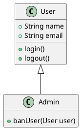

В этом простом примере мы видим класс `User` с атрибутами и методами. Класс `Admin` наследует все от `User`, добавляя свою специфическую функцию `banUser(User user)`. Это иллюстрирует как наследование работает в UML и в ООП – `Admin` обладает всеми свойствами `User`, но также и расширяет его функционал.


#### Реализация концепций на практике

На уроке мы не просто изучили теоретические аспекты ООП, мы также обсудили, как эти концепции реализуются на практике. Особенно важно это для понимания объектно-ориентированного анализа и проектирования, когда мы переводим требования и представления стейкхолдеров в конкретные структуры данных и алгоритмы.

#### Роль UML в объектно-ориентированном проектировании

##### Диаграммы: Чертежи программного мира

UML действует как универсальный язык для визуализации структуры и поведения системы. Это особенно ценно в объектно-ориентированном проектировании, где сложность системы может расти экспоненциально. С помощью UML разработчики могут создавать диаграммы классов, которые показывают, как классы связаны между собой, какие атрибуты и методы они содержат.

#### Заключение: Осмысление урока

Заканчивая наш первый урок, мы увидели, что ООП и UML не просто технические инструменты, но и способы мышления и общения в сфере разработки программного обеспечения. Они позволяют нам приближать абстракции программирования к понятным и управляемым концепциям из реального мира, обеспечивая тем самым не только эффективность, но и ясность визуального представления сложных систем. 

Этот урок был первым шагом на пути к глубокому пониманию объектно-ориентированного подхода в программировании, который обязательно откроет новые горизонты в создании программных решений.
#### Преимущества использования UML

UML предоставляет разработчикам мощный инструмент для анализа, проектирования и документирования системы. Вот несколько преимуществ использования UML:

1. **Язык визуализации**: UML предоставляет набор графических символов и нотаций, которые позволяют разработчикам визуализировать структуру и поведение системы. Это делает процесс разработки более понятным и доступным для всех участников проекта.

2. **Универсальность**: UML является стандартом в индустрии программного обеспечения и широко используется различными методологиями разработки. Это означает, что разработчики, знакомые с UML, могут легко работать с другими командами и интегрировать свою работу с другими системами.

3. **Абстракция**: UML позволяет создавать абстрактные модели системы, которые скрывают детали реализации и фокусируются на ключевых концепциях и отношениях между элементами системы. Это помогает упростить сложные системы и облегчить понимание и коммуникацию между участниками проекта.

4. **Анализ и проектирование**: UML предоставляет различные виды диаграмм, которые позволяют разработчикам анализировать и проектировать систему на разных уровнях абстракции. Например, диаграммы классов позволяют определить структуру системы, диаграммы последовательности - моделировать взаимодействие между объектами, а диаграммы состояний - описывать поведение объектов.

5. **Документация**: UML диаграммы могут служить отличной формой документации для системы. Они предоставляют компактное и наглядное представление системы, которое можно использовать для объяснения ее структуры и поведения другим участникам проекта или клиентам.

В целом, использование UML в объектно-ориентированном проектировании помогает создавать более чистый и эффективный код, улучшает коммуникацию внутри команды разработки и облегчает понимание и сопровождение системы на протяжении всего ее жизненного цикла.

## Урок 2
### Содержание. Урок 2: Введение в объектно-ориентированный анализ и проектирование (2-й урок)

**Цели урока:**
- Погружение в методологии объектно-ориентированного анализа и проектирования
- Изучение роли и значимости UML в проектировании

**План урока:**
- **Повторение (5 минут):** Краткий обзор предыдущего урока, ответы на вопросы
- **Методологии ООА и ООП (15 минут):** Обсуждение различных методологий, таких как RUP, Agile и их использование в анализе и проектировании
- **UML как язык моделирования (15 минут):** Введение в UML, его роль и использование в ООА/ООП
- **Практический пример (5 минут):** Представление простого примера использования UML для моделирования
- **Вопросы и ответы (5 минут):** Время для обсуждения возникших вопросов
- **Заключение (5 минут):** Подведение итогов урока, объяснение следующих шагов


### Погружение в Методологии: Как Строить Программное Обеспечение С Умом

#### Разведка по методологиям

Второй урок нашего курса посвящен углубленному изучению объектно-ориентированного анализа и проектирования (ООАП), и в центре внимания оказались методологии разработки. Методологии - это своего рода "рецепты" или наборы лучших практик, которые разработчики используют для создания структурированных и качественных программных продуктов.

🔍 **Что такое методологии разработки?**

Методологии разработки - это наборы правил, процессов и инструментов, которые помогают команде разработчиков создавать программное обеспечение более эффективно и организованно. Они представляют собой некоторый "рецепт" или подход к разработке, который определяет последовательность шагов и рекомендации для достижения конкретной цели.

📚 **Какие существуют методологии разработки?**

Существует множество методологий разработки, каждая из которых имеет свои особенности и применяется в определенных ситуациях. Некоторые из наиболее популярных методологий включают:

- Водопадная модель: последовательный подход к разработке, где каждая фаза строго следует за предыдущей.
- Гибкая (Agile) методология: итеративный подход к разработке, где требования и планы могут меняться на протяжении проекта.
- SCRUM: фреймворк гибкой методологии, который делит проект на короткие спринты для достижения конкретных целей.
- Каскадная модель: подход, где каждая фаза разработки завершается перед переходом к следующей.

🛠️ **Зачем нужны методологии разработки?**

Методологии разработки помогают командам разработчиков более эффективно организовывать свою работу и достигать поставленных целей. Они предлагают структурированный подход к разработке, который помогает сократить время и затраты на проект, а также повысить качество программного обеспечения.

Например, методология **Agile** позволяет команде быстро реагировать на изменения требований клиента и гибко адаптироваться к новым условиям. Это особенно полезно в сфере разработки программного обеспечения, где требования могут меняться на протяжении всего проекта.

Водопадная модель, напротив, предлагает последовательный подход к разработке, где каждая фаза строго следует за предыдущей. Это может быть полезно в случаях, когда требования четко определены и не подвержены изменениям.

**SCRUM** - это фреймворк гибкой методологии, который делит проект на короткие спринты для достижения конкретных целей. Это позволяет команде быстро получать обратную связь от клиента и вносить коррективы в работу.

Каскадная модель предлагает подход, где каждая фаза разработки завершается перед переходом к следующей. Это может быть полезно в случаях, когда каждая фаза должна быть полностью завершена перед тем, как приступить к следующей.

В целом, методологии разработки помогают командам разработчиков структурировать свою работу и управлять проектами более эффективно. Они предлагают набор инструментов и рекомендаций, которые помогают достичь поставленных целей и создать качественное программное обеспечение.

📈 **Как выбрать подходящую методологию?**

Выбор методологии зависит от множества факторов, таких как размер проекта, требования заказчика, доступные ресурсы и опыт команды разработчиков. Некоторые проекты могут лучше подходить для водопадной модели, где требования четко определены заранее, в то время как другие проекты могут требовать более гибкого подхода, такого как Agile или SCRUM.

💡 **Важные принципы методологий разработки**

Независимо от выбранной методологии, есть несколько общих принципов, которые помогут команде разработчиков успешно реализовать проект:

- Коммуникация и сотрудничество: важно поддерживать открытую коммуникацию и сотрудничество между всеми участниками проекта.
- Итеративность: разработка должна быть итеративной, чтобы позволить быстрые корректировки и адаптацию к изменяющимся требованиям.
- Тестирование: тестирование является неотъемлемой частью методологий разработки, чтобы обеспечить качество программного обеспечения.
- Постоянное улучшение: команда разработчиков должна стремиться к постоянному улучшению своих навыков и процессов разработки.

Давайте, более подробно рассмотрим каждую методологию.

#### Agile


🔍 **Что такое Agile?**

Agile - это гибкая методология разработки, которая акцентирует внимание на быстрой адаптации к изменениям и сотрудничестве между участниками команды разработчиков. Она предлагает итеративный подход к разработке, где требования и планы могут меняться на протяжении всего проекта.

📚 **Как работает Agile?**

Agile основывается на принципах "Манифеста Agile", который определяет ценности и принципы этой методологии. Основные принципы Agile включают:

1. Взаимодействие с клиентом: активное взаимодействие с клиентом для понимания его требований и обратной связи.
2. Итеративность: разработка происходит поэтапно, с короткими спринтами, что позволяет быстро получать обратную связь от клиента и вносить изменения.
3. Самоорганизация команды: команда разработчиков самостоятельно организует свою работу и принимает решения.
4. Гибкость: возможность быстро адаптироваться к изменениям требований или условий проекта.

Agile использует такие практики, как "Scrum" и "Kanban", чтобы организовать работу команды разработчиков. Scrum - это фреймворк гибкой методологии, который делит проект на короткие спринты (обычно 1-2 недели), в течение которых команда работает над определенными задачами. Каждый спринт начинается с планирования, где определяются цели и задачи для этого спринта, а заканчивается обзором, где команда демонстрирует свои достижения клиенту.

🛠️ **Когда использовать Agile?**

Agile подходит для проектов, где требования могут меняться на протяжении всего процесса разработки. Он особенно полезен в сфере разработки программного обеспечения, где клиент может не иметь четкого представления о конечном продукте или требования могут меняться в результате обратной связи.

💡 **Преимущества Agile**

- Гибкость: Agile позволяет быстро адаптироваться к изменениям требований и условий проекта.
- Быстрая обратная связь: короткие спринты и регулярные обзоры позволяют команде получать обратную связь от клиента и вносить изменения.
- Улучшение качества: Agile подразумевает постоянное тестирование и проверку, что помогает обнаруживать и исправлять ошибки на ранних этапах разработки.

📈 **Пример использования Agile**

Представим, что команда разработчиков работает над созданием нового мобильного приложения. Вместо того, чтобы разработать все функции сразу, они используют Agile методологию и делят проект на короткие спринты продолжительностью 2 недели.

На первом спринте команда фокусируется на основных функциях приложения, таких как регистрация пользователя и авторизация. После завершения спринта они проводят обзор с клиентом, который дает свою обратную связь и предлагает изменения.

На следующем спринте команда добавляет функцию поиска в приложение. Опять же, после завершения спринта они проводят обзор с клиентом и вносят необходимые изменения.

Таким образом, команда постепенно разрабатывает приложение, получая обратную связь от клиента на каждом этапе. Это позволяет им быстро адаптироваться к изменениям требований и создавать качественное программное обеспечение.


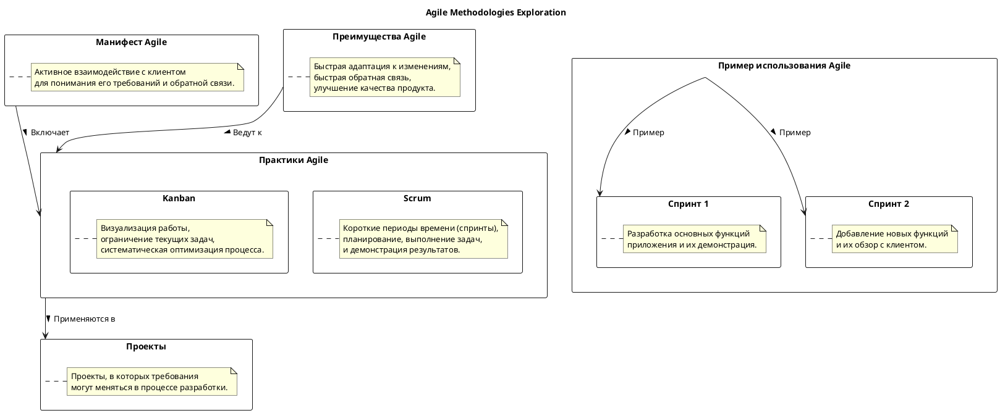
---
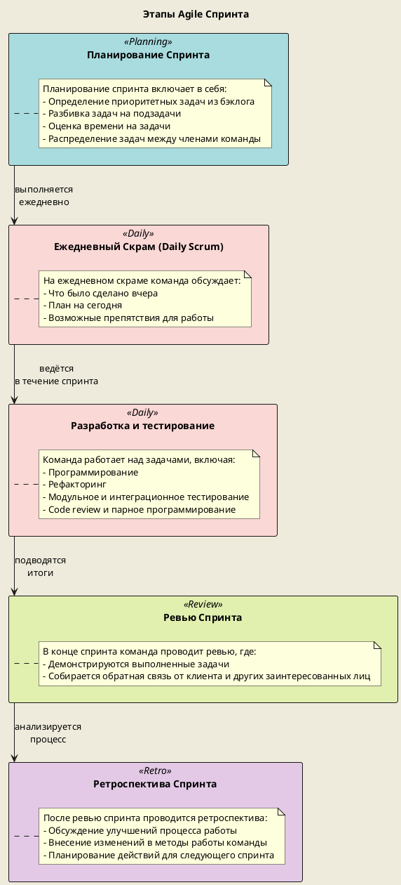

#### SCRUM

🔍 **Что такое SCRUM?**

SCRUM - это гибкая методология разработки, которая используется для управления проектами. Она основана на итеративном и инкрементальном подходе к разработке, где проект разбивается на короткие спринты, обычно длительностью от 1 до 4 недель. Каждый спринт имеет конкретные цели и результаты, которые должны быть достигнуты.

📚 **Как работает SCRUM?**

SCRUM состоит из нескольких ключевых элементов:

- **Продуктовый бэклог**: это список всех требований и задач проекта, упорядоченных по приоритету. Он постоянно обновляется и изменяется в соответствии с потребностями проекта.
- **Спринты**: это короткие временные интервалы (обычно 1-4 недели), в течение которых команда разработчиков работает над определенным набором задач из продуктового бэклога.
- **Спринт планирование**: на этом этапе команда выбирает задачи из продуктового бэклога для выполнения в следующем спринте. Задачи декомпозируются на более мелкие подзадачи, и определяется объем работы, который команда может выполнить за спринт.
- **Ежедневное SCRUM-совещание**: это короткое (обычно 15 минут) ежедневное совещание, на котором каждый член команды отчитывается о своих достижениях, планах и препятствиях.
- **Спринтовый обзор**: на этом совещании команда демонстрирует выполненную работу заказчику или заинтересованным сторонам и получает обратную связь.
- **Спринтовый ретроспектив**: на этом совещании команда анализирует прошлый спринт и обсуждает, что было хорошо, что можно улучшить и какие изменения нужно внести в следующий спринт.

🛠️ **Зачем использовать SCRUM?**

SCRUM помогает командам разработчиков достичь следующих преимуществ:

- Гибкость: SCRUM позволяет быстро реагировать на изменения требований клиента или рынка. Команда может легко адаптироваться к новым условиям и вносить коррективы в работу.
- Прозрачность: каждый спринт имеет конкретные цели и результаты, которые видны всей команде и заказчику. Это обеспечивает прозрачность процесса разработки и позволяет легко отслеживать прогресс.
- Коллективная ответственность: SCRUM подразумевает активное участие всей команды в планировании, выполнении и оценке работы. Каждый член команды несет ответственность за достижение целей спринта.
- Улучшение качества: регулярные спринтовые обзоры и ретроспективы помогают выявлять проблемы и находить пути для улучшения процесса разработки.

💡 **Важные принципы SCRUM**

SCRUM основан на нескольких важных принципах:

- **Инкрементальность**: разработка происходит постепенно, с каждым спринтом добавляются новые функции или улучшения к уже существующим.
- **Самоорганизация**: команда сама организует свою работу и принимает решения. SCRUM-мастер играет роль фасилитатора, помогая команде следовать методологии.
- **Коллективная ответственность**: каждый член команды несет ответственность за достижение целей спринта и успех проекта в целом.
- **Обратная связь**: регулярные спринтовые обзоры и ретроспективы позволяют команде получать обратную связь от заказчика и улучшать процесс разработки.

SCRUM - это мощный инструмент для управления проектами разработки программного обеспечения. Он помогает командам разработчиков организовывать свою работу, достигать поставленных целей и создавать качественное программное обеспечение.


🚀 **Заключение**

Методологии разработки играют важную роль в создании программного обеспечения. Они помогают командам разработчиков организовывать свою работу, повышать эффективность и достигать поставленных целей. Выбор подходящей методологии зависит от конкретных условий проекта, но независимо от выбранной методологии, важно придерживаться общих принципов успешной разработки.

#### В чем разница?

Scrum и Agile (эджайл) часто упоминаются вместе, и это может привести к путанице, но важно понимать различие между ними.

### Agile (Эджайл)

**Agile** - это больше философия или набор принципов для разработки программного обеспечения, которая была описана в [Агил-манифесте](http://agilemanifesto.org/) в 2001 году. Основные принципы Agile включают:

- **Индивиды и взаимодействия** больше, чем процессы и инструменты.
- **Работающий продукт** больше, чем исчерпывающая документация.
- **Сотрудничество с клиентом** больше, чем договоренности по контракту.
- **Готовность к изменениям** больше, чем следование первоначальному плану.

Цель Agile - ускорить процесс разработки и сделать его более гибким, с акцентом на быстрое и непрерывное доставление ценности клиенту, активное вовлечение клиента в процесс, открытость к изменениям и непрерывное улучшение.
### Scrum

**Scrum**, с другой стороны, является одной из конкретных методологий, следующих философии Agile. Это набор практик и ролей, которые применяются в рамках разработки продукта. Основные аспекты Scrum включают:

- **Роли**: В Scrum определены специфические роли, такие как Скрам-мастер (Scrum Master), Владелец продукта (Product Owner) и Команда разработки (Development Team).
- **События**: Scrum разбивает проект на итерации, известные как спринты (обычно от 1 до 4 недель), с регулярными совещаниями (Daily Stand-up, Sprint Planning, Sprint Review и Sprint Retrospective).
- **Артефакты**: Scrum требует определенных "доставляемых" элементов, таких как Product Backlog (список всех требований к продукту), Sprint Backlog (требования, выбранные для реализации в текущем спринте) и Increment (новая версия продукта, получаемая по итогам спринта).

### Как Scrum отличается от Agile

- **Agile** - это широкая философия с множеством подходов (включая Scrum, Kanban и другие), в то время как **Scrum** - это конкретный набор правил и практик для реализации этой философии.
- **Agile** определяет ценности и принципы, **Scrum** предоставляет конкретный способ их применения.
- В **Agile** в центре внимания - непрерывное улучшение и гибкость, в **Scrum** - прозрачность, инспектирование и адаптация через фиксированные рамки спринтов.

Таким образом, Scrum - это один из способов "делать" Agile, предоставляющий конкретный фреймворк для его применения на практике.

#### Водопадная модель

🔍 **Что такое водопадная модель?**

Водопадная модель - это последовательный подход к разработке, где каждая фаза строго следует за предыдущей. Она предполагает линейную последовательность шагов, начиная с определения требований и заканчивая тестированием и поддержкой продукта.

📚 **Как работает водопадная модель?**

Водопадная модель состоит из следующих фаз:

1. Определение требований: команда разработчиков взаимодействует с клиентом, чтобы определить требования к программному продукту.
2. Анализ: команда анализирует требования и определяет, какие функции должны быть реализованы.
3. Проектирование: на основе анализа команда разрабатывает детальный план проекта, включая архитектуру и дизайн.
4. Разработка: команда приступает к написанию кода и реализации функциональности продукта.
5. Тестирование: после завершения разработки команда проводит тестирование для обнаружения и исправления ошибок.
6. Внедрение: разработанный продукт внедряется в рабочую среду или предоставляется клиенту.
7. Поддержка: команда обеспечивает поддержку и техническое обслуживание продукта после его внедрения.

Каждая фаза завершается перед переходом к следующей, и изменения требований или планов могут быть сложными или невозможными на поздних этапах разработки.

🛠️ **Когда использовать водопадную модель?**

Водопадная модель подходит для проектов, где требования четко определены заранее и не подвержены изменениям. Она может быть полезна, когда клиент имеет четкое представление о конечном продукте и не ожидает значительных изменений.

💡 **Преимущества водопадной модели**

- Простота: водопадная модель проста в использовании и понимании.
- Четкость: каждая фаза строго следует за предыдущей, что обеспечивает четкость процесса разработки.
- Хорошо подходит для стабильных требований: если требования четко определены заранее, то водопадная модель может быть эффективным подходом.

📈 **Пример использования водопадной модели**

Представим, что команда разработчиков работает над созданием веб-сайта для клиента. Сначала они проводят встречу с клиентом, чтобы
определить требования к веб-сайту. На основе этой информации команда анализирует требования и определяет, какие функции должны быть реализованы.

Затем команда приступает к проектированию веб-сайта, разрабатывая детальный план, который включает в себя архитектуру и дизайн. После завершения проектирования команда приступает к разработке, где они пишут код и реализуют функциональность веб-сайта.

После завершения разработки команда проводит тестирование, чтобы обнаружить и исправить ошибки. Затем разработанный веб-сайт внедряется в рабочую среду или предоставляется клиенту.

После внедрения команда продолжает обеспечивать поддержку и техническое обслуживание веб-сайта для клиента.

В данном случае использование водопадной модели было эффективным, так как требования к веб-сайту были четко определены заранее и не подвержены изменениям. Команда могла последовательно следовать каждой фазе разработки, что обеспечило четкость процесса и успешное завершение проекта.
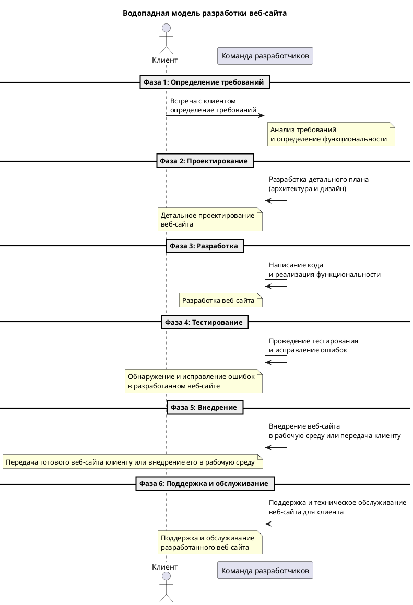


#### Архитектурные фундаменты ООП

##### ООА и ООП: Близнецы-разработчики

Объектно-ориентированный анализ (ООА) и объектно-ориентированное проектирование (ООП) работают рука об руку, чтобы преобразовать требования к программному обеспечению в конкретные решения. ООА фокусируется на что система должна делать, а ООП на как система будет это делать.
ООА и ООП являются взаимосвязанными и взаимодополняющими методами разработки программного обеспечения. ООА направлен на анализ требований к системе и определение ее функциональности, тогда как ООП фокусируется на проектировании структуры системы и способа реализации этой функциональности.

В контексте ООА, разработчики проводят детальное изучение требований к системе, выявляют основные функции, которые она должна выполнять, а также определяют объекты и классы, которые будут использоваться для решения этих задач. В результате проведения ООА создается модель предметной области - набор классов, объектов и связей между ними, которые отражают структуру и поведение системы.

Затем наступает этап ООП, где разработчики принимают модель предметной области из ООА и начинают проектирование системы. В ходе проектирования определяется архитектура системы - как классы и объекты будут взаимодействовать между собой для выполнения необходимых функций. Разработчики определяют интерфейсы классов, методы и свойства, а также устанавливают отношения между классами, такие как наследование и ассоциация.

ООП позволяет разработчикам создавать модульные, гибкие и легко поддерживаемые системы. Классы и объекты, созданные в ходе ООА и ООП, позволяют разделить систему на независимые компоненты, что упрощает ее разработку и сопровождение. Кроме того, ООП способствует повторному использованию кода благодаря возможности создания классов-наследников или использования композиции объектов.

Важно отметить, что ООА и ООП не являются линейными процессами. Разработчики могут проводить анализ требований к системе параллельно с проектированием ее структуры. В ходе работы над проектом могут возникать изменения в требованиях или необходимость изменить структуру системы. Поэтому гибкость и адаптивность являются ключевыми принципами ООА и ООП.

Таким образом, ООА и ООП являются неотъемлемой частью разработки программного обеспечения. Они работают вместе, чтобы преобразовать требования к системе в конкретные решения. ООА определяет, что система должна делать, а ООП определяет, как она будет это делать. Эти методы позволяют создавать гибкие и модульные системы, которые легко поддерживать и развивать.

#### UML: Универсальный Язык Программистов

##### Разговаривая на UML

**Unified Modeling Language (UML)** - это визуальный язык, который позволяет аналитикам и разработчикам создавать схемы, отражающие структуру и поведение программных систем. Во время урока мы исследовали различные типы UML-диаграмм, каждая из которых служит определенной цели, от изображения статической структуры системы до моделирования ее поведения и динамики.

UML предоставляет разработчикам универсальный набор символов и нотаций, которые позволяют им визуализировать различные аспекты системы. Например, **диаграмма классов UML** позволяет представить структуру классов и связей между ними, а **диаграмма последовательности UML** позволяет моделировать взаимодействие объектов во времени.

Одним из основных преимуществ использования UML является его универсальность. UML может быть использован для моделирования различных типов систем, от маленьких приложений до сложных корпоративных систем. Благодаря этому, команда разработчиков может использовать общий язык и нотацию для обмена идеями и концепциями.

*Еще одним преимуществом UML является его способность сделать сложные концепции более понятными и доступными.* 

Вместо того чтобы описывать систему словами или текстом, разработчики могут использовать графические диаграммы, которые легко читаются и понимаются. Это особенно полезно при командной работе или при общении с заинтересованными сторонами, которые не имеют технического образования.

Кроме того, UML позволяет разработчикам проводить анализ и проектирование системы на ранних этапах разработки. С помощью UML-диаграмм, разработчики могут визуализировать требования к системе, определить ее структуру и взаимодействие компонентов. Это помогает предотвратить ошибки и проблемы, связанные с неправильным пониманием требований или недостаточной архитектурой системы.

Однако следует отметить, что UML не является самоцелью. Он является всего лишь инструментом для моделирования и коммуникации. Успешное использование UML требует хорошего понимания его концепций и нотаций, а также умения применять его в конкретной ситуации.

В целом, UML является мощным инструментом для анализа и проектирования программных систем. Он позволяет разработчикам визуализировать сложные концепции и обменяться информацией с другими участниками проекта. Успешное использование UML может значительно повысить качество и эффективность разработки программного обеспечения.

##### Виды диаграмм: Наброски будущего ПО

Одни из ключевых диаграмм в UML - это диаграммы классов, объектов, вариантов использования, активностей, последовательности и состояний. Диаграммы классов, например, отображают классы и отношения между ними, обеспечивая основу для построения системы.
Диаграммы объектов, в свою очередь, представляют конкретные экземпляры классов и связи между ними. Эти диаграммы полезны для понимания, как объекты взаимодействуют друг с другом в рамках системы.

1. Диаграммы вариантов использования
2. Диаграмма классов
3. Диаграмма состояний
4. Диаграмма деятельности
5. Диаграмма последовательности
6. Диаграмма кооперации
7. Диаграмма компонентов
8. Диаграмма развертывания

Давайте чуть более подробно поговорим, что с помощью каждой из них можно сделать.

**Диаграммы вариантов использования**: позволяют описать различные сценарии использования системы, иллюстрируя взаимодействие между актерами (пользователями или внешними системами) и системой. Они помогают определить функциональные требования к системе и выделить основные функции, которые должна выполнять система. Например, диаграмма вариантов использования может показать, как пользователь регистрируется в системе, авторизуется, создает новый объект или выполняет поиск информации.

Пример:

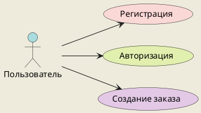


**Диаграмма классов**: позволяет описать структуру системы, ее классы и связи между ними. Она показывает атрибуты и методы каждого класса, а также отношения наследования, ассоциации, агрегации и композиции между классами. Диаграмма классов является основой для проектирования объектно-ориентированных систем.

Пример:

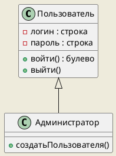


**Диаграмма состояний**: позволяет описать жизненный цикл объекта или состояния системы. Она показывает переходы между состояниями объекта или системы в ответ на определенные события. Диаграмма состояний полезна для моделирования поведения объектов или системы в различных ситуациях.

Пример:

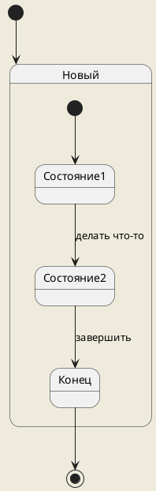


**Диаграмма деятельности**: позволяет описать последовательность действий или процессов в рамках определенного сценария использования. Она показывает шаги, условия и ветвления в процессе выполнения задачи. Диаграмма деятельности полезна для анализа и оптимизации бизнес-процессов.

Пример:

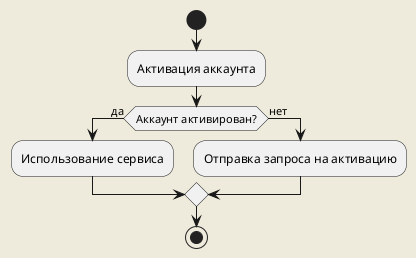


**Диаграмма последовательности**: позволяет описать взаимодействие между объектами или компонентами системы в рамках определенного сценария использования. Она показывает последовательность сообщений, которые передаются между объектами, и время выполнения каждого сообщения. Диаграмма последовательности полезна для анализа и оптимизации взаимодействия между компонентами системы.

Пример:

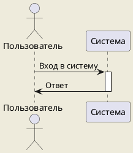


**Диаграмма кооперации**: позволяет описать сотрудничество между объектами или компонентами системы в рамках определенного сценария использования. Она показывает, как объекты обмениваются сообщениями и как они сотрудничают для выполнения задачи. Диаграмма кооперации полезна для анализа и оптимизации коллективной работы объектов или компонентов.

Пример:

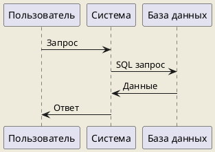


В чем отличия UML диаграмм кооперации и последовательности? 

🔍 UML диаграммы кооперации и последовательности являются двумя типами диаграмм, используемых в языке моделирования UML (Unified Modeling Language). Они оба представляют взаимодействие между объектами в системе, но имеют некоторые отличия.

📊 **UML диаграмма кооперации** (Collaboration diagram) также известна как диаграмма коммуникации. Она показывает, как объекты сотрудничают друг с другом для выполнения определенной функциональности. Диаграмма кооперации фокусируется на связях между объектами и порядке передачи сообщений между ними. Она отображает объекты в виде прямоугольников с их именами и ролями, а связи между объектами представлены стрелками или линиями.

⚙️ **UML диаграмма последовательности** (Sequence diagram) показывает последовательность сообщений, передаваемых между объектами в системе. Она описывает, как объекты взаимодействуют друг с другом в определенном порядке для достижения цели. Диаграмма последовательности отображает объекты в виде прямоугольников с их именами, а сообщения представлены стрелками, указывающими направление передачи сообщения.

🔄 Отличия между диаграммой кооперации и диаграммой последовательности:

1️⃣  **Уровень детализации**: Диаграмма кооперации обычно более абстрактна и показывает общую структуру взаимодействия объектов, в то время как диаграмма последовательности более детализирована и показывает точную последовательность сообщений между объектами.

2️⃣  **Фокус**: Диаграмма кооперации фокусируется на связях между объектами и коммуникации, тогда как диаграмма последовательности фокусируется на временной последовательности сообщений.

3️⃣  **Представление объектов**: В диаграмме кооперации объекты представлены с указанием их ролей, а в диаграмме последовательности они представлены только с их именами.

4️⃣  **Сложность**: Диаграмма кооперации может быть проще для понимания, так как она не учитывает временные аспекты взаимодействия. Диаграмма последовательности может быть сложнее для понимания из-за учета времени выполнения операций.

📝 В целом, диаграмма кооперации и диаграмма последовательности являются полезными инструментами для визуализации взаимодействия между объектами в системе. Выбор между ними зависит от уровня детализации и целей моделирования.

**Диаграмма компонентов**: позволяет описать структуру системы на уровне компонентов и связей между ними. Она показывает, какие компоненты присутствуют в системе, как они связаны между собой и какие интерфейсы они предоставляют. Диаграмма компонентов полезна для архитектурного проектирования системы.

Пример:

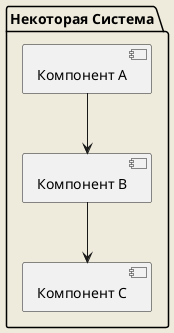


**Диаграмма развертывания**: позволяет описать физическую конфигурацию системы, ее компоненты и связи между ними. Она показывает, на каких устройствах или серверах размещены компоненты системы и как они взаимодействуют друг с другом. Диаграмма развертывания полезна для планирования и настройки инфраструктуры системы.

Пример:

```plantuml
@startuml
skinparam BackgroundColor #EEEBDC

' 8. Диаграмма развертывания
node "Сервер приложений" as AppServer {
  artifact "МояАпп.war"
}
node "База данных" as Database {
  artifact "МояБаза.db"
}
AppServer --> Database : JDBC

@enduml

````



Каждая из этих диаграмм имеет свою специфическую цель и помогает разработчикам и аналитикам лучше понять структуру и поведение системы, ее функциональные требования и взаимодействие между компонентами. Использование этих диаграмм в процессе разработки программного обеспечения помогает улучшить качество и эффективность проекта.

##### Применение UML: От анализа до разработки

UML может быть использован на различных этапах жизненного цикла программного обеспечения, начиная с анализа требований и заканчивая разработкой и тестированием.

На этапе анализа требований UML-диаграммы могут быть использованы для визуализации требований пользователей и определения функциональности системы. Диаграммы вариантов использования могут помочь разработчикам понять, как пользователи будут взаимодействовать с системой, а диаграммы классов - определить основные компоненты системы.

На этапе проектирования UML-диаграммы используются для определения структуры и архитектуры системы. Диаграммы классов позволяют разработчикам определить классы и связи между ними, а диаграммы последовательности - моделировать взаимодействие объектов. Диаграммы состояний могут быть использованы для моделирования поведения объектов или системы в различных состояниях.

На этапе разработки UML-диаграммы могут быть использованы для документирования кода и обмена информацией между членами команды разработки. Диаграммы классов могут помочь разработчикам понять структуру кода и отношения между классами, а диаграммы активностей - моделировать последовательность операций или процессов.

На этапе тестирования UML-диаграммы могут быть использованы для определения тестовых сценариев и проверки соответствия реализации требованиям. Диаграммы вариантов использования могут помочь определить сценарии использования системы, которые должны быть протестированы, а диаграммы последовательности - моделировать взаимодействие объектов в тестовых сценариях.

В целом, UML является мощным инструментом для анализа и проектирования программных систем на различных этапах их разработки. Он позволяет разработчикам визуализировать и коммуницировать сложные концепции, улучшает понимание требований и помогает предотвратить ошибки и проблемы в процессе разработки.

#### 📝 Пример: Диаграмма вариантов использования UML

```plantuml
@startuml
left to right direction
actor Customer
actor Bank
usecase "Withdraw cash" as WC
usecase "Deposit funds" as DF
usecase "Transfer funds" as TF
Customer --> WC
Customer --> DF
Bank --> TF
@enduml
```

На приведенной диаграмме показано взаимодействие клиента с банковскими операциями, такими как снятие наличных и пополнение счета, а также возможность банка осуществлять переводы.

#### Окно в процесс разработки

Во время урока мы также обсудили, как практически использовать UML для моделирования. С помощью UML можно начать переводить собранные требования в четко определенные модели, которые станут основой для написания кода.

#### Вопросы: Мост между теорией и практикой

Вопросы и ответы играют ключевую роль в образовательном процессе, особенно когда речь идет о сложных темах, таких как методологии программирования. Задавая вопросы, студенты имеют возможность глубже погрузиться в материал, а преподаватель может лучше понять, какие аспекты требуют дополнительного объяснения.

#### Подытоживание: Все вместе теперь

К концу урока мы пришли к пониманию, что объектно-ориентированный анализ и проектирование не ограничиваются только созданием кода. Это комплексный процесс, который начинается с понимания того, что система должна делать, и переходит к детальному планированию того, как система будет это делать.

Мы разобрались, что UML не просто инструмент для создания диаграмм, но и способ общения внутри команды разработчиков и с заинтересованными сторонами. UML помогает представить сложные системы в удобоваримом и универсальном виде, что существенно облегчает процесс проектирования и сопровождения программных продуктов.

В конце урока, каждый студент вынес для себя что-то важное: для кого-то это было новое открытие методологий ООАП, а кто-то увидел, как теоретические знания превращаются в практические навыки, благодаря примерам использования UML. Это знания, которые станут фундаментом для дальнейшего пути в мире программирования.

## Урок 2
### Содержание. Урок 3: Диаграммы в UML. Диаграммы вариантов использования (3-й урок)

**Цели урока:**
- Знакомство со структурой и назначением диаграмм вариантов использования в UML
- Разработка навыков построения диаграмм вариантов использования

**План урока:**
- **Введение (5 минут):** Объяснение целей урока и важности диаграмм вариантов использования
- **Теория диаграмм вариантов использования (10 минут):** Обучение структуре и элементам диаграмм вариантов использования
- **Примеры диаграмм вариантов использования (15 минут):** Анализ реальных примеров диаграмм
- **Создание диаграммы (10 минут):** Разработка простой диаграммы вариантов использования на общем примере
- **Обсуждение и вопросы (3 минуты):** Возможность для студентов задать вопросы по пройденному материалу
- **Заключение (2 минуты):** Объяснение домашнего задания, подведение итогов урока

```
Подробный и детальный конспект этого урока. В формате СТАТЬИ. А не плана, указаний или приказов. Никаких домашних задний, если я об этом не прошу. Подробно, понятно, простым языком. Можешь использовать PlantUml диаграммы (пиши их код) для коротких примеров. Используй заголовки 3 и 4 уровней, а так же перечни, эмодзи.
```

### Осваиваем UML: Искусство Диаграмм Вариантов Использования

#### 🌟 Вступление в мир UML


> [!info]
> Отличная статья Хабра[^1] на эту тему. [читать](https://habr.com/ru/articles/566218/)
> 
> 


Добро пожаловать в увлекательный мир моделирования! На третьем уроке мы погружаемся в изучение диаграмм вариантов использования UML (Unified Modeling Language) - мощного инструмента для визуализации, спецификации и документирования разработки систем.

#### 📘 Суть диаграмм вариантов использования

##### Что такое диаграмма вариантов использования?

Диаграмма вариантов использования - это графическое представление функций, которые система должна выполнять с точки зрения пользователей. Эти диаграммы помогают нам разобраться, как конечные пользователи будут взаимодействовать с системой, что в свою очередь позволяет определить требования к функционалу системы.

##### Элементы диаграммы

На таких диаграммах вы увидите следующие элементы:
- **Актеры (Actors)** - это пользователи или внешние системы, которые взаимодействуют с нашей системой.
- **Прецеденты (Use Cases)** - это функциональные возможности системы, описанные с точки зрения пользователя.


Прецеденты описывают конкретные действия, которые пользователь может выполнить в системе. Например, "Зарегистрироваться в системе", "Добавить товар в корзину" или "Оформить заказ". Каждый прецедент имеет название, которое отражает его основную функцию.

##### Как строится диаграмма вариантов использования?

Для построения диаграммы вариантов использования нужно выполнить следующие шаги:

1. Определить актеров - пользователей или внешние системы, которые будут взаимодействовать с нашей системой. Например, это могут быть администраторы, клиенты или другие сервисы.

2. Определить прецеденты - функциональные возможности системы, описанные с точки зрения пользователя. Для каждого прецедента нужно указать его название и краткое описание.

3. Установить связи между актерами и прецедентами - показать, какие актеры могут выполнять какие прецеденты. Например, администратор может добавлять новых пользователей в систему, а клиент может оформлять заказы.

4. Добавить расширения и альтернативные пути - показать возможные варианты развития событий внутри прецедента. Например, если пользователь вводит неправильные данные при регистрации, система может показать ошибку и запросить повторный ввод.

##### Зачем нужна диаграмма вариантов использования?

Диаграмма вариантов использования помогает разработчикам и аналитикам лучше понять требования к системе и ее функциональность. Она позволяет описать все возможные действия пользователей и определить, как система должна на них реагировать.

Эта диаграмма также может быть полезна для коммуникации с заказчиком или другими заинтересованными сторонами. Она предоставляет наглядное представление функциональности системы и помогает уточнить требования.

##### Пример диаграммы вариантов использования


На этом примере видно, что актер "Пользователь" может выполнять прецеденты "Зарегистрироваться", "Войти в систему" и "Просмотреть товары". Актер "Администратор" может выполнять прецеденты "Добавить нового пользователя" и "Удалить пользователя".

```md
mermaid
```


##### Заключение

Диаграмма вариантов использования - это инструмент, который помогает определить требования к функционалу системы и понять, как пользователи будут взаимодействовать с ней. Она является важной частью процесса анализа и проектирования системы и помогает улучшить коммуникацию между разработчиками, аналитиками и заказчиком.


#### 🖼️ Пример диаграммы вариантов использования

Давайте посмотрим, как выглядит простая диаграмма вариантов использования на примере интернет-магазина:

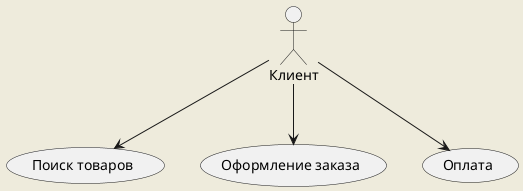


На диаграмме представлен клиент (актер) и основные действия, которые он может выполнять в системе: поиск товаров, оформление заказа и оплату.

#### 💡 Строим диаграмму вместе

##### Как создать свою диаграмму?

На уроке мы научились создавать такие диаграммы шаг за шагом:
1. Определите актеров системы.
2. Выделите основные действия, которые актеры выполняют с системой.
3. Нарисуйте диаграмму, используя актеров и прецеденты.

### Диаграммы вариантов использования UML: Всё, что Вам Нужно Знать

Диаграмма вариантов использования (Use Case Diagram) в UML - это прекрасный инструмент, который позволяет наглядно показать, как различные пользователи (или системы) взаимодействуют с системой. Чтобы понять этот вид диаграмм, давайте подробно рассмотрим её основные элементы и блоки.

#### Актёры (Actors)

Актёры - это представление пользователей или других систем, которые взаимодействуют с нашей системой. Они могут быть:

- **Людьми** (например, клиент, администратор).
- **Внешними системами** (например, платёжная система, база данных).
- **Подсистемами** (если наша система является частью большего приложения).

На диаграмме актёры обычно обозначаются в виде человечков или прямоугольников с именами ролей.

#### Прецеденты (Use Cases)

Прецеденты - это функции или задачи, которые система выполняет в ответ на действия актёров. Они описывают, что система делает, но не то, как она это делает. На диаграмме прецеденты обозначаются овалами с названиями внутри.

#### Отношения (Relationships)

Отношения показывают связи между актёрами и прецедентами. Существует несколько типов отношений:

- **Ассоциации** (простые линии) - базовые взаимодействия актёра с прецедентом.
- **Включения** (include) - когда один прецедент включает в себя другой.
- **Расширения** (extend) - когда прецедент может расширяться дополнительным поведением.

#### Заметки (Notes)

Заметки могут быть добавлены к любому элементу для дополнительного пояснения или комментариев. Они помогают лучше понять логику диаграммы и могут содержать дополнительную информацию о прецедентах или актёрах.

#### Пример диаграммы вариантов использования с PlantUML

Давайте создадим простую диаграмму вариантов использования для интернет-магазина:

```plantuml
@startuml
skinparam BackgroundColor #EEEBDC
skinparam UseCaseBackgroundColor #A9DCDF
skinparam UseCaseBorderColor #FAD8D6
skinparam ActorBackgroundColor #E1EFAF
skinparam ActorBorderColor #E3C9E6

actor "Клиент" as Client
actor "Система управления заказами" as OrderSystem

usecase "Выбор товара" as UC1
usecase "Добавление товара в корзину" as UC2


usecase "Оформление заказа" as UC3
usecase "Оплата заказа" as UC4

Client --> UC1
Client --> UC2
Client --> UC3
Client --> UC4

OrderSystem --> UC3
OrderSystem --> UC4

note right of UC1
  Клиент просматривает каталог,
  выбирает товары по категориям.
end note

note right of UC2
  Выбранные товары помещаются
  в виртуальную корзину для последующего оформления заказа.
end note

note right of UC3
  Клиент вводит данные для доставки,
  проверяет заказ перед подтверждением.
end note

note right of UC4
  Платеж может быть совершен
  различными способами: кредитной картой,
  электронными деньгами или при получении.
end note

@enduml
```

На этой диаграмме мы видим актёров "Клиент" и "Система управления заказами", которые взаимодействуют с прецедентами - "Выбор товара", "Добавление товара в корзину", "Оформление заказа" и "Оплата заказа". Заметки прилагаются к каждому прецеденту, чтобы объяснить, что происходит на каждом этапе.

В диаграммах вариантов использования UML используются следующие типы отношений между актерами и вариантами использования:

1. **Ассоциации** - линии, соединяющие актеров с вариантами использования, показывают, что актер участвует в варианте использования.
2. **Включения** (`<<include>>`) - когда один вариант использования неизбежно и всегда включает выполнение другого варианта использования.
3. **Расширения** (`<<extend>>`) - когда один вариант использования может в некоторых ситуациях включать дополнительное поведение, представленное другим вариантом использования.
4. **Обобщения** - когда один актер наследует роль другого актера, это подобно наследованию в объектно-ориентированном программировании.

### Примеры на PlantUML

#### Ассоциация

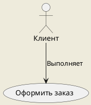

Эта диаграмма показывает, что клиент выполняет вариант использования "Оформить заказ".

#### Включение

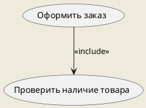

Здесь "Оформить заказ" всегда включает "Проверить наличие товара" как часть процесса.

#### Расширение

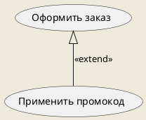

"Применить промокод" является необязательным расширением процесса оформления заказа.

#### Обобщение

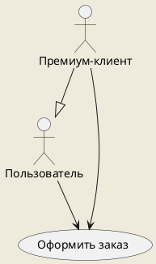

"Премиум-клиент" является специализированным типом "Пользователя" и участвует в тех же вариантах использования, что и обычный "Пользователь".
#### 💬 Обсуждение и вопросы

Этот этап урока был посвящен вопросам от студентов, что помогло укрепить понимание основных концепций и узнать больше о специфических ситуациях при создании диаграмм.

#### 🎓 Заключительные мысли

В завершение мы подвели итоги: диаграммы вариантов использования - не просто рисунки, но и способ коммуникации между разработчиками, аналитиками и клиентами. Они служат мостом между желаниями и требованиями к реально работающей системе.

Давайте создадим диаграмму вариантов использования на PlantUML, на которой будут представлены различные типы отношений: ассоциация, включение (`<<include>>`), расширение (`<<extend>>`) и обобщение (наследование между актёрами). В этом примере будем рассматривать контекст веб-приложения для заказа еды.

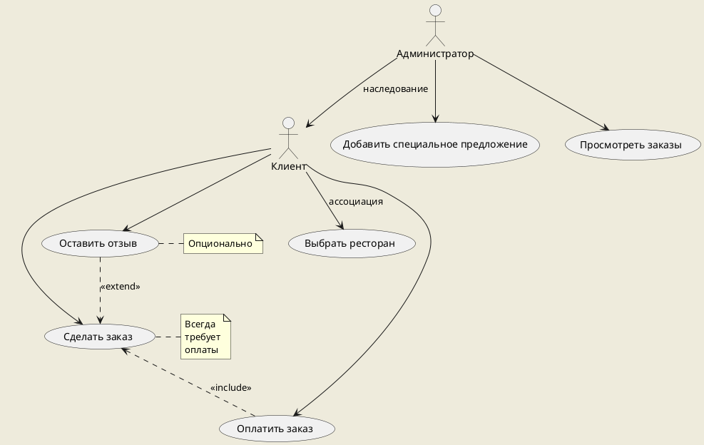

На этой диаграмме:
- **Ассоциация** (прямая стрелка) показывает, что Клиент может "Выбрать ресторан", "Сделать заказ", "Оплатить заказ" и "Оставить отзыв".
- **Включение** (`<<include>>`, пунктирная стрелка с наконечником) указывает, что действие "Оплатить заказ" всегда включается при выполнении "Сделать заказ".
- **Расширение** (`<<extend>>`, пунктирная стрелка с наконечником) демонстрирует, что возможность "Оставить отзыв" является опциональной и расширяет функциональность "Сделать заказ".
- **Наследование** между актёрами (прямая линия) показывает, что Администратор наследует возможности Клиента и добавляет свои уникальные действия, такие как "Добавить специальное предложение" и "Просмотреть заказы".

Этот пример иллюстрирует, как на диаграмме вариантов использования можно наглядно представить различные типы отношений между актёрами и прецедентами, описывая взаимодействие пользователей с системой.


## Урок 4: Практическая работа: построение диаграмм вариантов использования


Для практической работы №4, которая посвящена построению диаграмм вариантов использования UML (Use Case Diagrams), мы можем предложить следующие пять вариантов заданий:

### Вариант 1: Разработка диаграммы вариантов использования для системы онлайн-библиотеки

**Задача:** 
- Создать диаграмму вариантов использования, которая описывает взаимодействие пользователей с онлайн-системой библиотеки. Учесть различные типы пользователей: читатели, библиотекари и администраторы.

**Подзадачи:**
- Определение и описание акторов (читатели, библиотекари, администраторы).
- Определение вариантов использования для каждого актора (поиск книг, бронирование, управление пользователями и т.д.).
- Описание взаимодействия между акторами и системой.
- Визуализация взаимосвязей между акторами и вариантами использования.

### Вариант 2: Построение диаграммы для интернет-магазина

**Задача:** 
- Спроектировать диаграмму вариантов использования для интернет-магазина, включающую процессы выбора товара, оформления заказа и оплаты.

**Подзадачи:**
- Идентификация основных и альтернативных потоков событий для каждого варианта использования.
- Подробное описание потоков событий.
- Связывание вариантов использования с соответствующими акторами (покупатели, продавцы, система оплаты).
- Обсуждение ограничений и предпосылок для каждого варианта использования.

### Вариант 3: Анализ вариантов использования в системе управления проектами

**Задача:** 
- Разработать диаграмму вариантов использования для системы управления проектами, отражающую процессы планирования, отслеживания задач и взаимодействия команды.

**Подзадачи:**
- Определение ролей участников проекта (менеджер проекта, разработчик, аналитик и т.д.).
- Описание ключевых функций системы для каждой роли.
- Оформление диаграммы с чётким разграничением обязанностей и возможностей акторов.
- Создание сценариев использования для комплексных задач, требующих взаимодействия акторов.

### Вариант 4: Сценарии использования мобильного приложения для фитнес-трекинга

**Задача:** 
- Описать с помощью диаграммы вариантов использования типичные сценарии работы пользователя с мобильным приложением для отслеживания физической активности.

**Подзадачи:**
- Выявление функций приложения, таких как трекинг активности, планирование тренировок, настройка целей и мониторинг прогресса.
- Определение вариантов использования для различных видов пользователей (новички, опытные спортсмены).
- Изображение взаимодействия между пользователями и приложением, включая внешние сервисы (например, социальные сети для деления достижений).
- Разработка диаграммы, в которой будет учитываться возможность синхронизации данных с другими устройствами и сервисами (например, смарт-часы).

### Вариант 5: Проектирование диаграммы вариантов использования для автоматизированной системы ресторана

**Задача:**
- Создать диаграмму вариантов использования, отражающую процессы заказа еды в ресторане с использованием автоматизированной системы (как в зале, так и онлайн).

**Подзадачи:**
- Идентификация акторов системы (посетители, официанты, кухня, администрация).
- Выявление и описание функциональности системы для каждой группы акторов (электронное меню, система заказов, CRM для администрации).
- Описание процесса взаимодействия между акторами и системой, в том числе интеграция с платёжными и доставочными сервисами.
- Оформление диаграммы с указанием взаимодействий и зависимостей между различными вариантами использования.

При выполнении каждого из этих вариантов учащиеся должны сосредоточиться на детальном анализе предметной области, выявлении ключевых акторов и вариантов использования, а также на правильном оформлении диаграммы согласно стандартам UML. Они могут использовать различные инструменты для создания диаграмм, такие как Visio, Lucidchart или даже специализированные программы для UML, например, StarUML или Enterprise Architect. 

Важно также научить учащихся правильно документировать каждый вариант использования, включая основной поток действий и альтернативные потоки (если таковые имеются), а также потенциальные расширения и исключения. Это поможет им в дальнейшем при проектировании более сложных систем и в разработке технических требований.


[^1]: [Статья Хабр: Диаграммы вариантов использования](https://habr.com/ru/articles/566218/)