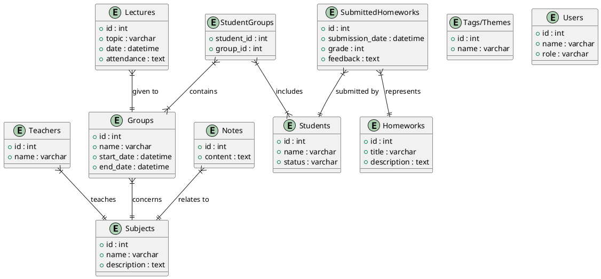
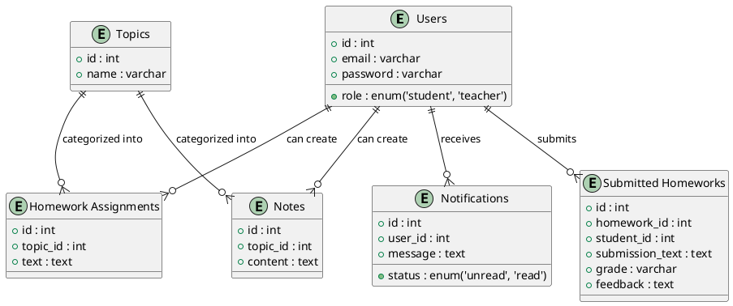
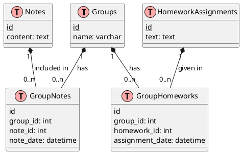

[[Холст. Базы данных.canvas|Холст. Базы данных]]
[[Переезд с SQLite в MySQL]]
[[С чего начинается MySQL]]
# Модуль Базы Данных


## ✏️Введение в теорию баз данных

#### История и этапы развития
История баз данных начинается ещё в далёком прошлом, когда данные хранились вручную в бумажных карточных индексах. С развитием компьютерных технологий и необходимостью обработки больших объемов данных появились первые электронные системы хранения данных:

- **1960-е годы**: Появление иерархических и сетевых баз данных. Данные структурировались в виде древовидных структур или сложных сетей.
- **1970-е годы**: Разработка реляционной модели Эдгаром Коддом, которая позволяет хранить данные в таблицах, состоящих из строк и столбцов. Это стало революционным изменением, так как реляционная модель была более гибкой и понятной.
- **1980-е годы**: Распространение реляционных систем управления базами данных (СУБД), таких как Oracle, MySQL, Microsoft SQL Server, SQLite
- **1990-е годы и далее**: Рост и развитие объектно-ориентированных и NoSQL баз данных, а также распространение интернет-технологий и облачных вычислений, что привело к созданию распределенных и масштабируемых систем хранения данных.

##### Основные характеристики иерархических баз данных:

Иерархические базы данных — это одна из ранних форм систем управления базами данных, которые организовывали данные в структуру, напоминающую дерево. Эта модель была широко распространена в 1960-х и 1970-х годах и до сих пор используется в некоторых системах, где подходит такая структура данных.

1. **Структура данных в виде дерева**: Каждая запись имеет один родительский элемент и может иметь множество дочерних элементов, но каждый дочерний элемент имеет только одного родителя (один-ко-многим).

2. **Узлы и связи**: Данные представлены в узлах, а отношения между данными — это связи между узлами. Это образует иерархическую структуру, напоминающую семейное дерево.

3. **Путь навигации**: Чтобы получить доступ к данным, необходимо следовать определенному пути от корневого узла через все промежуточные узлы. Это означает, что доступ к данным осуществляется через навигацию по этой структуре.

4. **Ограниченная гибкость**: Иерархические базы данных ограничены тем, что они не могут эффективно обрабатывать комплексные отношения многие-ко-многим и имеют ограниченную гибкость в запросах и изменении структуры данных.

5. **Эффективность для определенных запросов**: Несмотря на свои ограничения, иерархические базы данных могут быть очень эффективными для запросов, которые хорошо соответствуют их древовидной структуре.

Примером иерархической базы данных является IBM Information Management System (IMS), который был и остается критически важным для многих крупных предприятий, особенно в таких областях, как банковское дело и авиалинии, где структура данных естественным образом подходит под иерархическую модель. Несмотря на снижение популярности по сравнению с более современными реляционными и NoSQL системами, иерархические базы данных до сих пор используются там, где их уникальные качества наиболее ценятся.

Можно провести аналогию между иерархическими базами данных и файловой системой Windows, в которой файлы организованы в папки. В файловой системе:

- Каждая папка (кроме корневой) имеет одну родительскую папку.
- Каждая папка может содержать множество файлов или подпапок, но каждый файл или подпапка принадлежит только одной папке.
- Доступ к файлу требует прохождения определенного пути от корневой папки через все промежуточные папки.

Таким же образом, в иерархической базе данных:

- Каждая запись (или узел) является частью одной и только одной родительской записи (кроме корневой записи, которая не имеет родителя).
- Запись может иметь множество дочерних записей (или 'детей').
- Доступ к определенной записи требует следования по иерархии от корневой записи вниз до нужной записи.

##### Реляционные базы данных

Разработка реляционной модели баз данных Эдгаром Коддом в 1970-х годах стала революционным прорывом в области управления данными. Это нововведение привнесло несколько ключевых концепций и принципов, кардинально отличавшихся от традиционных иерархических и сетевых моделей баз данных того времени. Вот основные аспекты реляционной модели:

###### 1. Табличное представление данных:
Данные в реляционной базе данных организованы в таблицы (называемые "отношениями"), состоящие из строк и столбцов. Каждая строка (также известная как "запись" или "кортеж") представляет собой уникальный экземпляр данных, а каждый столбец (или "атрибут") — это определенное поле данных. Это представление делает структуру данных более понятной и нормализованной.

###### 2. Независимость данных:
Одной из ключевых особенностей реляционной модели является независимость данных. Это означает, что структура данных (схема базы данных) может быть изменена без необходимости изменять приложения, которые к ней обращаются. Такая гибкость значительно упрощает разработку и поддержку приложений.

###### 3. Использование SQL:
Реляционная модель привела к созданию языка структурированных запросов (SQL), который стал стандартным средством для управления и манипулирования данными в реляционных базах данных. SQL предоставляет мощный и гибкий способ для выборки, вставки, обновления и удаления данных, а также для управления самими базами данных.

###### 4. Целостность данных и согласованность:
Реляционная модель поддерживает строгие правила целостности, включая первичные ключи (для уникальной идентификации каждой строки) и внешние ключи (для обеспечения согласованных связей между таблицами). Эти правила обеспечивают точность и надежность данных.

###### 5. Теоретическое основание:
Реляционная модель основана на теории множеств и предикатной логике, что обеспечивает строгую математическую основу для работы с данными. Это не только способствует точности и надежности, но и позволяет разрабатывать более эффективные алгоритмы обработки запросов.

Эдгар Кодд предложил эти и многие другие концепции в своей знаменитой работе "A Relational Model of Data for Large Shared Data Banks", которая положила начало новой эре в управлении базами данных. Реляционная модель значительно упростила процесс проектирования и использования баз данных, сделав их более доступными, гибкими и мощными, что оказало огромное влияние на развитие информационных технологий.

### Понятие база данных
База данных — это организованная коллекция структурированных информационных или данных, обычно хранимая и доступная электронно из компьютерной системы. Базы данных бывают разных типов, но наиболее распространены следующие:

- **Реляционные базы данных**: Данные структурированы в форме таблиц, каждая из которых состоит из строк (записей) и столбцов (атрибутов).
- **Документо-ориентированные базы данных**: Информация хранится в виде документов, часто использующих форматы JSON или XML.
- **Ключ-значение**: Простая структура хранения, где каждый элемент данных имеет связанный ключ и определенное значение.

#### Понятие система управления базами данных (СУБД)
Система управления базами данных (СУБД) — это программное обеспечение, предназначенное для создания, управления, обслуживания и взаимодействия с базами данных. СУБД обеспечивает безопасность данных, поддерживает целостность данных, обеспечивает многопользовательский доступ к данным и предоставляет механизмы для резервного копирования и восстановления данных.

Основные функции СУБД включают:

- **Запросы и обновление данных**: СУБД предоставляет языки запросов, такие как SQL, для извлечения и обновления данных.
- **Транзакционное управление**: Гарантирует, что все операции с данными являются атомарными, согласованными, изолированными и устойчивыми (свойство ACID).
- **Управление доступом**: Регулирует, кто и как может получать доступ к данным, обеспечивая безопасность и контроль над информацией.

СУБД стали неотъемлемой частью информационных систем и являются критически важными инструментами для бизнеса, науки, образования и многих других областей, где требуется эффективное управление данными.

## 💽 Сводная таблица БД

Вот сводная таблица некоторых из самых популярных баз данных, упорядоченная по субъективному восприятию gpt-4 их популярности на момент последнего обновления моих данных в апреле 2023 года:

| Название             | Платная / Бесплатная                 | Открытое ПО | Тип БД                    | Создатель                           | Обычное использование                                                                                      |
| -------------------- | ------------------------------------ | ----------- | ------------------------- | ----------------------------------- | ---------------------------------------------------------------------------------------------------------- |
| MySQL                | Бесплатная                           | Да          | Реляционная               | Oracle Corporation                  | Веб-приложения, онлайн-бизнес, малый и средний бизнес                                                      |
| PostgreSQL           | Бесплатная                           | Да          | Реляционная               | PostgreSQL Global Development Group | Веб-приложения, корпоративные базы данных, аналитика, высокая совместимость с стандартами SQL              |
| Microsoft SQL Server | Платная                              | Нет         | Реляционная               | Microsoft                           | Корпоративные базы данных, CRM, ERP, бизнес-аналитика                                                      |
| Oracle Database      | Платная                              | Нет         | Реляционная               | Oracle Corporation                  | Большие корпоративные системы, высоконагруженные транзакционные системы, банковское дело                   |
| MongoDB              | Бесплатная версия и платная подписка | Да          | Документо-ориентированная | MongoDB Inc.                        | Веб-приложения, большие объемы данных, работа с неструктурированными данными, NoSQL приложения             |
| Redis                | Бесплатная                           | Да          | Ключ-значение             | Redis Labs                          | Кэширование, очереди сообщений, быстрый доступ к данным, NoSQL приложения                                  |
| SQLite               | Бесплатная                           | Да          | Реляционная               | D. Richard Hipp                     | Встраиваемые системы, мобильные приложения, локальное хранение данных для настольных приложений            |
| MariaDB              | Бесплатная                           | Да          | Реляционная               | MariaDB Corporation                 | Веб-приложения, альтернатива MySQL, бизнес-приложения                                                      |
| IBM Db2              | Платная                              | Нет         | Реляционная               | IBM                                 | Корпоративные системы, аналитические приложения, высокая производительность и надежность                   |
| Cassandra            | Бесплатная                           | Да          | Колоночная                | Apache Software Foundation          | Распределенные системы, обработка больших данных, высокая доступность и масштабируемость, NoSQL приложения |
| Neo4j                | Бесплатная версия и платная подписка | Да          | Графовая                  | Neo4j, Inc.                         | Социальные сети, рекомендательные системы, обнаружение мошенничества, сложные запросы связей               |
| Elasticsearch        | Бесплатная                           | Да          | Поисковая                 | Elastic                             | Полнотекстовый поиск, аналитика в реальном времени, логирование, мониторинг                                |
| Amazon DynamoDB      | Платная                              | Нет         | Ключ-значение             | Amazon Web Services                 | Веб-приложения, серверные приложения, масштабируемые и распределенные приложения, NoSQL приложения         |
| InfluxDB             | Бесплатная версия и платная подписка | Да          | Временные ряды            | InfluxData, Inc.                    | Мониторинг производительности, IoT-приложения, аналитика временных рядов                                   |
| Couchbase            | Бесплатная версия и платная подписка | Да          | Документо-ориентированная | Couchbase, Inc.                     | Мобильные приложения, веб и Edge Computing, корпоративные приложения, NoSQL приложения                     |

Эта таблица дает общее представление о некоторых из самых популярных системах управления базами данных, их типах, создателях и типичных областях применения. Разнообразие баз данных позволяет специалистам в области IT выбирать наиболее подходящие инструменты для конкретных задач и сценариев использования.

Мой **выбор расположения MySQL на первом месте** в таблице не отражает абсолютного рейтинга по популярности среди всех баз данных, а скорее основывается на общем признании и широком распространении MySQL в индустрии, особенно в контексте веб-разработки. MySQL давно зарекомендовала себя как надежная, эффективная и легко доступная система управления базами данных. Это делает её популярным выбором среди разработчиков, особенно для малого и среднего бизнеса, а также в стартапах, которые часто используют открытый и бесплатный стек технологий.

Причины популярности MySQL:

1. **Бесплатное и открытое ПО**: MySQL доступна бесплатно и имеет открытый исходный код, что делает её доступной для широкой аудитории.
2. **Широкая поддержка**: MySQL поддерживается множеством платформ и языков программирования, что делает её универсальным решением для различных приложений.
3. **Легкость использования**: MySQL известна своей простотой настройки и использования, что делает её привлекательной для начинающих разработчиков.
4. **Сильное сообщество**: Сильное сообщество пользователей и разработчиков обеспечивает хорошую документацию и множество ресурсов для обучения и поддержки.
5. **Широко используется в веб-разработке**: MySQL часто используется в сочетании с популярными веб-технологиями, такими как PHP и Apache.


## 🔭 Сравнение существующих моделей баз данных

Сравнение различных моделей баз данных помогает понять их структуру, преимущества, недостатки и наилучшие сценарии использования. Давайте рассмотрим каждую из указанных моделей:

### 1. Файловая модель:
Файловая модель — это самый базовый способ хранения данных, при котором информация хранится в обычных файлах (например, текстовых или бинарных).

**Преимущества**:
- Простота использования и понимания.
- Не требуется специализированное ПО для управления данными.

**Недостатки**:
- Отсутствие структурированности и централизованного управления данными.
- Сложности с многопользовательским доступом и обеспечением целостности данных.
- Ограниченные возможности поиска и запросов.

**Использование**: Лучше всего подходит для очень простых или персональных задач, где не требуется сложное взаимодействие с данными.


### 2. Сетевая модель:
Сетевая модель данных представляет собой расширение иерархической модели, позволяя создавать более сложные структуры с отношениями многие-ко-многим.

**Преимущества**:
- Большая гибкость по сравнению с иерархической моделью.
- Поддержка сложных отношений между данными.

**Недостатки**:
- Сложность понимания и управления.
- Необходимость сложных навигационных запросов для извлечения данных.

**Использование**: Используется в некоторых специализированных приложениях, где необходимы сложные связи, но в целом уступила место более современным моделям.

### 3. Иерархическая модель:
Иерархическая модель организует данные в древовидную структуру, где каждый элемент имеет одного родителя и может иметь множество детей.

**Преимущества**:
- Простота и интуитивно понятная структура.
- Эффективный доступ и навигация для определенных типов запросов.

**Недостатки**:
- Ограниченная гибкость; трудно адаптировать к изменениям структуры данных.
- Отношения многие-ко-многим трудно реализовать.

**Использование**: Хорошо подходит для приложений с четко определенной иерархической структурой данных, например, для организационных структур или каталогов файлов.

### 4. Реляционная модель:
Реляционная модель представляет данные в виде таблиц, состоящих из строк и столбцов, и поддерживает сложные запросы и операции над данными.

**Преимущества**:
- Гибкость и мощность в запросах и управлении данными.
- Широкая поддержка и большое сообщество.
- Сильная теоретическая основа, облегчающая оптимизацию и обеспечение целостности.

**Недостатки**:
- Может быть избыточной для некоторых типов данных или приложений.
- Требует понимания и владения языком запросов (SQL).

**Использование**: Широко используется в самых разных приложениях от малых до крупных предприятий, веб-разработке, аналитике и многих других областях.

### 5. Объектно-ориентированная модель:
Объектно-ориентированная модель хранения данных использует концепции объектно-ориентированного программирования, позволяя хранить объекты напрямую в базе данных.

**Преимущества**:
- Естественное представление данных для объектно-ориентированных языков программирования.
- Поддержка сложных структур данных и отношений.

**Недостатки**:
- Может быть сложнее в управлении и оптимизации по сравнению с реляционными базами данных.
- Не так широко поддерживается и используется, как реляционные модели.

**Использование**: Подходит для приложений, где данные естественным образом представляются в виде объектов, например, в сложных инженерных приложениях или системах, требующих глубокой интеграции с объектно-ориентированным кодом.

### 6. Векторная модель:
Векторная модель — это относительно новый тип базы данных, оптимизированный для работы с векторными операциями и часто используемый в задачах машинного обучения и анализа больших данных.

**Преимущества**:
- Оптимизирована для операций с высокой производительностью над векторами.
- Подходит для задач машинного обучения и аналитики больших объемов данных.

**Недостатки**:
- Специализированное использование, не такое универ

сальное, как реляционные или объектно-ориентированные базы данных.
- Может потребоваться более сложная настройка и управление.

**Использование**: Используется в специализированных приложениях, требующих быстрой обработки больших объемов данных, особенно в областях, связанных с машинным обучением, биоинформатикой и аналитикой.

Каждая из этих моделей имеет свои уникальные характеристики и лучше всего подходит для определенных типов приложений и сценариев использования. Выбор подходящей модели зависит от специфических требований к данным, сложности, производительности и других факторов, специфичных для каждого проекта или организации.

Ниже представлена сводная таблица популярных баз данных, разделенных по шести категориям, с информацией о создателях, типе лицензирования и области применения.

### 1. Файловая модель:
| Название   | Создатель | Платная/Бесплатная | Применение                                    |
| ---------- | --------- | ------------------ | --------------------------------------------- |
| JSON файлы | -         | Бесплатная         | Хранение конфигураций, легкая передача данных |
| CSV файлы  | -         | Бесплатная         | Экспорт/импорт данных, простые таблицы        |
| XML файлы  | -         | Бесплатная         | Конфигурации, обмен данными                   |

### 2. Сетевая модель:
| Название       | Создатель         | Платная/Бесплатная | Применение                          |
|----------------|-------------------|---------------------|--------------------------------------|
| IDS (Integrated Data Store) | Charles Bachman    | Платная          | Корпоративные системы, сложные связанные данные |
| Raima Database Manager | Raima Inc.       | Платная          | Встраиваемые системы, промышленные приложения  |

### 3. Иерархическая модель:
| Название      | Создатель        | Платная/Бесплатная | Применение                           |
|---------------|------------------|---------------------|---------------------------------------|
| IBM IMS       | IBM              | Платная             | Банковские системы, крупные корпоративные приложения |
| Windows Registry | Microsoft     | Бесплатная (часть ОС) | Хранение настроек и параметров системы в Windows |

### 4. Реляционная модель:
| Название             | Создатель                           | Платная/Бесплатная | Применение                             |
| -------------------- | ----------------------------------- | ------------------ | -------------------------------------- |
| MySQL                | Oracle Corporation                  | Бесплатная         | Веб-приложения, малый и средний бизнес |
| PostgreSQL           | PostgreSQL Global Development Group | Бесплатная         | Веб-приложения, корпоративные системы  |
| Microsoft SQL Server | Microsoft                           | Платная            | Корпоративные системы, аналитика       |
| Oracle Database      | Oracle Corporation                  | Платная            | Крупные предприятия, банковское дело   |

### 5. Объектно-ориентированная модель:
| Название     | Создатель       | Платная/Бесплатная | Применение                            |
|--------------|-----------------|---------------------|----------------------------------------|
| db4o         | db4objects (now Actian Corporation) | Платная | Мобильные приложения, встраиваемые системы |
| ObjectDB     | ObjectDB Software | Платная          | Java приложения, веб-приложения       |
| Versant ODB  | Versant Corporation | Платная          | Крупномасштабные системы, сложные объектные модели |

### 6. Векторная модель:
| Название                     | Создатель                  | Платная/Бесплатная | Применение                                                             |
| ---------------------------- | -------------------------- | ------------------ | ---------------------------------------------------------------------- |
| ClickHouse                   | Yandex                     | Бесплатная         | Аналитика больших данных, онлайн-запросы с высокой производительностью |
| Apache Solr (в части поиска) | Apache Software Foundation | Бесплатная         | Полнотекстовый поиск, аналитика больших данных                         |
| Elasticsearch                | Elastic                    | Бесплатная         | Полнотекстовый поиск, логирование, аналитика                           |

Эта таблица представляет популярные системы управления базами данных в различных категориях. Однако важно отметить, что классификация и популярность могут меняться со временем, а также зависят от конкретных потребностей и контекста использования. Всегда рекомендуется проводить дополнительное исследование и тестирование, чтобы выбрать наиболее подходящее решение для ваших целей.


## 🤔 Понятие реляционной модели баз данных

Реляционная модель баз данных — это подход к управлению данными, который организует данные в структурированном формате, известном как таблицы. Эта модель была предложена Эдгаром Коддом в 1970 году и с тех пор стала одним из наиболее широко используемых подходов для управления базами данных. Вот основные аспекты реляционной модели:

#speak
### Таблицы (отношения):
В реляционной базе данных, все данные хранятся в таблицах, которые также иногда называют "отношениями". Таблица состоит из рядов и столбцов, аналогично тому, как она представлена в электронной таблице.

- **Строки (кортежи)**: Каждая строка таблицы представляет собой запись, содержащую уникальные данные. В контексте базы данных, строки также часто называют "кортежами".
- **Столбцы (атрибуты)**: Каждый столбец таблицы представляет определенный тип данных (атрибут), который хранится в таблице. Например, столбец "Имя" в таблице "Сотрудники".

### Ключи:
Ключи — это особые поля в таблице, предназначенные для идентификации и управления данными.

- **Первичный ключ (Primary Key)**: Уникально идентифицирует каждую строку в таблице. Ни один из компонентов первичного ключа не может быть null.
- **Внешний ключ (Foreign Key)**: Ссылка на первичный ключ другой таблицы, используется для установления связи между таблицами.

### Нормализация:
Нормализация — это процесс организации данных в таблицах таким образом, чтобы минимизировать избыточность и зависимость данных. Это достигается путем разделения данных на несколько связанных таблиц и установления связей между ними с помощью внешних ключей. Целью нормализации является повышение целостности и оптимизация хранения данных.

### Целостность данных:
Реляционная модель предоставляет строгие правила, которые помогают поддерживать точность и надежность данных, известные как ограничения целостности. Эти ограничения включают:

- **Ограничения первичного ключа**: Обеспечивают уникальность каждой строки в таблице.
- **Ограничения внешнего ключа**: Гарантируют, что связи между таблицами остаются действительными.
- **Ограничения целостности домена**: Устанавливают правила для допустимых значений в столбцах.

### 🗨️ Язык структурированных запросов (SQL):

SQL (Structured Query Language) — это декларативный язык запросов, используемый для управления и манипулирования данными в реляционных базах данных. Вот его ключевые характеристики и их значения:

#### 1. Декларативный:
- **Что означает**: В отличие от императивных языков программирования, где вы описываете, как достичь желаемого результата, в декларативном языке, каким является SQL, вы описываете, что вы хотите получить, не указывая точную последовательность шагов для его достижения.
- **Преимущества**: Это упрощает написание запросов, поскольку пользователю не нужно заботиться о внутренней логике обработки данных. Система сама определяет наиболее эффективный способ выполнения запроса.

Декларативным, так же, являются и HTML CSS, Docker и многие другие.
#### 2. Структурированный:
- **Что означает**: SQL использует строгую структуру и синтаксис, состоящий из определенных команд, функций и синтаксических правил.
- **Преимущества**: Структурированность делает SQL относительно легким для изучения и понимания, а также облегчает написание сложных запросов.

#### 3. Мощный:
- **Что означает**: SQL обладает широким набором возможностей для выполнения различных операций с данными, включая выборку, вставку, обновление, удаление и управление структурами баз данных.
- **Преимущества**: Это делает SQL универсальным инструментом, способным решать широкий спектр задач по управлению данными.

#### 4. Интерактивный:
- **Что означает**: SQL позволяет пользователям напрямую взаимодействовать с базой данных, отправляя запросы и получая немедленные результаты.
- **Преимущества**: Быстрый отклик и возможность немедленного получения результатов делают SQL мощным инструментом для анализа и управления данными.

#### 5. Стандартизированный:
- **Что означает**: SQL является стандартизированным языком, что означает, что его основной синтаксис и функциональность остаются последовательными между различными системами управления базами данных.
- **Преимущества**: Стандартизация облегчает переносимость навыков и запросов между различными базами данных, хотя могут быть специфические для каждой СУБД расширения.

#### 6. Расширяемый:
- **Что означает**: Большинство СУБД поддерживают расширения и дополнения к стандартному SQL, позволяя добавлять новые функции или оптимизировать запросы под конкретные нужды.
- **Преимущества**: Расширяемость делает SQL гибким и адаптируемым к различным требованиям и сценариям использования.

SQL продолжает быть ведущим языком для работы с реляционными базами данных благодаря своей мощности, гибкости и относительной простоте использования. Его декларативная природа и стандартизация делают его доступным для изучения и использования широким кругом специалистов и аналитиков.

### Транзакции:
Транзакции в реляционной модели обеспечивают надежное выполнение группы операций. Они гарантируют, что все операции внутри транзакции либо полностью выполняются, либо полностью отменяются, что помогает поддерживать целостность данных даже в случае сбоев системы или ошибок.

Реляционная модель баз данных обеспечивает мощный, гибкий и интуитивно понятный способ организации и управления данными. Ее широкое применение и поддержка делают ее основным выбором для множества приложений и систем, от малых проектов до крупных корпоративных решений.

## 🐥 Почему на старте лучше начать с SQLite?

SQLite — это уникальная система управления базами данных (СУБД), которая существенно отличается от таких серверных СУБД, как MySQL или PostgreSQL. Основные особенности работы SQLite заключаются в следующем:

### Встроенная СУБД

1. **Без Сервера:** В отличие от серверных СУБД, таких как MySQL или PostgreSQL, SQLite не использует клиент-серверную архитектуру. Это означает, что нет отдельного серверного процесса, который бы обрабатывал запросы к базе данных. Вместо этого SQLite работает как встраиваемая библиотека, непосредственно интегрируясь в приложения.

2. **Прямой Доступ к Файлам:** SQLite читает и записывает данные непосредственно в файлы на диске. Каждая база данных SQLite представляет собой отдельный файл, который можно перемещать, копировать или делиться им так же, как и с любым другим файлом.

### Работа с SQLite через Программы и Библиотеки

1. **Графические Оболочки (например, SQLite Studio):**
   - Когда вы используете программу с графическим интерфейсом для работы с SQLite, такую как SQLite Studio, она встраивает в себя движок SQLite.
   - При выполнении запросов программа напрямую взаимодействует с файлом базы данных SQLite, используя встроенные функции SQLite для чтения и модификации данных.
   - Пользовательский интерфейс предоставляет удобную оболочку для формирования запросов SQL и визуализации данных.

2. **Использование в Программировании (например, библиотека sqlite3 в Python):**
   - При использовании библиотеки, такой как `sqlite3` в Python, вы интегрируете SQLite непосредственно в свое приложение.
   - Когда приложение запускается, оно может открывать, читать и писать в файл базы данных SQLite напрямую, используя функции библиотеки.
   - Все операции с базой данных, включая создание таблиц, вставку, обновление, удаление и выборку данных, осуществляются через вызовы функций библиотеки.

Файлы баз данных SQLite обычно имеют следующие расширения:

- **.db**: Это наиболее общее расширение для файлов баз данных SQLite.
- **.sqlite**: Это другое популярное расширение, которое часто используется для уточнения, что файл является базой данных SQLite.
- **.sqlite3**: Это расширение указывает на то, что файл базы данных соответствует версии SQLite 3, которая является наиболее широко используемой версией на сегодняшний день.
- **.db3**: Менее распространенное, но также используемое расширение для файлов баз данных SQLite.


### Преимущества и Особенности SQLite

1. **Простота и Легкость:** Одним из основных преимуществ SQLite является его простота. Нет необходимости в установке и настройке сервера баз данных, что делает его идеальным для легких приложений, встраиваемых систем и разработки прототипов.
   
2. **Портативность:** Файлы базы данных SQLite легко переносить и использовать на различных платформах и системах, что обеспечивает высокий уровень портативности данных.

3. **Низкие Затраты на Поддержку:** SQLite не требует регулярного обслуживания, такого как резервное копирование или мониторинг, что характерно для серверных СУБД.

4. **Мультиплатформенность:** SQLite доступен на множестве операционных систем и может быть встроен в разнообразные программные приложения, от мобильных приложений до крупных серверных систем.

5. **Транзакционность:** SQLite поддерживает транзакции, что гарантирует целостность данных даже при возникновении ошибок или сбоев системы.

### Ограничения SQLite

1. **Масштабируемость:** SQLite не лучшим образом подходит для высоконагруженных приложений или приложений с высокой степенью параллелизма доступа к данным, так как он предназначен для локального доступа и не оптимизирован для большого количества параллельных операций записи.

2. **Функциональность:** В некоторых аспектах SQLite менее функционален, чем полноценные серверные СУБД. Например, он поддерживает ограниченный набор типов данных и не имеет встроенной поддержки таких функций, как хранимые процедуры или триггеры, на том же уровне, что и более крупные СУБД.

### Заключение

SQLite представляет собой уникальный тип СУБД, сочетающий в себе простоту и портативность с достаточным функционалом для многих приложений. Его встраиваемый характер делает его идеальным выбором для приложений, требующих легковесной, но надежной системы управления базами данных без сложностей, связанных с настройкой и поддержкой сервера.

SQLite широко используется в различных серьезных и крупных проектах благодаря своей надежности, простоте и портативности. 

### Где используется SQLite?

Ниже приведены несколько примеров, где SQLite находит свое применение:

1. **Мобильные Приложения:** Одно из самых распространенных применений SQLite - мобильные приложения. Из-за своего небольшого размера и легкости интеграции SQLite часто используется в качестве СУБД для iOS и Android приложений. Он идеален для хранения данных на устройствах с ограниченными ресурсами.

2. **Веб-браузеры:** Популярные веб-браузеры, такие как Google Chrome и Mozilla Firefox, используют SQLite для хранения данных о закладках, истории просмотров, кэша и других пользовательских данных.

3. **Компьютерные Программы:** Многие настольные приложения, включая программы для обработки текста, электронные таблицы и инструменты для управления данными, используют SQLite для хранения конфигураций, настроек, пользовательских данных и другой информации.

4. **Встроенные Системы и Интернет Вещей (IoT):** SQLite широко применяется во встроенных системах и устройствах Интернета вещей для локального хранения данных. Его легковесность и способность работать без необходимости серверной инфраструктуры делают его идеальным выбором для таких устройств.

5. **Файловые Форматы:** Некоторые программные приложения используют SQLite в качестве формата файлов. Например, приложение может сохранять свои данные в файле базы данных SQLite, что облегчает управление данными и обеспечивает их целостность.

6. **Аналитика и Журналирование:** SQLite может использоваться для журналирования и аналитики в приложениях, где не требуется сложная обработка или масштабирование данных, но важна скорость и простота доступа к логам.

7. **Прототипирование и Тестирование:** Разработчики часто используют SQLite для быстрого прототипирования и тестирования приложений, так как это позволяет легко настраивать и управлять базами данных без сложной настройки.

### Заключение

SQLite - это универсальное решение для множества приложений, от мобильных и настольных приложений до встроенных систем и IoT. Он особенно полезен в ситуациях, где требуется легковесная, но функциональная

 система управления базами данных, которая не требует сложной настройки и управления, характерных для серверных СУБД. Его надежность, простота в использовании и широкая поддержка различных платформ делают SQLite идеальным выбором для широкого спектра проектов, начиная от малых и заканчивая крупными и серьезными приложениями.

## 🤔 Запросы DDL, DML, DCL

**Введение в SQL (Structured Query Language):**
SQL - это язык, который используется для работы с базами данных. С его помощью вы можете выполнять различные операции с данными, такие как создание, изменение, удаление и выборка данных из таблиц.

**Стандарты языка SQL:**
SQL имеет различные стандарты, такие как SQL-92, SQL-99, SQL:2003 и другие. Эти стандарты определяют синтаксис и функциональность языка. В MySQL и SQLite используются разные версии стандарта SQL, но большинство основных команд и функций общие.

### **DDL, DML, DCL:**
- **DDL (Data Definition Language - язык определения данных):** Этот подмножество SQL используется для создания, изменения и удаления структуры базы данных, такой как таблицы, индексы и ключи. Примеры команд DDL включают `CREATE TABLE` (создание таблицы) и `ALTER TABLE` (изменение таблицы). В MySQL и SQLite поддерживаются команды DDL.

- **DML (Data Manipulation Language - язык манипуляции данными):** Этот подмножество SQL используется для выполнения операций с данными, таких как вставка, обновление и удаление записей из таблицы. Примеры команд DML включают `INSERT` (вставка данных), `UPDATE` (обновление данных) и `DELETE` (удаление данных). В MySQL и SQLite поддерживаются команды DML. Так же, сюда включены запросы выборки данных, всё что идет после `SELECT`

- **DCL (Data Control Language - язык управления данными):** Этот подмножество SQL используется для управления правами доступа к данным. Примеры команд DCL включают `GRANT` (разрешение доступа) и `REVOKE` (отзыв прав доступа). В MySQL и SQLite также поддерживаются команды DCL.

**MySQL и SQLite:**
- MySQL и SQLite - это две разные системы управления базами данных, и они имеют некоторые различия в синтаксисе и функциональности SQL.
- В обоих MySQL и SQLite вы можете выполнять команды DDL, DML и DCL.
- MySQL может предоставить более широкий набор функциональности и возможностей, так как это полноценная клиент-серверная СУБД, в то время как SQLite - это встроенная СУБД, которая обычно используется в однопользовательских или локальных приложениях.
- Оба СУБД поддерживают стандарт SQL, но могут иметь свои особенности и расширения.

Итак, SQL - это язык, который используется для работы с базами данных, и в MySQL и SQLite вы можете выполнять разнообразные операции с данными, включая создание, изменение, удаление и выборку данных. Кроме того, оба СУБД поддерживают подмножества SQL, такие как DDL, DML и DCL, что позволяет управлять структурой данных, данными и правами доступа к данным.

### Разделение на эти три подмножества позволяет

- Четко определить цели и назначение операций. DDL отвечает за создание и управление структурой базы данных, DML - за манипуляцию данными внутри этой структуры, а DCL - за управление безопасностью и правами доступа.
- Обеспечить безопасность данных, так как DCL позволяет управлять правами доступа к данным, предотвращая несанкционированный доступ и изменение данных.
- Разграничить роли и обязанности в рамках управления базой данных. Например, администратор базы данных может иметь права на выполнение DDL и DCL операций, а пользователи - на выполнение DML операций.

Таким образом, разделение на DDL, DML и DCL упрощает управление и обеспечивает эффективную работу с базами данных, делая код более структурированным и безопасным.

Разделение на DDL, DML и DCL полезно новичкам по следующим причинам:

1. **Ясность и структура:** Новичкам легче ориентироваться в языке SQL, когда операции разделены на категории. Это делает язык более понятным и организованным.

2. **Фокус на конкретной задаче:** Каждая из категорий имеет свой собственный набор операций, что помогает новичкам сфокусироваться на конкретных задачах. Например, они могут начать с изучения DDL, чтобы создавать таблицы и структуры базы данных, а затем перейти к DML для работы с данными.

3. **Безопасность:** Понимание DCL (Data Control Language) помогает новичкам осознать важность безопасности данных и управления правами доступа. Это способствует более безопасному и надежному использованию баз данных.

4. **Разделение обязанностей:** Разделение операций на DDL, DML и DCL позволяет разделять обязанности между разными членами команды. Например, администратор базы данных может управлять DDL и DCL операциями, а разработчики - DML операциями.

5. **Легкость изучения:** Начинать изучение SQL с DDL (создание структуры базы данных) может быть более легким способом вхождения в мир баз данных, так как новичку не нужно сразу заботиться о манипуляциях с данными.

6. **Более четкий код:** Знание разделения на DDL, DML и DCL способствует написанию более чистого и структурированного кода SQL, что делает его более читаемым и поддерживаемым.

В целом, разделение на DDL, DML и DCL помогает новичкам в учебе и работе с SQL, обеспечивая структуру и ясность, а также учитывая важные аспекты безопасности данных.

## 🔢 Запросы SQLite в пределах одной таблицы

Ключевые слова и операторы SQL, которые новичку стоит изучить для работы с одной таблицей в SQLite, можно разделить на две категории: для выборки и поиска информации и для создания, добавления, обновления и удаления записей.

**Для выборки и поиска информации:**

1. `SELECT`: Выборка данных из таблицы.
2. `FROM`: Указание таблицы, из которой выполняется выборка.
3. `WHERE`: Фильтрация данных по условию.
4. `ORDER BY`: Сортировка результатов выборки.
5. `GROUP BY`: Группировка данных.
6. `HAVING`: Фильтрация данных после группировки.
7. `LIKE`: Поиск по шаблону.
8. Функции агрегирования, такие как `COUNT`, `SUM`, `AVG`, `MIN`, `MAX`: Вычисление агрегированных значений в выборке.

**Для создания, добавления, обновления и удаления записей:**

1. `CREATE TABLE`: Создание новой таблицы.
2. `INSERT INTO`: Добавление новой записи в таблицу.
3. `UPDATE`: Обновление существующей записи.
4. `DELETE FROM`: Удаление записи из таблицы.

Эти ключевые слова и операторы позволят вам осуществлять разнообразные операции с данными в SQLite, как простые, так и более сложные.

## Структура учебной таблицы

Данные 2gis которые кто-то заботливо спарсил в CSV, а я их упаковал вот в такую однотабличную базу данных.

```sql
CREATE TABLE ["2gis_businesses"] (
id INTEGER NOT NULL,
gis_id INTEGER,
name VARCHAR NOT NULL,
region VARCHAR,
district VARCHAR,
city VARCHAR,
city_district VARCHAR,
address VARCHAR,
[index] VARCHAR,
phone VARCHAR,
mobile_phone VARCHAR,
email VARCHAR,
website VARCHAR,
category VARCHAR,
subcategory VARCHAR,
working_hours VARCHAR,
payment_methods VARCHAR,
whatsapp VARCHAR,
viber VARCHAR,
telegram VARCHAR,
facebook VARCHAR,
instagram VARCHAR,
vkontakte VARCHAR,
odnoklassniki VARCHAR,
youtube VARCHAR,
twitter VARCHAR,
skype VARCHAR,
icq VARCHAR,
googleplus VARCHAR,
linkedin VARCHAR,
pinterest VARCHAR,
latitude FLOAT,
longitude FLOAT,
PRIMARY KEY (
id
)
);
```
## Учебные запросы с комментариями

Вот примеры запросов к вашей базе данных `"2gis_businesses"`, охватывающие различные аспекты использования SQL-операторов, от простых до более сложных. Каждый запрос сопровождается пояснением.

### 1. Простые `SELECT` запросы
1. **Выборка всех данных из таблицы:**
```sql
SELECT * FROM "2gis_businesses";
```
   Возвращает все строки и столбцы из таблицы `"2gis_businesses"`.

2. **Выборка конкретных столбцов:**
```sql
SELECT name, address, phone FROM "2gis_businesses";
```
   Возвращает названия, адреса и телефоны всех бизнесов.

### 2. `WHERE` для фильтрации
3. **Фильтрация по городу:**
```sql
SELECT name, address FROM "2gis_businesses" WHERE city = 'Москва';
```
   Возвращает названия и адреса бизнесов в Москве.

4. **Фильтрация по категории:**
```sql
SELECT name, category FROM "2gis_businesses" WHERE category = 'Ресторан';
```
   Возвращает названия ресторанов.

### 3. `AND`, `OR`, `NOT`
5. **Фильтрация по городу и категории:**
```sql
SELECT name, address FROM "2gis_businesses" WHERE city = 'Москва' AND category = 'Кафе';
```
   Возвращает кафе в Москве.

6. **Фильтрация по городу или району:**
```sql
SELECT name, city, district FROM "2gis_businesses" WHERE city = 'Москва' OR district = 'Тверской';
```
   Возвращает бизнесы в Москве или в районе Тверской.

7. **Исключение категории:**
```sql
SELECT name, category FROM "2gis_businesses" WHERE NOT category = 'Ресторан';
```
   Возвращает все бизнесы, которые не являются ресторанами.

### 4. `ORDER BY` для сортировки
8. **Сортировка по названию:**
```sql
SELECT name FROM "2gis_businesses" ORDER BY name;
```
   Возвращает названия бизнесов в алфавитном порядке.

9. **Сортировка по городу и названию:**
```sql
SELECT name, city FROM "2gis_businesses" ORDER BY city, name;
```
   Возвращает бизнесы, отсортированные сначала по городу, затем по названию.

10. **Сортировка по адресу в обратном порядке:**
```sql
SELECT name, address FROM "2gis_businesses" ORDER BY address DESC;
```
   Возвращает бизнесы, отсортированные по адресу в обратном порядке.

### 5. `LIMIT` для пагинации
11. **Первые 10 записей:**
```sql
SELECT name, address FROM "2gis_businesses" LIMIT 10;
```
   Возвращает первые 10 бизнесов.

12. **Записи с 11 по 20:**
```sql
SELECT name, address FROM "2gis_businesses" LIMIT 10 OFFSET 10;
```
   Пропускает первые 10 записей и возвращает следующие 10.

13. **Записи с 21 по 30:**
```sql
SELECT name, address FROM "2gis_businesses" LIMIT 10 OFFSET 20;
```
   Пропускает первые 20 записей и возвращает следующие 10.

### 6. Комбинирование `WHERE`, `ORDER BY` и `LIMIT`
14. **Фильтрация и сортировка:**
```sql
SELECT name, city FROM "2gis_businesses" WHERE city = 'Москва' ORDER BY name LIMIT 5;
```
   Возвращает первые 5 бизнесов в Москве, от

сортированных по названию.

15. **Фильтрация, сортировка и пагинация:**
```sql
SELECT name, city FROM "2gis_businesses" WHERE category = 'Кафе' ORDER BY name LIMIT 5 OFFSET 5;
```
   Возвращает кафе, начиная с шестого, отсортированных по названию.

16. **Сложная фильтрация с пагинацией:**
```sql
SELECT name, city, district FROM "2gis_businesses" WHERE city = 'Москва' AND (category = 'Кафе' OR category = 'Ресторан') LIMIT 10 OFFSET 10;
```
   Возвращает кафе и рестораны в Москве, начиная с 11-го, до 20-го.

### 7. Более сложные запросы
17. **Фильтрация по нескольким условиям:**
```sql
SELECT name, city, phone FROM "2gis_businesses" WHERE (city = 'Москва' OR city = 'Санкт-Петербург') AND category = 'Магазин' ORDER BY name;
```
   Возвращает магазины в Москве и Санкт-Петербурге, отсортированные по названию.

18. **Фильтрация с исключением:**
```sql
SELECT name, address FROM "2gis_businesses" WHERE city = 'Москва' AND NOT category = 'Ресторан' ORDER BY address LIMIT 10;
```
   Возвращает первые 10 бизнесов в Москве, которые не являются ресторанами, отсортированных по адресу.

19. **Сложная фильтрация с группировкой условий:**
```sql
-- Надо фиксить (таких категорий со строгим равенством нет)
SELECT name, city, address FROM "2gis_businesses" WHERE (city = 'Москва' OR city = 'Санкт-Петербург') AND (category = 'Кафе' OR category = 'Магазин') AND email IS NOT NULL ORDER BY city, name;
```
   Возвращает кафе и магазины с электронной почтой в Москве и Санкт-Петербурге, отсортированные сначала по городу, затем по названию.

20. **Выборка с множественными условиями и сортировкой:**
```sql
SELECT name, city, address FROM "2gis_businesses" WHERE city_district = 'Тверской' AND category = 'Ресторан' ORDER BY address DESC LIMIT 5;
```
   Возвращает первые 5 ресторанов в районе Тверской, отсортированных по адресу в обратном порядке.

### 8. Дополнительные примеры
21. **Сортировка по нескольким полям с фильтрацией:**
```sql
SELECT name, region, city FROM "2gis_businesses" WHERE region = 'Московская область' ORDER BY city, name;
```
   Возвращает бизнесы в Московской области, отсортированные сначала по городу, затем по названию.

22. **Фильтрация по району с пагинацией:**
```sql
SELECT name, city_district, address FROM "2gis_businesses" WHERE city_district = 'Арбат' LIMIT 10 OFFSET 20;
```
   Возвращает бизнесы в районе Арбат, начиная с 21-го, до 30-го.


23. **Фильтрация по наличию телефона и сортировка по адресу:**
```sql
SELECT name, phone, address FROM "2gis_businesses" WHERE phone IS NOT NULL ORDER BY address LIMIT 10;
```
   Возвращает первые 10 бизнесов, у которых указан телефон, отсортированных по адресу.

24. **Фильтрация по категории с ограничением количества результатов:**
```sql
SELECT name, category FROM "2gis_businesses" WHERE category = 'Банк' LIMIT 5;
```
   Возвращает первые 5 записей о банках.

25. **Фильтрация по нескольким категориям и городу:**
```sql
SELECT name, category, city FROM "2gis_businesses" WHERE (category = 'Банк' OR category = 'Аптека') AND city = 'Новосибирск' ORDER BY name LIMIT 10;
```
   Возвращает первые 10 записей о банках и аптеках в Новосибирске, отсортированных по названию.

26. **Фильтрация по району с сортировкой по нескольким критериям:**
```sql
SELECT name, district, address FROM "2gis_businesses" WHERE district = 'Пресненский' ORDER BY name, address;
```
   Возвращает бизнесы в Пресненском районе, отсортированные сначала по названию, затем по адресу.

27. **Выборка с фильтрацией по электронной почте и сортировкой:**
```sql
SELECT name, email FROM "2gis_businesses" WHERE email IS NOT NULL ORDER BY name LIMIT 10;
```
   Возвращает первые 10 бизнесов, у которых есть электронная почта, отсортированных по названию.

28. **Фильтрация по нескольким районам:**
```sql
SELECT name, city_district FROM "2gis_businesses" WHERE city_district IN ('Арбат', 'Тверской') LIMIT 10;
```
   Возвращает первые 10 бизнесов в районах Арбат и Тверской.

29. **Выборка с сортировкой по убыванию по одному из полей:**
```sql
SELECT name, region, city FROM "2gis_businesses" WHERE region = 'Ленинградская область' ORDER BY city DESC LIMIT 10;
```
   Возвращает первые 10 бизнесов в Ленинградской области, отсортированные по городу в обратном порядке.

30. **Фильтрация по наличию веб-сайта:**
```sql
SELECT name, website FROM "2gis_businesses" WHERE website IS NOT NULL LIMIT 10;
```
   Возвращает первые 10 бизнесов, у которых есть веб-сайт.

Эти примеры демонстрируют различные способы использования SQL для фильтрации, сортировки и ограничения результатов запросов к базе данных. Они покрывают базовые конструкции и могут служить хорошим началом для более сложных запросов и анализа данных.

## 📏 Функции агрегирования SQLite

### Теория Функций Агрегирования в SQLite

Функции агрегирования в SQLite (и в SQL в целом) используются для выполнения вычислений на наборе значений и возвращают одно значение. Эти функции часто применяются для анализа данных в базах данных. Основные функции агрегирования включают:

1. **COUNT:** Считает количество строк в наборе результатов. Может использоваться для подсчета всех строк или только строк с уникальными значениями.

2. **SUM:** Суммирует числовые значения в столбце. Используется для нахождения общей суммы чисел в столбце.

3. **AVG:** Вычисляет среднее значение числовых данных в столбце.

4. **MAX и MIN:** Определяют максимальное и минимальное значения в столбце соответственно.

5. **GROUP_CONCAT:** Объединяет значения столбца в одну строку.

Эти функции можно использовать на любом наборе данных, который возвращает запрос, включая результаты работы других функций или подзапросов.

#### Использование Без `GROUP BY`:
Функции агрегирования можно использовать без `GROUP BY`. В этом случае они будут применяться ко всем строкам, возвращаемым запросом, как единый набор данных. Например, `SELECT COUNT(*) FROM table;` вернет количество строк в таблице.

#### Использование с `GROUP BY`:
При использовании с `GROUP BY`, функции агрегирования применяются к каждой группе строк, сгруппированных по одному или нескольким столбцам. Это позволяет выполнять агрегацию отдельно для каждой уникальной комбинации значений в указанных столбцах.

### Что такое группировка в SQL (GROUP BY)

Группировка в SQL, осуществляемая с помощью оператора `GROUP BY`, используется для объединения строк в более крупные наборы на основе одного или нескольких столбцов. Это позволяет проводить агрегированные вычисления, такие как подсчет, суммирование, вычисление среднего и другие, на каждой группе строк отдельно.

#### Зачем она используется:
1. **Для Агрегирования Данных:** Группировка позволяет агрегировать данные, например, подсчитывать количество клиентов в каждом регионе или суммировать продажи по каждому продукту.

2. **Упрощение Отчетности:** Она облегчает получение сводной информации из больших объемов данных, сгруппировав их по определенным критериям.

3. **Анализ Данных:** Позволяет проводить аналитические расчеты и получать инсайты, например, находить средний доход по различным категориям товаров.

### Зачем нужен HAVING

`HAVING` используется для фильтрации агрегированных данных после применения `GROUP BY`. В то время как `WHERE` фильтрует строки до агрегации, `HAVING` применяется после группировки и позволяет отсеивать группы на основе агрегированных условий.

#### Пример использования HAVING:
Если вы хотите выбрать только те категории продуктов, где общее количество проданных товаров превышает определенное значение, вы используете `HAVING` после группирования по категориям.

### Отличие HAVING от WHERE

1. **WHERE:**
   - Применяется до агрегирования данных.
   - Используется для фильтрации отдельных строк на основе конкретных условий.
   - Не может использоваться с агрегированными функциями.

2. **HAVING:**
   - Применяется после агрегирования данных (после `GROUP BY`).
   - Используется для фильтрации групп.
   - Может использоваться с агрегированными функциями (например, `HAVING COUNT(*) > 5`).

#### Пример:
- **WHERE:** `SELECT category, SUM(sales) FROM products WHERE sales > 100 GROUP BY category;

`
  В этом запросе `WHERE` фильтрует продукты, продажи которых превышают 100, до того как данные группируются по категориям. Таким образом, в групповую агрегацию попадают только те продукты, которые удовлетворяют условию `sales > 100`.

- **HAVING:** `SELECT category, SUM(sales) FROM products GROUP BY category HAVING SUM(sales) > 100;`
  Здесь `HAVING` фильтрует категории продуктов на основе общей суммы продаж по каждой категории после группировки. То есть в результат попадут только те категории, где суммарные продажи превышают 100.

### GROUP BY: Объяснение

`GROUP BY` в SQL используется для группировки строк в более крупные наборы данных по одному или нескольким столбцам. Это особенно полезно при использовании с функциями агрегирования (например, COUNT, SUM, AVG), чтобы проводить вычисления на каждой группе отдельно.

#### Как это работает:
1. **Группировка Данных:** Предположим, у вас есть таблица с данными о продажах, и вы хотите узнать общую сумму продаж по каждому продукту. Здесь `GROUP BY` позволит сгруппировать все продажи по идентификатору продукта.

2. **Применение Функций Агрегирования:** После группирования данных вы можете применить функцию агрегирования, например, SUM, чтобы вычислить общую сумму продаж в каждой группе.

3. **Результат:** Результатом будет набор данных, где каждая строка представляет одну группу (в нашем примере – один продукт) и агрегированные значения для этой группы (например, общая сумма продаж).

### GROUP BY с ORDER BY:

`ORDER BY` используется в сочетании с `GROUP BY` для упорядочивания групп в результате запроса.

#### Как это работает:
1. **Сначала Группировка:** Сначала SQL выполняет операцию `GROUP BY`, группируя строки по указанным критериям.

2. **Затем Сортировка:** После группирования результаты упорядочиваются с помощью `ORDER BY`. Это может быть упорядочивание по идентификатору группы или по агрегированному значению (например, общей сумме продаж).

3. **Пример:** Если вы хотите увидеть топ-продажи по каждой категории, сначала группируйте данные по категории (`GROUP BY category`), а затем упорядочивайте результаты по убыванию общей суммы продаж в каждой категории (`ORDER BY SUM(sales) DESC`).

### GROUP_CONCAT и DISTINCT

`GROUP_CONCAT` и `DISTINCT` — это функции, которые можно использовать в сочетании с `GROUP BY`, для создания уникальных списков или строк, объединенных из значений внутри каждой группы.

#### GROUP_CONCAT:
1. **Объединение Строк:** `GROUP_CONCAT` объединяет значения из столбца в одну строку для каждой группы. Это полезно, если вы хотите увидеть все элементы в группе в одной строке.

2. **Разделители:** Вы можете указать разделитель, который будет использоваться между значениями в объединенной строке. Например, запятая или точка с запятой.

3. **Пример:** Если в группе есть значения A, B и C, `GROUP_CONCAT` с разделителем запятой вернет "A,B,C".

#### DISTINCT в GROUP_CONCAT:
1. **Удаление Дубликатов:** Использование `DISTINCT` внутри `GROUP_CONCAT` удаляет дублирующиеся значения перед их объединением.

2. **Пример:** Если в группе есть значения A, B, A, C, `GROUP_CONCAT(DISTINCT ...)` вернет "A,B,C", исключая повторное появление A.

#### Применение вместе:
`GROUP_CONCAT` часто используется с `GROUP BY` для создания представлений, где нужно объединить множество значений в одно поле. Например, вы можете группировать данные по категориям и использовать `GROUP_CONCAT` для получения списка всех продуктов в каждой категории. Использование `DISTINCT` внутри `GROUP_CONCAT` гарантирует, что каждый продукт будет упомянут только один раз в каждой категории.

В сочетании, `GROUP BY`, `ORDER BY`, `GROUP_CONCAT` и `DISTINCT` предоставляют мощные инструменты для агрегирования и представления данных в удобной для анализа форме.

### Что такое псевдонимы в SQL

Псевдонимы в SQL используются для временного переименования таблиц или столбцов в рамках конкретного запроса. Это делается для упрощения запросов, особенно когда работа идет с таблицами, имеющими длинные или неудобные названия, или когда необходимо улучшить читаемость запроса.

#### Как работают псевдонимы:
1. **Для Столбцов:**
   - Позволяют дать столбцу более понятное или удобное для чтения название.
   - Особенно полезно при использовании функций агрегирования.
   - Пример: `SELECT SUM(salary) AS total_salary FROM employees;` — здесь `total_salary` является псевдонимом для суммы зарплат.

2. **Для Таблиц:**
   - Упрощают запросы, особенно когда происходит соединение нескольких таблиц.
   - Уменьшают количество текста, которое необходимо ввести при обращении к таблице.
   - Пример: `SELECT e.name FROM employees AS e;` — здесь `e` является псевдонимом для таблицы `employees`.

### Псевдонимы и их использование с GROUP BY и HAVING

Псевдонимы можно эффективно использовать в запросах, содержащих `GROUP BY` и `HAVING`, для улучшения читаемости и упрощения запросов.

#### Примеры:
1. **Использование Псевдонимов в GROUP BY:**
   - Пример: `SELECT department_id, COUNT(*) AS employee_count FROM employees GROUP BY department_id;`
   - Здесь `employee_count` является псевдонимом, который облегчает понимание того, что представляет собой `COUNT(*)`.

2. **Использование Псевдонимов с HAVING:**
   - Пример: `SELECT department_id, COUNT(*) AS employee_count FROM employees GROUP BY department_id HAVING COUNT(*) > 5;`
   - В этом примере `HAVING` используется для фильтрации групп, где количество сотрудников больше 5. Псевдоним `employee_count` делает запрос более понятным.

3. **Использование Псевдонимов для Таблиц:**
   - Пример: `SELECT e.name FROM employees AS e WHERE e.salary > 50000;`
   - Псевдоним `e` используется для сокращения и упрощения ссылки на таблицу `employees`.

### Примеры запросов к вашей базе данных:

1. **Подсчет общего количества бизнесов:**
```sql
SELECT COUNT(*) FROM "2gis_businesses";
```
   Считает общее количество записей в таблице `"2gis_businesses"`.

2. **Нахождение количества уникальных городов:**
```sql
SELECT COUNT(DISTINCT city) FROM "2gis_businesses";
```
   Подсчитывает количество уникальных городов, в которых находятся бизнесы.

3. **Среднее количество бизнесов в каждом городе:**
```sql
SELECT AVG(business_count) FROM (SELECT city, COUNT(*) as business_count FROM "2gis_businesses" GROUP BY city);
```
   Вычисляет среднее количество бизнесов в каждом городе.

4. **Максимальное и минимальное количество бизнесов в регионах:**
```sql
SELECT MAX(business_count), MIN(business_count) FROM (SELECT region, COUNT(*) as business_count FROM "2gis_businesses" GROUP BY region);
```
   Находит максимальное и минимальное количество бизнесов в каждом регионе.

5. **Суммарное количество бизнесов в определенной категории:**
```sql
SELECT COUNT(*) FROM "2gis_businesses" WHERE category = 'Ресторан';
```
   Подсчитывает общее количество ресторанов в базе данных.

6. **Количество уникальных категорий бизнесов:**
```sql
SELECT COUNT(DISTINCT category) FROM "2gis_businesses";
```
   Определяет, сколько уникальных категорий бизнесов представлено в данных.

7. **Перечисление всех категорий через запятую:**
```sql
SELECT GROUP_CONCAT(DISTINCT category) FROM "2gis_businesses";
```
   Создает строку, содержащую все уникальные категории бизнесов, разделенные запятыми.

8. **Среднее количество бизнесов в каждом районе:**
```sql
SELECT city_district, AVG(business_count) FROM (SELECT city_district, COUNT(*) as business_count FROM "2gis_businesses" GROUP BY city_district) GROUP BY city_district;
```
   Вычисляет среднее количество бизнесов в каждом районе города.

9. **Наибольшее количество бизнесов в районе:**
```sql
SELECT city_district, MAX(business_count) FROM (SELECT city_district, COUNT(*) as business_count FROM "2gis_businesses" GROUP BY city_district);
```
   Определяет район с наибольшим количеством бизнесов.

10. **Наименьшее количество бизнесов в регионе:**
```sql
SELECT region, MIN(business_count) FROM (SELECT region, COUNT(*) as business_count FROM "2gis_businesses" GROUP BY region);
```
   Находит регион с наименьшим количеством бизнесов.

11. **Количество бизнесов по каждой категории:**
```sql
SELECT category, COUNT(*) FROM "2gis_businesses" GROUP BY category;
```
Подсчитывает количество бизнесов в каждой категории.

12. **Среднее количество контактных телефонов на бизнес:**
```sql
SELECT AVG(phone_count) FROM (SELECT COUNT(phone) as phone_count FROM "2gis_businesses" GROUP BY id);
```
Вычисляет среднее количество телефонных номеров на один бизнес.

13. **Максимальное количество бизнесов в одном городе:**
```sql
SELECT city, COUNT(*) as business_count FROM "2gis_businesses" GROUP BY city ORDER BY business_count DESC LIMIT 1;
```
Определяет город с максимальным количеством зарегистрированных бизнесов.

14. **Общее количество бизнесов, имеющих веб-сайт:**
```sql
SELECT COUNT(*) FROM "2gis_businesses" WHERE website IS NOT NULL;
```
Подсчитывает количество бизнесов, у которых указан веб-сайт.

15. **Количество бизнесов в каждом городе с сортировкой:**
```sql
SELECT city, COUNT(*) as business_count FROM "2gis_businesses" GROUP BY city ORDER BY business_count DESC;
```
Возвращает количество бизнесов в каждом городе, отсортированное по убыванию.

16. **Суммарное количество бизнесов в каждом районе определенного города:**
```sql
SELECT city_district, COUNT(*) FROM "2gis_businesses" WHERE city = 'Москва' GROUP BY city_district;
```
Считает количество бизнесов в каждом районе Москвы.

17. **Районы с наименьшим количеством бизнесов:**
```sql
SELECT city_district, COUNT(*) as business_count FROM "2gis_businesses" GROUP BY city_district ORDER BY business_count ASC LIMIT 5;
```
Определяет пять районов с наименьшим количеством бизнесов.

18. **Среднее количество бизнесов в каждой категории:**
```sql
SELECT category, AVG(business_count) FROM (SELECT category, COUNT(*) as business_count FROM "2gis_businesses" GROUP BY category) GROUP BY category;
```
Вычисляет среднее количество бизнесов в каждой категории.

19. **Количество различных видов социальных сетей у бизнесов:**
```sql
SELECT COUNT(DISTINCT facebook) + COUNT(DISTINCT instagram) + COUNT(DISTINCT vkontakte) FROM "2gis_businesses";
```
Считает общее количество уникальных аккаунтов в различных социальных сетях среди всех бизнесов.

20. **Наиболее популярные категории бизнесов в каждом городе:**
```sql
SELECT city, category, COUNT(*) as business_count FROM "2gis_businesses" GROUP BY city, category ORDER BY city, business_count DESC;
```
Определяет самые популярные категории бизнесов в каждом городе.

Эти запросы демонстрируют различные способы использования функций агрегирования в SQLite для анализа данных по бизнесам, собранным из 2GIS. Они позволяют получить полезную информацию о распределении бизнесов по городам, районам, категориям и другим характеристикам.

### LIKE в SQLite

`LIKE` — это оператор в SQL, используемый для выполнения операций сравнения с шаблоном в текстовых строках. Он часто применяется для поиска строк, соответствующих определенному шаблону.

#### Как работает LIKE:
1. **Процентные знаки (%):** Символ `%` в шаблоне LIKE представляет собой последовательность любых символов (включая ноль символов). Например, `LIKE '%test%'` найдет любую строку, содержащую "test".

2. **Подчеркивание (_):** Символ `_` в шаблоне LIKE представляет собой любой одиночный символ. Например, `LIKE 'te_t'` соответствует "test", "tent", "text" и т.д.

### Использование LIKE с DISTINCT

`DISTINCT` используется для удаления дубликатов из результата запроса. При использовании `LIKE` с `DISTINCT`, можно выбрать уникальные строки, соответствующие определенному шаблону.

#### Примеры:
1. **Удаление пробелов в начале и конце строк:** Если вам нужно выбрать уникальные строки, игнорируя пробелы в начале и конце, можно использовать функцию `TRIM` вместе с `DISTINCT`. Например:
```sql
SELECT DISTINCT TRIM(column_name) FROM table_name;
```
   Это удаляет пробелы в начале и конце каждой строки в `column_name` и возвращает уникальные результаты.

2. **Выборка уникальных строк с шаблоном:** Для выбора уникальных строк, соответствующих шаблону:
```sql
SELECT DISTINCT column_name FROM table_name WHERE column_name LIKE '%pattern%';
```
   Здесь возвращаются строки, содержащие "pattern", с исключением дубликатов.

### LIKE с IN

`IN` — это оператор, который позволяет указать несколько возможных значений для столбца. `LIKE` и `IN` не используются напрямую вместе, но можно добиться похожего поведения, используя несколько условий `LIKE` совместно с `OR`.

#### Пример:
Допустим, вы хотите найти строки, которые содержат любое из нескольких слов. Это можно сделать так:
```sql
SELECT * FROM table_name
WHERE column_name LIKE '%word1%'
OR column_name LIKE '%word2%'
OR column_name LIKE '%word3%';
```
Этот запрос вернет строки, где `column_name` содержит "word1", "word2" или "word3". Хотя это не точное использование `IN`, оно служит аналогичной цели — выбору данных, соответствующих одному из нескольких шаблонов.

## GROUP BY

## 💽 Сводная таблица встроенных функций SQLite

Создадим более подробную таблицу встроенных функций SQLite, включая описание использования, примеры синтаксиса и примеры того, как данные могут измениться до и после применения функции:

#таблица

| Функция               | Описание и использование                         | Пример синтаксиса                                                       | Было                          | Стало               |
| --------------------- | ------------------------------------------------ | ----------------------------------------------------------------------- | ----------------------------- | ------------------- |
| `COUNT()`             | Подсчет количества строк или уникальных значений | `SELECT COUNT(*) FROM table;`                                           | 5 строк в таблице             | 5                   |
| `SUM()`               | Суммирование числовых значений в столбце         | `SELECT SUM(price) FROM sales;`                                         | 10, 20, 30                    | 60                  |
| `AVG()`               | Вычисление среднего значения                     | `SELECT AVG(price) FROM sales;`                                         | 10, 20, 30                    | 20                  |
| `MAX()`               | Поиск максимального значения                     | `SELECT MAX(age) FROM users;`                                           | 25, 35, 45                    | 45                  |
| `MIN()`               | Поиск минимального значения                      | `SELECT MIN(age) FROM users;`                                           | 25, 35, 45                    | 25                  |
| `GROUP_CONCAT()`      | Объединение строковых значений                   | `SELECT GROUP_CONCAT(name) FROM users;`                                 | Анна, Борис                   | Анна,Борис          |
| `UPPER()`             | Преобразование строки в верхний регистр          | `SELECT UPPER('abc');`                                                  | abc                           | ABC                 |
| `LOWER()`             | Преобразование строки в нижний регистр           | `SELECT LOWER('ABC');`                                                  | ABC                           | abc                 |
| `LENGTH()`            | Получение длины строки                           | `SELECT LENGTH('Hello');`                                               | Hello                         | 5                   |
| `SUBSTR()`            | Извлечение подстроки                             | `SELECT SUBSTR('Hello', 1, 2);`                                         | Hello                         | He                  |
| `TRIM()`              | Удаление пробелов                                | `SELECT TRIM('  Hello ');`                                              | &nbsp;&nbsp;Hello&nbsp;&nbsp; | Hello               |
| `ROUND()`             | Округление числа                                 | `SELECT ROUND(123.456, 2);`                                             | 123.456                       | 123.46              |
| `RANDOM()`            | Генерация случайного числа                       | `SELECT RANDOM();`                                                      | -                             | случайное число     |
| `DATETIME()`          | Получение текущей даты и времени                 | `SELECT DATETIME('now');`                                               | -                             | 2021-01-01 10:00:00 |
| `DATE()`              | Получение текущей даты                           | `SELECT DATE('now');`                                                   | -                             | 2021-01-01          |
| `TIME()`              | Получение текущего времени                       | `SELECT TIME('now');`                                                   | -                             | 10:00:00            |
| `JULIANDAY()`         | Дни с начала юлианского периода                  | `SELECT JULIANDAY('2021-01-01');`                                       | -                             | 2459216.5           |
| `STRFTIME()`          | Форматирование даты/времени                      | `SELECT STRFTIME('%Y-%m-%d', 'now');`                                   | -                             | 2021-01-01          |
| `ABS()`               | Абсолютное значение числа                        | `SELECT ABS(-5);`                                                       | -5                            | 5                   |
| `COALESCE()`          | Возвращает первое ненулевое значение             | `SELECT COALESCE(NULL, NULL, 5);`                                       | NULL, NULL, 5                 | 5                   |
| `NULLIF()`            | Возвращает NULL, если значения равны             | `SELECT NULLIF(5, 5);`                                                  | 5                             | NULL                |
| `INSTR()`             | Поиск подстроки                                  | `SELECT INSTR('Hello', 'e');`                                           | Hello                         | 2                   |
| `REPLACE()`           | Замена подстроки                                 | `SELECT REPLACE('Hello', 'e', 'a');`                                    | Hello                         | Hallo               |
| `LAST_INSERT_ROWID()` | ID последней вставленной строки                  | `INSERT INTO users (name) VALUES ('Анна'); SELECT LAST_INSERT_ROWID();` | -                             | ID новой записи     |
| `TYPEOF()`            | Тип данных аргумента                             | `SELECT TYPEOF('abc');`                                                 | abc                           | text                |

Эта таблица охватывает многие популярные функции SQLite, их типичное использование, примеры синтаксиса, а также примеры того, как данные могут измениться до и после применения функции. Она может служить полезным ресурсом для понимания и применения этих функций в SQL-запросах.

Агрегирующие функции в SQLite, как и в других системах управления базами данных (СУБД), используются для выполнения вычислений на наборе значений и возвращают одно суммарное значение. Эти функции имеют особое значение при работе с большими объемами данных, так как позволяют проводить статистический анализ и получать обобщенную информацию по заданным критериям.

### Основные Агрегирующие Функции в SQLite

1. **COUNT:** Подсчитывает количество строк в выборке. Может использоваться для подсчета всех строк (`COUNT(*)`) или строк с уникальными значениями в определенном столбце (`COUNT(DISTINCT column_name)`).

2. **SUM:** Суммирует числовые значения в столбце. Используется для нахождения общей суммы чисел в столбце.

3. **AVG:** Вычисляет среднее значение числовых данных в столбце.

4. **MAX и MIN:** Определяют максимальное и минимальное значения в столбце соответственно.

5. **GROUP_CONCAT:** Объединяет строки столбца в одну строку, разделяя значения заданным разделителем.

### Взаимодействие с Группировкой (GROUP BY)

`GROUP BY` в SQLite используется для группирования строк в наборы по одному или нескольким критериям (столбцам). После группирования агрегирующие функции применяются к каждой группе отдельно.

#### Как это работает:

1. **Группировка Данных:** Предположим, у вас есть таблица с данными о продажах, и вы хотите узнать общую сумму продаж по каждому продукту. `GROUP BY product_id` сгруппирует все продажи по `product_id`.

2. **Применение Агрегирующих Функций:** После группирования можно применить `SUM(sales)` для вычисления общей суммы продаж в каждой группе.

3. **Результат:** В результате получится набор данных, где каждая строка представляет одну группу (в данном случае – один продукт) и суммарные значения продаж для этой группы.

### Примеры:

- **Общая сумма продаж по продукту:** 
```sql
SELECT product_id, SUM(sales) FROM sales GROUP BY product_id;
```
  Здесь для каждого продукта рассчитывается общая сумма продаж.

- **Средняя цена продажи по категориям:**
```sql
SELECT category_id, AVG(price) FROM sales GROUP BY category_id;
```


  В этом запросе вычисляется средняя цена продажи для каждой категории продуктов.

- **Количество продаж по регионам:**
```sql
SELECT region, COUNT(*) FROM sales GROUP BY region;
```
  Здесь подсчитывается количество продаж в каждом регионе.

- **Максимальная и минимальная цена продажи в каждой категории:**
```sql
SELECT category_id, MAX(price), MIN(price) FROM sales GROUP BY category_id;
```
  Определяются максимальная и минимальная цены продажи в каждой категории.

- **Список всех продуктов, проданных в каждой категории:**
```sql
SELECT category_id, GROUP_CONCAT(product_name) FROM sales GROUP BY category_id;
```
  Объединяет названия всех продуктов в каждой категории в одну строку.

### Важные Моменты

- **Одновременное использование агрегирующих функций и обычных столбцов:** При использовании `GROUP BY`, любой столбец, который не включен в агрегирующую функцию, должен быть указан в `GROUP BY`. Например, `SELECT category_id, COUNT(*) FROM sales GROUP BY category_id;`.

- **Фильтрация групп с помощью HAVING:** Если необходимо отфильтровать группы после агрегирования, используйте `HAVING`. Например, `SELECT category_id, SUM(sales) FROM sales GROUP BY category_id HAVING SUM(sales) > 1000;`.

- **Порядок выполнения:** Важно помнить, что сначала выполняется `GROUP BY`, затем агрегирующие функции, и после этого `HAVING`.

### Заключение

Агрегирующие функции в сочетании с группировкой в SQLite позволяют эффективно анализировать и обрабатывать большие объемы данных, получая суммарную, среднюю, максимальную и минимальную информацию по группам данных. Это особенно полезно для создания сводных отчетов, анализа данных и принятия на их основе информированных решений.


## 🛒 Типы Данных в SQLite

#speak

SQLite имеет несколько уникальных особенностей, касающихся типов данных, отличающихся от других систем управления базами данных (СУБД). 

SQLite — это легковесная встраиваемая система управления базами данных (СУБД), которая отличается гибкостью в отношении типов данных. Эта гибкость является одним из ключевых отличий SQLite от других СУБД, таких как MySQL или PostgreSQL. В SQLite тип данных столбца не строго фиксирован, что позволяет хранить данные различных типов в одном столбце. Тем не менее, есть рекомендуемые правила для хранения определенных типов данных.

### Основные Типы Данных в SQLite

SQLite использует динамическую типизацию, где тип данных определяется значением, которое сохраняется в столбце, а не самим столбцом. Тем не менее, определены несколько основных типов данных:

1. **INTEGER:** Целочисленный тип данных, используемый для хранения целых чисел. Он может варьироваться от очень маленьких чисел до очень больших, в зависимости от размера числа. В SQLite размер INTEGER адаптируется автоматически, что позволяет экономить место при хранении меньших значений.

2. **REAL:** Используется для хранения чисел с плавающей точкой (десятичных чисел). Этот тип подходит для хранения данных, требующих высокой точности, например, научных измерений или финансовых расчетов.

3. **TEXT:** Текстовый тип данных, предназначенный для хранения строк. В SQLite текст хранится в кодировке UTF-8, UTF-16BE или UTF-16LE в зависимости от конфигурации. TEXT идеально подходит для хранения таких данных, как имена, адреса, описания и прочего текстового контента.

4. **BLOB:** Двоичный тип данных (Binary Large Object), используемый для хранения двоичных данных, таких как изображения, аудиофайлы или любые другие данные, которые не подходят под категории INTEGER, REAL или TEXT. BLOB сохраняет данные точно в том виде, в каком они были введены.

5. **NUMERIC:** Этот тип данных уникален для SQLite и представляет собой универсальный тип данных, который может хранить INTEGER, REAL, TEXT или NULL в зависимости от контекста. SQLite использует алгоритм, который определяет, какой тип данных наилучшим образом подходит для хранения данного значения.

### Аффинитет Типов Данных

Хотя SQLite позволяет сохранять данные любого типа в любом столбце, система использует понятие "аффинитета типа данных" для определения, какой тип данных предпочтительнее для каждого столбца. Аффинитет типов определяется на основе объявленного типа данных столбца и влияет на то, как данные преобразуются и хранятся. Например, если вы объявляете столбец как TEXT, но сохраняете в нем число, SQLite все равно будет пытаться сохранить его как текст.

### Работа с Типами Данных

При работе с SQLite важно учитывать, что тип данных, указанный при создании таблицы, является скорее рекомендацией, чем строгим ограничением. SQLite позволяет вам вставлять данные, которые не соответствуют объявленному типу столбца. Однако, для обеспечения целостности и предсказуемости поведения базы данных лучше придерживаться стандартных практик типизации.

### Примеры использования типов данных

#### Пример с INTEGER

```sql
CREATE TABLE Employees (
    EmployeeID INTEGER PRIMARY KEY,
    Age INTEGER
);
```

В этом примере `EmployeeID` и `Age` объявлены как INTEGER. Это означает, что они будут хранить целые числа. Если вы попытаетесь вставить нечисловое значение в эти столбцы, SQLite попытается преобразовать его в целое число.

#### Пример с TEXT

```sql
CREATE TABLE Books (
    BookID INTEGER PRIMARY KEY,
    Title TEXT,
    Author TEXT
);
```

Здесь `Title` и `Author` являются текстовыми полями, подходящими для хранения строковых данных, таких как названия книг и имена авторов.

#### Пример с REAL

```sql
CREATE TABLE Measurements (
    MeasurementID INTEGER PRIMARY KEY,
    Temperature REAL
);
```

В этой таблице `Temperature` хранит значения с плавающей точкой, что идеально подходит для данных, требующих десятичной точности, например, температурных показаний.

#### Пример с BLOB

```sql
CREATE TABLE Images (
    ImageID INTEGER PRIMARY KEY,
    Data BLOB
);
```

`Data` предназначен для хранения двоичных данных, таких как изображения или файлы.

### Заключение

Типы данных в SQLite обеспечивают гибкость при работе с различными видами информации, позволяя хранить данные от простых текстовых строк до сложных двоичных объектов. Главное — понимать свойства и предназначение каждого типа данных и использовать их соответственно, чтобы максимально эффективно и корректно управлять данными в вашей базе данных.


## 🧙‍♂️ Создание таблицы `CREATE`

Давайте создадим простую таблицу SQLite для учебных целей, шаг за шагом. Таблица будет называться `Students` и предназначена для хранения информации о студентах.

```sql
-- Создаем новую таблицу с именем Students
CREATE TABLE Students (
    -- Определяем столбец ID как целое число
    -- Это будет первичный ключ таблицы, что означает, что каждое значение в этом столбце уникально
    -- AUTOINCREMENT указывает, что значение в этом столбце будет автоматически увеличиваться
    ID INTEGER PRIMARY KEY AUTOINCREMENT,

    -- Столбец для хранения имени студента
    -- Тип данных TEXT используется для хранения текстовой строки
    Name TEXT NOT NULL,

    -- Столбец для хранения возраста студента
    -- Тип данных INTEGER используется для хранения целых чисел
    Age INTEGER NOT NULL,

    -- Столбец для хранения специальности студента
    -- Также используется тип TEXT для текстовых данных
    Major TEXT,

    -- Столбец для хранения среднего балла студента
    -- REAL используется для хранения чисел с плавающей точкой
    GPA REAL
);
```

Объяснение каждой части запроса:

1. `CREATE TABLE Students`: Эта команда создает новую таблицу с именем `Students`.

2. `ID INTEGER PRIMARY KEY AUTOINCREMENT`: Это определение столбца `ID`. `INTEGER` означает, что столбец будет хранить целые числа. `PRIMARY KEY` указывает, что каждое значение в этом столбце уникально для каждой строки таблицы, и это поле используется для идентификации строк. `AUTOINCREMENT` означает, что SQLite будет автоматически увеличивать значение этого поля для каждой новой строки, обеспечивая уникальность.

3. `Name TEXT NOT NULL`: Определяет столбец `Name`, который будет хранить имя студента. `TEXT` означает, что данные в этом столбце будут текстовыми. `NOT NULL` указывает, что это поле не может быть пустым, то есть для каждого студента обязательно должно быть указано имя.

4. `Age INTEGER NOT NULL`: Столбец `Age` предназначен для хранения возраста студента. Тип данных `INTEGER` используется для хранения целых чисел. Аналогично `Name`, `NOT NULL` гарантирует, что для каждого студента будет указан возраст.

5. `Major TEXT`: Столбец `Major` предназначен для хранения специальности студента. Поскольку специальность — это текстовая информация, используется тип данных `TEXT`. В отличие от `Name` и `Age`, здесь отсутствует ограничение `NOT NULL`, что означает, что для некоторых студентов специальность может не быть указана.

6. `GPA REAL`: Столбец `GPA` (Grade Point Average — средний балл) предназначен для хранения среднего балла студента. Тип данных `REAL` используется для хранения чисел с плавающей точкой, что подходит для представления таких значений, как средний балл.

В целом, эта таблица `Students` предназначена для хранения информации о студентах, включая их ID, имя, возраст, специальность и средний балл. Использование разных типов данных и ограничений (`NOT NULL`) обеспечивает целостность и актуальность хранимых данных.

### Первичные ключи (Primary Keys)

Первичный ключ в базе данных — это уникальный идентификатор для каждой строки в таблице. Он гарантирует уникальность записей и используется для установления связей между таблицами.

#### Особенности Первичных Ключей:
1. **Уникальность:** Каждое значение первичного ключа должно быть уникальным. Никакие две строки в таблице не могут иметь одинаковое значение первичного ключа.

2. **Неизменяемость:** Значение первичного ключа, как правило, не изменяется после создания строки.

3. **Индексация:** Первичные ключи автоматически индексируются, что обеспечивает быстрый поиск и доступ к данным.

4. **Связи между таблицами:** В реляционных базах данных первичные ключи используются для создания связей (отношений) между таблицами через внешние ключи.

### Автоинкремент (Autoincrement)

Автоинкремент — это свойство, которое можно применить к столбцу (обычно к первичному ключу), чтобы при добавлении новой строки значение в этом столбце автоматически увеличивалось на единицу относительно предыдущей строки.

#### Особенности Автоинкремента:
1. **Автоматическое Увеличение:** Каждый раз при добавлении новой строки значение в столбце автоинкремента увеличивается, обеспечивая уникальность.

2. **Удобство:** Упрощает процесс добавления новых записей, так как не требует ручного ввода уникального идентификатора.

3. **Порядковые номера:** Часто используется для присвоения порядковых номеров записям.

#### Пример использования:

```sql
CREATE TABLE Students (
ID INTEGER PRIMARY KEY AUTOINCREMENT,
Name TEXT NOT NULL
);
```

В этом примере:
- `ID` — это первичный ключ для таблицы `Students`.
- `AUTOINCREMENT` гарантирует, что каждый новый студент будет получать уникальный ID автоматически.

### Применение

Первичные ключи и автоинкремент широко используются в проектировании баз данных для обеспечения целостности данных и упрощения их управления. Они критически важны в реляционных базах данных, где отношения между таблицами и быстрый доступ к данным являются ключевыми аспектами.


В реляционных базах данных ключи играют важную роль в управлении и организации данных. Рассмотрим подробно различные типы ключей, используя в качестве примера SQLite и вашу таблицу `Students`.

## 🆙 Примеры `UPDATE` Синтаксиса SQLite для Обновления Данных в Таблице Students

#### Обновление Всех Строк

Для обновления всех строк в таблице используется следующий синтаксис:

```sql
UPDATE Students
SET Major = 'Обновленная Специальность';
```

Этот запрос изменит значение столбца `Major` на 'Обновленная Специальность' для всех студентов в таблице.

#### Выборочное Обновление

Для обновления определенных строк на основе условия используйте `WHERE`:

```sql
UPDATE Students
SET Major = 'Биология'
WHERE Name = 'Мария Петрова';
```

Этот запрос изменит специальность на 'Биология' только для студента с именем 'Мария Петрова'.

#### Использование Условий

Вы можете использовать различные условия в `WHERE` для более точного определения строк, которые нужно обновить:

```sql
UPDATE Students
SET GPA = 5.0
WHERE Age > 20 AND Major = 'Математика';
```

Этот запрос установит средний балл (GPA) в 5.0 для всех студентов старше 20 лет, обучающихся на специальности 'Математика'.

#### Особенности Обновления Различных Типов Данных

- **Текст (TEXT):** При обновлении текстовых данных помните о необходимости заключать текст в одинарные кавычки.
  
```sql
SET Name = 'Новое Имя'
```

- **Целые числа (INTEGER) и числа с плавающей точкой (REAL):** Для числовых данных кавычки не используются.
  
```sql
SET Age = 23, GPA = 4.8
```

- **NULL значения:** Для очистки значения столбца и установки его в NULL, используйте `NULL` без кавычек.
  
```sql
SET Major = NULL
```

### Пример Обновления

Предположим, что вы хотите обновить информацию о студенте 'Алексей Сидоров', изменить его возраст и специальность:

```sql
UPDATE Students
SET Age = 20, Major = 'Компьютерные науки'
WHERE Name = 'Алексей Сидоров';
```

В этом запросе:
- `UPDATE Students` указывает, что обновление будет производиться в таблице `Students`.
- `SET Age = 20, Major = 'Компьютерные науки'` меняет возраст на 20 и специальность на 'Компьютерные науки'.
- `WHERE Name = 'Алексей Сидоров'` ограничивает обновление только строкой, где имя студента - 'Алексей Сидоров'.

### Важные Моменты

- При использовании `UPDATE` важно указывать условие `WHERE`, чтобы не изменить все строки в таблице случайно.
- Всегда проверяйте типы данных и их соответствие столбцам таблицы.
- Обновление данных с автоинкрементным первичным ключом (например, `ID`) обычно не рекомендуется, так как это может нарушить целостность данных.
- Перед выполнением масштабных обновлений полезно сначала выполнить запрос `SELECT` с теми же условиями, чтобы убедиться в корректности выборки.

## 🚫 Примеры Синтаксиса `DELETE` SQLite для Удаления Данных из Таблицы Students

### Примеры Синтаксиса SQLite для Удаления Данных из Таблицы Students

#### Удаление Всех Строк

Для удаления всех строк из таблицы используется следующий синтаксис:

```sql
DELETE FROM Students;
```

Этот запрос удалит все записи из таблицы `Students`, оставив ее пустой.

#### Удаление с Условием

Чтобы удалить строки на основе определенного условия, используйте `WHERE`:

```sql
DELETE FROM Students
WHERE Name = 'Алексей Сидоров';
```

Этот запрос удалит все строки, где значение в столбце `Name` равно 'Алексей Сидоров'.

#### Удаление с Использованием Агрегирующих Функций

SQLite не поддерживает прямое использование агрегирующих функций в запросах `DELETE`. Однако, вы можете использовать подзапросы для достижения аналогичного результата. Например, если вы хотите удалить всех студентов с GPA ниже среднего:

```sql
DELETE FROM Students
WHERE GPA < (SELECT AVG(GPA) FROM Students);
```

Здесь подзапрос `(SELECT AVG(GPA) FROM Students)` вычисляет средний балл среди всех студентов, и основной запрос удаляет тех студентов, чей GPA ниже этого среднего значения.

#### Удаление с Использованием WHERE и Других Условий

Вы можете комбинировать условия в `WHERE` для более точного определения строк, которые нужно удалить:

```sql
DELETE FROM Students
WHERE Age > 20 AND Major = 'Физика';
```

Этот запрос удалит всех студентов старше 20 лет, обучающихся на специальности 'Физика'.

### Важные Моменты

- При использовании `DELETE` важно осторожно применять условие `WHERE`, чтобы случайно не удалить больше данных, чем было запланировано.
- В SQLite, как и в других СУБД, удаленные данные не могут быть восстановлены. Поэтому перед выполнением запроса `DELETE` рекомендуется убедиться в его корректности.
- Удаление строк, особенно большого количества, может повлиять на производительность базы данных. В некоторых случаях может потребоваться оптимизация или восстановление базы данных после массового удаления.


CRUD - это акроним, описывающий четыре основные операции, используемые во взаимодействии с базами данных и веб-приложениях: **C**reate (Создание), **R**ead (Чтение), **U**pdate (Обновление) и **D**elete (Удаление). Эти операции являются фундаментальными для работы с базами данных, включая SQLite, и они лежат в основе многих веб-приложений.

### 👷‍♂️ CRUD в Контексте Веб-Приложений и SQLite

Используя вашу учебную базу данных `Students`, давайте рассмотрим, как каждая из операций CRUD реализуется в SQLite:

#### 1. Create (Создание)
- **Операция:** Вставка новых записей в таблицу.
- **SQL-команда:** `INSERT`
- **Пример:** Добавление нового студента в таблицу `Students`:
  ```sql
  INSERT INTO Students (Name, Age, Major, GPA) VALUES ('Иван Иванов', 20, 'Информатика', 4.0);
  ```

#### 2. Read (Чтение)
- **Операция:** Чтение и извлечение данных из таблицы.
- **SQL-команда:** `SELECT`
- **Пример:** Выборка информации о всех студентах:
  ```sql
  SELECT * FROM Students;
  ```

#### 3. Update (Обновление)
- **Операция:** Изменение существующих записей в таблице.
- **SQL-команда:** `UPDATE`
- **Пример:** Обновление информации о студенте (например, изменение специальности):
  ```sql
  UPDATE Students SET Major = 'Математика' WHERE ID = 1;
  ```

#### 4. Delete (Удаление)
- **Операция:** Удаление записей из таблицы

.
- **SQL-команда:** `DELETE`
- **Пример:** Удаление записи о студенте из таблицы `Students`:
  ```sql
  DELETE FROM Students WHERE ID = 1;
  ```

### Важность CRUD в Веб-Приложениях

- **Интерфейс Пользователя:** В типичном веб-приложении, операции CRUD соответствуют действиям пользователя, таким как добавление новых данных (например, регистрация пользователя), просмотр данных (просмотр профилей или записей), редактирование (обновление профиля) и удаление (удаление учетной записи).
- **API и Бэкенд:** На стороне сервера веб-приложений эти операции реализуются через API, который взаимодействует с базой данных, выполняя соответствующие SQL-команды.
- **SQLite в Роли Базы Данных:** SQLite идеально подходит для малых и средних веб-приложений, мобильных приложений или приложений с ограниченным масштабом пользователей. Он обеспечивает легкую и быструю реализацию операций CRUD, не требуя сложной настройки сервера баз данных.

### Реализация CRUD в Различных Фреймворках

- **Django и Flask с SQLAlchemy:** В популярных Python-фреймворках, таких как Django и Flask, операции CRUD могут быть реализованы через ORM (Object-Relational Mapping), что упрощает работу с базой данных, позволяя разработчикам работать с объектами в коде, а не напрямую с SQL-запросами.

### Заключение

CRUD является основополагающим концептом в проектировании веб-приложений и взаимодействии с базами данных. Понимание этих четырех основных операций и их реализация в контексте базы данных, такой как SQLite, имеет решающее значение для разработки эффективных и функциональных веб-приложений.

## 🗝️Подробнее про Ключи (Primary Keys)

1. **Определение:** Первичный ключ — это уникальный идентификатор каждой строки в таблице. Он обеспечивает уникальность каждой записи и служит средством быстрого доступа к строкам данных.

2. **Использование в SQLite:** В вашей таблице `Students`, `ID` определен как первичный ключ с использованием AUTOINCREMENT. Это означает, что каждая новая запись в таблице будет автоматически получать уникальный `ID`.

   ```sql
   ID INTEGER PRIMARY KEY AUTOINCREMENT,
   ```

3. **Значение:** Первичные ключи используются для установления связей между таблицами (через внешние ключи) и обеспечения целостности данных.

### Внешние Ключи (Foreign Keys)

1. **Определение:** Внешний ключ — это столбец или набор столбцов, используемый для установления связи с первичным ключом другой таблицы. Он указывает на первичный ключ в другой таблице, создавая таким образом связь между двумя таблицами.

2. **Использование в SQLite:** Допустим, у вас есть другая таблица, назовем её `Classes`, где каждый класс связан со студентом из таблицы `Students`. В таблице `Classes` можно создать внешний ключ, который будет ссылаться на `ID` из `Students`.

   ```sql
   CREATE TABLE Classes (
       ClassID INTEGER PRIMARY KEY AUTOINCREMENT,
       StudentID INTEGER,
       ClassName TEXT,
       FOREIGN KEY (StudentID) REFERENCES Students(ID)
   );
   ```

3. **Значение:** Внешние ключи обеспечивают ссылочную целостность, гарантируя, что связи между таблицами логически корректны.

### Составные Ключи (Composite Keys)

1. **Определение:** Составной ключ состоит из двух или более столбцов, которые вместе образуют уникальный идентификатор строки. Составные ключи используются, когда уникальность не может быть обеспечена одним столбцом.

2. **Типы:** Составные ключи могут быть как первичными, так и внешними. Составной первичный ключ используется, когда необходимо уникально идентифицировать запись по комбинации нескольких полей. Составной внешний ключ ссылается на составной первичный ключ в другой таблице.

3. **Использование в SQLite:** Если бы в вашей таблице `Students` уникальность студента определялась не только `ID`, но и, скажем, сочетанием `Name` и `Major`, это могло бы быть составным ключом.

   ```sql
   CREATE TABLE Students (
       Name TEXT,
       Major TEXT,
       Age INTEGER,
       GPA REAL,
       PRIMARY KEY (Name, Major)
   );
   ```

4. **Значение:** Составные ключи полезны в случаях, когда отдельные столбцы сами по себе не обеспечивают уникальности записей. Они обеспечивают большую гибкость в определении уникальности и используются для создания более сложных связей между таблицами.

### Общие Принципы Использования Ключей в Реляционных Базах Данных

1. **Обеспечение Уникальности и Целостности:** Ключи гарантируют, что каждая запись в таблице уникальна и что данные между связанными таблицами соответствуют друг другу.

2. **Оптимизация Запросов:** Индексация по первичным и внешним ключам может значительно ускорить выполнение запросов, особенно в больших базах данных.

3. **Облегчение Связей Между Таблицами:** Ключи позволяют легко связывать данные из разных таблиц, что является основой реляционной модели данных.

### Важность Правильного Проектирования Ключей

Правильное проектирование и использование ключей в базе данных критически важно для эффективности, масштабируемости и целостности базы данных. Неправильное использование ключей может привести к дублированию данных, замедлению запросов и затруднениям в поддержке и масштабировании базы данных.

### Автоматически Создаваемый Ключ в SQLite

SQLite действительно автоматически создает специальный столбец под названием `ROWID` для каждой таблицы, если только не указано иное. `ROWID` представляет собой уникальный идентификатор для каждой строки в таблице и функционирует похоже на первичный ключ с автоинкрементом. Однако, `ROWID` не всегда является частью определения таблицы, которое вы видите или задаете в SQL-запросе.

### Создание Первичного Ключа Без AUTOINCREMENT

Если вы создадите первичный ключ без AUTOINCREMENT, SQLite не будет автоматически увеличивать значение этого ключа. В этом случае ответственность за обеспечение уникальности значений ключа ложится на вас. Если вы вставите строку без указания значения для такого первичного ключа или укажете дублирующееся значение, SQLite выдаст ошибку из-за нарушения уникальности первичного ключа.

### Риски Дублирования Без Уникального Ключа

Если первичный ключ не объявлен как уникальный, существует риск вставки дублирующихся значений, что может привести к нарушению целостности данных. В SQLite, однако, первичный ключ всегда уникален по определению. Если вы объявляете столбец как PRIMARY KEY, он автоматически становится уникальным, и SQLite не позволит вставить дублирующееся значение.

### Использование Составных Ключей

Составной ключ необходим, когда одного столбца недостаточно для уникальной идентификации каждой записи в таблице. Это может происходить, например, в случаях, когда у вас есть таблица с данными, где комбинация нескольких полей определяет уникальность записи.

Пример использования составного ключа:

```sql
CREATE TABLE Enrollments (
    StudentID INTEGER,
    CourseID INTEGER,
    EnrollmentDate TEXT,
    PRIMARY KEY (StudentID, CourseID)
);
```

В этом примере комбинация `StudentID` и `CourseID` используется для уникальной идентификации записей в таблице `Enrollments`.

### Составные Первичные и Внешние Ключи

Составные первичные ключи часто используются в реляционных базах данных для уникальной идентификации записей в таблицах с отношениями "многие ко многим" или в других сложных случаях.

Составные внешние ключи используются для ссылки на составные первичные ключи в других таблицах. Это распространенная практика в сложных базах данных, где отнош

ения между данными в разных таблицах не могут быть однозначно представлены с помощью простого (одностолбцового) первичного или внешнего ключа.

### Пример с Составным Внешним Ключом

Рассмотрим две таблицы: `Students` (как у вас) и `Courses`, где каждый курс может иметь множество студентов, и каждый студент может быть записан на множество курсов. В таком случае мы могли бы создать связующую таблицу `Enrollments`:

```sql
CREATE TABLE Courses (
    CourseID INTEGER PRIMARY KEY AUTOINCREMENT,
    CourseName TEXT
);

CREATE TABLE Enrollments (
    StudentID INTEGER,
    CourseID INTEGER,
    EnrollmentDate TEXT,
    PRIMARY KEY (StudentID, CourseID),
    FOREIGN KEY (StudentID) REFERENCES Students(ID),
    FOREIGN KEY (CourseID) REFERENCES Courses(CourseID)
);
```

В этом примере `Enrollments` имеет составной первичный ключ, состоящий из `StudentID` и `CourseID`, который одновременно является составным внешним ключом, ссылающимся на `Students` и `Courses`.

Создание таблицы с составным первичным ключом, как в примере с `Enrollments`, который связывает студентов (`Students`) и курсы (`Courses`), является классическим подходом к реализации отношений "многие ко многим" в реляционных базах данных. Давайте разберем, для чего это делается и какие преимущества это может предоставить.

### Цель Использования Составного Ключа в Отношениях "Многие ко Многим"

1. **Уникальность Записей:** Составной первичный ключ гарантирует, что каждая комбинация студента и курса будет уникальной. Это предотвращает дублирование записей, где один и тот же студент мог бы быть записан на один и тот же курс несколько раз.

2. **Гибкость:** Такая структура позволяет одному студенту быть записанным на несколько курсов и одному курсу включать множество студентов. Это идеально подходит для моделирования реальных сценариев обучения.

3. **Целостность Данных:** Использование внешних ключей в таблице `Enrollments`, ссылающихся на `Students` и `Courses`, обеспечивает ссылочную целостность. Это означает, что нельзя добавить запись в `Enrollments`, если соответствующие студент или курс отсутствуют в их основных таблицах.

### Сравнение с Альтернативными Подходами

1. **Стандартная Модель "Многие ко Многим"** без составного ключа часто реализуется похожим образом, но может включать дополнительные поля (например, уникальный ID для каждой записи в `Enrollments`). Это добавляет сложности и не всегда необходимо, особенно если уникальная комбинация студента и курса уже обеспечивает нужную функциональность.

2. **Производительность:** Во многих случаях использование составного первичного ключа может улучшить производительность, особенно для операций поиска и соединения таблиц, так как ключ оптимизируется и индексируется для быстрого доступа.

3. **Простота и Читаемость:** Использование составного ключа может упростить структуру базы данных, делая ее более понятной и легкой для навигации, особенно когда взаимосвязи между таблицами являются ключевым аспектом данных.

### Заключение

Использование составного первичного ключа в отношениях "многие ко многим" представляет собой эффективный и распространенный

 подход в проектировании баз данных. Это позволяет точно и эффективно моделировать сложные взаимоотношения, обеспечивая при этом целостность и уникальность данных. В то время как существуют и другие способы организации отношений "многие ко многим", использование составных ключей часто является наиболее прямым и оптимальным решением, особенно в ситуациях, когда связи между данными являются ключевым фактором структуры базы данных. Этот метод облегчает как обслуживание базы данных, так и разработку приложений, использующих эти данные, предоставляя четкую и эффективную структуру для управления сложными связями.


## Нормализация, Кодд, формы. Что всё это такое? 🤔

Правила Кодда – это набор из двенадцати правил (или рекомендаций), предложенных Эдгаром Ф. Коддом, предназначенных для оценки способности системы управления базами данных поддерживать идеалы реляционной модели. Эти правила включают принципы управления данными, обеспечения целостности, независимости данных и др. Не все современные СУБД полностью соответствуют всем правилам Кодда, но они служат важным ориентиром в разработке и оценке СУБД.

### Нормализация и Нормальные Формы

Нормализация в контексте баз данных – это процесс организации структуры базы данных для сокращения избыточности и улучшения целостности данных. Она включает разделение больших таблиц на меньшие и связанные между собой, чтобы уменьшить дублирование данных и упростить поддержку данных.

#### Нормальные Формы

Нормальные формы – это уровни, на которых может находиться база данных в процессе нормализации. Они представляют собой набор правил для организации таблиц и отношений в базе данных. Всего существует несколько нормальных форм, наиболее известны первая (1NF), вторая (2NF), третья (3NF) и Бойса-Кодда нормальная форма (BCNF). Существуют также 4NF и 5NF, которые применяются в более специфических и сложных ситуациях.

#### Связь Между Ними

Нормализация и правила Кодда связаны тем, что оба направлены на оптимизацию работы с реляционными базами данных. Правила Кодда фокусируются на общих принципах реляционной модели, в то время как нормализация конкретно занимается улучшением структуры данных.

### Как, Зачем и Когда Производится Нормализация

1. **Как:** Нормализация производится путем анализа таблиц на предмет избыточности данных и функциональных зависимостей между колонками. Затем осуществляется процесс разделения таблиц и создания связей через внешние ключи.
2. **Зачем:** Нормализация делается для уменьшения избыточности данных, улучшения целостности, упрощения модификации данных и оптимизации запросов.
3. **Когда:** Обычно нормализация выполняется на этапе проектирования базы данных, но она также может быть применена к существующим базам для их оптимизации.

### Нормализация на Существующих Базах

- **Возможность:** Нормализация может быть выполнена на существующих базах данных, но это может потребовать значительных изменений в структуре базы и, возможно, в приложении, которое с ней работает.
- **Сложность:** Сложность нормализации существующей базы зависит от ее текущего состояния, размера, сложности и степени избыточности данных. В больших и сложных системах это может быть довольно трудоемким процессом.

### Избыточность Данных

Избыточность данных в базе данных – это когда одна и та же информация хранится в нескольких местах. Это может привести к проблемам с несоответствием данных, усложняет обновления и занимает дополнительное место.

### Определение Нормальности и Целостности Структуры БД

- **Нормальная Структура:** База данных считается нормализованной, если она соответствует определенной нормальной форме, минимизируя избыточность и зависимости.
- **Целостность:** Целостность данных достигается, когда данные точны, последовательны и каждая запись уникально идентифицируема. Нормализ

ация способствует этому, уменьшая вероятность несоответствия данных и облегчая поддержание целостности.

### Заключение

Нормализация - это ключевой процесс в проектировании и оптимизации баз данных, направленный на уменьшение избыточности данных и улучшение их целостности. Правила Кодда и нормальные формы являются фундаментальными концепциями в реляционных базах данных, направленными на создание эффективных и надежных систем управления данными. Нормализация может быть применена как на этапе разработки новой базы данных, так и к существующим базам, хотя в последнем случае это может быть более сложным и ресурсоемким процессом.

## Нормальные Формы в Реляционных Базах Данных 🎭

#### 1. Первая Нормальная Форма (1NF)

- **Что Это:** Таблица находится в 1NF, если все значения являются атомарными (не разделяемыми на более мелкие части), каждый столбец содержит значения только одного типа, и каждая строка обладает ==**уникальным идентификатором.**==
- **Проверка Соответствия:** ==**Не должно быть повторяющихся групп или массивов данных**== (например, списков или сложных структур) внутри столбцов. Каждое поле должно содержать только одно значение.
- **Правила Кодда:** Соответствует первым нескольким правилам Кодда, касающимся табличной структуры данных.

#### 2. Вторая Нормальная Форма (2NF)

- **Что Это:** Таблица находится в 2NF, если она уже в 1NF и все не ключевые атрибуты полностью зависят от первичного ключа (необходимо исключить частичные функциональные зависимости на составной ключ).
- **Проверка Соответствия:** Не должно быть таких атрибутов, которые зависят только от части составного ключа.
- **Правила Кодда:** Соответствует правилам о полном и неделимом описании данных (правила 2 и 3).

#### 3.Третья Нормальная Форма (3NF)

- **Что Это:** Таблица находится в 3NF, если она уже в 2NF и все её атрибуты не ключевые и не зависят друг от друга (транзитивно) через первичный ключ.
- **Проверка Соответствия:** Не должно быть атрибутов, значения которых можно определить через другие не ключевые атрибуты. Например, если есть таблица с полями "Номер заказа", "Имя клиента" и "Адрес клиента", то "Адрес клиента" не должен зависеть от "Имя клиента".
- **Правила Кодда:** Соответствует усиленному акценту на неделимость информации (правила 2 и 3).

#### Нормальная Форма Бойса-Кодда (BCNF)

- **Что Это:** Расширение 3NF, BCNF требует, чтобы для каждого функционально зависимого атрибута его детерминант был суперключом.
- **Проверка Соответствия:** Если в таблице есть

функциональная зависимость, то определяющий атрибут должен быть суперключом (ключом, который уникально идентифицирует каждую строку).

- **Правила Кодда:** Это дополнительное уточнение правил обеспечения целостности и полноты данных.

#### Четвертая Нормальная Форма (4NF)

- **Что Это:** Таблица находится в 4NF, если она уже в BCNF, и в ней отсутствуют многозначные зависимости (когда один атрибут функционально зависит от двух или более других независимых атрибутов).
- **Проверка Соответствия:** Не должно быть ситуаций, где при изменении одного атрибута нужно менять несколько строк из-за многозначных зависимостей.
- **Правила Кодда:** Соответствует более продвинутым требованиям к целостности данных.

#### Пятая Нормальная Форма (5NF)

- **Что Это:** Таблица находится в 5NF, если она уже в 4NF, и из неё невозможно выделить дополнительные сущности без потери данных (для устранения соединительных зависимостей).
- **Проверка Соответствия:** Все возможные соединения таблиц не приводят к появлению или исчезновению данных.
- **Правила Кодда:** Отражает самые строгие требования к нормализации и устранению избыточности.

### Заключение

Нормализация и нормальные формы - это ключевые концепции в разработке и оптимизации баз данных, направленные на уменьшение избыточности, улучшение целостности и упрощение управления данными. Применение этих форм позволяет разработчикам создавать более эффективные, надежные БД.

Первая нормальная форма (1NF) является основным уровнем нормализации баз данных в реляционной модели. Чтобы таблица соответствовала 1NF, она должна удовлетворять следующим условиям:

### Условия 1NF 1️⃣

1. **Атомарность Значений:** Каждый столбец таблицы должен содержать атомарные (не разделимые) значения. Это означает, что в одном столбце не должно быть множества значений или сложных структур данных, таких как списки или массивы.

2. **Уникальность Строк:** Каждая строка в таблице должна быть уникальной. Часто это достигается с помощью уникального идентификатора, такого как первичный ключ.

3. **Однозначность Столбцов:** Каждый столбец должен иметь уникальное имя, и все значения в столбце должны быть одного и того же типа данных.

### Примеры

#### Пример, Соответствующий 1NF

**Таблица "Студенты" (Students)**

| ID  | Имя         | Возраст |
|-----|-------------|---------|
| 1   | Иван Иванов | 20      |
| 2   | Мария Петрова | 21      |

- Каждое значение в каждом столбце атомарно.
- У каждой строки уникальный идентификатор (ID).
- Все столбцы имеют уникальные имена и содержат данные одного типа.

#### Пример, Не Соответствующий 1NF

**Таблица "Студенты" (Students)**

| Имя         | Возраст и Курсы               |
|-------------|--------------------------------|
| Иван Иванов | 20, Математика; Физика        |
| Мария Петрова | 21, Литература; История |

- Столбец "Возраст и Курсы" содержит неатомарные значения (сочетание возраста и списка курсов).
- Нет уникального идентификатора для каждой строки.

### Соответствие Правилам Кодда

Первая нормальная форма соответствует нескольким правилам Кодда, в частности:

- **Правило 1 (Правило Информационной Независимости):** Все информация в реляционной базе данных представлена однозначно в виде значений в таблицах.
- **Правило 2 (Гарантированный доступ):** Это правило гласит, что каждое значение в базе данных должно быть доступно путем комбинации названия таблицы, первичного ключа (строки) и названия столбца, что соблюдается в 1NF за счет уникальности строк и однозначности названий столбцов.

### Заключение

Первая нормальная форма - это начальный и фундаментальный шаг в процессе нормализации баз данных. Она направлена на устранение дублирования данных и неоднозначности в таблицах. Соблюдение 1NF важно для поддержания целостности и эффективности базы данных, а также облегчает дальнейшие этапы нормализации. В то же время, следование этим принципам обеспечивает соответствие основным правилам Кодда, что является важным для создания надежной реляционной базы данных.


Вторая нормальная форма (2NF) является следующим уровнем нормализации после первой нормальной формы (1NF) в процессе организации баз данных. Для того чтобы таблица соответствовала 2NF, она должна уже находиться в 1NF и, кроме того, удовлетворять следующему условию:

### Условия 2NF 2️⃣

**Устранение Зависимостей Частичных Ключей:** Все неключевые атрибуты (столбцы, которые не входят в состав первичного ключа) должны зависеть от всего первичного ключа, а не от его части. Это особенно актуально для таблиц с составными первичными ключами.

### Примеры

#### Пример, Соответствующий 2NF

**Таблица "Студенческие Записи" (StudentRecords)**

Первичный ключ состоит из двух полей: `StudentID` и `CourseID`.

| StudentID | CourseID | Grade   |
|-----------|----------|---------|
| 1         | 101      | A       |
| 1         | 102      | B       |
| 2         | 101      | C       |

- Каждая оценка (`Grade`) зависит от комбинации `StudentID` и `CourseID`, которые вместе образуют первичный ключ.

#### Пример, Не Соответствующий 2NF

**Таблица "Студенческие Записи" (StudentRecords)**

Первичный ключ состоит из двух полей: `StudentID` и `CourseID`. Однако, `StudentName` зависит только от `StudentID`.

| StudentID | CourseID | StudentName   | Grade |
|-----------|----------|---------------|-------|
| 1         | 101      | Иван Иванов   | A     |
| 1         | 102      | Иван Иванов   | B     |
| 2         | 101      | Мария Петрова | C     |


- В этом примере `StudentName` зависит только от `StudentID` и не зависит от `CourseID`. Такая зависимость от части составного ключа нарушает правила 2NF. Для соответствия 2NF необходимо вынести `StudentName` в отдельную таблицу.

### Как добиться соответствия 2NF

Чтобы привести таблицу к 2NF, следует устранить все зависимости от части составного ключа:

1. **Разделение Таблиц:** Создать отдельные таблицы для данных, которые зависят только от части первичного ключа. Например, информацию о студентах (`StudentID`, `StudentName`) следует вынести в отдельную таблицу.
2. **Установка Связей:** Связать новые таблицы с исходной с помощью внешних ключей для поддержания целостности данных.

### Соответствие Правилам Кодда

Вторая нормальная форма напрямую не связана с конкретными правилами Кодда, однако она способствует улучшению структурной целостности базы данных, что в свою очередь соответствует общим принципам реляционной модели Кодда.

### Заключение

Переход на вторую нормальную форму важен для устранения частичных зависимостей в базе данных, что повышает ее эффективность и облегчает поддержку. 2NF обеспечивает более четкую и логически

 консистентную организацию данных, упрощая их обновление, вставку и удаление, а также снижая риск возникновения ошибок и повышая общую надежность системы управления базами данных.

Нормализация до второй нормальной формы является ключевым шагом в проектировании реляционных баз данных, особенно важным для баз данных с составными ключами. Это обеспечивает более гибкое и масштабируемое хранение данных и является фундаментом для дальнейшей нормализации до третьей и последующих нормальных форм.


Третья нормальная форма (3NF) – это ещё один уровень нормализации в реляционных базах данных, следующий за второй нормальной формой (2NF). Чтобы таблица соответствовала 3NF, она должна уже находиться в 2NF и, кроме того, удовлетворять следующему условию:

### Условия 3NF

**Устранение Транзитивных Зависимостей:** В таблице не должно быть транзитивных зависимостей неключевых атрибутов от первичного ключа. Это означает, что неключевой атрибут не должен зависеть от других неключевых атрибутов.

### Примеры

#### Пример, Соответствующий 3NF

**Таблица "Студенты" (Students)**

| StudentID | Name      | MajorID |
|-----------|-----------|---------|
| 1         | Иван Иванов | 10      |
| 2         | Мария Петрова | 20      |

**Таблица "Специальности" (Majors)**

| MajorID | MajorName       |
|---------|-----------------|
| 10      | Информатика     |
| 20      | Математика      |

- Здесь `MajorName` зависит от `MajorID`, а не от `StudentID`. Таким образом, транзитивная зависимость устранена путем разделения таблиц.

#### Пример, Не Соответствующий 3NF

**Таблица "Студенты" (Students)**

| StudentID | Name      | Major      | Faculty      |
|-----------|-----------|------------|--------------|
| 1         | Иван Иванов | Информатика | Компьютерные науки |
| 2         | Мария Петрова | Математика  | Естественные науки |

- Здесь `Faculty` транзитивно зависит от `StudentID` через `Major`. Это нарушает правила 3NF, так как существует транзитивная зависимость.

### Как добиться соответствия 3NF

Чтобы привести таблицу к 3NF, необходимо устранить транзитивные зависимости:

1. **Разделение Таблиц:** Создать отдельные таблицы для атрибутов, которые транзитивно зависят от первичного ключа.
2. **Установка Связей:** Использовать внешние ключи для связывания новых таблиц с основной, поддерживая целостность данных.

### Соответствие Правилам Кодда

Третья нормальная форма не связана напрямую с конкретными правилами Кодда, но она поддерживает общие принципы реляционной модели, такие как ясность структуры данных и уменьшение избыточности, что соответствует целям реляционной модели Кодда в целом.

### Заключение

Третья нормальная форма важна для уменьшения избыточности в базе данных и улучшения её структуры, что делает данные более управляемыми и уменьшает вероятность ошибок. Приведение таблицы к 3NF обеспечивает более чистую и эффективную организацию данных, способствует лучшей масштабируемости и производительности базы данных. Это ключевой шаг в процессе нормализации, который улучшает целостность данных и облегчает их поддержку и обновление в долгосрочной перспективе.

Четвертая нормальная форма (4NF) представляет собой дальнейшее развитие концепций нормализации в реляционных базах данных. Этот уровень нормализации нацелен на устранение нежелательных зависимостей, связанных с многозначными атрибутами.

### Условия 4NF

Чтобы таблица соответствовала 4NF, она должна удовлетворять следующим условиям:

1. **Таблица уже в 3NF:** Прежде всего, таблица должна быть в третьей нормальной форме.
2. **Устранение Многозначных Зависимостей:** В таблице не должно быть многозначных зависимостей, которые не являются функциональными зависимостями. То есть, никакой атрибут не должен быть зависим от другого атрибута, кроме зависимости от первичного ключа.

### Примеры

#### Пример, Соответствующий 4NF

**Таблица "Студенты и Их Курсы" (StudentCourses)**

| StudentID | CourseID |
|-----------|----------|
| 1         | 101      |
| 1         | 102      |
| 2         | 103      |

- Здесь каждая пара "студент - курс" уникальна и независима от других пар. Не существует многозначной зависимости между `StudentID` и `CourseID`.

#### Пример, Не Соответствующий 4NF

**Таблица "Студенты, Их Курсы и Хобби" (StudentCoursesHobbies)**

| StudentID | CourseID | Hobby     |
|-----------|----------|-----------|
| 1         | 101      | Плавание  |
| 1         | 102      | Плавание  |
| 1         | 101      | Чтение    |
| 1         | 102      | Чтение    |

- Здесь существует многозначная зависимость: хобби студента зависит от студента, но не от его курсов

. То есть, `Hobby` зависит от `StudentID`, но не от `CourseID`. Это нарушает правила 4NF, так как в одной таблице смешаны две разные зависимости: `StudentID` -> `CourseID` и `StudentID` -> `Hobby`.

### Как добиться соответствия 4NF

Для приведения таблицы к 4NF необходимо разделить данные так, чтобы многозначные зависимости были устранены:

1. **Разделение Таблиц:** Создать отдельные таблицы для каждой многозначной зависимости.
   
   Например, для приведенной таблицы "Студенты, Их Курсы и Хобби" можно создать две отдельные таблицы: одну для связи студентов с их курсами, а другую для связи студентов с их хобби.

### Соответствие Правилам Кодда

Четвертая нормальная форма не привязан

а к определенным правилам Кодда напрямую, но она способствует улучшению структурной ясности и целостности данных в реляционных базах данных. Это соответствует общим целям реляционной модели, направленным на обеспечение точности, надежности и легкости управления данными.


Пятая нормальная форма (5NF), также известная как проекционно-соединительная нормальная форма (PJ/NF), представляет собой довольно продвинутый уровень нормализации в реляционных базах данных. Для достижения 5NF таблица должна быть в четвертой нормальной форме (4NF) и, кроме того, удовлетворять следующему условию:

### Условия 5NF

**Устранение Соединительных Зависимостей:** Таблица находится в 5NF, если она не имеет соединительных зависимостей, которые могут быть устранены путем декомпозиции и последующего соединения без потерь. Другими словами, если нельзя разбить таблицу на более мелкие таблицы, а затем воссоздать исходную таблицу с помощью операции соединения без потери данных, то таблица находится в 5NF.

### Примеры

#### Пример, Соответствующий 5NF

**Таблица "Заказы Продуктов" (ProductOrders)**

Предположим, у нас есть таблица, где записываются заказы продуктов клиентами:

| ClientID | ProductID | OrderID |
|----------|-----------|---------|
| 1        | A         | 101     |
| 2        | B         | 102     |
| 1        | C         | 103     |

В этой таблице нет возможности для дальнейшей декомпозиции без потери связей между клиентами, продуктами и заказами. Она удовлетворяет условиям 5NF.

#### Пример, Не Соответствующий 5NF

**Таблица "Заказы Продуктов" (ProductOrders)**

| ClientID | ProductID | DeliveryMethod |
|----------|-----------|----------------|
| 1        | A         | Почта          |
| 1        | B         | Почта          |
| 2        | C         | Курьер         |
| 2        | A         | Курьер         |

В этом примере, хотя таблица может находиться в 4NF, она не соответствует 5NF, так как имеет соединительные зависимости. Метод доставки (DeliveryMethod) зависит как от клиента (ClientID), так и от продукта (ProductID). Таблицу можно разбить на более мелкие, например, "Клиент-Метод Доставки" и "Продукт-Метод Доставки", а затем воссоздать исходную таблицу без потерь. Это показывает, что исходная таблица содержит соединительные зависимости и не соответствует 5NF.

### Как добиться соответствия 5NF

Для достижения 5NF необходимо тщательно анализировать соединительные зависимости в таблицах и устранять их путем декомпозиции на более мелкие таблицы так, чтобы исходные данные можно было воссоздать через соединение без потерь.

### Соответствие Правилам Кодда

Пятая нормальная форма не связана напрямую с конкретными правилами Кодда, но она способствует улучшению структурной целостности базы данных, что в свою очередь соответствует общим принципам реляционной модели Кодда в целом.

### Заключение

Пятая нормальная форма является продвинутым уровнем нормализации, который часто используется в сложных базах данных с множественными связями между данными. Достижение 5NF помогает уменьшить избыточность

## 👨‍⚖️ 12 правил Кодда

### Перечень правил

**Эдгар Франк "Тед" Кодд** — это британский ученый в области информатики, который в значительной мере способствовал развитию теории реляционных баз данных и их широкому применению. Работая в IBM, Кодд сформулировал свою знаменитую реляционную модель баз данных в 1970 году, которая стала фундаментальной для современных систем управления базами данных (СУБД).

**Двенадцать правил Кодда** были опубликованы в 1985 году как критерии, которым должна соответствовать СУБД, чтобы быть классифицированной как реляционная. Эти правила охватывают различные аспекты реляционных баз данных:

1. **Правило информационной поддержки:**
   Все информации в реляционной базе данных представлены явно на уровне логической схемы и в точных значениях в таблицах.

2. **Правило гарантированного доступа:**
   Каждое значение в базе данных должно быть доступно путем использования комбинации имени таблицы, первичного ключа (строка) и имени столбца.

3. **Систематическое управление отношениями с переменной степенью:**
   Система должна позволять использование таблиц разной степени сложности (количество столбцов).

4. **Динамическое онлайн каталоговое обновление:**
   Описание базы данных должно храниться онлайн, т.е. доступ к нему и возможность его обновления должны быть предоставлены авторизованным пользователям при помощи языка запросов.

5. **Гибкая система обработки табличных данных:**
   Система должна поддерживать не только стандартные операции SQL, но и комплексные операции "сверху вниз", например, обработку связанных таблиц.

6. **Правило обновления представлений:**
   Все представления, которые теоретически можно обновить, должны поддерживать операции обновления.

7. **Высокоуровневый язык запросов:**
   Система должна поддерживать обновление и запросы к данным через язык запросов, который может использоваться как в интерактивном, так и в программном режиме.

8. **Физическая независимость данных:**
   Изменения в физическом хранении данных не должны требовать изменений в приложении или операциях.

9. **Логическая независимость данных:**
   Изменения в логической структуре данных (например, добавление нового поля) не должны требовать изменений в приложении.

10. **Правило независимости интегритета:**
    Любые ограничения интегритета должны быть зависимы только от данных и описаны в базе данных на уровне логической схемы, а не в приложении.

11. **Правило независимости распределения:**
    Работа с распределенной базой данных должна быть неотличима от работы с нераспределенной.

12. **Правило неразрушающего обновления:**
    Все операции обновления должны быть неразрушающими, т.е. обновление данных не должно приводить к их удалению или созданию копий.

Эти правила были сформулированы Коддом в качестве руководства для проектирования реляционных СУБД и оценки их соответствия реляционной модели. Несмотря на то, что на практике мало какие современные СУБД полностью соответствуют всем двенадцати правилам, они остаются важной теоретической основой для разработки и оценки реляционных баз данных.

### 1️⃣ Первое правило Кодда

Первое правило Кодда, известное как **правило информационной поддержки**, требует, чтобы вся информация в реляционной базе данных была представлена только в одном виде — в виде значений в таблицах. Это правило подчеркивает, что все данные, включая метаданные (описание данных), должны быть доступны для пользователей через тот же механизм, что и сами данные. Давайте разберем это более подробно:

#### Значения в таблицах

В контексте реляционных баз данных, таблица (или отношение) состоит из рядов и столбцов. Первое правило говорит, что каждый индивидуальный элемент данных, то есть каждая "ячейка" таблицы, должна содержать ровно одно значение из домена этого столбца.

#### Нет скрытой информации

Все данные, на которые могут ссылаться запросы и обновления, должны быть явно представлены в таблицах. Не должно быть информации, "скрытой" в системе, недоступной для операций с базой данных через SQL.

#### Метаданные

Метаданные — это данные о структуре базы данных, такие как схемы, таблицы, столбцы, типы данных и связи. Первое правило Кодда также гласит, что метаданные должны быть доступны и управляемы с использованием тех же операций, что и обычные данные. В реляционной СУБД метаданные хранятся в системных таблицах, доступ к которым можно получить с помощью того же языка запросов, что используется для работы с пользовательскими данными.

#### Следствия правила

Это правило лежит в основе многих аспектов реляционного дизайна, включая целостность данных, нормализацию и способность СУБД обрабатывать "самоописываемые" данные. Это значит, что структура данных не зависит от устройства или алгоритма, используемого для их хранения или обработки, и что все интеракции с данными должны происходить через унифицированные механизмы СУБД.

Это правило исключает использование внутренних указателей, адресов или физических ссылок для доступа к данным. Вместо этого доступ должен быть основан на использовании ключей и значений, что обеспечивает абстракцию и портативность данных.

#### Важность правила

Первое правило подчеркивает фундаментальное отличие реляционных баз данных от их предшественников, в которых данные могли быть представлены в разных формах и структурах, включая иерархические и сетевые модели. Это правило способствует прозрачности, упрощает запросы и облегчает понимание структуры данных для конечных пользователей.

### 2️⃣ Второе правило Кодда

Второе правило Кодда, известное как **правило гарантированного доступа**, утверждает, что каждое отдельное значение данных (атомарный элемент) в реляционной базе данных должно быть доступно посредством комбинации имени таблицы, первичного ключа (строка) и имени столбца. Другими словами, должен существовать уникальный способ адресации каждого элемента данных.

#### Разбор правила

Это правило можно разделить на несколько ключевых компонентов:

- **Таблица:** В контексте реляционных баз данных, таблица является совокупностью данных, упорядоченных в виде столбцов и строк. Она представляет собой отношение в терминах реляционной модели.

- **Первичный ключ:** Каждая строка в таблице должна иметь уникальный идентификатор, известный как первичный ключ. Этот ключ не может иметь пустых значений и должен уникально определять запись в таблице.

- **Имя столбца:** Столбцы содержат атрибуты данных, и каждый столбец имеет уникальное имя в рамках таблицы.

#### Пример

Допустим, у нас есть таблица `Customers` с столбцами `CustomerID`, `FirstName`, `LastName` и т.д., где `CustomerID` является первичным ключом. Чтобы получить доступ к имени клиента с ID 123, мы можем использовать SQL-запрос, который включает все три элемента (таблица, ключ, столбец):

```sql
SELECT FirstName FROM Customers WHERE CustomerID = 123;
```

#### Важность правила

Это правило подчеркивает важность адресуемости каждого значения, что является основой для целостности данных и их независимости. Оно обеспечивает:

- **Целостность:** Уникальный доступ ко всем данным позволяет точно идентифицировать и изменять данные без риска случайного влияния на другие значения.

- **Прозрачность:** Пользователи могут получить доступ к информации прямо и однозначно, что упрощает понимание и работу с базой данных.

- **Стандартизацию:** Этот метод доступа служит стандартом для всех операций в реляционной базе данных, упрощая тем самым разработку и использование базы данных.

Второе правило также обеспечивает, что изменения в физическом хранении данных не повлияют на способ доступа к данным, поскольку доступ осуществляется через логический (а не физический) путь.

#### Ограничения и критика

Хотя второе правило Кодда кажется простым, на практике реализация может быть сложной, особенно в больших и сложных базах данных с множеством связанных таблиц. Кроме того, современные СУБД часто предоставляют дополнительные способы адресации данных, такие как индексы или сложные ключи, которые могут позволить обращение к данным в обход строгой модели Кодда. Тем не менее, правило остается важной теоретической основой, указывающей на цель доступности и управляемости данных в реляционной СУБД.

### 3️⃣ Третье правило Кодда

Третье правило Кодда, известное как **правило систематического управления отношениями с переменной степенью**, касается универсальности и гибкости реляционной базы данных в обработке таблиц (отношений) различной степени сложности, или другими словами, таблиц с разным числом столбцов.

#### Описание правила

- **Отношения с переменной степенью:** В контексте реляционных баз данных "степень" отношения (таблицы) относится к количеству столбцов в ней. Правило требует, чтобы СУБД могла поддерживать отношения с любым количеством столбцов — от одного до максимального предела, который система может обработать.

- **Систематическое управление:** Под этим подразумевается, что все отношения независимо от их степени обрабатываются одинаково. СУБД должна предоставлять одинаковый набор операций для управления данными, независимо от того, сколько столбцов содержится в отношении.

#### Пример

Допустим, у нас есть таблицы `Customers` с двумя столбцами (`CustomerID`, `LastName`) и `Orders` с пятью столбцами (`OrderID`, `OrderDate`, `CustomerID`, `ProductID`, `Quantity`). СУБД должна предоставлять одинаковые возможности для обработки, запроса, обновления, вставки и удаления данных в обеих таблицах, независимо от того, что одна таблица имеет меньше столбцов, чем другая.

#### Важность правила

Это правило подчеркивает следующие аспекты:

- **Гибкость:** Реляционные СУБД должны быть способны обрабатывать таблицы разного размера и сложности без ограничений, предоставляя пользователям свободу в организации данных.

- **Простота:** Поддержание однородного интерфейса для работы с данными независимо от их структуры упрощает понимание и использование СУБД для конечных пользователей и разработчиков.

- **Универсальность:** СУБД должна иметь возможность управлять любыми типами отношений, что делает ее универсальной для различных приложений и сценариев использования.

#### Ограничения и критика

На практике существует ограничение на количество столбцов, которое система может обработать, и это ограничение зависит от конкретной реализации СУБД. Тем не менее, требование, чтобы все отношения, независимо от степени, управлялись систематически, остается важным принципом реляционной модели.

Третье правило Кодда в значительной степени обеспечивает, что СУБД не будет навязывать разработчикам или пользователям ненужные ограничения и что СУБД будет предоставлять гибкие и мощные средства для работы с данными. Это принцип, который поддерживает масштабируемость и адаптируемость реляционных баз данных к потребностям бизнеса и технологий.

### 4️⃣ Четвертое правило Кодда

Четвёртое правило Кодда, известное как **правило динамического онлайн каталогового обновления**, касается метаданных и их доступности в реляционной системе управления базами данных (СУБД). Метаданные — это данные о данных, описывающие структуру базы данных, такие как информация о таблицах, столбцах, типах данных, ограничениях и других объектах базы данных.

#### Описание правила:

- **Динамическое обновление:** Подразумевается, что системный каталог, который содержит метаданные, должен быть доступен для пользователя и подлежит изменению через стандартный язык запросов (SQL). Это означает, что пользователи и приложения могут не только читать, но и обновлять и изменять метаданные так же, как и обычные данные.

- **Онлайн доступность:** Метаданные должны быть доступны в режиме онлайн, т.е. во время работы СУБД, и пользователи должны иметь возможность выполнять запросы к метаданным, не прибегая к отключению системы или использованию внешних утилит.

#### Пример:

Предположим, что вы работаете с СУБД, которая соответствует четвёртому правилу Кодда. Вы можете использовать SQL-запросы для получения информации о структуре таблицы, например:

```sql
SELECT * FROM INFORMATION_SCHEMA.TABLES WHERE TABLE_NAME = 'YourTableName';
```

Этот запрос вернёт информацию о таблице `YourTableName`, включая такие данные, как имя схемы, тип таблицы и другие свойства.

#### Важность правила:

- **Прозрачность:** Предоставляя доступ к метаданным через стандартные запросы, система упрощает понимание своей структуры и организации, что облегчает разработку, тестирование и обслуживание базы данных.

- **Гибкость:** Возможность изменения метаданных без остановки системы или использования специализированных утилит делает СУБД более гибкой и адаптивной к изменениям в требованиях к данным.

- **Независимость:** Поскольку метаданные доступны и управляемы через тот же интерфейс, что и обычные данные, приложения могут быть разработаны без жёсткой привязки к конкретной структуре базы данных, что упрощает их масштабирование и модификацию.

#### Ограничения и критика:

На практике реализация этого правила может варьироваться в зависимости от конкретной СУБД. Некоторые системы могут предоставлять широкий доступ к метаданным, но ограничивать возможности их обновления. Также вопросы безопасности и целостности данных могут требовать введения дополнительных ограничений на изменение метаданных.

Четвёртое правило Кодда подчёркивает важность интеграции и доступности метаданных, что является ключевым аспектом для эффективной и гибкой работы с реляционными базами данных.

### 5️⃣ Пятое правило Кодда

Пятое правило Кодда, известное как **правило гибкой системы обработки табличных данных**, утверждает, что система должна поддерживать онлайн, интерактивное выполнение запрошенной транзакции, изменяющей данные, на всех уровнях сложности и всех типах описаний данных.

#### Описание правила:

- **Гибкая система обработки:** Система должна обладать возможностью эффективно выполнять не только простые запросы, но и сложные манипуляции данными. Это включает в себя операции соединения таблиц, субзапросы, агрегирование данных, и обновления на основе сложных условий.

- **Онлайн выполнение:** Изменения должны происходить в режиме реального времени, позволяя пользователям и приложениям немедленно видеть результаты своих действий. Система должна поддерживать интерактивную работу пользователя с данными.

- **Транзакции:** Поддержка транзакций означает, что система должна обеспечивать возможность группировки операций с данными в логические единицы работы, которые либо полностью выполняются, либо полностью отменяются, сохраняя таким образом целостность данных.

#### Пример:

Предположим, вы работаете с базой данных интернет-магазина. Вы хотите обновить количество товаров на складе после оформления заказа и одновременно рассчитать общую стоимость заказа на основе цен и количества заказанных товаров. Система, соответствующая пятому правилу Кодда, позволит вам создать сложный запрос, который одновременно обновит запасы и рассчитает стоимость, и все это будет выполнено в рамках одной транзакции.

#### Важность правила:

- **Гибкость:** Поддержка сложных запросов и операций обеспечивает, что система может обрабатывать разнообразные потребности пользователей и приложений, не ограничивая их простыми операциями.

- **Производительность:** Система должна обеспечивать эффективную обработку данных, включая оптимизацию запросов и интеллектуальное управление ресурсами.

- **Надежность:** Поддержка транзакций гарантирует, что даже в случае ошибок или сбоев изменения данных останутся консистентными и надежными.

#### Ограничения и критика:

На практике полная реализация этого правила может быть затруднена из-за ограничений производительности и сложности оптимизации запросов. Особенно это касается ситуаций с большими объемами данных или высокими требованиями к одновременности транзакций. Тем не менее, это правило служит важной целью, указывая на стремление СУБД обеспечивать максимально гибкую и эффективную обработку данных.

### 6️⃣ Шестое правило Кодда

Шестое правило Кодда, известное как **правило обновления представлений**, утверждает, что все представления, которые теоретически можно обновить, должны поддерживать операции обновления. Это означает, что система должна позволять пользователям вносить изменения в данные через представления так же, как и непосредственно в таблицы.

#### Описание правила:

- **Представления:** В реляционных базах данных представление (view) — это виртуальная таблица, представляющая результаты запроса к одной или нескольким таблицам. Представления используются для упрощения сложных запросов, обеспечения безопасности путём ограничения доступа к данным и улучшения модульности приложения.

- **Обновляемые представления:** Обновляемое представление позволяет пользователям вносить изменения в данные (вставка, обновление, удаление), и эти изменения отражаются в базовых таблицах. Не все представления могут быть обновляемыми из-за их сложности или специфических ограничений.

#### Пример:

Допустим, у вас есть представление, которое объединяет данные из нескольких таблиц для отображения информации о заказах клиентов. Если это представление соответствует шестому правилу Кодда, вы сможете не только просматривать данные о заказах, но и обновлять информацию о статусе заказа или деталях клиента непосредственно через представление.

#### Важность правила:

- **Гибкость:** Поддержка обновления представлений позволяет пользователям более гибко работать с данными, используя представления для абстракции и упрощения сложных структур базы данных.

- **Безопасность:** Представления могут служить средством контроля доступа, позволяя пользователям обновлять только определенные части данных, тем самым снижая риск случайных или злонамеренных изменений.

- **Удобство:** Обновляемые представления делают работу с базой данных более удобной и интуитивно понятной, позволяя пользователям работать с данными на более высоком уровне абстракции.

#### Ограничения и критика:

Не все представления могут быть обновляемыми из-за их сложности или специфических ограничений. Например, представление, включающее агрегирование данных (SUM, COUNT и т.д.), объединение нескольких таблиц или сложные вычисления, может быть необновляемым. В таких случаях, система должна ясно указывать ограничения и предоставлять альтернативные способы работы с данными.

Шестое правило Кодда подчёркивает важность предоставления пользователям полнофункционального интерфейса для работы с данными через представления, что способствует улучшению пользовательского опыта и эффективности работы с базой данных.

### 7️⃣ Седьмое правило Кодда

Седьмое правило Кодда, известное как **правило высокоуровневого языка запросов**, устанавливает, что для взаимодействия с базой данных должен использоваться язык запросов, не зависящий от аппаратных и программных реализаций. Этот язык должен быть достаточно мощным, чтобы предоставлять пользователям возможность определять и манипулировать данными.

#### Описание правила:

- **Высокоуровневый язык:** Язык запросов должен быть достаточно высокого уровня, что означает, что он абстрагируется от технических деталей физического хранения данных и структур данных. Пользователям не следует беспокоиться о том, как и где хранятся данные, когда они пишут запросы.

- **Независимость:** Язык должен быть унифицированным и стандартизированным, чтобы запросы, написанные для одной реляционной системы, были применимы и в других, с минимальными изменениями. Это также означает, что язык не должен зависеть от конкретной реализации аппаратного или программного обеспечения.

- **Мощность:** Язык запросов должен быть достаточно мощным, чтобы охватывать все типы операций, необходимых для работы с данными, включая создание, чтение, обновление и удаление данных (CRUD), а также более сложные операции, такие как объединение (JOIN), сортировка (ORDER BY) и агрегирование (SUM, COUNT и т.д.).

#### Пример:

SQL (Structured Query Language) — это классический пример языка, соответствующего седьмому правилу Кодда. Он предоставляет мощные, но простые для понимания конструкции для работы с реляционными данными. Например, запрос для выбора всех клиентов из таблицы `Customers` будет выглядеть так:

```sql
SELECT * FROM Customers;
```

Этот запрос не требует от пользователя знания о том, как данные хранятся или обрабатываются на низком уровне.

#### Важность правила:

- **Доступность:** Высокоуровневый язык делает систему более доступной для непрограммистов, так как для работы с данными не требуется глубоких технических знаний.

- **Переносимость:** Независимость от аппаратных и программных реализаций делает запросы и приложения, написанные на этом языке, более переносимыми и долговечными.

- **Производительность и оптимизация:** Сложные запросы, написанные на высокоуровневом языке, могут быть автоматически оптимизированы СУБД, что повышает общую производительность системы.

#### Ограничения и критика:

Несмотря на все преимущества, использование высокоуровневого языка запросов также может привести к потере некоторого контроля над производительностью и оптимизацией, особенно в сложных случаях, когда детальное понимание физической структуры данных может помочь в написании более эффективных запросов. Также стандартизация языка не всегда достигается полностью, поскольку разные СУБД могут иметь свои расширения и отличия в реализации SQL.

Несмотря на эти ограничения, седьмое правило Кодда остаётся фундаментальным принципом, направленным на обеспечение удобства и эффективности работы с реляционными базами данных.

### 8️⃣ Восьмое правило Кодда

Восьмое правило Кодда, известное как **правило физической независимости данных**, гласит, что операции приложений должны оставаться незатронутыми при изменениях в хранении данных или методах доступа. Это правило подчеркивает важность разделения физического уровня хранения данных от логической структуры данных, представляемой пользователям и приложениям.

#### Описание правила:

- **Физическая независимость:** Это означает, что изменения в физическом хранении данных (например, изменение типа устройства хранения, структуры файлов, индексации или разбиения на фрагменты) не должны требовать изменений в приложениях, которые используют эти данные. Приложения взаимодействуют с данными через логическую схему, и изменения на физическом уровне должны быть прозрачны для них.

- **Абстракция от физических деталей:** Пользователи и разработчики не должны беспокоиться о физическом расположении данных. Их запросы к данным должны быть одинаковыми, независимо от того, как и где физически хранятся данные.

#### Пример:

Если администратор базы данных решает перенести данные с HDD на более быстрое SSD устройство или изменить способ индексации для повышения производительности, приложения, которые запрашивают эти данные, не должны изменять свои запросы или обновлять свой код. Они по-прежнему будут обращаться к таблицам и столбцам так, как если бы ничего не изменилось.

#### Важность правила:

- **Упрощение обслуживания:** Администраторы баз данных могут оптимизировать и модернизировать хранилище без внесения изменений в каждое приложение, которое использует базу данных.

- **Сокращение расходов:** Меньше изменений в приложениях означает меньшие затраты на разработку и тестирование.

- **Гибкость и масштабируемость:** Система может быть легко масштабирована или изменена в ответ на растущие требования к производительности и объему данных без необходимости переписывания приложений.

#### Ограничения и критика:

В реальном мире абсолютная физическая независимость сложно достижима. Некоторые изменения на физическом уровне могут потребовать настройки на уровне приложения для достижения оптимальной производительности, особенно в системах с высокими требованиями к производительности или специфическими техническими характеристиками. Тем не менее, этот принцип остается важной целью при проектировании реляционных СУБД и приложений, работающих с данными.

Восьмое правило Кодда подчеркивает важность абстракции и независимости в дизайне баз данных, что способствует созданию устойчивых, гибких и легко обслуживаемых систем.

### 9️⃣ Девятое правило Кодда

Девятое правило Кодда, известное как **правило логической независимости данных**, утверждает, что приложения и терминальные операции должны оставаться незатронутыми при изменениях в логической схеме данных (т.е. логической структуре и организации данных). Это изменение в логической схеме может включать добавление или удаление столбцов в таблице или изменение отношений между таблицами.

#### Описание правила:

- **Логическая независимость:** Это означает, что приложения, написанные для работы с базой данных, не должны требовать изменений в коде или перекомпиляции, если изменяется структура или организация данных на логическом уровне. Изменения могут включать добавление новых таблиц или столбцов, изменение типов данных столбцов или изменение отношений между таблицами.

- **Абстракция от логических изменений:** Пользователи и разработчики интерактивных запросов, отчетов или программных приложений работают с логической моделью данных, которая защищает их от необходимости перестраивать запросы или приложения каждый раз, когда вносятся изменения в структуру данных.

#### Пример:

Если администратор добавляет новый столбец в таблицу, приложения, которые используют эту таблицу, не должны прерывать свою работу или требовать изменений в коде. Они по-прежнему будут запрашивать столбцы, которые использовали раньше, и будут работать корректно, даже если в таблицу добавлены новые столбцы.

#### Важность правила:

- **Уменьшение связности:** Это правило уменьшает связность между приложениями и данными, что делает системы более гибкими и упрощает их обслуживание.

- **Упрощение эволюции системы:** Базы данных часто нуждаются в изменении для отражения изменений в бизнес-требованиях. Логическая независимость данных позволяет этим изменениям происходить с минимальными нарушениями для пользователей и приложений.

- **Сокращение расходов:** Снижение необходимости в постоянных изменениях приложений при изменении схемы данных сокращает время и ресурсы, необходимые для поддержки и развития системы.

#### Ограничения и критика:

Полная логическая независимость сложно достижима, особенно в сложных системах, где изменения в схеме данных могут повлиять на бизнес-логику приложений. Кроме того, определенные изменения в логической структуре, такие как изменение отношений между данными, могут потребовать изменений в приложениях, чтобы гарантировать, что логика приложения остается правильной и актуальной.

Тем не менее, девятое правило Кодда служит важным напоминанием о необходимости стремиться к разделению и независимости между логической структурой данных и приложениями, что способствует созданию более гибких, адаптивных и легко обслуживаемых систем.

### 🔟Десятое правило Кодда 

Десятое правило Кодда, известное как **правило независимости интегритета**, подчёркивает, что ограничения интегритета должны быть независимы от приложений и должны храниться в базе данных. Это значит, что система должна иметь возможность обеспечивать интегритет данных на основе правил, определённых в самой базе данных, а не полагаться на внешние приложения для поддержания этих ограничений.

#### Описание правила:

- **Ограничения интегритета:** Это правила, которые гарантируют правильность и надёжность данных в базе данных. Они включают ограничения первичных ключей (уникальность идентификаторов объектов), внешних ключей (ссылочная целостность между таблицами), ограничения непустых значений и другие пользовательские ограничения.

- **Независимость:** Ограничения интегритета должны быть определены и управляемы самой базой данных, а не кодом приложений, которые к ней обращаются. Это обеспечивает, что все данные, вводимые в базу данных или изменяемые в ней, будут проверяться на соответствие этим правилам, независимо от источника изменений.

#### Пример:

Если в вашей базе данных есть таблица `Orders` с внешним ключом, указывающим на таблицу `Customers`, то ограничение внешнего ключа гарантирует, что каждый заказ может быть связан только с существующим клиентом. Если кто-то попытается вставить заказ с идентификатором клиента, которого нет в таблице `Customers`, система отклонит такую вставку, независимо от того, была ли она сделана через пользовательский интерфейс, API или прямой запрос к базе данных.

#### Важность правила:

- **Надёжность данных:** Централизация ограничений интегритета в базе данных помогает гарантировать, что данные будут всегда надёжны и последовательны, независимо от того, какие приложения или процессы их изменяют.

- **Уменьшение избыточности:** Поддержание интегритета на уровне базы данных устраняет необходимость реализации и поддержки одних и тех же правил в каждом приложении, что снижает избыточность и потенциал для ошибок.

- **Гибкость:** Когда новые приложения или процессы подключаются к базе данных, им не нужно заново реализовывать логику интегритета данных, они могут полагаться на уже существующие ограничения.

#### Ограничения и критика:

Хотя централизация ограничений интегритета в базе данных имеет множество преимуществ, она также может привести к некоторым трудностям. Сложные правила интегритета могут усложнить проектирование и управление базой данных. Кроме того, иногда для обеспечения производительности и гибкости бизнес-процессов некоторые проверки интегритета могут быть целесообразно реализованы на стороне приложения.

Тем не менее, десятое правило Кодда служит важным напоминанием о необходимости встраивать фундаментальные ограничения интегритета в саму структуру базы данных, что способствует созданию более устойчивых и надёжных систем управления данными.

### 🔢 Одиннадцатое правило Кодда

Одиннадцатое правило Кодда, известное как **правило независимости распределения**, утверждает, что приложениям не должно быть видно, хранятся ли данные в централизованной или распределённой системе. Это означает, что пользователи и приложения должны иметь возможность взаимодействовать с базой данных так же, как если бы она была одной целостной системой, независимо от того, как данные фактически распределены по различным местам.

#### Описание правила:

- **Независимость распределения:** Пользователи и приложения не должны знать о распределении данных. Изменения в физическом распределении данных, такие как добавление новых серверов, перемещение данных между серверами или изменение структуры сети, не должны влиять на операции приложения.

- **Прозрачность распределения:** Операции с данными, включая запросы, обновления, и транзакции, должны выполняться прозрачно, как если бы данные были расположены локально, несмотря на их физическое распределение по разным узлам.

#### Пример:

Если компания имеет базы данных, распределённые между несколькими географическими локациями, разработчики приложений могут создавать запросы, не думая о том, где именно находятся данные. Например, запрос для получения информации о клиенте будет выглядеть одинаково, независимо от того, находятся ли данные о клиенте в одном центре обработки данных или распределены по нескольким центрам.

#### Важность правила:

- **Упрощение разработки:** Разработчики могут создавать приложения, не беспокоясь о деталях распределения данных, что упрощает процесс разработки и снижает вероятность ошибок.

- **Гибкость и масштабируемость:** Предприятия могут легко масштабировать свои системы и изменять распределение данных без необходимости переписывания приложений.

- **Оптимизация производительности:** Системы управления базами данных могут оптимизировать распределение и локализацию данных для повышения производительности и надёжности, не затрагивая приложения.

#### Ограничения и критика:

На практике достижение полной независимости распределения может быть сложно. Распределённые системы сталкиваются с уникальными проблемами, такими как задержки сети, согласованность данных и управление транзакциями в распределённой среде. Это может потребовать компромиссов в дизайне и управлении системой.

Тем не менее, одиннадцатое правило Кодда представляет идеал, к которому должны стремиться разработчики баз данных, подчёркивая важность прозрачности и удобства для пользователя в проектировании и эксплуатации распределённых систем.

### 🔢 Двенадцатое правило Кодда

Двенадцатое и последнее правило Кодда, известное как **правило неразрушающего обновления**, утверждает, что если система баз данных предоставляет интерфейс обновления, который не поддерживает команды "найти" и "получить данные", то, когда данные обновляются, они не должны быть ни удалены, ни потеряны, ни иным образом уничтожены. Вместо этого, система должна поддерживать такую форму обновления, которая сохраняет все старые данные, делая возможным восстановление предыдущего состояния без использования отдельных журналов операций или других внешних механизмов.

#### Описание правила:

- **Неразрушающее обновление:** При обновлении данных в базе данных старые версии данных не должны безвозвратно уничтожаться. Вместо этого, должна быть возможность восстановления предыдущих состояний данных.

- **Поддержка версионности:** Идеально, система должна поддерживать версионность данных, позволяя хранить историю изменений и при необходимости возвращаться к предыдущим версиям.

#### Пример:

Если пользователь обновляет информацию о клиенте, система может сохранить предыдущую версию данных о клиенте. В случае ошибки или необходимости аудита, эти данные могут быть восстановлены. Это может быть реализовано через механизмы, такие как журналирование изменений, таблицы истории или специальные версионные контрольные системы.

#### Важность правила:

- **Безопасность и надежность:** Обеспечение возможности восстановления данных повышает надежность системы и защищает от потери важной информации.

- **Поддержка аудита:** Сохранение истории изменений позволяет проводить аудит и отслеживать, когда и как были сделаны изменения в данных, что критически важно во многих бизнес-процессах.

- **Устойчивость к ошибкам:** В случае ошибок пользователя или системы, возможность восстановить предыдущее состояние данных может предотвратить серьезные последствия.

#### Ограничения и критика:

На практике полная реализация этого правила может быть затруднена. Хранение всех версий всех данных может требовать значительных ресурсов хранения и повлиять на производительность. Кроме того, управление версиями и историей изменений может усложнить архитектуру системы. Важно найти баланс между поддержкой неразрушающих обновлений и обеспечением производительности и управляемости системы.

Двенадцатое правило Кодда подчеркивает важность защиты и сохранности данных, призывая к разработке систем, которые обеспечивают надежное и безопасное управление информацией.


## ✅ Практика. Придумываем свой сервис.

Допустим, я хочу сделать веб-приложение, которое пока что будет помогать мне вести учет домашних работ, прогресс студентов, а в будущем, я сделаю собственную онлайн-школу.

Как база данных может выглядеть на старте, а как ближе концу? Давайте подумаем про текущий этап. 
Каковы мои потребности?

1. Таблица направлений которые я преподаю
	1. Я могу преподавать в нескольких направлениях.
	2. Несколько направлений может быть у одного преподавателя, один преподаватель может вести несколько направлений.
	3. В будущем нам понадобится таблица преподавателей.
	4. В будущем, возможно, будут только видео-записи и текстовые уроки (без живых лекций)
2. Таблица групп где я преподаю
	1. Одна группа может проходить в один момент времени только один предмет (направление)
	2. Группа может проходить разные предметы в разное время (Тестировщики закончили автоматизацию на пайтон, пошли на базы данных)
	3. Группа получает конспеты, видео и участвует в лекциях. - Что она получила?
	4. Каков прогресс группы по программе?
3. Таблица студентов которым я преподаю
	1. Представления "Студент"
	2. Студент может быть в нескольких группах одновременно (а каждая группа в своем предмете)
	3. Студент может находится в академ-отпуске, это, вероятно отдельный статус (или таблица, т.к. студент может захотеть выбраться из академа и нам надо будет его пристроить куда-то, т.е. можно хранить параметры этого академа - вероятно еще одна таблица)
	4. Студент может оставить отзывы на преподавателя, текстовый конспект, видео-материалы, живые лекции, все к чему он привязан
4. Таблица домашних заданий которые я выдаю
	1. Одно домашнее задание может быть выдано разным группам. Закрепляется за предметом или направлением. 
	2. Может иметь темы-теги - про что оно
	3. Кто сдал домашнее задание?
	4. Студент может ставить оценку и отзыв ДЗ (качество проработки, интересно или нет и т.п)
5. Таблица сданных домашних заданий от студентов, которые я должен проверить.
	1. Они загружают на сайт свои домашки, я их проверяю, сохраняется ответ. Они могут его посмотреть
	2. После успешной проверки ДЗ, студенты могут посмотреть решения этого варианта ДЗ от других студентов, оценить их и обсудить
6. Таблица текстовых конспектов (уроков) которые я выдаю
	1. Конспекты могут принадлежать разным направлениям (база пайтон к примеру у всех одна)
	2. Должны иметь "теги", т.е. перечень тем, подтем о чем они (вероятно нужна будет таблица тегов или тем)
	3. Студент может оценить конспект, оставить комментарий, вопрос, видеть вопросы других студентов и общаться 
7. Таблица проведенных живых лекций
	1. Кто присутствовал, кто пропустил занятие. Какой процент посещения, какие темы рассказывались, какой конспект был выдан, какое дз было выдано. Оценка студентом лекции.


Причем в этой таблице абсолютно отсутствует коммерческая составляющая. Т.е. для оплат, рассрочек и прочего - нужны будут еще таблицы.
Таблица пользователей сайта с ролями, студент, преподаватель, администратор.

Давай опишем это красиво. Причеши этот перечень. Пусть все будет более красиво и понятно и наглядно!

Чтобы создать структурированное и логически связанное описание потребностей для базы данных вашего веб-приложения, начнем с определения ключевых сущностей и их взаимосвязей:

#### Основные Сущности и Связи

1. **Направления (Subjects)**
   - Уникальные направления, которые преподаются.
   - Отношения многие-ко-многим с преподавателями (Teachers) через связующую таблицу, так как один преподаватель может вести несколько направлений и на одно направление могут быть несколько преподавателей.

2. **Группы (Groups)**
   - Каждая группа связана с определенным направлением.
   - Одна группа - одно направление в один момент времени. Если группа проходит новое направление, это может быть новая запись в таблице с указанием временных рамок.

3. **Студенты (Students)**
   - У каждого студента может быть статус (активный, в академическом отпуске и т.д.).
   - Студенты связаны с группами отношениями многие-ко-многим, так как один студент может быть в нескольких группах.

4. **Домашние Задания (Homeworks)**
   - Привязаны к направлениям.
   - Могут быть связаны с тегами/темами для лучшей категоризации.

5. **Сданные Домашние Задания (Submitted Homeworks)**
   - Связаны с конкретными студентами и домашними заданиями.
   - Содержат информацию о статусе проверки, комментарии и оценки.

6. **Конспекты (Notes)**
   - Связаны с направлениями и темами/тегами.
   - Студенты могут комментировать и ставить оценки.

7. **Лекции (Lectures)**
   - Связаны с группами и направлениями.
   - Содержат информацию о посещаемости, материалах лекций и выданных домашних заданиях.

8. **Преподаватели (Teachers)**
   - В будущем будет таблица для учета информации о преподавателях.

9. **Теги/Темы (Tags/Themes)**
   - Используются для категоризации домашних заданий и конспектов.

10. **Пользователи (Users)**
    - Будет хранить информацию о всех пользователях системы с указанием их ролей.

#### Возможное Развитие Базы Данных

- **На старте:** Сфокусируемся на основных таблицах, таких как направления, группы, студенты, домашние задания, конспекты и лекции.
- **Конечная цель:** Расширение базы данных для включения коммерческих операций, учета пользователей сайта, взаимодействия студентов и преподавателей, а также управления контентом.

#### Примерная Структура Базы Данных



#### Заключение

Структура базы данных должна быть гибкой, чтобы поддерживать текущие потребности и легко масштабироваться для будущего роста. Ключевым моментом является тщательное планирование связей и индексов для обеспечения производительности и удобства запросов. Рекомендуется также использовать ER-диаграммы для визуализации структуры и связей перед реализацией.


### Упрощаем

На старте, мы можем упростить всю эту историю. Сейчас, я просто хочу
1. Хранить и иметь возможность отобразить тем студентам, которые получили эти домашние работы и прошли эти темы
	1. Конспекты
	2. Тексты домашних работ
2. Получать от студентов домашнюю работу в виде кода (HTML CSS JS SQL)
	1. В формате файла. 1 файл = 1 запись в БД в виде текста
3. Проверять домашние работы на сайте
4. Оповещать о проверке и отображать студентам Обратную связь

Соответственно преподаватель (только я) и разные студенты с разных групп, которым открываются конспекты и домашки.
Домашки и конспекты я правлю и работаю с ними вручную. Личный кабинет и регистрация пользователя. Оповещения (емейл или пуш в браузере)

Чуть позже можно добавить функционал общения (под конспектами и домашками - возможность задавать вопросы) - причем вопросы будут видеть и другие студенты которые имеют доступ к этому. А так же получать уведомления (при наличии подписки) + всегда получать уведомления, если им кто-то ответил.

Добавим сюда лайки и дизлайки.

Оценка + отзыв студента на конспект и домашку.

Позже, добавим решения других студентов (студент будет видеть решения других студентов, только при наличии с данной работы на эту тему)
Система рейтингов - самые залайканные решения - сверху.

Для создания начальной версии вашей базы данных, учитывая упрощенные требования, вам потребуются следующие сущности и связи:

1. **Пользователи (Users)**
   - Для хранения информации о преподавателях и студентах. Можно добавить роли для разграничения доступа.

2. **Конспекты (Notes)**
   - Для хранения материалов уроков, которые выданы студентам. Это могут быть ссылки на документы или тексты.

3. **Домашние Задания (Homework Assignments)**
   - Для хранения текста домашних заданий. Каждое задание может быть связано с темами для удобства навигации.

4. **Сданные Домашние Работы (Submitted Homeworks)**
   - Для хранения сданных работ студентов. Каждая запись содержит текст работы и информацию об оценке и обратной связи.

5. **Темы (Topics)**
   - Для категоризации конспектов и домашних заданий.

6. **Оповещения (Notifications)**
   - Для информирования студентов о новых конспектах, домашних заданиях и проверенных работах.

Давайте оформим это в виде ER-диаграммы на языке PlantUML:




В этой начальной версии базы данных у нас есть минимально необходимый набор таблиц для учета материалов уроков, домашних заданий и для взаимодействия с студентами. Мы также предусмотрели возможность оповещения студентов и преподавателей о важных событиях, таких как новые конспекты или проверенные работы.

Следующим шагом будет дизайн интерфейса пользователя и логика взаимодействия, которые будут использовать эту структуру данных для реализации функционала вашего веб-приложения.

Давайте подробно разберем каждую сущность и связи в предложенной ER-диаграмме для начальной версии вашей базы данных:

#### Сущности (Таблицы)

1. **Users (Пользователи)**
   - `id`: Уникальный идентификатор пользователя (преподавателя или студента).
   - `email`: Адрес электронной почты пользователя, используемый для входа в систему и оповещений.
   - `password`: Хешированный пароль для доступа к аккаунту пользователя.
   - `role`: Роль пользователя в системе, может принимать значения 'student' или 'teacher', что определяет доступные действия в системе.

2. **Notes (Конспекты)**
   - `id`: Уникальный идентификатор конспекта.
   - `topic_id`: Идентификатор темы, к которой относится конспект, связь с таблицей "Topics".
   - `content`: Текст конспекта, который может включать форматированный текст, ссылки и т.д.

3. **Homework Assignments (Домашние Задания)**
   - `id`: Уникальный идентификатор домашнего задания.
   - `topic_id`: Идентификатор темы, к которой относится домашнее задание, связь с таблицей "Topics".
   - `text`: Текст домашнего задания, который студенты должны выполнить.

4. **Submitted Homeworks (Сданные Домашние Работы)**
   - `id`: Уникальный идентификатор сданной работы.
   - `homework_id`: Связь с конкретным домашним заданием из таблицы "Homework Assignments".
   - `student_id`: Идентификатор студента, который сдал работу, связь с таблицей "Users".
   - `submission_text`: Текст сданной домашней работы.
   - `grade`: Оценка, присвоенная преподавателем.
   - `feedback`: Обратная связь от преподавателя по работе.

5. **Topics (Темы)**
   - `id`: Уникальный идентификатор темы.
   - `name`: Название темы, которое может использоваться для классификации конспектов и домашних заданий.

6. **Notifications (Оповещения)**
   - `id`: Уникальный идентификатор оповещения.
   - `user_id`: Идентификатор пользователя, которому предназначено оповещение, связь с таблицей "Users".
   - `message`: Текст оповещения.
   - `status`: Статус прочтения оповещения, может принимать значения 'unread' (непрочитано) или 'read' (прочитано).

#### Связи

- **Users и Notes**: Преподаватели (роль 'teacher') могут создавать конспекты.
- **Users и Homework Assignments**: Преподаватели могут создавать домашние задания.
- **Users и Submitted Homeworks**: Студенты (роль 'student') сдают домашние работы, которые затем проверяются преподавателем.
- **Users и Notifications**: Студенты и преподаватели получают оповещения.
- **Topics и Notes**: Конспекты категоризированы по темам.
- **Topics и Homework Assignments**: Домашние задания категоризированы по темам.

ER-диаграмма показывает структуру базы данных и взаимосвязи между различными таблицами, что помогает понять, как данные связаны друг с другом. Это визуальное представление служит отправной точ
кой для разработки схемы базы данных и помогает убедиться, что все потребности приложения будут удовлетворены.

Вот примеры определения таблиц в SQLite с комментариями на русском языке:

```sql
-- Таблица для хранения пользователей (студенты и преподаватели)
CREATE TABLE Users (
    id INTEGER PRIMARY KEY AUTOINCREMENT, -- Уникальный идентификатор пользователя
    email TEXT NOT NULL UNIQUE, -- Электронная почта пользователя
    password TEXT NOT NULL, -- Пароль пользователя
    role TEXT CHECK(role IN ('student', 'teacher')) NOT NULL -- Роль пользователя в системе (студент или преподаватель)
);

-- Таблица для хранения конспектов
CREATE TABLE Notes (
    id INTEGER PRIMARY KEY AUTOINCREMENT, -- Уникальный идентификатор конспекта
    topic_id INTEGER, -- Идентификатор темы, связь с таблицей Topics
    content TEXT -- Содержимое конспекта
    -- Связь с таблицей Topics не включена в этот SQL-скрипт и должна быть добавлена после определения таблицы Topics
);

-- Таблица для хранения домашних заданий
CREATE TABLE HomeworkAssignments (
    id INTEGER PRIMARY KEY AUTOINCREMENT, -- Уникальный идентификатор домашнего задания
    topic_id INTEGER, -- Идентификатор темы, связь с таблицей Topics
    text TEXT -- Текст домашнего задания
    -- Связь с таблицей Topics не включена в этот SQL-скрипт и должна быть добавлена после определения таблицы Topics
);

-- Таблица для хранения сданных домашних работ
CREATE TABLE SubmittedHomeworks (
    id INTEGER PRIMARY KEY AUTOINCREMENT, -- Уникальный идентификатор сданной работы
    homework_id INTEGER NOT NULL, -- Связь с конкретным домашним заданием
    student_id INTEGER NOT NULL, -- Идентификатор студента, который сдал работу
    submission_text TEXT -- Текст сданной домашней работы
    -- Здесь не указаны оценка и обратная связь; их можно добавить по мере необходимости
);

-- Таблица для хранения тем
CREATE TABLE Topics (
    id INTEGER PRIMARY KEY AUTOINCREMENT, -- Уникальный идентификатор темы
    name TEXT -- Название темы
);

-- Таблица для хранения оповещений
CREATE TABLE Notifications (
    id INTEGER PRIMARY KEY AUTOINCREMENT, -- Уникальный идентификатор оповещения
    user_id INTEGER NOT NULL, -- Идентификатор пользователя, который получает оповещение
    message TEXT, -- Текст оповещения
    status TEXT CHECK(status IN ('unread', 'read')) -- Статус прочтения оповещения
);

-- Внешние ключи и связи между таблицами должны быть добавлены с использованием конструкции FOREIGN KEY, если вам нужно строгое обеспечение ссылочной целостности.
-- Например:
-- ALTER TABLE Notes ADD FOREIGN KEY (topic_id) REFERENCES Topics(id);
-- ALTER TABLE HomeworkAssignments ADD FOREIGN KEY (topic_id) REFERENCES Topics(id);
-- ALTER TABLE SubmittedHomeworks ADD FOREIGN KEY (homework_id) REFERENCES HomeworkAssignments(id);
-- ALTER TABLE SubmittedHomeworks ADD FOREIGN KEY (student_id) REFERENCES Users(id);
-- ALTER TABLE Notifications ADD FOREIGN KEY (user_id) REFERENCES Users(id);
```

Эти определения таблиц предполагают, что вы планируете добавить связи между таблицами в более поздних версиях схемы. В текущем виде внешние ключи не включены, чтобы упростить начальное проектирование и ускорить разработку на ранних этапах, где строгая ссылочная целостность может быть не первоочередной задачей.

Внешние ключи в предыдущем примере кода были представлены в виде комментариев для иллюстрации, как они могут быть добавлены позже. Это может быть сделано по нескольким причинам:

1. **Упрощение Разработки:**
   На ранних этапах разработки может быть удобнее работать с таблицами без строгой ссылочной целостности, чтобы быстрее прототипировать приложение. Внешние ключи добавляют сложность и могут усложнить внесение изменений в структуру базы данных.

2. **Избегание Проблем при Создании Таблиц:**
   В SQLite, чтобы использовать внешние ключи, необходимо включить поддержку внешних ключей в каждой новой сессии. Это делается с помощью команды `PRAGMA foreign_keys = ON;`. Если эта опция не включена, внешние ключи не будут обеспечивать ссылочную целостность.

3. **Последовательное Создание Таблиц:**
   Если таблицы, на которые ссылаются внешние ключи, ещё не созданы, вы не сможете добавить внешние ключи при создании таблицы. В таком случае, вам нужно сначала создать все необходимые таблицы, а затем модифицировать их структуру, добавляя внешние ключи.

В обычном рабочем процессе после того, как все таблицы созданы и проверены, рекомендуется добавить внешние ключи для обеспечения ссылочной целостности данных, что важно для предотвращения ошибок данных, таких как "висячие" ссылки или некорректные связи между таблицами.

Для добавления внешних ключей в SQLite, вы можете раскомментировать соответствующие строки в примере выше и выполнить их, убедившись, что все ссылаемые таблицы существуют. Вот как это выглядит в раскомментированном виде:

```sql
-- Пример добавления внешнего ключа для таблицы Notes после создания таблицы Topics
ALTER TABLE Notes ADD FOREIGN KEY (topic_id) REFERENCES Topics(id);

-- Аналогичные команды для других таблиц
ALTER TABLE HomeworkAssignments ADD FOREIGN KEY (topic_id) REFERENCES Topics(id);
ALTER TABLE SubmittedHomeworks ADD FOREIGN KEY (homework_id) REFERENCES HomeworkAssignments(id);
ALTER TABLE SubmittedHomeworks ADD FOREIGN KEY (student_id) REFERENCES Users(id);
ALTER TABLE Notifications ADD FOREIGN KEY (user_id) REFERENCES Users(id);
```

Обратите внимание, что команды `ALTER TABLE` для добавления внешних ключей могут не работать во всех версиях SQLite. В таких случаях создание внешних ключей должно происходить непосредственно при создании таблицы.
### Еще раз упрощаем


Давай это еще раз упростим. Я думаю что начать можно с сайта, на котором бы просто можно было бы размещать домашние задания и статьи для студентов.

Таким образом, будет представление для конспектов, представление для домашних заданий. Никакой регистрации и ничего лишнего. Под капотом в самой базе будут еще таблицы группа, к которой будут привязываться пройденные темы, выданные домашки, а так же дата прохождения темы и дата выдачи домашки. Чтобы можно было посмотреть кто, что, когда проходил, и какие конспекты получил.

Позже на это будет добавляться функционал из предыдущего сообщения. Как бы это могло бы выглядеть в plantuml. Какие таблицы, какие связи там могли бы быть?


Для начального этапа разработки вашего веб-сайта, где основная задача — это размещение домашних заданий и статей (конспектов) для студентов, вам понадобится следующая упрощенная структура базы данных. В этом сценарии, мы создаем три основные таблицы: одна для хранения информации о группах, одна для конспектов и одна для домашних заданий. Также будет таблица для связи конспектов и домашних заданий с группами.

Вот пример ER-диаграммы на языке PlantUML:



### Описание Таблиц

- **Groups (Группы)**
  - `id`: Уникальный идентификатор группы.
  - `name`: Название группы.

- **Notes (Конспекты)**
  - `id`: Уникальный идентификатор конспекта.
  - `content`: Содержимое конспекта.

- **HomeworkAssignments (Домашние Задания)**
  - `id`: Уникальный идентификатор домашнего задания.
  - `text`: Текст домашнего задания.

- **GroupNotes (Конспекты Групп)**
  - `id`: Уникальный идентификатор записи о конспекте в группе.
  - `group_id`: Ссылка на группу.
  - `note_id`: Ссылка на конспект.
  - `note_date`: Дата, когда конспект был предоставлен группе.

- **GroupHomeworks (Домашние Задания Групп)**
  - `id`: Уникальный идентификатор записи о домашнем задании в группе.
  - `group_id`: Ссылка на группу.
  - `homework_id`: Ссылка на домашнее задание.
  - `assignment_date`: Дата, когда домашнее задание было выдано группе.

### Связи между Таблицами

- **GroupNotes с Groups и Notes**: Таблица `GroupNotes` связывает конспекты (`Notes`) с группами (`Groups`), позволяя отслеживать, какие конспекты были предоставлены определенным группам и когда.

- **GroupHomeworks с Groups и HomeworkAssignments**: Таблица `GroupHomeworks` связывает домашние задания (`HomeworkAssignments`) с группами (`Groups`), позволяя отслеживать, какие домашние задания были выданы определенным группам и когда.

Эта структура является стартовой точкой и предоставляет основу для добавления дополнительных функций в будущем.

Давайте создадим SQL запросы для создания этих таблиц в SQLite, с комментариями, которые пояснят структуру и связи:

```sql
-- Создание таблицы для групп
CREATE TABLE Groups (
    id INTEGER PRIMARY KEY, -- Уникальный идентификатор группы. INTEGER PRIMARY KEY автоматически делает это поле rowid
    name TEXT NOT NULL -- Название группы, не может быть NULL
);

-- Создание таблицы для конспектов
CREATE TABLE Notes (
    id INTEGER PRIMARY KEY, -- Уникальный идентификатор конспекта
    content TEXT -- Содержимое конспекта, TEXT подходит для большого объема текста
);

-- Создание таблицы для домашних заданий
CREATE TABLE HomeworkAssignments (
    id INTEGER PRIMARY KEY, -- Уникальный идентификатор домашнего задания
    text TEXT -- Текст домашнего задания, TEXT подходит для большого объема текста
);

-- Создание таблицы для связи конспектов и групп
CREATE TABLE GroupNotes (
    id INTEGER PRIMARY KEY, -- Уникальный идентификатор записи о конспекте в группе
    group_id INTEGER, -- Ссылка на группу
    note_id INTEGER, -- Ссылка на конспект
    note_date TEXT, -- Дата, когда конспект был предоставлен группе
    FOREIGN KEY (group_id) REFERENCES Groups(id), -- Внешний ключ для поля group_id
    FOREIGN KEY (note_id) REFERENCES Notes(id) -- Внешний ключ для поля note_id
);

-- Создание таблицы для связи домашних заданий и групп
CREATE TABLE GroupHomeworks (
    id INTEGER PRIMARY KEY, -- Уникальный идентификатор записи о домашнем задании в группе
    group_id INTEGER, -- Ссылка на группу
    homework_id INTEGER, -- Ссылка на домашнее задание
    assignment_date TEXT, -- Дата, когда домашнее задание было выдано группе
    FOREIGN KEY (group_id) REFERENCES Groups(id), -- Внешний ключ для поля group_id
    FOREIGN KEY (homework_id) REFERENCES HomeworkAssignments(id) -- Внешний ключ для поля homework_id
);
```

Эти SQL-запросы создают таблицы с указанными полями и связями. Здесь используется тип данных `TEXT` для текстовых полей, так как SQLite имеет динамическую типизацию и позволяет хранить данные переменной длины. Даты сохраняются в текстовом формате, что упрощает работу с ними в SQLite, но вы можете использовать и тип `DATETIME`, если планируете использовать функции SQLite для работы с датами. 

Внешние ключи (`FOREIGN KEY`) устанавливают связи между таблицами. Они обеспечивают ссылочную целостность, гарантируя, что в таблице `GroupNotes` и `GroupHomeworks` не может быть записей, ссылающихся на несуществующие `id` в таблицах `Groups`, `Notes` и `HomeworkAssignments`.


## 🗂️ Индексы

### Основы Индексов в SQLite

#### Что такое Индексы

Индексы в базах данных SQLite — это специальные структуры данных, которые упрощают и ускоряют процесс поиска информации в таблицах. Можно провести аналогию с индексами в конце книги, которые помогают быстро находить необходимую информацию, не перелистывая всю книгу целиком.

Индексы в SQLite создаются для одного или нескольких столбцов в таблице. Они обеспечивают быстрый доступ к данным, особенно при выполнении операций сравнения и поиска.

#### Зачем Нужны Индексы

1. **Ускорение Поиска:** Без индексов база данных должна просмотреть каждую строку в таблице, чтобы найти нужные данные, что называется полным сканированием таблицы. Индексы позволяют базе данных пропустить это полное сканирование, значительно ускоряя поиск.

2. **Оптимизация Запросов:** Индексы особенно полезны для ускорения выполнения запросов `SELECT`, `WHERE`, `JOIN` и других операций, которые часто используются для фильтрации или сортировки данных.

3. **Улучшение Производительности:** В целом, индексы могут значительно улучшить производительность приложений, особенно в базах данных с большим объемом данных и высокой частотой запросов.

#### Как Работают Индексы

Когда вы создаете индекс на столбец, SQLite генерирует отдельную структуру данных (обычно B-дерево или его вариации), которая содержит упорядоченные значения из этого столбца и ссылки на соответствующие строки таблицы. Благодаря этой упорядоченности, SQLite может быстро и эффективно находить строки, соответствующие критериям запроса.

### Заключение

Индексы являются мощным инструментом для оптимизации запросов в SQLite. Правильное использование индексов может значительно улучшить производительность запросов, особенно в больших и сложных баз

 данных. Однако важно помнить, что индексы также требуют дополнительного пространства на диске и могут замедлить операции вставки, обновления и удаления данных, так как при каждой такой операции индекс также нужно обновить. Поэтому важно тщательно анализировать и планировать, какие столбцы индексировать, основываясь на частоте и типах выполняемых запросов.

Создание и использование индексов в SQLite должно быть сбалансированным, учитывая как преимущества ускорения чтения данных, так и возможное замедление операций записи. Эффективное использование индексов является ключевым аспектом оптимизации производительности баз данных и должно основываться на тщательном анализе и понимании потребностей конкретного приложения.


### Создание Индексов в SQLite

Создание индексов в SQLite — это важный шаг в оптимизации производительности базы данных, особенно при работе с большими объемами данных. Индексы помогают ускорить поиск и извлечение данных, но их создание и использование должны быть обоснованными.

#### Как Создавать Индексы

1. **Определение Столбцов для Индексации:** Прежде всего, необходимо определить, какие столбцы в таблице чаще всего используются в запросах `SELECT`, `JOIN`, `WHERE` и `ORDER BY`. Индексирование этих столбцов может значительно ускорить выполнение запросов.

2. **Создание Индекса:**
   - Чтобы создать индекс, используется команда `CREATE INDEX`. Например:
     ```sql
     CREATE INDEX idx_student_name ON Students (Name);
     ```
     Этот пример создает индекс для столбца `Name` в таблице `Students`.

3. **Именование Индекса:** Хорошая практика — давать индексам осмысленные имена, отражающие имя таблицы и индексируемые столбцы.

#### Когда Создавать Индексы

1. **Большие Таблицы:** Если таблица содержит большое количество строк, и вы часто выполняете операции поиска по определенным столбцам.

2. **Частые Операции Чтения:** В сценариях, где операции чтения (SELECT, JOIN) значительно преобладают над операциями записи (INSERT, UPDATE, DELETE).

3. **Сложные Запросы:** Если ваши запросы включают сложные операции соединения или фильтрации данных.

#### Важные Моменты

1. **Влияние на Операции Записи:** Индексы могут замедлить операции вставки, обновления и удаления данных, так как каждое такое действие требует обновления индекса.

2. **Баланс Чтения и Записи:** Важно найти баланс между ускорением операций чтения и потенциальным замедлением операций записи. Не стоит индексировать каждый столбец в таблице.

3. **Управление Пространством:** Индексы занимают дополнительное место в базе данных. Необходимо учитывать доступное дисковое пространство.

### Заключение

Правильно созданные и оптимизированные индексы могут значительно улучшить производительность вашей базы данных SQLite, особенно в случаях с большими объемами данных и сложными запросами. Однако важно помнить о потенциальном влиянии на производительность операций записи и управл

ении дисковым пространством. Создание индексов должно быть тщательно спланировано и основано на анализе частоты и типа выполняемых запросов, а также на объеме и характере данных в таблицах. В некоторых случаях может быть полезно провести тестирование производительности с индексами и без них, чтобы убедиться в их эффективности для конкретных сценариев использования базы данных. Как правило, индексы являются ключевым элементом в оптимизации запросов и обеспечении высокой производительности приложений, работающих с реляционными базами данных.


### Влияние на Производительность: Как Индексы Влияют на Скорость Запросов в SQLite

#### Общее Влияние Индексов на Производительность

Индексы в SQLite играют ключевую роль в оптимизации производительности запросов, особенно в базах данных с большим объемом данных. Они могут значительно ускорить операции поиска, фильтрации и сортировки, но также могут влиять на скорость операций вставки, обновления и удаления данных.

#### Ускорение Операций Чтения

1. **Поиск и Фильтрация:** Индексы ускоряют операции поиска и фильтрации, так как позволяют SQLite быстро находить данные, не просматривая всю таблицу. Это особенно эффективно для запросов с условиями `WHERE`, `JOIN` и `ORDER BY`.

2. **Уменьшение Времени Доступа:** Индексы упорядочивают данные по ключевым столбцам, что позволяет базе данных быстрее находить необходимые строки, осуществляя "прыжки" по индексу, вместо последовательного просмотра.

#### Замедление Операций Записи

1. **Обновление Индексов:** Каждая операция вставки, обновления или удаления требует дополнительного времени для обновления соответствующих индексов. Это может замедлить эти операции, особенно в таблицах с большим количеством индексов или частыми операциями обновления.

2. **Затраты на Поддержку Индексов:** Индексы занимают дополнительное место в базе данных и требуют времени на поддержание их актуальности. Это может влиять на общую производительность системы, особенно если индексы созданы для столбцов, которые редко используются в запросах.

#### Балансировка Производительности

1. **Выборочное Индексирование:** Важно тщательно выбирать, какие столбцы индексировать. Оптимальный выбор зависит от частоты и типа выполняемых запросов.

2. **Анализ Запросов:** Использование инструментов анализа запросов может помочь определить, какие индексы наиболее эффективны и необходимы для ускорения выполнения запросов.

3. **Тестирование и Оптимизация:** Регулярное тестирование производительности и анализ планов выполнения запросов могут помочь оптимизировать использование индексов.

### Заключение

Индексы в SQLite могут значительно улучшить скорость выполнения запросов за счет более быстрого доступа к данным. Однако необходимо учитывать их влияние на операции записи и общие затраты на поддержку индексов. Эффективное использование индексов требует баланса межд

у ускорением операций чтения и потенциальным замедлением операций записи, а также умелого управления ресурсами системы. Принимая во внимание специфику данных и частоту различных типов запросов, можно достичь оптимальной производительности базы данных. Это особенно важно для систем, где производительность запросов критична и где работа с большими объемами данных требует тщательной оптимизации. Правильно спланированные и реализованные индексы являются ключевым элементом высокоэффективных реляционных баз данных.


### Одностолбцовые vs Многостолбцовые Индексы в SQLite

#### Одностолбцовые Индексы

1. **Описание:**
   - Одностолбцовые индексы создаются для одного столбца в таблице.
   - Они оптимизируют запросы, которые фильтруют или сортируют данные по этому столбцу.

2. **Применение:**
   - Особенно полезны, когда запросы часто фильтруют данные по одному столбцу.
   - Пример: Поиск пользователей по их уникальному идентификатору или email.

3. **Создание:**
   ```sql
   CREATE INDEX idx_column_name ON table_name (column_name);
   ```

4. **Преимущества:**
   - Простота и эффективность для запросов, которые работают только с одним столбцом.
   - Меньший размер индекса по сравнению с многостолбцовыми индексами.

#### Многостолбцовые Индексы

1. **Описание:**
   - Многостолбцовые индексы (или составные индексы) включают два или более столбца.
   - Они оптимизируют запросы, которые фильтруют или сортируют данные по этой комбинации столбцов.

2. **Применение:**
   - Эффективны, когда запросы часто используют комбинации столбцов.
   - Пример: Запросы, которые фильтруют данные по географическому региону и возрастным категориям.

3. **Создание:**
   ```sql
   CREATE INDEX idx_column1_column2 ON table_name (column1, column2);
   ```

4. **Преимущества:**
   - Оптимизация сложных запросов, использующих несколько столбцов.
   - Улучшение производительности для запросов с условиями, охватывающими все столбцы индекса.

#### Различия и Выбор

1. **Выбор Столбцов:**
   - Одностолбцовые индексы хороши для простых запросов.
   - Многостолбцовые индексы предпочтительны, когда запросы включают сортировки или условия фильтрации по нескольким столбцам.

2. **Порядок Столбцов в Многостолбцовых Индексах:**
   - Порядок столбцов в многостолбцовом индексе имеет важное значение.
   - Индекс будет наиболее эффективен для запросов, которые используют префиксные подмножества этих столбцов.

3. **Производительность:**
   - Создание индекса может замедлить операции вставки, обновления и удаления, так как индекс нужно обновлять.
   - В

ажно анализировать соотношение операций чтения к операциям записи. Индексы очень полезны для баз данных с преобладающими операциями чтения.

#### Особые Сценарии Использования

1. **Оптимизация Определенных Запросов:**
   - Если определенный запрос использует несколько столбцов для фильтрации или сортировки, многостолбцовый индекс может значительно улучшить его производительность.

2. **Планы Запросов:**
   - Использование инструментов EXPLAIN QUERY PLAN в SQLite может помочь понять, как индексы используются в запросах и как они влияют на производительность.

3. **Учитывание Порядка Столбцов:**
   - В многостолбцовых индексах порядок столбцов важен. Индекс лучше всего работает для запросов, которые фильтруют данные начиная с первого столбца индекса.

### Заключение

Выбор между одностолбцовыми и многостолбцовыми индексами в SQLite зависит от специфики запросов к базе данных. Одностолбцовые индексы эффективны для простых операций фильтрации по одному столбцу, в то время как многостолбцовые индексы подходят для более сложных запросов, использующих несколько столбцов. Правильное использование индексов может значительно улучшить производительность запросов, но важно помнить о потенциальном влиянии на операции записи и необходимости тщательного планирования и анализа запросов.


### Уникальные Индексы в SQLite

#### Что Такое Уникальные Индексы

Уникальные индексы в SQLite - это тип индекса, который гарантирует, что все значения в индексируемом столбце (или комбинации столбцов) уникальны. Это означает, что никакие две строки в таблице не могут иметь одинаковые значения в столбцах, включенных в уникальный индекс.

#### Применение Уникальных Индексов

1. **Обеспечение Уникальности Данных:**
   - Уникальные индексы часто используются для обеспечения уникальности значений в столбце, например, для уникальных идентификаторов пользователей, номеров телефонов или адресов электронной почты.

2. **Поддержание Целостности Данных:**
   - Они помогают поддерживать целостность данных, предотвращая дублирование информации.

#### Создание Уникальных Индексов

1. **Синтаксис:**
   - Создание уникального индекса аналогично созданию обычного индекса, но с добавлением ключевого слова `UNIQUE`.
   - Пример:
     ```sql
     CREATE UNIQUE INDEX idx_unique_column ON table_name (column_name);
     ```

2. **Создание Уникальных Индексов При Определении Таблицы:**
   - Уникальность также можно определить непосредственно при создании таблицы, объявляя столбец как `UNIQUE`.
   - Пример:
     ```sql
     CREATE TABLE users (
         id INTEGER PRIMARY KEY,
         email TEXT UNIQUE
     );
     ```

#### Влияние на Производительность

1. **Ускорение Поиска:**
   - Уникальные индексы могут ускорить операции поиска, так как они позволяют базе данных быстрее определять уникальность значений.

2. **Влияние на Операции Записи:**
   - Подобно другим типам индексов, уникальные индексы могут замедлить операции вставки, обновления и удаления, поскольку базе данных необходимо поддерживать уникальность индекса.

#### Подходы к Использованию Уникальных Индексов

1. **Тщательный Выбор Столбцов:**
   - Важно тщательно выбирать столбцы для уникальных индексов. Идеальные кандидаты - это столбцы, где уникальность значений критична для бизнес-логики приложения.

2. **Избежание Излишнего Индексирования:**
   - Не стоит создавать уникальные индексы без явной необходимости, так как они могут негативно сказаться на производительности операций записи.

### Заключение

Уникальные индексы в SQLite - мощный инструмент для обеспечения уникальности данных в таблицах. Они играют ключевую роль в поддержании целостности данных и могут улучшить производительность поиска. Однако, как и любые другие индексы, уникальные индексы следует использовать с умом, учитывая их влияние на операции вставки, обновления и удаления

 данных. Особенно важно их применение в тех случаях, когда нужно гарантировать уникальность определенных данных, что часто является ключевым требованием в различных бизнес-процессах и приложениях. Правильное использование уникальных индексов помогает предотвратить потенциальные ошибки и проблемы, связанные с дублированием данных, обеспечивая тем самым высокую целостность и надежность базы данных.

### Частичные Индексы в SQLite

#### Определение Частичных Индексов

Частичные индексы в SQLite — это тип индексов, который создается не для всех строк таблицы, а только для тех, которые удовлетворяют определенному условию. Это означает, что индекс будет включать только подмножество данных таблицы, основываясь на заданном критерии фильтрации.

#### Когда и Почему Использовать Частичные Индексы

1. **Оптимизация Специфических Запросов:**
   - Частичные индексы полезны, когда необходимо оптимизировать запросы, которые часто работают с определенной частью данных.

2. **Экономия Ресурсов:**
   - Они занимают меньше места и требуют меньше времени на обновление, чем полные индексы, так как индексируют только часть данных.

3. **Сценарии Применения:**
   - Примеры включают индексирование только активных записей, товаров на складе или открытых задач.

#### Создание Частичных Индексов

1. **Синтаксис:**
   - Частичные индексы создаются с использованием ключевого слова `WHERE` в определении индекса.
   - Пример:
     ```sql
     CREATE INDEX idx_active_users ON users (username) WHERE status = 'active';
     ```
     В этом примере индекс будет включать только активных пользователей.

2. **Советы по Созданию:**
   - Важно точно определить условие, чтобы индекс был эффективен для целевых запросов.
   - Частичные индексы особенно полезны в таблицах с большим количеством строк, где только небольшая часть данных активно используется.

#### Влияние на Производительность

1. **Ускорение Запросов:**
   - Частичные индексы могут значительно ускорить запросы, работающие с индексируемыми данными, поскольку объем индексируемой информации меньше.

2. **Оптимизация Пространства и Времени:**
   - Они помогают сэкономить место на диске и уменьшают нагрузку на поддержание актуальности индекса, так как в индекс включается только часть строк.

#### Заключение

Частичные индексы в SQLite являются мощным инструментом для оптимизации производительности запросов и экономии ресурсов системы. Они идеально подходят для сценариев, когда нужно ускорить операции с подмножеством данных, особенно в больших таблицах, где только часть данных часто используется. Правильное пр

именение частичных индексов позволяет повысить эффективность запросов, сократить затраты на обслуживание индексов и оптимизировать использование дискового пространства.

Важно тщательно анализировать запросы и паттерны доступа к данным перед созданием частичных индексов, чтобы гарантировать, что они будут действительно полезны и эффективны. Это особенно актуально для баз данных с динамически меняющимися данными и для систем, где требуется оптимизировать производительность при одновременной экономии ресурсов. Частичные индексы предлагают гибкое и мощное решение для повышения производительности в таких сценариях, делая их важным инструментом в арсенале разработчика баз данных.


### Примеры из Реальной Жизни: Кейсы использования разных типов индексов в SQLite

Индексы в SQLite могут быть использованы в различных сценариях, чтобы улучшить производительность базы данных. Ниже приведены примеры из реальной жизни, демонстрирующие использование различных типов индексов.

#### 1. Одностолбцовые Индексы: Оптимизация Поиска

- **Сценарий:** Веб-приложение использует базу данных для хранения информации о пользователях. Часто выполняются запросы на поиск пользователя по его уникальному идентификатору или почте.
- **Решение:** Создать одностолбцовые индексы для столбцов `user_id` и `email`.
- **Пример SQL:**
  ```sql
  CREATE INDEX idx_user_id ON users (user_id);
  CREATE INDEX idx_email ON users (email);
  ```

#### 2. Многостолбцовые Индексы: Эффективные Фильтры и Сортировка

- **Сценарий:** Онлайн-магазин выполняет запросы для получения списка продуктов в определенной категории, отсортированных по цене.
- **Решение:** Создать многостолбцовый индекс на столбцы `category` и `price`.
- **Пример SQL:**
  ```sql
  CREATE INDEX idx_category_price ON products (category, price);
  ```

#### 3. Уникальные Индексы: Предотвращение Дублирования Данных

- **Сценарий:** Учетные записи пользователей не должны иметь дублирующихся адресов электронной почты.
- **Решение:** Создать уникальный индекс для столбца `email`.
- **Пример SQL:**
  ```sql
  CREATE UNIQUE INDEX idx_unique_email ON users (email);
  ```

#### 4. Частичные Индексы: Оптимизация Запросов на Подмножества Данных

- **Сценарий:** Анализ логов в приложении, где анализируются только записи об ошибках.
- **Решение:** Создать частичный индекс для логов, которые содержат ошибки.
- **Пример SQL:**
  ```sql
  CREATE INDEX idx_error_logs ON logs (timestamp) WHERE log_type = 'ERROR';
  ```
### Заключение

Каждый из этих примеров демонстрирует, как различные типы индексов могут быть использованы в реальных сценариях для оптимизации запросов и улучшения общей производительности базы данных. Выбор правильного типа индекса зависит от конкретных нужд приложения и паттернов доступа к данным. Правильное применение индексов может значительно улучшить скорость выполнения запросов и общую производительность приложений, работающих с SQLite.
